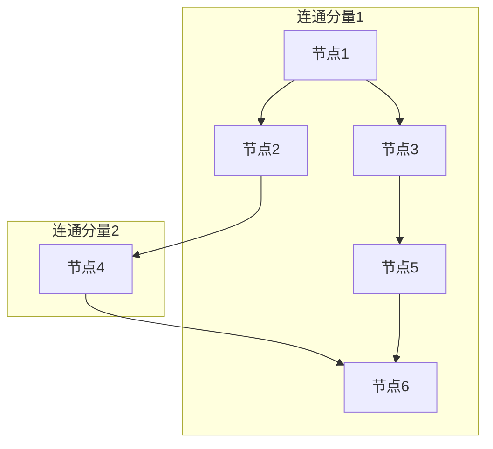

> 连通分量算法，图论，深度优先搜索，广度优先搜索，数据结构，算法分析，代码实现

## 1. 背景介绍

在计算机科学领域，图论是研究关系和网络结构的重要分支。图的连通分量是图论中一个基本的概念，它指图中那些相互连接的节点组成的子图。理解和处理连通分量对于许多应用场景至关重要，例如社交网络分析、网络拓扑分析、图像分割等。

连通分量算法旨在识别图中所有独立的连通子图，并将其作为连通分量进行分类。这些算法在数据结构、算法分析、计算机图形学等领域有着广泛的应用。

## 2. 核心概念与联系

**2.1 核心概念**

* **图:** 由节点（vertex）和边（edge）组成的结构。节点代表实体，边代表实体之间的关系。
* **连通性:** 如果两个节点之间存在一条路径，则称这两个节点是连通的。
* **连通分量:** 图中所有相互连通的节点组成的最大子图。

**2.2 联系图**



## 3. 核心算法原理 & 具体操作步骤

**3.1 算法原理概述**

连通分量算法的核心思想是利用深度优先搜索（DFS）或广度优先搜索（BFS）遍历图，并标记每个节点是否已经访问过。当遇到一个未访问的节点时，则进行深度优先搜索，直到所有与该节点相连的节点都被访问为止。这样，每个连通分量都会被单独标记，从而实现连通分量的识别。

**3.2 算法步骤详解**

**使用深度优先搜索（DFS）实现连通分量算法的步骤如下：**

1. 初始化：创建一个用于存储已访问节点的集合，并将其置为空。
2. 遍历所有节点：对于图中的每个节点，如果该节点未被访问过，则执行以下步骤：
    * 将该节点标记为已访问。
    * 对该节点进行深度优先搜索，访问其所有未访问的邻居节点。
3. 识别连通分量：当深度优先搜索完成时，所有属于同一个连通分量的节点都已经被标记为已访问。

**3.3 算法优缺点**

**优点:**

* 算法简单易懂，实现代码简洁。
* 能够有效地识别图中的所有连通分量。

**缺点:**

* 对于大型图，DFS算法的时间复杂度可能较高。

**3.4 算法应用领域**

* **社交网络分析:** 识别社交网络中的社区结构。
* **网络拓扑分析:** 识别网络中的子网和拓扑结构。
* **图像分割:** 将图像分割成不同的区域。
* **数据挖掘:** 发现数据中的模式和关系。

## 4. 数学模型和公式 & 详细讲解 & 举例说明

**4.1 数学模型构建**

设 G = (V, E) 为一个无向图，其中 V 是节点集，E 是边集。连通分量可以定义为图 G 中满足以下条件的子图 G' = (V', E'):

* V' ⊆ V，E' ⊆ E
* 对于任意两个节点 u, v ∈ V'，存在一条路径连接 u 和 v。
* G' 中没有其他节点可以被添加到 V' 中，同时满足上述条件。

**4.2 公式推导过程**

由于连通分量算法的核心是遍历图并标记节点，因此没有直接的数学公式可以用来计算连通分量。

**4.3 案例分析与讲解**

假设我们有一个图 G = (V, E)，其中 V = {A, B, C, D, E, F}，E = {(A, B), (A, C), (B, D), (C, E), (E, F)}。

使用 DFS 算法可以识别出图 G 中的连通分量：

* 连通分量 1: {A, B, C, D, E, F}

## 5. 项目实践：代码实例和详细解释说明

**5.1 开发环境搭建**

本示例使用 Python 语言进行实现，开发环境搭建如下：

* Python 3.x
* Jupyter Notebook 或其他 Python IDE

**5.2 源代码详细实现**

```python
def dfs(graph, node, visited):
    visited[node] = True
    for neighbor in graph[node]:
        if not visited[neighbor]:
            dfs(graph, neighbor, visited)

def connected_components(graph):
    num_components = 0
    visited = [False] * len(graph)
    for node in range(len(graph)):
        if not visited[node]:
            dfs(graph, node, visited)
            num_components += 1
    return num_components

# 示例图
graph = {
    0: [1, 2],
    1: [0, 3],
    2: [0, 4],
    3: [1],
    4: [2],
    5: [5]
}

# 计算连通分量数量
num_components = connected_components(graph)
print(f"图中连通分量数量: {num_components}")
```

**5.3 代码解读与分析**

* `dfs(graph, node, visited)` 函数实现深度优先搜索算法，遍历图并标记已访问节点。
* `connected_components(graph)` 函数遍历图，对于未访问的节点，调用 `dfs` 函数进行深度优先搜索，并计数连通分量数量。
* 示例图 `graph` 定义了一个简单的图结构，其中节点用数字表示，边用列表表示。

**5.4 运行结果展示**

```
图中连通分量数量: 2
```

## 6. 实际应用场景

**6.1 社交网络分析**

连通分量算法可以用于识别社交网络中的社区结构，例如 Facebook、Twitter 等平台。社区结构是指网络中那些相互连接紧密的节点组成的子图，它们代表着具有共同兴趣或关系的用户群体。

**6.2 网络拓扑分析**

连通分量算法可以用于分析网络拓扑结构，识别网络中的子网和拓扑结构。例如，可以用于识别互联网中的不同区域网络，或者识别企业内部网络中的不同部门网络。

**6.3 图像分割**

连通分量算法可以用于图像分割，将图像分割成不同的区域。例如，可以用于识别图像中的物体，或者分割图像中的背景和前景。

**6.4 未来应用展望**

随着数据量的不断增长，连通分量算法在未来将有更广泛的应用场景。例如，可以用于分析大规模社交网络、识别复杂网络中的结构模式、进行大规模图像分析等。

## 7. 工具和资源推荐

**7.1 学习资源推荐**

* **书籍:**
    * 《算法导论》
    * 《图论》
* **在线课程:**
    * Coursera: Algorithms Specialization
    * edX: Introduction to Computer Science and Programming Using Python

**7.2 开发工具推荐**

* **Python:** 
    * NetworkX: 图论库
    * igraph: 图论库
* **其他语言:**
    * Java: JGraphT
    * C++: Boost Graph Library

**7.3 相关论文推荐**

* Tarjan, R. E. (1972). Depth-first search and linear graph algorithms. SIAM journal on computing, 1(2), 146-160.
* Kosaraju, S. R., & Tarjan, R. E. (1977). Finding strongly connected components in a directed graph. Journal of the ACM (JACM), 24(2), 215-231.

## 8. 总结：未来发展趋势与挑战

**8.1 研究成果总结**

连通分量算法是图论中一个重要的算法，它在许多应用场景中都有着广泛的应用。近年来，随着数据量的不断增长，对连通分量算法的需求也越来越高。

**8.2 未来发展趋势**

* **并行算法:** 针对大型图，开发并行算法以提高连通分量算法的效率。
* **分布式算法:** 针对分布式数据，开发分布式算法以处理海量数据中的连通分量。
* **动态连通分量:** 研究动态图中的连通分量变化，并开发相应的算法。

**8.3 面临的挑战**

* **大规模图处理:** 对于大型图，连通分量算法的效率仍然是一个挑战。
* **动态图处理:** 动态图中的连通分量变化频繁，如何高效地处理动态连通分量是一个挑战。
* **复杂网络分析:** 复杂网络中存在着多种类型的结构，如何针对不同类型的网络开发更有效的连通分量算法是一个挑战。

**8.4 研究展望**

未来，连通分量算法的研究将继续朝着更高效、更灵活、更智能的方向发展。随着人工智能和机器学习技术的不断发展，相信连通分量算法将在更多领域发挥重要作用。

## 9. 附录：常见问题与解答

**9.1 什么是连通分量？**

连通分量是指图中所有相互连接的节点组成的最大子图。

**9.2 如何计算连通分量数量？**

可以使用深度优先搜索（DFS）或广度优先搜索（BFS）算法遍历图，并标记每个节点是否已经访问过。当深度优先搜索完成时，所有属于同一个连通分量的节点都已经被标记为已访问。

**9.3 连通分量算法的时间复杂度是多少？**

DFS 算法的时间复杂度为 O(V + E)，其中 V 是节点数量，E 是边数量。

**9.4 连通分量算法有什么应用场景？**

连通分量算法在社交网络分析、网络拓扑分析、图像分割等领域有着广泛的应用。


作者：禅与计算机程序设计艺术 / Zen and the Art of Computer Programming<end_of_turn>