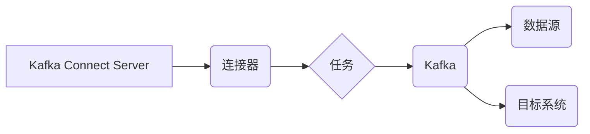

> Kafka Connect,数据集成,数据流,插件架构,数据同步,数据转换

## 1. 背景介绍

在当今数据爆炸的时代，企业需要高效地收集、处理和分析来自各种来源的数据。Apache Kafka作为一款高性能、分布式流处理平台，已经成为数据流处理的热门选择。然而，Kafka本身并不具备直接连接外部数据源和目标系统的能力。这时，Kafka Connect就应运而生，它提供了一种灵活、可扩展的机制，用于将Kafka与各种数据源和目标系统连接起来。

Kafka Connect是一个开源的插件架构，它允许用户通过开发自定义的连接器来实现数据集成。连接器可以将数据从各种数据源（例如数据库、文件系统、云平台等）传输到Kafka主题，也可以将数据从Kafka主题传输到各种目标系统（例如数据库、搜索引擎、数据仓库等）。

## 2. 核心概念与联系

Kafka Connect的核心概念包括：

* **连接器（Connector）：** 连接器是Kafka Connect的核心组件，它负责连接Kafka与外部数据源或目标系统。每个连接器都包含一个特定的数据源类型和目标系统类型。
* **任务（Task）：** 连接器由多个任务组成，每个任务负责处理一部分数据。任务可以并行执行，从而提高数据处理效率。
* **配置（Configuration）：** 连接器通过配置参数来控制其行为，例如数据源地址、目标系统地址、数据格式等。
* **状态管理（State Management）：** Kafka Connect使用状态管理机制来跟踪任务的进度和数据处理状态。

**Kafka Connect 架构图**



## 3. 核心算法原理 & 具体操作步骤

### 3.1  算法原理概述

Kafka Connect的核心算法原理是基于流式数据处理和分布式任务执行。

* **流式数据处理：** Kafka Connect将数据视为一个持续的流，并使用流式处理技术来处理数据。
* **分布式任务执行：** Kafka Connect将任务分配给多个节点执行，从而提高数据处理效率。

### 3.2  算法步骤详解

1. **连接器配置：** 用户需要配置连接器的参数，例如数据源地址、目标系统地址、数据格式等。
2. **任务分配：** Kafka Connect Server根据连接器的配置和集群资源分配任务给各个节点。
3. **数据读取：** 任务从数据源读取数据。
4. **数据处理：** 任务对数据进行处理，例如转换、过滤、聚合等。
5. **数据写入：** 任务将处理后的数据写入目标系统。
6. **状态管理：** Kafka Connect Server跟踪任务的进度和数据处理状态。

### 3.3  算法优缺点

**优点：**

* **灵活可扩展：** 通过开发自定义连接器，Kafka Connect可以连接各种数据源和目标系统。
* **高性能：** Kafka Connect使用流式数据处理和分布式任务执行技术，可以处理海量数据。
* **可靠性：** Kafka Connect使用状态管理机制，可以保证数据的可靠传输。

**缺点：**

* **开发复杂度：** 开发自定义连接器需要一定的开发经验和技术能力。
* **维护成本：** 连接器的维护和更新需要一定的成本。

### 3.4  算法应用领域

Kafka Connect广泛应用于以下领域：

* **数据集成：** 将来自不同数据源的数据整合到Kafka主题中。
* **数据同步：** 将数据从Kafka主题同步到目标系统。
* **数据转换：** 对数据进行格式转换、数据清洗等操作。
* **实时数据分析：** 将实时数据流传输到Kafka主题，用于实时数据分析。

## 4. 数学模型和公式 & 详细讲解 & 举例说明

Kafka Connect的算法原理可以抽象为一个数据流处理模型，其中涉及到数据流的传输、处理和存储等环节。

### 4.1  数学模型构建

我们可以用以下数学模型来描述Kafka Connect的数据流处理过程：

```
D(t) = f(D(t-1), C)
```

其中：

* D(t) 表示在时间t时刻的数据流。
* D(t-1) 表示在时间t-1时刻的数据流。
* f() 表示数据处理函数，它根据数据流D(t-1)和连接器配置C进行数据处理。
* C 表示连接器的配置参数。

### 4.2  公式推导过程

该公式表示数据流在每个时间点都是由前一个时间点的状态和连接器配置决定的。

### 4.3  案例分析与讲解

例如，假设我们有一个连接器用于从MySQL数据库读取数据并写入Kafka主题。

* D(t-1) 表示在时间t-1时刻从MySQL数据库读取到的数据。
* f() 表示将MySQL数据库数据转换为Kafka主题的格式。
* C 表示连接器的配置参数，例如MySQL数据库地址、用户名、密码、Kafka主题名称等。

根据公式，在时间t时刻，连接器会根据前一个时间点的MySQL数据库数据和连接器配置，将数据转换为Kafka主题的格式并写入Kafka主题。

## 5. 项目实践：代码实例和详细解释说明

### 5.1  开发环境搭建

为了演示Kafka Connect的开发过程，我们将在本地搭建一个开发环境。

* 安装Java JDK
* 安装Apache Kafka
* 安装Apache ZooKeeper
* 安装Kafka Connect

### 5.2  源代码详细实现

我们创建一个简单的连接器，用于从本地文件系统读取数据并写入Kafka主题。

```java
public class FileSourceConnector extends AbstractConnector {

    private String topic;
    private String file;

    @Override
    public String name() {
        return "file-source-connector";
    }

    @Override
    public void start(Map<String, String> props) {
        this.topic = props.get("topic");
        this.file = props.get("file");

        // 创建任务
        Task task = new FileSourceTask(this.topic, this.file);
        this.tasks.add(task);
    }

    @Override
    public void stop() {
        // 关闭任务
        for (Task task : this.tasks) {
            task.close();
        }
    }

    // ... 其他方法
}
```

### 5.3  代码解读与分析

* `name()` 方法返回连接器的名称。
* `start()` 方法在连接器启动时执行，用于初始化连接器和创建任务。
* `stop()` 方法在连接器停止时执行，用于关闭任务。
* `FileSourceTask` 是一个任务类，负责从文件系统读取数据并写入Kafka主题。

### 5.4  运行结果展示

启动Kafka Connect Server后，我们可以看到连接器正在运行，并从文件系统读取数据写入Kafka主题。

## 6. 实际应用场景

Kafka Connect在实际应用场景中具有广泛的应用价值。

### 6.1  数据集成

Kafka Connect可以将来自不同数据源的数据整合到Kafka主题中，例如将数据库、文件系统、云平台等数据整合到Kafka主题中，用于数据分析、机器学习等应用。

### 6.2  数据同步

Kafka Connect可以将数据从Kafka主题同步到目标系统，例如将数据从Kafka主题同步到数据库、搜索引擎、数据仓库等系统，用于数据备份、数据迁移等应用。

### 6.3  数据转换

Kafka Connect可以对数据进行格式转换、数据清洗等操作，例如将JSON格式的数据转换为CSV格式，将数据中的空格替换为下划线等操作，用于数据预处理、数据清洗等应用。

### 6.4  未来应用展望

随着数据量的不断增长和数据处理需求的不断变化，Kafka Connect将继续发挥重要作用。未来，Kafka Connect可能会支持更多的数据源和目标系统，并提供更强大的数据处理功能。

## 7. 工具和资源推荐

### 7.1  学习资源推荐

* Apache Kafka Connect官方文档：https://kafka.apache.org/documentation/#connect
* Kafka Connect教程：https://www.tutorialspoint.com/kafka_connect/index.htm

### 7.2  开发工具推荐

* IntelliJ IDEA
* Eclipse

### 7.3  相关论文推荐

* Kafka Connect: A Framework for Building Data Pipelines
* Kafka Connect: A Scalable and Reliable Data Integration Platform

## 8. 总结：未来发展趋势与挑战

### 8.1  研究成果总结

Kafka Connect是一个强大的数据集成平台，它提供了灵活、可扩展的机制，用于将Kafka与各种数据源和目标系统连接起来。

### 8.2  未来发展趋势

未来，Kafka Connect可能会支持更多的数据源和目标系统，并提供更强大的数据处理功能。

### 8.3  面临的挑战

Kafka Connect面临的主要挑战包括：

* 开发自定义连接器的复杂度
* 连接器维护和更新的成本
* 数据安全和隐私保护

### 8.4  研究展望

未来研究方向包括：

* 开发更易于使用的连接器开发工具
* 提供更强大的数据处理功能
* 加强数据安全和隐私保护机制

## 9. 附录：常见问题与解答

### 9.1  常见问题

* 如何配置Kafka Connect连接器？
* 如何开发自定义Kafka Connect连接器？
* 如何解决Kafka Connect连接器运行时遇到的问题？

### 9.2  解答

* Kafka Connect连接器的配置方法可以通过配置文件或命令行参数进行设置。
* 开发自定义Kafka Connect连接器需要了解Kafka Connect的API和数据处理模型。
* 遇到Kafka Connect连接器运行时问题时，可以参考官方文档或社区论坛寻求帮助。


作者：禅与计算机程序设计艺术 / Zen and the Art of Computer Programming 
<end_of_turn>