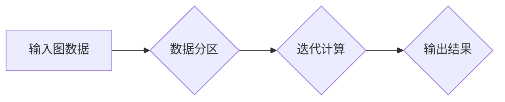

> Pregel, 图计算, 并行算法, 数据流, 迭代算法, 编程模型

## 1. 背景介绍

随着互联网和移动互联网的蓬勃发展，海量数据在各个领域不断涌现。如何高效地处理和分析这些数据成为了一个重要的挑战。图数据作为一种强大的数据模型，能够有效地表示现实世界中的复杂关系，在社交网络分析、推荐系统、知识图谱构建等领域得到了广泛应用。然而，传统的数据库系统难以处理海量图数据的复杂查询和分析任务。

为了解决这一问题，Google于2010年提出了Pregel（Probabilistic Graph Processing）算法框架，它是一种专门用于图计算的并行编程模型。Pregel基于数据流和迭代算法，能够高效地处理海量图数据，并支持各种图算法的实现。

## 2. 核心概念与联系

Pregel的核心概念包括：

* **图数据:** Pregel处理的图数据由节点和边组成，节点代表实体，边代表实体之间的关系。
* **数据流:** Pregel将图数据处理看作是一个数据流的过程，数据流由一系列的迭代操作组成。
* **迭代算法:** Pregel使用迭代算法来处理图数据，每个迭代步骤都会更新节点的状态，直到达到收敛条件。
* **并行处理:** Pregel支持并行处理，可以将图数据分布到多个节点上进行计算，从而提高计算效率。

**Pregel架构流程图:**



## 3. 核心算法原理 & 具体操作步骤

### 3.1  算法原理概述

Pregel算法的核心思想是通过迭代的方式，从图的局部信息出发，逐步推导全局信息。每个节点在迭代过程中，会接收来自相邻节点的信息，并根据自己的状态和接收到的信息更新自己的状态。

### 3.2  算法步骤详解

Pregel算法的具体步骤如下：

1. **数据分区:** 将图数据划分为多个子图，每个子图分配到一个节点上进行计算。
2. **初始化:** 每个节点初始化自己的状态，例如节点的度数、邻居节点等信息。
3. **迭代计算:** 迭代计算过程包括以下步骤：
    * **消息传递:** 每个节点向其邻居节点发送消息，消息内容包含节点的状态信息。
    * **消息接收:** 每个节点接收来自邻居节点的消息，并更新自己的状态。
    * **状态更新:** 每个节点根据自己的状态和接收到的消息，更新自己的状态。
4. **收敛判断:** 当所有节点的状态不再发生变化时，迭代计算结束。
5. **结果输出:** 输出所有节点的状态信息，即为最终的计算结果。

### 3.3  算法优缺点

**优点:**

* **并行效率高:** Pregel支持并行处理，可以充分利用多核处理器和分布式计算资源。
* **易于编程:** Pregel提供了一个简单的编程模型，开发者可以方便地编写图算法。
* **支持多种图算法:** Pregel可以支持各种图算法的实现，例如PageRank、ShortestPath等。

**缺点:**

* **内存消耗大:** Pregel需要存储整个图数据，因此内存消耗较大。
* **数据一致性问题:** Pregel的并行处理机制可能会导致数据一致性问题，需要采取相应的措施保证数据一致性。

### 3.4  算法应用领域

Pregel算法在以下领域得到了广泛应用：

* **社交网络分析:** 分析社交网络结构、用户关系、传播路径等。
* **推荐系统:** 基于用户行为和商品关系，推荐用户感兴趣的商品。
* **知识图谱构建:** 建立知识图谱，表示实体和关系，支持知识推理和查询。
* **生物信息学:** 分析蛋白质相互作用网络、基因调控网络等。

## 4. 数学模型和公式 & 详细讲解 & 举例说明

### 4.1  数学模型构建

Pregel算法可以抽象为一个图的迭代更新过程，其中每个节点的状态是一个向量，每个迭代步骤都会更新节点状态向量的值。

假设图G = (V, E) ，其中V是节点集合，E是边集合。每个节点v ∈ V 都有一个状态向量 s(v) ∈ R^d，其中d是状态向量的维度。

### 4.2  公式推导过程

Pregel算法的迭代更新公式如下：

```latex
s'(v) = f(s(v), \sum_{u \in N(v)} \sigma(u, s(u)))
```

其中：

* s'(v) 是节点v在迭代步骤t+1后的状态向量。
* s(v) 是节点v在迭代步骤t的当前状态向量。
* N(v) 是节点v的邻居节点集合。
* σ(u, s(u)) 是节点u发送给节点v的消息，它依赖于节点u的状态向量s(u)。
* f(s(v), ...) 是一个状态更新函数，它接受节点v的当前状态向量和来自邻居节点的消息，并返回节点v在下一个迭代步骤的状态向量。

### 4.3  案例分析与讲解

例如，在PageRank算法中，每个节点的状态向量表示该节点的PageRank值。状态更新函数f(s(v), ...) 会根据节点v的邻居节点的PageRank值，更新节点v的PageRank值。

## 5. 项目实践：代码实例和详细解释说明

### 5.1  开发环境搭建

Pregel算法可以使用多种编程语言实现，例如Java、Python等。本文以Java为例，介绍Pregel算法的代码实现。

需要安装Java开发环境和Pregel框架。

### 5.2  源代码详细实现

```java
import org.apache.giraph.graph.BasicComputation;
import org.apache.giraph.graph.Vertex;
import org.apache.hadoop.io.DoubleWritable;
import org.apache.hadoop.io.LongWritable;
import org.apache.hadoop.io.Text;

public class PageRankComputation extends BasicComputation<LongWritable, Text, DoubleWritable, DoubleWritable> {

    @Override
    public void compute(Vertex<LongWritable, Text, DoubleWritable> vertex,
                        Iterable<DoubleWritable> messages) throws Exception {
        // 获取当前节点的ID和PageRank值
        LongWritable nodeId = vertex.getId();
        DoubleWritable currentPageRank = vertex.getValue();

        // 计算新的PageRank值
        double newPageRank = currentPageRank.get();
        for (DoubleWritable message : messages) {
            newPageRank += message.get();
        }

        // 更新节点的状态
        vertex.setValue(new DoubleWritable(newPageRank));

        // 发送消息给邻居节点
        for (Text neighbor : vertex.getEdges()) {
            sendMessage(neighbor, new DoubleWritable(newPageRank / vertex.getEdges().size()));
        }
    }
}
```

### 5.3  代码解读与分析

* `compute()`方法是Pregel算法的核心方法，它在每个迭代步骤中执行。
* `vertex.getId()`获取当前节点的ID。
* `vertex.getValue()`获取当前节点的PageRank值。
* `sendMessage()`方法发送消息给邻居节点。

### 5.4  运行结果展示

运行Pregel算法后，可以得到每个节点的最终PageRank值。

## 6. 实际应用场景

Pregel算法在实际应用场景中具有广泛的应用前景。

### 6.1  社交网络分析

Pregel算法可以用于分析社交网络结构、用户关系、传播路径等。例如，可以利用Pregel算法计算用户之间的影响力，识别关键用户，分析信息传播路径。

### 6.2  推荐系统

Pregel算法可以用于构建基于图的推荐系统。例如，可以利用Pregel算法分析用户行为和商品关系，推荐用户感兴趣的商品。

### 6.3  知识图谱构建

Pregel算法可以用于构建知识图谱，表示实体和关系，支持知识推理和查询。例如，可以利用Pregel算法分析文本数据，提取实体和关系，构建知识图谱。

### 6.4  未来应用展望

随着大数据和人工智能技术的快速发展，Pregel算法在未来将有更广泛的应用前景。例如，可以利用Pregel算法分析生物网络、金融网络等复杂网络，发现隐藏的模式和规律。

## 7. 工具和资源推荐

### 7.1  学习资源推荐

* **Pregel官方文档:** https://github.com/google/Pregel
* **图计算教程:** https://www.coursera.org/learn/graph-algorithms

### 7.2  开发工具推荐

* **Hadoop:** https://hadoop.apache.org/
* **Giraph:** https://giraph.apache.org/

### 7.3  相关论文推荐

* **Pregel: A System for Large-Scale Graph Processing**
* **Graph Algorithms in the MapReduce Model**

## 8. 总结：未来发展趋势与挑战

### 8.1  研究成果总结

Pregel算法是一种高效的图计算框架，能够处理海量图数据，并支持各种图算法的实现。

### 8.2  未来发展趋势

未来，Pregel算法将朝着以下方向发展：

* **更强大的并行处理能力:** 利用分布式计算技术，进一步提高Pregel算法的并行处理能力。
* **更灵活的编程模型:** 提供更灵活的编程模型，方便开发者编写复杂的图算法。
* **更广泛的应用场景:** 将Pregel算法应用于更多领域，例如生物信息学、金融分析等。

### 8.3  面临的挑战

Pregel算法也面临一些挑战：

* **数据一致性问题:** Pregel的并行处理机制可能会导致数据一致性问题，需要采取相应的措施保证数据一致性。
* **内存消耗问题:** Pregel需要存储整个图数据，因此内存消耗较大，需要优化算法和数据结构，降低内存消耗。

### 8.4  研究展望

未来，我们将继续研究Pregel算法，提高其性能和效率，并将其应用于更多领域。

## 9. 附录：常见问题与解答

**Q1: Pregel算法的内存消耗大吗？**

A1: 由于Pregel需要存储整个图数据，因此内存消耗较大。

**Q2: Pregel算法支持哪些图算法？**

A2: Pregel可以支持各种图算法的实现，例如PageRank、ShortestPath等。

**Q3: 如何使用Pregel算法？**

A3: 可以参考Pregel官方文档和相关教程学习如何使用Pregel算法。


作者：禅与计算机程序设计艺术 / Zen and the Art of Computer Programming 
<end_of_turn>