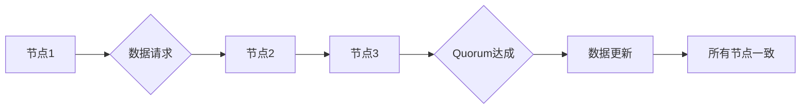

> Quorum机制,分布式系统,一致性,Paxos协议,Raft协议,数据库,区块链

## 1. 背景介绍

在分布式系统中，数据一致性是至关重要的保证。当多个节点同时访问和修改数据时，如何确保数据最终处于一致状态，避免数据冲突和丢失，成为了一个重大挑战。Quorum机制作为一种解决分布式系统一致性问题的有效手段，在保证数据一致性的同时，也兼顾了系统的容错性和可用性。

Quorum机制的核心思想是，在进行数据操作时，需要获得超过半数节点的同意（Quorum）才能进行操作。这种机制能够确保即使部分节点发生故障，数据仍然能够保持一致性。

## 2. 核心概念与联系

**2.1 核心概念**

* **Quorum:**  Quorum是指在分布式系统中，进行数据操作所需的最小节点数量，通常为系统节点总数的一半加一。
* **节点:**  分布式系统中的单个计算单元，负责处理数据和执行操作。
* **一致性:**  在分布式系统中，所有节点都拥有相同的数据副本，并且所有操作都能够最终反映在所有节点上。

**2.2  Quorum机制与分布式一致性**

Quorum机制是实现分布式一致性的重要手段之一。它通过控制数据操作的权限，确保只有获得足够多的节点同意后，才能进行数据修改。这种机制能够有效地防止数据冲突和丢失，保证数据的一致性。

**2.3  Quorum机制与容错性**

Quorum机制也能够提高分布式系统的容错性。即使部分节点发生故障，只要剩余节点数量超过Quorum，系统仍然能够正常运行，并保证数据的一致性。

**2.4  Quorum机制与可用性**

Quorum机制能够在一定程度上保证系统的可用性。即使部分节点发生故障，只要剩余节点数量足够，系统仍然能够提供服务，并处理用户请求。

**2.5  Mermaid 流程图**



## 3. 核心算法原理 & 具体操作步骤

**3.1  算法原理概述**

Quorum机制的核心算法原理是通过节点投票来决定数据操作的最终结果。每个节点都拥有一个独立的数据副本，并且在进行数据操作时，需要获得超过半数节点的同意（Quorum）才能进行操作。

**3.2  算法步骤详解**

1. **数据请求:** 当一个节点需要进行数据操作时，它会向其他节点发送数据请求。
2. **节点投票:** 每个节点收到数据请求后，会进行投票，决定是否同意该操作。
3. **Quorum达成:** 当超过半数节点同意该操作时，Quorum就达成。
4. **数据更新:** 当Quorum达成后，操作将被执行，并更新所有节点的数据副本。

**3.3  算法优缺点**

* **优点:**
    * 保证数据一致性
    * 提高系统容错性
    * 能够在一定程度上保证系统可用性
* **缺点:**
    * 可能会导致系统性能下降
    * 需要复杂的协调机制

**3.4  算法应用领域**

Quorum机制广泛应用于分布式系统中，例如：

* 数据库系统
* 分布式文件系统
* 区块链技术

## 4. 数学模型和公式 & 详细讲解 & 举例说明

**4.1  数学模型构建**

假设一个分布式系统有N个节点，Quorum为Q，则Q = ⌈N/2⌉ + 1。

**4.2  公式推导过程**

Quorum机制的核心思想是，在进行数据操作时，需要获得超过半数节点的同意才能进行操作。

* 设节点集合为S，操作集合为O。
* 对于每个操作o∈O，需要找到一个子集S'⊆S，满足|S'|≥Q，并且所有节点在S'中都同意操作o。

**4.3  案例分析与讲解**

假设一个分布式系统有5个节点，Quorum为3。

* 当需要进行数据操作时，需要至少获得3个节点的同意。
* 如果节点1、节点2、节点3同意该操作，则Quorum达成，操作可以执行。
* 如果节点1、节点2、节点4同意该操作，则Quorum未达成，操作无法执行。

## 5. 项目实践：代码实例和详细解释说明

**5.1  开发环境搭建**

* 操作系统：Linux
* 编程语言：Python
* 开发工具：VS Code

**5.2  源代码详细实现**

```python
class Node:
    def __init__(self, id):
        self.id = id
        self.data = None
        self.votes = {}

    def receive_request(self, request):
        # 处理数据请求
        pass

    def vote(self, request):
        # 投票
        pass

class QuorumManager:
    def __init__(self, nodes):
        self.nodes = nodes
        self.quorum = len(nodes) // 2 + 1

    def execute_operation(self, operation):
        # 执行操作
        pass

```

**5.3  代码解读与分析**

* `Node`类代表一个分布式系统中的节点，包含节点ID、数据副本和投票记录。
* `QuorumManager`类负责管理Quorum机制，包含节点列表和Quorum数量。
* `execute_operation()`方法负责执行数据操作，并确保Quorum达成。

**5.4  运行结果展示**

运行代码后，可以模拟多个节点进行数据操作，并观察Quorum机制如何保证数据一致性。

## 6. 实际应用场景

**6.1  数据库系统**

在分布式数据库系统中，Quorum机制可以保证数据的一致性。例如，在MySQL Cluster中，Quorum机制用于协调数据写入操作，确保所有节点都拥有相同的最新数据副本。

**6.2  区块链技术**

在区块链技术中，Quorum机制用于验证交易和生成新的区块。例如，在比特币区块链中，Quorum机制用于确保所有节点都同意交易的有效性，并将其添加到区块链中。

**6.3  其他应用场景**

Quorum机制还可以应用于其他分布式系统中，例如：

* 分布式文件系统
* 分布式缓存系统
* 分布式机器学习

**6.4  未来应用展望**

随着分布式系统的不断发展，Quorum机制将继续发挥重要作用，并应用于更多领域。例如，在云计算、物联网等领域，Quorum机制可以帮助构建更加可靠、高效的分布式系统。

## 7. 工具和资源推荐

**7.1  学习资源推荐**

* 《分布式系统：概念与设计》
* 《Designing Data-Intensive Applications》
* Paxos论文

**7.2  开发工具推荐**

* Apache ZooKeeper
* etcd
* Consul

**7.3  相关论文推荐**

* Paxos: Making Weakly Consistent Distributed Systems Tolerant to Arbitrary Failures
* Raft: In Search of an Understandable Consensus Algorithm

## 8. 总结：未来发展趋势与挑战

**8.1  研究成果总结**

Quorum机制是一种成熟的分布式一致性算法，在保证数据一致性的同时，也兼顾了系统的容错性和可用性。

**8.2  未来发展趋势**

* 提高Quorum机制的效率和性能
* 将Quorum机制应用于更复杂的分布式系统
* 研究新的Quorum机制，以应对更严苛的应用场景

**8.3  面临的挑战**

* 随着分布式系统的规模和复杂度不断增加，Quorum机制的实现和维护越来越困难。
* 如何在保证数据一致性的同时，提高系统的性能和可用性，仍然是一个重要的挑战。

**8.4  研究展望**

未来，Quorum机制的研究将继续深入，并朝着更高效、更可靠、更灵活的方向发展。


## 9. 附录：常见问题与解答

**9.1  问题：Quorum机制的Quorum值如何确定？**

**答案：**Quorum值通常设置为系统节点总数的一半加一，以保证即使部分节点发生故障，系统仍然能够正常运行。

**9.2  问题：Quorum机制的性能如何？**

**答案：**Quorum机制可能会导致系统性能下降，因为需要进行节点投票和协调。

**9.3  问题：Quorum机制如何应对网络分区？**

**答案：**Quorum机制无法直接解决网络分区问题，需要结合其他机制，例如Paxos协议或Raft协议，来应对网络分区。


作者：禅与计算机程序设计艺术 / Zen and the Art of Computer Programming 
<end_of_turn>