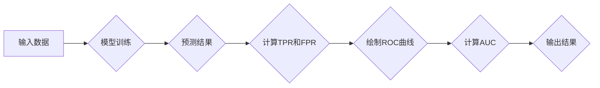

> ROC曲线，AUC，分类模型，性能评估，机器学习，Python，scikit-learn

## 1. 背景介绍

在机器学习领域，评估分类模型的性能至关重要。 传统的准确率指标在某些情况下可能不够全面，例如当数据样本类别分布不平衡时。 为了更全面地评估分类模型的性能，ROC曲线（Receiver Operating Characteristic Curve）和AUC（Area Under the Curve）指标应运而生。

ROC曲线是一种用于评估二分类模型性能的图形表示方法。它通过将模型的真阳性率（TPR，True Positive Rate）与假阳性率（FPR，False Positive Rate）之间的关系直观地展示出来。AUC指标则表示ROC曲线下的面积，它反映了模型对正负样本的区分能力。

## 2. 核心概念与联系

**2.1 ROC曲线**

ROC曲线是将真阳性率（TPR）作为纵坐标，假阳性率（FPR）作为横坐标绘制的曲线。

* **真阳性率 (TPR)**：也称为灵敏度或召回率，定义为模型正确预测为正例的正例样本比例。

* **假阳性率 (FPR)**：定义为模型错误预测为正例的负例样本比例。

**2.2 AUC指标**

AUC（Area Under the Curve）是ROC曲线下的面积，它反映了模型对正负样本的区分能力。AUC值介于0和1之间，其中：

* AUC = 0.5 表示模型的性能与随机猜测相同。
* AUC = 1 表示模型能够完美地区分正负样本。

**2.3  ROC曲线与AUC的关系**

ROC曲线可以直观地展示模型的性能，而AUC则提供了模型性能的单一指标。AUC值越高，模型的性能越好。

**2.4  Mermaid 流程图**



## 3. 核心算法原理 & 具体操作步骤

### 3.1  算法原理概述

ROC曲线和AUC指标的计算基于模型的预测概率。对于每个阈值，模型都会产生不同的真阳性率和假阳性率。通过遍历所有可能的阈值，我们可以得到一系列的(TPR, FPR)点，这些点连接起来就形成了ROC曲线。

AUC值可以通过计算ROC曲线下的面积来得到。常用的计算方法包括梯形法和Simpson积分法。

### 3.2  算法步骤详解

1. **模型训练:** 使用训练数据训练分类模型。
2. **预测概率:** 使用训练好的模型对测试数据进行预测，并获得每个样本的预测概率。
3. **阈值遍历:** 遍历所有可能的阈值，每个阈值对应一个分类决策边界。
4. **计算TPR和FPR:** 对于每个阈值，计算真阳性率和假阳性率。
5. **绘制ROC曲线:** 将所有(TPR, FPR)点连接起来，形成ROC曲线。
6. **计算AUC:** 计算ROC曲线下的面积，得到AUC值。

### 3.3  算法优缺点

**优点:**

* ROC曲线直观地展示了模型的性能，可以方便地比较不同模型的性能。
* AUC指标是一个单一的指标，可以方便地量化模型的性能。
* ROC曲线和AUC指标对样本类别分布不平衡有一定的鲁棒性。

**缺点:**

* ROC曲线和AUC指标只适用于二分类问题。
* ROC曲线和AUC指标不能直接反映模型的预测准确率。

### 3.4  算法应用领域

ROC曲线和AUC指标广泛应用于各种机器学习领域，例如：

* 医学诊断
* 欺诈检测
* 风险评估
* 图像识别

## 4. 数学模型和公式 & 详细讲解 & 举例说明

### 4.1  数学模型构建

ROC曲线和AUC指标的数学模型基于以下概念：

* **真阳性 (TP):** 模型正确预测为正例的正例样本数量。
* **假阳性 (FP):** 模型错误预测为正例的负例样本数量。
* **真阴性 (TN):** 模型正确预测为负例的负例样本数量。
* **假阴性 (FN):** 模型错误预测为负例的正例样本数量。

### 4.2  公式推导过程

* **真阳性率 (TPR):** TPR = TP / (TP + FN)
* **假阳性率 (FPR):** FPR = FP / (FP + TN)

ROC曲线是将TPR作为纵坐标，FPR作为横坐标绘制的曲线。AUC值可以通过计算ROC曲线下的面积来得到。常用的计算方法包括梯形法和Simpson积分法。

### 4.3  案例分析与讲解

假设我们有一个二分类模型，用于预测用户是否会点击广告。模型对测试数据进行了预测，并获得了每个样本的预测概率。

我们可以选择不同的阈值，例如0.5，0.6，0.7等，来进行分类决策。对于每个阈值，我们可以计算出相应的TPR和FPR值。

将所有(TPR, FPR)点连接起来，就形成了ROC曲线。AUC值可以通过计算ROC曲线下的面积来得到。

## 5. 项目实践：代码实例和详细解释说明

### 5.1  开发环境搭建

本案例使用Python语言和scikit-learn库进行实现。

```
pip install scikit-learn
```

### 5.2  源代码详细实现

```python
import numpy as np
from sklearn.datasets import make_classification
from sklearn.model_selection import train_test_split
from sklearn.linear_model import LogisticRegression
from sklearn.metrics import roc_curve, auc
import matplotlib.pyplot as plt

# 生成分类数据集
X, y = make_classification(n_samples=1000, n_features=20, random_state=42)

# 将数据划分为训练集和测试集
X_train, X_test, y_train, y_test = train_test_split(X, y, test_size=0.2, random_state=42)

# 训练逻辑回归模型
model = LogisticRegression()
model.fit(X_train, y_train)

# 对测试数据进行预测，并获得预测概率
y_pred_proba = model.predict_proba(X_test)[:, 1]

# 计算ROC曲线和AUC值
fpr, tpr, thresholds = roc_curve(y_test, y_pred_proba)
roc_auc = auc(fpr, tpr)

# 绘制ROC曲线
plt.figure()
plt.plot(fpr, tpr, color='darkorange', lw=2, label='ROC curve (area = %0.2f)' % roc_auc)
plt.plot([0, 1], [0, 1], color='navy', lw=2, linestyle='--')
plt.xlim([0.0, 1.0])
plt.ylim([0.0, 1.05])
plt.xlabel('False Positive Rate')
plt.ylabel('True Positive Rate')
plt.title('Receiver Operating Characteristic')
plt.legend(loc="lower right")
plt.show()
```

### 5.3  代码解读与分析

* 首先，我们使用`make_classification`函数生成一个分类数据集。
* 然后，我们将数据划分为训练集和测试集。
* 接下来，我们训练一个逻辑回归模型，并使用它对测试数据进行预测，并获得预测概率。
* 然后，我们使用`roc_curve`函数计算ROC曲线和AUC值。
* 最后，我们使用`matplotlib`库绘制ROC曲线。

### 5.4  运行结果展示

运行代码后，会生成一个ROC曲线图，以及AUC值。

## 6. 实际应用场景

ROC曲线和AUC指标在各种机器学习领域都有广泛的应用，例如：

* **医学诊断:** 评估疾病诊断模型的性能，例如癌症检测、心血管疾病预测等。
* **欺诈检测:** 识别欺诈交易，例如信用卡欺诈、网络钓鱼攻击等。
* **风险评估:** 评估客户信用风险、贷款风险等。
* **图像识别:** 评估图像分类模型的性能，例如人脸识别、物体检测等。

### 6.4  未来应用展望

随着机器学习技术的不断发展，ROC曲线和AUC指标将在更多领域得到应用。例如：

* **个性化推荐:** 评估推荐系统的性能，例如商品推荐、内容推荐等。
* **自然语言处理:** 评估文本分类模型的性能，例如情感分析、文本摘要等。
* **自动驾驶:** 评估自动驾驶系统的性能，例如目标检测、路径规划等。

## 7. 工具和资源推荐

### 7.1  学习资源推荐

* **书籍:**
    * 《The Elements of Statistical Learning》
    * 《Pattern Recognition and Machine Learning》
* **在线课程:**
    * Coursera: Machine Learning
    * edX: Introduction to Machine Learning

### 7.2  开发工具推荐

* **Python:** 
    * scikit-learn
    * TensorFlow
    * PyTorch

### 7.3  相关论文推荐

* **ROC curves for evaluating classifier performance**
* **The AUC—a useful metric for evaluating classification models**

## 8. 总结：未来发展趋势与挑战

### 8.1  研究成果总结

ROC曲线和AUC指标是评估分类模型性能的重要工具，它们能够直观地展示模型的性能，并提供一个单一的指标来量化模型的性能。

### 8.2  未来发展趋势

未来，ROC曲线和AUC指标的研究将朝着以下方向发展：

* **多分类问题:** 扩展ROC曲线和AUC指标到多分类问题。
* **不平衡数据:** 针对不平衡数据，开发新的ROC曲线和AUC指标。
* **解释性:** 研究如何解释ROC曲线和AUC指标，以便更好地理解模型的性能。

### 8.3  面临的挑战

ROC曲线和AUC指标也面临一些挑战：

* **阈值选择:** 不同的阈值会导致不同的ROC曲线和AUC值，因此需要选择合适的阈值。
* **数据质量:** ROC曲线和AUC指标的准确性依赖于数据的质量。
* **模型复杂度:** 对于复杂的模型，ROC曲线和AUC指标可能难以解释。

### 8.4  研究展望

未来，我们将继续研究ROC曲线和AUC指标，以更好地评估分类模型的性能，并将其应用于更多领域。

## 9. 附录：常见问题与解答

**1. ROC曲线和AUC指标适用于哪些类型的问题？**

ROC曲线和AUC指标适用于二分类问题。

**2. 如何选择合适的阈值？**

合适的阈值取决于具体的应用场景。

**3. ROC曲线和AUC指标的局限性是什么？**

ROC曲线和AUC指标不能直接反映模型的预测准确率，并且对数据质量和模型复杂度敏感。

**作者：禅与计算机程序设计艺术 / Zen and the Art of Computer Programming**<end_of_turn>