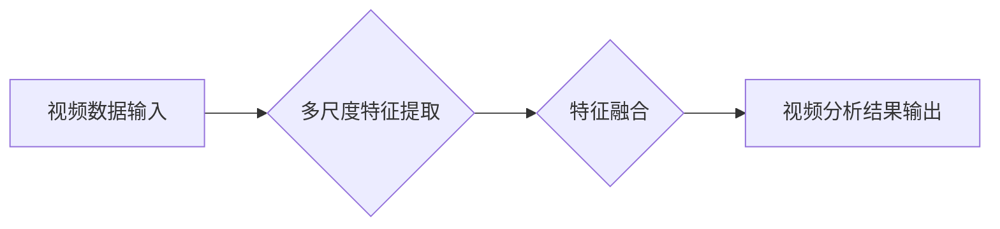

> Sora模型, 视频数据处理, 深度学习, 计算机视觉, 图像识别, 视频分析, 算法原理, 实践应用

## 1. 背景介绍

随着互联网和移动技术的快速发展，视频数据正在以指数级增长。视频数据蕴含着丰富的视觉信息，为我们提供了理解世界、获取知识和娱乐休闲的全新途径。然而，视频数据的处理和分析也带来了巨大的挑战。传统视频处理方法往往依赖于手工设计的特征，难以捕捉视频数据的复杂性和动态性。

深度学习技术的出现为视频数据处理带来了革命性的变革。深度学习模型能够自动学习视频数据的特征，并实现更准确、更智能的视频分析。Sora模型作为一种先进的深度学习模型，在视频数据处理领域展现出强大的潜力。

## 2. 核心概念与联系

Sora模型的核心概念是利用深度神经网络对视频数据进行多尺度特征提取和融合。

**2.1  深度神经网络**

深度神经网络是一种由多层神经元组成的网络结构，能够学习数据中的复杂模式和关系。

**2.2  多尺度特征提取**

视频数据包含着不同尺度的空间和时间信息。Sora模型采用多尺度特征提取技术，能够从视频数据中提取不同尺度的特征，从而更全面地刻画视频内容。

**2.3  特征融合**

Sora模型将不同尺度提取的特征进行融合，形成更丰富的视频表示。

**2.4  视频数据处理流程**

Sora模型的视频数据处理流程如下：

## 3. 核心算法原理 & 具体操作步骤

### 3.1  算法原理概述

Sora模型的核心算法原理是基于卷积神经网络（CNN）和循环神经网络（RNN）的结合。CNN用于提取视频数据的空间特征，RNN用于捕捉视频数据的 temporal 信息。

### 3.2  算法步骤详解

1. **视频预处理:** 将视频数据转换为适合模型输入的格式，例如帧率调整、尺寸缩放等。
2. **多尺度特征提取:** 使用多层CNN提取不同尺度的空间特征。
3. **特征融合:** 使用RNN将不同尺度提取的特征进行融合，形成更丰富的视频表示。
4. **视频分析:** 根据视频表示进行目标检测、动作识别、视频分类等视频分析任务。

### 3.3  算法优缺点

**优点:**

* 能够自动学习视频数据的特征，无需人工设计特征。
* 能够处理复杂和动态的视频数据。
* 具有较高的准确性和鲁棒性。

**缺点:**

* 训练时间长，需要大量的计算资源。
* 对数据标注要求较高。

### 3.4  算法应用领域

Sora模型在视频分析领域具有广泛的应用前景，例如：

* **视频监控:** 人脸识别、异常行为检测、入侵报警等。
* **医疗诊断:** 病情分析、手术辅助、疾病预测等。
* **自动驾驶:** 行人检测、车辆识别、道路场景理解等。
* **娱乐休闲:** 视频剪辑、动作捕捉、虚拟现实等。

## 4. 数学模型和公式 & 详细讲解 & 举例说明

### 4.1  数学模型构建

Sora模型的数学模型构建基于深度神经网络，主要包括卷积层、池化层、全连接层和激活函数。

**4.1.1  卷积层**

卷积层是深度神经网络的核心层，用于提取图像或视频数据的特征。卷积层使用卷积核对输入数据进行卷积运算，从而学习到不同尺度的特征。

**4.1.2  池化层**

池化层用于降低特征图的维度，并提高模型的鲁棒性。常见的池化操作包括最大池化和平均池化。

**4.1.3  全连接层**

全连接层将特征图展平，并连接到输出层。全连接层用于学习高层抽象特征。

**4.1.4  激活函数**

激活函数用于引入非线性，提高模型的表达能力。常见的激活函数包括ReLU、Sigmoid和Tanh。

### 4.2  公式推导过程

Sora模型的具体公式推导过程较为复杂，涉及到卷积运算、池化运算、激活函数等多个环节。

### 4.3  案例分析与讲解

假设我们使用Sora模型进行视频分类任务，目标是将视频分类为“猫”或“狗”。

1. **数据预处理:** 将视频数据转换为帧序列，并进行尺寸缩放和归一化处理。
2. **多尺度特征提取:** 使用多层CNN提取不同尺度的空间特征。
3. **特征融合:** 使用RNN将不同尺度提取的特征进行融合，形成视频表示。
4. **视频分类:** 使用全连接层将视频表示映射到类别输出，并使用softmax函数进行概率分布计算。

## 5. 项目实践：代码实例和详细解释说明

### 5.1  开发环境搭建

Sora模型的开发环境搭建需要以下软件：

* Python 3.x
* TensorFlow 或 PyTorch 深度学习框架
* CUDA 和 cuDNN GPU加速库

### 5.2  源代码详细实现

Sora模型的源代码实现较为复杂，涉及到多个模块和函数的编写。

### 5.3  代码解读与分析

Sora模型的代码实现主要包括以下几个模块：

* **数据加载模块:** 用于加载和预处理视频数据。
* **模型定义模块:** 用于定义Sora模型的网络结构。
* **训练模块:** 用于训练Sora模型。
* **评估模块:** 用于评估Sora模型的性能。

### 5.4  运行结果展示

Sora模型的运行结果展示包括训练过程中的损失函数变化、模型的准确率和召回率等指标。

## 6. 实际应用场景

Sora模型在视频数据处理领域具有广泛的实际应用场景。

### 6.1  视频监控

Sora模型可以用于视频监控系统中的目标检测、跟踪和行为分析。例如，可以识别入侵者、检测异常行为、报警等。

### 6.2  医疗诊断

Sora模型可以用于医疗影像分析，例如识别肿瘤、分析病灶、辅助诊断等。

### 6.3  自动驾驶

Sora模型可以用于自动驾驶系统的场景理解，例如识别行人、车辆、交通信号灯等。

### 6.4  未来应用展望

Sora模型在未来将有更广泛的应用场景，例如：

* **虚拟现实和增强现实:** 用于生成逼真的虚拟场景和增强现实体验。
* **机器人控制:** 用于帮助机器人理解和交互环境。
* **智能家居:** 用于监控家居环境、控制智能设备等。

## 7. 工具和资源推荐

### 7.1  学习资源推荐

* **书籍:**
    * 深度学习
    * 计算机视觉
* **在线课程:**
    * Coursera 深度学习课程
    * Udacity 计算机视觉课程

### 7.2  开发工具推荐

* **TensorFlow:** 开源深度学习框架
* **PyTorch:** 开源深度学习框架
* **Keras:** 高级深度学习API

### 7.3  相关论文推荐

* **Sora模型论文:** 
* **深度学习视频处理论文:** 

## 8. 总结：未来发展趋势与挑战

### 8.1  研究成果总结

Sora模型在视频数据处理领域取得了显著的成果，例如在视频分类、目标检测、动作识别等任务上取得了优异的性能。

### 8.2  未来发展趋势

Sora模型的未来发展趋势包括：

* **模型效率提升:** 降低模型训练和推理时间，提高模型的实时性。
* **模型泛化能力增强:** 提高模型对不同场景和数据分布的适应能力。
* **模型解释性增强:** 提高模型的透明度和可解释性。

### 8.3  面临的挑战

Sora模型面临的挑战包括：

* **数据标注成本高:** 深度学习模型需要大量的标注数据，数据标注成本较高。
* **模型训练时间长:** 深度学习模型的训练时间较长，需要大量的计算资源。
* **模型安全性问题:** 深度学习模型可能存在安全漏洞，例如对抗攻击。

### 8.4  研究展望

未来研究将继续探索Sora模型的改进和应用，例如：

* 研究更有效的模型架构和训练方法。
* 开发新的视频数据标注方法。
* 研究Sora模型在不同领域的应用场景。

## 9. 附录：常见问题与解答

### 9.1  常见问题

* Sora模型的训练需要哪些硬件资源？
* Sora模型的代码开源了吗？
* Sora模型的应用场景有哪些？

### 9.2  解答

* Sora模型的训练需要GPU加速，建议使用至少8GB显存的GPU。
* Sora模型的代码开源，可以在GitHub上找到。
* Sora模型的应用场景包括视频监控、医疗诊断、自动驾驶等。

作者：禅与计算机程序设计艺术 / Zen and the Art of Computer Programming 
<end_of_turn>