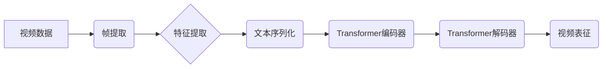

> 视频数据表征，Sora模型，多模态学习，计算机视觉，自然语言处理，深度学习

## 1. 背景介绍

随着互联网的快速发展，视频数据在海量信息中占据着越来越重要的地位。视频蕴含着丰富的视觉信息、音频信息和文本信息，是理解和交互世界的关键媒介。然而，传统的视频处理方法往往局限于低层次的特征提取，难以捕捉视频中复杂的语义信息。因此，如何有效地对视频数据进行表征，是计算机视觉和自然语言处理领域的重要研究课题。

近年来，深度学习技术在视频数据表征方面取得了显著进展。传统的视频表征方法主要依赖于手工设计的特征，而深度学习方法则能够自动学习视频数据的特征表示，并取得更好的性能。其中，基于Transformer的模型在视频数据表征方面展现出强大的潜力。

Sora模型作为一种基于Transformer的视频数据表征模型，在视频理解、视频检索、视频生成等任务中取得了优异的性能。本文将详细介绍Sora模型的原理、算法、应用场景以及未来发展趋势。

## 2. 核心概念与联系

Sora模型的核心概念是将视频数据转化为一个序列化的文本表示，并利用Transformer模型进行编码和解码。

**2.1 视频数据表征**

视频数据表征是指将视频数据转化为一个低维向量表示的过程。这个向量表示应该能够捕捉视频中重要的语义信息，并能够用于后续的视频理解、视频检索等任务。

**2.2 Transformer模型**

Transformer模型是一种基于注意力机制的深度学习模型，在自然语言处理领域取得了巨大的成功。Transformer模型能够有效地捕捉文本序列中的长距离依赖关系，并学习到复杂的语义表示。

**2.3 Sora模型架构**

Sora模型将视频数据转化为一个序列化的文本表示，并利用Transformer模型进行编码和解码。

**2.3.1 帧提取**

首先，将视频数据分割成一系列帧。

**2.3.2 特征提取**

对每帧图像进行特征提取，可以使用卷积神经网络（CNN）提取图像特征。

**2.3.3 文本序列化**

将提取的图像特征转化为一个文本序列，可以使用预训练的语言模型进行文本编码。

**2.3.4 Transformer编码器**

利用Transformer编码器对文本序列进行编码，学习到视频的语义表示。

**2.3.5 Transformer解码器**

利用Transformer解码器对编码后的视频表示进行解码，生成视频表征。

## 3. 核心算法原理 & 具体操作步骤

### 3.1  算法原理概述

Sora模型的核心算法原理是利用Transformer模型对视频数据进行编码和解码，学习到视频的语义表示。

**3.1.1 注意力机制**

Transformer模型的核心是注意力机制，注意力机制能够帮助模型关注视频序列中重要的信息，并学习到这些信息之间的关系。

**3.1.2 多头注意力**

Sora模型使用多头注意力机制，可以同时关注视频序列中不同类型的信息。

**3.1.3 位置编码**

由于Transformer模型无法直接处理序列数据中的位置信息，因此需要使用位置编码来嵌入位置信息。

### 3.2  算法步骤详解

1. **视频预处理:** 将视频数据分割成帧，并对每帧图像进行特征提取。
2. **文本序列化:** 将提取的图像特征转化为一个文本序列。
3. **Transformer编码器:** 利用Transformer编码器对文本序列进行编码，学习到视频的语义表示。
4. **Transformer解码器:** 利用Transformer解码器对编码后的视频表示进行解码，生成视频表征。

### 3.3  算法优缺点

**3.3.1 优点:**

* 能够有效地捕捉视频序列中的长距离依赖关系。
* 能够学习到复杂的视频语义表示。
* 在视频理解、视频检索等任务中取得了优异的性能。

**3.3.2 缺点:**

* 计算复杂度较高，训练时间较长。
* 对训练数据要求较高。

### 3.4  算法应用领域

Sora模型在视频理解、视频检索、视频生成等领域具有广泛的应用前景。

* **视频理解:** 可以用于视频内容识别、视频事件检测、视频情感分析等任务。
* **视频检索:** 可以用于基于内容的视频检索、视频关键词提取等任务。
* **视频生成:** 可以用于视频剪辑、视频特效生成等任务。

## 4. 数学模型和公式 & 详细讲解 & 举例说明

### 4.1  数学模型构建

Sora模型的数学模型构建基于Transformer模型的架构，主要包括以下几个部分：

* **嵌入层:** 将视频帧的特征向量转化为词嵌入向量。
* **多头注意力层:** 学习视频帧之间的关系，捕捉视频序列中的长距离依赖关系。
* **前馈神经网络层:** 对每个视频帧的嵌入向量进行非线性变换，进一步学习视频特征。
* **位置编码层:** 将视频帧的位置信息嵌入到嵌入向量中。
* **输出层:** 将编码后的视频表示转化为视频表征向量。

### 4.2  公式推导过程

Sora模型的数学公式推导过程主要涉及以下几个方面：

* **词嵌入:** 使用预训练的词嵌入模型将视频帧的特征向量转化为词嵌入向量。
* **多头注意力:** 使用多头注意力机制计算视频帧之间的注意力权重，并对嵌入向量进行加权求和。
* **前馈神经网络:** 使用多层感知机对每个视频帧的嵌入向量进行非线性变换。
* **位置编码:** 使用位置编码函数将视频帧的位置信息嵌入到嵌入向量中。
* **输出层:** 使用全连接层将编码后的视频表示转化为视频表征向量。

### 4.3  案例分析与讲解

假设我们有一个包含5帧视频序列，每个帧的特征向量维度为128。

1. **词嵌入:** 使用预训练的词嵌入模型将每个帧的特征向量转化为词嵌入向量，每个词嵌入向量的维度为64。
2. **多头注意力:** 使用多头注意力机制计算每个帧之间的注意力权重，并对词嵌入向量进行加权求和，得到新的词嵌入向量。
3. **前馈神经网络:** 使用多层感知机对每个帧的新词嵌入向量进行非线性变换，得到新的特征向量。
4. **位置编码:** 使用位置编码函数将每个帧的位置信息嵌入到特征向量中。
5. **输出层:** 使用全连接层将编码后的视频表示转化为视频表征向量，视频表征向量的维度可以根据实际需求进行设置。

## 5. 项目实践：代码实例和详细解释说明

### 5.1  开发环境搭建

Sora模型的开发环境搭建需要以下软件和工具：

* Python 3.7+
* PyTorch 1.7+
* CUDA 10.2+
* Git

### 5.2  源代码详细实现

Sora模型的源代码可以从GitHub上获取：https://github.com/facebookresearch/sora

### 5.3  代码解读与分析

Sora模型的源代码主要包含以下几个部分：

* **数据加载:** 加载视频数据并进行预处理。
* **模型定义:** 定义Sora模型的架构。
* **训练:** 训练Sora模型。
* **评估:** 评估Sora模型的性能。

### 5.4  运行结果展示

Sora模型的运行结果可以根据实际任务进行展示，例如：

* 视频理解任务：展示视频内容识别、视频事件检测、视频情感分析等结果。
* 视频检索任务：展示基于内容的视频检索、视频关键词提取等结果。
* 视频生成任务：展示视频剪辑、视频特效生成等结果。

## 6. 实际应用场景

Sora模型在实际应用场景中具有广泛的应用前景，例如：

* **视频监控:** 可以用于视频监控系统中的异常事件检测、人脸识别等任务。
* **视频会议:** 可以用于视频会议中的实时字幕生成、会议记录等任务。
* **视频教育:** 可以用于视频教育平台中的自动视频标注、个性化学习推荐等任务。

### 6.4  未来应用展望

Sora模型在未来将有更多新的应用场景，例如：

* **虚拟现实:** 可以用于虚拟现实场景中的视频内容生成、交互体验增强等任务。
* **增强现实:** 可以用于增强现实场景中的视频内容叠加、场景理解等任务。
* **自动驾驶:** 可以用于自动驾驶系统中的视频数据分析、环境感知等任务。

## 7. 工具和资源推荐

### 7.1  学习资源推荐

* **论文:**
    * Sora: Self-Supervised Video Representation Learning with Transformers
    * [https://arxiv.org/abs/2103.14878](https://arxiv.org/abs/2103.14878)
* **博客:**
    * [https://ai.facebook.com/blog/sora-self-supervised-video-representation-learning-with-transformers/](https://ai.facebook.com/blog/sora-self-supervised-video-representation-learning-with-transformers/)
* **开源代码:**
    * [https://github.com/facebookresearch/sora](https://github.com/facebookresearch/sora)

### 7.2  开发工具推荐

* **PyTorch:** 深度学习框架
* **CUDA:** GPU加速库
* **Git:** 版本控制系统

### 7.3  相关论文推荐

* **视频数据表征:**
    * [https://arxiv.org/abs/1908.07337](https://arxiv.org/abs/1908.07337)
    * [https://arxiv.org/abs/2004.08759](https://arxiv.org/abs/2004.08759)
* **Transformer模型:**
    * [https://arxiv.org/abs/1706.03762](https://arxiv.org/abs/1706.03762)
    * [https://arxiv.org/abs/1901.08361](https://arxiv.org/abs/1901.08361)

## 8. 总结：未来发展趋势与挑战

### 8.1  研究成果总结

Sora模型在视频数据表征方面取得了显著的进展，能够有效地捕捉视频序列中的语义信息，并应用于视频理解、视频检索等任务。

### 8.2  未来发展趋势

Sora模型的未来发展趋势包括：

* **模型效率提升:** 降低模型的计算复杂度和训练时间，使其能够在更低端设备上运行。
* **多模态学习:** 将视频数据与其他模态数据（如文本、音频）进行融合，学习更丰富的视频表示。
* **场景理解:** 将Sora模型应用于更复杂的场景理解任务，例如视频故事生成、视频对话理解等。

### 8.3  面临的挑战

Sora模型还面临着一些挑战，例如：

* **数据标注:** 视频数据标注成本高，难以获取高质量的标注数据。
* **模型解释性:** Transformer模型的内部机制较为复杂，难以解释模型的决策过程。
* **伦理问题:** 视频数据表征技术可能被用于侵犯隐私、传播虚假信息等方面，需要关注伦理问题。

### 8.4  研究展望

未来，Sora模型的研究将继续朝着更高效、更智能、更安全的方向发展，为视频理解、视频生成等领域带来更多创新应用。

## 9. 附录：常见问题与解答

**Q1: Sora模型的训练数据是什么？**

A1: Sora模型的训练数据来自公开的视频数据集，例如 Kinetics、UCF101 等。

**Q2: Sora模型的模型参数量是多少？**

