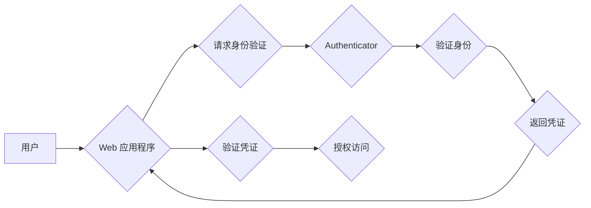

> WebAuthn，密码认证，FIDO，安全，生物识别，Web API，PKI，密码管理

## 1. 背景介绍

随着互联网的快速发展，用户在网络上的身份验证需求日益增长。传统的密码认证方式存在着诸多安全隐患，例如密码泄露、钓鱼攻击等。为了解决这些问题，FIDO（Fast IDentity Online）联盟提出了WebAuthn（Web Authentication）标准，旨在提供一种更加安全、便捷的Web身份认证方案。

WebAuthn是一种基于Web标准的密码认证协议，它利用硬件安全模块（如指纹传感器、面部识别器等）来验证用户的身份，无需依赖传统的密码或一次性密码（OTP）。WebAuthn标准由W3C（世界广域网联盟）制定，并得到了广泛的行业支持，包括Google、Microsoft、Apple等科技巨头。

## 2. 核心概念与联系

WebAuthn的核心概念包括：

* **Authenticator:** 认证器，负责存储用户的私钥和进行身份验证。它可以是硬件设备（如安全密钥、指纹识别器等）或软件应用程序（如手机上的Authenticator App）。
* **Credential:** 凭证，包含用户的公钥和相关信息，用于证明用户的身份。
* **Revocation List:** 吊销列表，用于记录已吊销的凭证。
* **Web API:** Web应用程序接口，允许网站和应用程序与Authenticator进行交互。

**WebAuthn 核心架构流程图:**



## 3. 核心算法原理 & 具体操作步骤

### 3.1  算法原理概述

WebAuthn基于椭圆曲线密码学（ECC）和数字签名算法来实现身份验证。

* **椭圆曲线密码学（ECC）：** ECC是一种公钥密码学算法，它使用椭圆曲线上的点进行加密和解密。ECC算法具有较高的安全性，并且密钥长度相对较短，因此更适合在资源受限的设备上使用。
* **数字签名算法：** 数字签名算法用于验证数据的完整性和身份。WebAuthn使用RSA或ECDSA算法来生成数字签名。

### 3.2  算法步骤详解

1. **用户注册:**
    * 用户在支持WebAuthn的网站上注册账户。
    * 网站会引导用户选择一个Authenticator，并进行身份验证。
    * Authenticator会生成一对公钥和私钥，并将公钥发送给网站。
    * 网站会将用户的公钥和相关信息存储在数据库中，作为用户的凭证。

2. **用户登录:**
    * 用户在支持WebAuthn的网站上登录。
    * 网站会请求用户使用Authenticator进行身份验证。
    * Authenticator会使用用户的私钥对一个随机挑战值进行签名。
    * 用户的签名和挑战值会被发送回网站。
    * 网站会使用用户的公钥验证签名，并确认用户的身份。

### 3.3  算法优缺点

**优点:**

* **安全性高:** WebAuthn基于硬件安全模块进行身份验证，不易受到攻击。
* **便捷性强:** 用户无需记住密码，只需使用Authenticator进行身份验证。
* **跨平台支持:** WebAuthn标准得到了广泛的行业支持，支持多种平台和设备。

**缺点:**

* **需要支持WebAuthn的网站和浏览器:** 目前，并非所有网站和浏览器都支持WebAuthn。
* **Authenticator的成本:** 购买硬件Authenticator可能需要一定的成本。

### 3.4  算法应用领域

WebAuthn可以应用于各种场景，例如：

* **网站登录:** 使用WebAuthn进行网站登录，提高安全性。
* **应用程序登录:** 使用WebAuthn进行应用程序登录，简化用户体验。
* **支付系统:** 使用WebAuthn进行支付系统认证，保障交易安全。
* **云服务:** 使用WebAuthn进行云服务身份验证，提高账户安全。

## 4. 数学模型和公式 & 详细讲解 & 举例说明

### 4.1  数学模型构建

WebAuthn基于椭圆曲线密码学（ECC）进行身份验证，其数学模型主要包括：

* **椭圆曲线:**  椭圆曲线是一个数学曲线，其方程为：y^2 = x^3 + ax + b。
* **点加法:**  椭圆曲线上的两个点可以进行加法运算，得到第三个点。
* **点乘:**  椭圆曲线上的一个点可以与一个整数进行乘法运算，得到另一个点。

### 4.2  公式推导过程

* **点加法公式:**  设P1 = (x1, y1) 和 P2 = (x2, y2) 是椭圆曲线上的两个点，则它们的点加法结果 P = P1 + P2 = (x, y)，其中：
    * x = λ^2 - x1 - x2
    * y = λ(x1 - x) - y1

* **点乘公式:**  设P = (x, y) 是椭圆曲线上的一个点，n 是一个整数，则点乘结果 Q = nP = (x', y')，其中：
    * x' = x
    * y' = y

### 4.3  案例分析与讲解

假设椭圆曲线方程为 y^2 = x^3 + 2x + 1，点 P1 = (1, 1) 和 P2 = (2, 3)。

* **点加法:**  P1 + P2 = (3, 0)
* **点乘:**  2P = 2 * P1 = (1, 1)

## 5. 项目实践：代码实例和详细解释说明

### 5.1  开发环境搭建

* **操作系统:** Linux、macOS 或 Windows
* **编程语言:** JavaScript
* **Web 浏览器:** Chrome、Firefox 或 Edge
* **WebAuthn 库:**  例如：`webauthn-polyfill`

### 5.2  源代码详细实现

```javascript
// 注册用户
async function registerUser() {
  const publicKeyCredential = await navigator.credentials.create({
    publicKey: {
      challenge: challenge, // 随机挑战值
      name: 'My Website',
      displayName: 'My Website',
      user: {
        id: 'user123', // 用户 ID
      },
    },
  });
  // 保存用户的凭证信息
}

// 登录用户
async function loginUser() {
  const publicKeyCredential = await navigator.credentials.get({
    publicKey: {
      challenge: challenge, // 随机挑战值
      allowCredentials: [
        {
          id: 'user123', // 用户 ID
        },
      ],
    },
  });
  // 验证用户的凭证信息
}
```

### 5.3  代码解读与分析

* `navigator.credentials.create()` 方法用于注册用户凭证。
* `navigator.credentials.get()` 方法用于获取用户的凭证信息。
* `challenge` 是一个随机生成的挑战值，用于验证用户的身份。
* `allowCredentials` 参数用于指定允许使用的凭证。

### 5.4  运行结果展示

当用户注册成功后，他们将获得一个Authenticator，并可以使用该Authenticator登录网站。

## 6. 实际应用场景

WebAuthn已在许多实际应用场景中得到应用，例如：

* **Google Chrome:** Chrome浏览器支持WebAuthn，用户可以使用Authenticator进行登录。
* **Microsoft Azure:** Azure平台支持WebAuthn，用户可以使用Authenticator进行身份验证。
* **Apple iCloud:** iCloud服务支持WebAuthn，用户可以使用Touch ID或Face ID进行登录。

### 6.4  未来应用展望

WebAuthn有望成为未来Web身份认证的标准，它将进一步提高网络安全，简化用户体验。

## 7. 工具和资源推荐

### 7.1  学习资源推荐

* **WebAuthn 规范:** https://www.w3.org/TR/webauthn/
* **FIDO Alliance:** https://fidoalliance.org/
* **WebAuthn Polyfill:** https://github.com/webauthn/webauthn-polyfill

### 7.2  开发工具推荐

* **YubiKey:** https://www.yubico.com/
* **Google Titan Security Key:** https://store.google.com/product/titan_security_key

### 7.3  相关论文推荐

* **Web Authentication (WebAuthn):** https://www.w3.org/TR/webauthn/
* **FIDO2 Protocol:** https://fidoalliance.org/specs/fido-v2.0/fido-v2.0-protocol-spec-v1.0.pdf

## 8. 总结：未来发展趋势与挑战

### 8.1  研究成果总结

WebAuthn标准的制定和推广，为Web身份认证带来了新的发展方向，提高了网络安全水平，并为用户提供了更加便捷的认证体验。

### 8.2  未来发展趋势

* **更广泛的应用:** WebAuthn将被应用于更多场景，例如物联网、区块链等领域。
* **更强大的安全性:** WebAuthn的安全性将不断提高，例如支持生物识别认证、零信任认证等。
* **更便捷的用户体验:** WebAuthn将与其他技术融合，例如人工智能、区块链等，提供更加便捷的用户体验。

### 8.3  面临的挑战

* **兼容性问题:** WebAuthn需要得到广泛的浏览器和网站支持，才能实现普及。
* **用户接受度:** 用户需要了解WebAuthn的优势，并愿意使用Authenticator进行身份验证。
* **安全漏洞:** WebAuthn标准需要不断完善，以应对新的安全威胁。

### 8.4  研究展望

未来，WebAuthn的研究方向将包括：

* **提高安全性:** 研究更安全的WebAuthn算法和协议。
* **增强用户体验:** 研究更便捷的用户认证方式。
* **拓展应用场景:** 将WebAuthn应用于更多领域。

## 9. 附录：常见问题与解答

* **什么是WebAuthn？** WebAuthn是一种基于Web标准的密码认证协议，它利用硬件安全模块来验证用户的身份。
* **WebAuthn有什么优势？** WebAuthn安全性高、便捷性强、跨平台支持。
* **如何使用WebAuthn？** 用户需要使用支持WebAuthn的网站和浏览器，并选择一个Authenticator进行身份验证。
* **WebAuthn是否安全？** WebAuthn基于硬件安全模块进行身份验证，安全性较高。
* **WebAuthn是否普及？** WebAuthn标准得到了广泛的行业支持，但并非所有网站和浏览器都支持WebAuthn。


作者：禅与计算机程序设计艺术 / Zen and the Art of Computer Programming 
<end_of_turn>