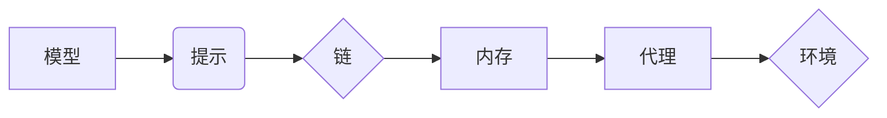

> LangChain, 多模态机器人, 自然语言处理, 图像识别, 语音识别, 机器学习, 深度学习, 计算机视觉

## 1. 背景介绍

近年来，人工智能技术取得了飞速发展，特别是自然语言处理（NLP）和计算机视觉（CV）领域取得了突破性进展。这使得构建能够理解和生成人类语言、识别和解释图像的多模态机器人成为可能。多模态机器人能够通过多种感知方式与人类交互，提供更丰富、更自然的体验。

LangChain 是一个强大的开源框架，专门用于构建和部署应用程序，它提供了一套完整的工具和组件，可以帮助开发者轻松地构建多模态机器人。

## 2. 核心概念与联系

**2.1 LangChain 的核心概念**

LangChain 的核心概念包括：

* **模型 (Model):**  指用于处理文本、图像、音频等数据的机器学习模型，例如 GPT-3、DALL-E 2、Whisper 等。
* **提示 (Prompt):**  指向模型提供输入的文本指令，用于引导模型生成特定的输出。
* **链 (Chain):**  指将多个模型和提示串联起来，形成一个完整的任务流程。
* **内存 (Memory):**  指存储模型在执行任务过程中获取的信息，用于保持上下文和状态。
* **代理 (Agent):**  指能够根据环境信息做出决策并执行操作的智能体，可以利用 LangChain 的工具和组件进行开发。

**2.2 LangChain 的架构**



**2.3 多模态机器人架构**

多模态机器人通常由以下几个模块组成：

* **感知模块:**  负责收集来自不同传感器的数据，例如摄像头、麦克风、触觉传感器等。
* **预处理模块:**  对收集到的数据进行预处理，例如图像识别、语音识别、文本处理等。
* **理解模块:**  对预处理后的数据进行理解，例如提取关键信息、识别意图等。
* **决策模块:**  根据理解到的信息，做出相应的决策。
* **执行模块:**  执行决策，例如控制机器人运动、发出语音指令等。

## 3. 核心算法原理 & 具体操作步骤

**3.1 算法原理概述**

多模态机器人的核心算法原理包括：

* **自然语言处理 (NLP):**  用于理解和生成人类语言，例如文本分类、情感分析、机器翻译等。
* **计算机视觉 (CV):**  用于识别和解释图像，例如物体检测、图像分类、场景理解等。
* **语音识别 (ASR):**  用于将语音转换为文本。
* **语音合成 (TTS):**  用于将文本转换为语音。

**3.2 算法步骤详解**

1. **数据收集:**  收集来自不同模态的数据，例如文本、图像、音频等。
2. **数据预处理:**  对收集到的数据进行预处理，例如文本清洗、图像裁剪、语音降噪等。
3. **模型训练:**  使用训练数据训练相应的模型，例如 NLP 模型、CV 模型、ASR 模型等。
4. **多模态融合:**  将不同模态的模型输出进行融合，例如将文本和图像信息结合起来，以获得更全面的理解。
5. **决策与执行:**  根据融合后的信息，做出决策并执行相应的操作。

**3.3 算法优缺点**

* **优点:**  能够理解和处理多种类型的输入，提供更丰富的交互体验。
* **缺点:**  算法复杂度高，需要大量的训练数据，部署成本较高。

**3.4 算法应用领域**

* **客服机器人:**  能够通过文本、语音和图像与用户进行交互，提供更智能化的客服服务。
* **教育机器人:**  能够通过多模态交互，提供更生动的学习体验。
* **医疗机器人:**  能够辅助医生进行诊断和治疗，提高医疗效率。

## 4. 数学模型和公式 & 详细讲解 & 举例说明

**4.1 数学模型构建**

多模态机器人的数学模型通常基于深度学习框架，例如 TensorFlow 或 PyTorch。模型结构可以根据具体任务进行设计，例如使用卷积神经网络 (CNN) 处理图像数据，使用循环神经网络 (RNN) 处理文本数据。

**4.2 公式推导过程**

深度学习模型的训练过程基于梯度下降算法，目标是找到模型参数，使得模型输出与真实值之间的误差最小化。

损失函数 (Loss Function) 用于衡量模型输出与真实值的差异，常用的损失函数包括均方误差 (MSE) 和交叉熵 (Cross-Entropy)。

梯度下降算法通过计算损失函数对模型参数的梯度，不断更新模型参数，使得损失函数逐渐减小。

**4.3 案例分析与讲解**

例如，在图像分类任务中，可以使用 CNN 模型，将图像数据转换为特征向量，然后使用全连接层进行分类。损失函数可以是交叉熵，梯度下降算法可以是 Adam 优化器。

## 5. 项目实践：代码实例和详细解释说明

**5.1 开发环境搭建**

需要安装 Python、pip、CUDA 和 cuDNN 等软件。

**5.2 源代码详细实现**

```python
from langchain.llms import OpenAI
from langchain.chains import ConversationChain
from langchain.memory import ConversationBufferMemory

# 初始化 OpenAI 模型
llm = OpenAI(temperature=0.7)

# 初始化对话内存
memory = ConversationBufferMemory()

# 初始化对话链
conversation = ConversationChain(
    llm=llm,
    memory=memory,
    prompt=f"你好，我是你的多模态机器人助手。请问有什么可以帮到您？"
)

# 与机器人对话
while True:
    user_input = input("您:")
    response = conversation.run(user_input)
    print("机器人:", response)
```

**5.3 代码解读与分析**

* 使用 OpenAI 的 API 连接到 GPT-3 模型。
* 使用 ConversationBufferMemory 作为对话内存，保存对话历史。
* 使用 ConversationChain 创建对话链，将模型、内存和提示串联起来。
* 使用循环结构与机器人进行交互，输入用户指令，获取机器人回复。

**5.4 运行结果展示**

```
您: 你好
机器人: 你好，我是你的多模态机器人助手。请问有什么可以帮到您？
您: 你能告诉我今天的天气吗？
机器人: 我需要访问外部信息才能告诉你今天的天气。
```

## 6. 实际应用场景

**6.1 客服机器人**

多模态客服机器人能够通过文本、语音和图像与用户进行交互，提供更智能化的客服服务。例如，用户可以通过语音描述问题，机器人可以识别问题并提供解决方案；用户可以通过图像上传故障图片，机器人可以识别故障并提供维修建议。

**6.2 教育机器人**

多模态教育机器人能够通过多模态交互，提供更生动的学习体验。例如，机器人可以展示3D模型，讲解科学知识；机器人可以进行角色扮演，帮助学生理解历史故事；机器人可以根据学生的学习进度，提供个性化的学习内容。

**6.3 医疗机器人**

多模态医疗机器人能够辅助医生进行诊断和治疗，提高医疗效率。例如，机器人可以帮助医生进行手术，提高手术精度；机器人可以帮助医生进行病理诊断，提高诊断准确率；机器人可以帮助医生进行患者康复训练，提高患者康复效果。

**6.4 未来应用展望**

随着人工智能技术的不断发展，多模态机器人的应用场景将会更加广泛。例如，在智能家居、智能交通、智能制造等领域，多模态机器人将发挥越来越重要的作用。

## 7. 工具和资源推荐

**7.1 学习资源推荐**

* **LangChain 官方文档:** https://python.langchain.com/docs/
* **OpenAI API 文档:** https://platform.openai.com/docs/api-reference
* **HuggingFace 模型库:** https://huggingface.co/models

**7.2 开发工具推荐**

* **Python:** https://www.python.org/
* **Jupyter Notebook:** https://jupyter.org/
* **TensorFlow:** https://www.tensorflow.org/
* **PyTorch:** https://pytorch.org/

**7.3 相关论文推荐**

* **BERT: Pre-training of Deep Bidirectional Transformers for Language Understanding:** https://arxiv.org/abs/1810.04805
* **GPT-3: Language Models are Few-Shot Learners:** https://arxiv.org/abs/2005.14165
* **DALL-E: Creating Images from Text:** https://openai.com/blog/dall-e/

## 8. 总结：未来发展趋势与挑战

**8.1 研究成果总结**

近年来，多模态机器人的研究取得了显著进展，模型性能不断提升，应用场景不断拓展。

**8.2 未来发展趋势**

* **模型能力提升:**  模型将更加强大，能够理解和处理更复杂的多模态信息。
* **应用场景拓展:**  多模态机器人的应用场景将更加广泛，覆盖更多领域。
* **伦理与安全:**  随着多模态机器人的应用越来越广泛，伦理和安全问题将更加重要。

**8.3 面临的挑战**

* **数据获取与标注:**  多模态数据的获取和标注成本较高。
* **模型训练与推理效率:**  多模态模型的训练和推理效率仍然需要提升。
* **跨模态理解与融合:**  实现跨模态的理解和融合仍然是一个挑战。

**8.4 研究展望**

未来，多模态机器人的研究将继续朝着更智能、更安全、更普惠的方向发展。


## 9. 附录：常见问题与解答

**9.1 如何选择合适的模型？**

选择合适的模型取决于具体的应用场景和任务需求。例如，对于图像分类任务，可以使用 ResNet 或 EfficientNet 等 CNN 模型；对于文本生成任务，可以使用 GPT-3 或 T5 等 Transformer 模型。

**9.2 如何处理多模态数据的融合？**

多模态数据的融合可以采用多种方法，例如特征融合、注意力机制、多任务学习等。

**9.3 如何评估多模态机器人的性能？**

多模态机器人的性能可以根据具体的应用场景和任务需求进行评估，例如使用准确率、召回率、F1-score 等指标评估分类任务的性能；使用BLEU、ROUGE 等指标评估文本生成任务的性能。


作者：禅与计算机程序设计艺术 / Zen and the Art of Computer Programming 
<end_of_turn>