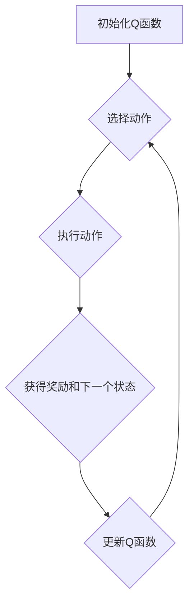

> Q-learning, 强化学习, 航天, 决策优化, 智能控制, 探索与利用, 奖励机制

## 1. 背景介绍

航天探索一直是人类文明的顶尖追求，它不仅拓展了人类对宇宙的认知，也推动了科技的进步。然而，航天任务的复杂性和风险性也使得其面临着巨大的挑战。传统的航天控制方法往往依赖于预先设定的规则和程序，难以应对未知环境和突发情况。近年来，人工智能（AI）技术的发展为航天领域带来了新的机遇。

其中，强化学习（Reinforcement Learning，RL）作为一种能够通过试错学习和优化决策的机器学习方法，展现出巨大的潜力。Q-learning，作为RL领域最经典和有效的算法之一，凭借其能够学习复杂决策策略的能力，在航天领域有着广泛的应用前景。

## 2. 核心概念与联系

**2.1 强化学习概述**

强化学习是一种基于交互学习的机器学习方法，其核心思想是通过与环境的交互，让智能体学习最优的策略，以最大化累积的奖励。

强化学习系统主要由以下几个组成部分构成：

* **智能体（Agent）：** 决策者，通过感知环境并采取行动来影响环境状态。
* **环境（Environment）：** 智能体所处的外部世界，会根据智能体的行动产生相应的反馈。
* **状态（State）：** 环境在某个时刻的描述，智能体感知环境的状态来做出决策。
* **动作（Action）：** 智能体可以采取的行动，会改变环境状态。
* **奖励（Reward）：** 环境对智能体采取的行动的反馈，可以是正向奖励或负向惩罚。

**2.2 Q-learning算法原理**

Q-learning算法是一种基于价值函数的强化学习算法，其目标是学习一个状态-动作价值函数Q(s,a)，该函数表示在状态s下采取动作a的期望累积奖励。

Q-learning算法的核心思想是通过迭代更新Q函数，使得Q函数逐渐逼近最优价值函数。更新规则如下：

$$Q(s,a) \leftarrow Q(s,a) + \alpha [r + \gamma \max_{a'} Q(s',a') - Q(s,a)]$$

其中：

* $\alpha$ 是学习率，控制着学习速度。
* $r$ 是当前状态下获得的奖励。
* $\gamma$ 是折扣因子，控制着未来奖励的权重。
* $s'$ 是采取动作a后进入的下一个状态。
* $a'$ 是在下一个状态下采取的动作。

**2.3  Q-learning算法流程图**



## 3. 核心算法原理 & 具体操作步骤

### 3.1  算法原理概述

Q-learning算法的核心是通过迭代更新状态-动作价值函数Q(s,a)，使得Q函数逐渐逼近最优价值函数。

算法的更新规则基于Bellman方程，它描述了状态-动作价值函数与环境奖励和未来状态价值之间的关系。

### 3.2  算法步骤详解

1. **初始化Q函数:** 将所有状态-动作对的Q值初始化为0或一个小的随机值。
2. **选择动作:** 根据当前状态和Q函数的值，选择一个动作。可以选择贪婪策略（选择Q值最大的动作）或探索策略（随机选择动作）。
3. **执行动作:** 在当前状态下执行选择的动作。
4. **获得奖励和下一个状态:** 环境根据执行的动作产生相应的奖励和下一个状态。
5. **更新Q函数:** 使用Bellman方程更新Q函数的值，根据当前状态、动作、奖励和下一个状态的Q值进行计算。
6. **重复步骤2-5:** 直到达到终止条件，例如达到最大迭代次数或达到目标奖励。

### 3.3  算法优缺点

**优点:**

* **能够学习复杂决策策略:** Q-learning算法能够学习复杂的环境和任务，即使环境是动态变化的。
* **不需要环境模型:** Q-learning算法不需要事先了解环境的模型，可以直接通过与环境的交互学习。
* **能够处理离散状态和动作空间:** Q-learning算法可以处理离散状态和动作空间，适用于许多实际应用场景。

**缺点:**

* **学习过程可能很慢:** Q-learning算法的学习过程可能需要很长时间，尤其是在状态和动作空间很大的情况下。
* **容易陷入局部最优:** Q-learning算法可能会陷入局部最优，无法找到全局最优策略。
* **需要大量的训练数据:** Q-learning算法需要大量的训练数据才能学习到有效的策略。

### 3.4  算法应用领域

Q-learning算法在许多领域都有广泛的应用，例如：

* **机器人控制:** 控制机器人运动、导航和任务执行。
* **游戏人工智能:** 训练游戏中的AI对手，使其能够做出智能决策。
* **推荐系统:** 建议用户感兴趣的内容，例如电影、音乐和商品。
* **金融交易:** 自动化交易策略，优化投资组合。

## 4. 数学模型和公式 & 详细讲解 & 举例说明

### 4.1  数学模型构建

Q-learning算法的核心是状态-动作价值函数Q(s,a)，它表示在状态s下采取动作a的期望累积奖励。

数学模型可以表示为：

$$Q(s,a) = E[\sum_{t=0}^{\infty} \gamma^t r_{t+1} | s_t = s, a_t = a]$$

其中：

* $s_t$ 表示时间t的状态。
* $a_t$ 表示时间t的动作。
* $r_{t+1}$ 表示时间t+1的奖励。
* $\gamma$ 是折扣因子，控制着未来奖励的权重。

### 4.2  公式推导过程

Q-learning算法的更新规则基于Bellman方程，它描述了状态-动作价值函数与环境奖励和未来状态价值之间的关系。

Bellman方程可以表示为：

$$Q(s,a) = r + \gamma \max_{a'} Q(s',a')$$

其中：

* $s'$ 是采取动作a后进入的下一个状态。
* $a'$ 是在下一个状态下采取的动作。

Q-learning算法的更新规则是：

$$Q(s,a) \leftarrow Q(s,a) + \alpha [r + \gamma \max_{a'} Q(s',a') - Q(s,a)]$$

其中：

* $\alpha$ 是学习率，控制着学习速度。

### 4.3  案例分析与讲解

假设有一个简单的环境，智能体可以采取两种动作：向上和向下。环境奖励为：

* 向上移动：奖励为1
* 向下移动：奖励为-1

智能体的目标是最大化累积奖励。

使用Q-learning算法，我们可以学习到最优策略。例如，如果智能体在某个状态下，向上移动的Q值大于向下移动的Q值，那么智能体就会选择向上移动。

## 5. 项目实践：代码实例和详细解释说明

### 5.1  开发环境搭建

* Python 3.x
* TensorFlow 或 PyTorch 等深度学习框架
* NumPy、Pandas 等数据处理库

### 5.2  源代码详细实现

```python
import numpy as np

# 定义环境
class Environment:
    def __init__(self):
        self.state = 0

    def step(self, action):
        if action == 0:  # 向上移动
            self.state = max(0, self.state - 1)
            reward = 1
        elif action == 1:  # 向下移动
            self.state = min(10, self.state + 1)
            reward = -1
        else:
            raise ValueError("Invalid action")
        return self.state, reward

# 定义Q-learning算法
class QLearning:
    def __init__(self, env, alpha=0.1, gamma=0.9, epsilon=0.1):
        self.env = env
        self.alpha = alpha
        self.gamma = gamma
        self.epsilon = epsilon
        self.q_table = np.zeros((11, 2))  # 状态-动作价值表

    def choose_action(self, state):
        if np.random.uniform(0, 1) < self.epsilon:
            return np.random.choice(2)  # 探索
        else:
            return np.argmax(self.q_table[state])  # 利用

    def learn(self, num_episodes):
        for episode in range(num_episodes):
            state = self.env.reset()
            done = False
            while not done:
                action = self.choose_action(state)
                next_state, reward = self.env.step(action)
                self.q_table[state, action] += self.alpha * (reward + self.gamma * np.max(self.q_table[next_state]) - self.q_table[state, action])
                state = next_state
                done = state == 10  # 终止条件

# 实例化环境和Q-learning算法
env = Environment()
agent = QLearning(env, alpha=0.1, gamma=0.9, epsilon=0.1)

# 训练Q-learning算法
agent.learn(num_episodes=1000)

# 测试最优策略
state = 0
while state != 10:
    action = agent.choose_action(state)
    state, reward = env.step(action)
    print(f"State: {state}, Action: {action}, Reward: {reward}")
```

### 5.3  代码解读与分析

* **环境定义:** `Environment`类定义了环境的规则，包括状态空间、动作空间和奖励函数。
* **Q-learning算法:** `QLearning`类实现了Q-learning算法的核心逻辑，包括选择动作、更新Q值和学习过程。
* **训练和测试:** 代码示例展示了如何训练Q-learning算法并测试最优策略。

### 5.4  运行结果展示

运行代码后，会输出智能体在环境中执行动作的轨迹，以及相应的奖励。最终，智能体应该能够学习到最优策略，最大化累积奖励。

## 6. 实际应用场景

### 6.1 航天任务规划与控制

Q-learning可以用于规划和控制航天任务，例如：

* **轨道控制:** 学习最优的推进策略，使航天器保持在预定的轨道上。
* **任务规划:** 学习最优的任务执行顺序，最大化任务完成效率。
* **避障控制:** 学习避开障碍物，确保航天器安全飞行。

### 6.2  遥感图像分析与处理

Q-learning可以用于遥感图像分析和处理，例如：

* **目标识别:** 学习识别特定目标，例如卫星、飞机和船只。
* **图像分割:** 学习将图像分割成不同的区域，例如陆地、水域和云层。
* **异常检测:** 学习检测图像中的异常情况，例如火灾和污染。

### 6.3  空间资源探测与利用

Q-learning可以用于空间资源探测和利用，例如：

* **矿物探测:** 学习识别和定位空间中的矿物资源。
* **资源采掘:** 学习最优的采掘策略，最大化资源利用率。
* **空间站维护:** 学习维护和修理空间站的各种系统。

### 6.4  未来应用展望

随着人工智能技术的不断发展，Q-learning在航天领域的应用前景更加广阔。未来，Q-learning可能被用于：

* **自主飞行:** 开发能够自主飞行和决策的航天器。
* **空间探索:** 探索更遥