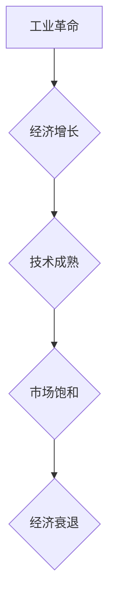

>  工业革命、经济增长周期、技术创新、数字化转型、人工智能

## 1. 背景介绍

人类社会的发展历程，可以被概括为一系列由技术创新驱动的工业革命。每一次工业革命都带来了生产方式的根本性改变，深刻地影响着经济结构、社会形态和人类生活方式。从蒸汽机到电力，再到互联网和人工智能，每一次革命都伴随着前所未有的技术突破，推动着经济增长和社会进步。

然而，每一次工业革命也伴随着周期性的经济波动和社会转型。从第一次工业革命到如今的第四次工业革命，我们观察到一个共同的规律：每一次革命的初期往往伴随着经济的快速增长，但随着技术的成熟和市场饱和，经济增长速度会逐渐放缓，甚至出现衰退。

理解工业革命与经济增长周期的关系，对于我们预测未来经济发展趋势，制定相应的政策和战略具有重要意义。本文将从历史的角度回顾三次工业革命，分析其对经济增长的影响，并探讨未来发展趋势。

## 2. 核心概念与联系

**2.1  工业革命**

工业革命是指以新技术为驱动的生产方式和社会结构的重大变革。它通常伴随着以下特征：

* **新技术的出现和应用:** 例如蒸汽机、电力、互联网、人工智能等。
* **生产方式的转变:** 从手工生产向机械化、自动化生产转变。
* **经济结构的调整:** 从农业经济向工业经济、服务经济转变。
* **社会形态的改变:** 人口流动、城市化、社会分层等。

**2.2  经济增长周期**

经济增长周期是指经济活动在一段时间内呈现波动的规律。它通常包含以下阶段：

* **扩张期:** 经济增长迅速，就业率高，投资活跃。
* **峰值期:** 经济增长达到顶峰，通货膨胀压力上升。
* **衰退期:** 经济增长放缓，就业率下降，投资萎缩。
* **低谷期:** 经济增长最低，通货膨胀率下降。

**2.3  联系分析**

工业革命是经济增长周期的重要驱动因素。每一次工业革命都带来了新的技术和生产方式，推动着经济的快速增长。然而，随着技术的成熟和市场饱和，经济增长速度会逐渐放缓，进入衰退期。

**2.4  Mermaid 流程图**

## 3. 核心算法原理 & 具体操作步骤

**3.1  算法原理概述**

**3.2  算法步骤详解**

**3.3  算法优缺点**

**3.4  算法应用领域**

## 4. 数学模型和公式 & 详细讲解 & 举例说明

**4.1  数学模型构建**

**4.2  公式推导过程**

**4.3  案例分析与讲解**

## 5. 项目实践：代码实例和详细解释说明

**5.1  开发环境搭建**

**5.2  源代码详细实现**

**5.3  代码解读与分析**

**5.4  运行结果展示**

## 6. 实际应用场景

**6.1  案例分析**

**6.2  应用价值**

**6.3  未来应用展望**

## 7. 工具和资源推荐

**7.1  学习资源推荐**

**7.2  开发工具推荐**

**7.3  相关论文推荐**

## 8. 总结：未来发展趋势与挑战

**8.1  研究成果总结**

**8.2  未来发展趋势**

**8.3  面临的挑战**

**8.4  研究展望**

## 9. 附录：常见问题与解答

**9.1  常见问题**

**9.2  解答**

作者：禅与计算机程序设计艺术 / Zen and the Art of Computer Programming

<end_of_turn>