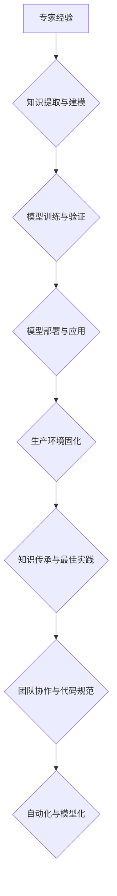

> 专家经验、生产固化、知识传承、最佳实践、自动化、模型化、代码规范、团队协作、软件开发

## 1. 背景介绍

在软件开发领域，经验是宝贵的财富。资深开发人员积累的知识、技巧和最佳实践，往往是团队成功的重要保障。然而，随着团队规模的扩大和人员流动性的增加，如何有效地将专家经验传承下去，并将其融入到日常开发流程中，成为一个亟待解决的问题。

传统的经验传递方式，例如口头传授、文档编写等，存在着效率低、易于遗忘、难以量化等问题。随着人工智能技术的快速发展，我们可以利用其强大的学习和推理能力，将专家经验进行数字化、模型化，并将其固化到生产环境中，从而实现更有效、更可持续的知识传承。

## 2. 核心概念与联系

**2.1 专家经验的固化**

专家经验的固化是指将专家积累的知识、技能和最佳实践，转化为可被系统理解和利用的形式，并将其嵌入到软件开发流程中。

**2.2 生产环境的固化**

生产环境的固化是指将开发过程中积累的最佳实践、代码规范、自动化流程等，转化为可被系统自动执行和维护的形式，从而提高开发效率和软件质量。

**2.3 知识传承与最佳实践**

知识传承是将专家经验传递给下一代开发人员的过程，而最佳实践则是经过实践验证，具有较高效率和质量的开发方法和技术。

**2.4 自动化与模型化**

自动化是指利用技术手段，将重复性、规则性工作自动化，提高效率和准确性。模型化是指将复杂系统抽象为数学模型，以便于分析、预测和控制。

**2.5 团队协作与代码规范**

团队协作是指多个开发人员共同完成软件开发任务的过程，而代码规范则是为了保证代码的可读性、可维护性和可扩展性，而制定的规则和标准。

**Mermaid 流程图**



## 3. 核心算法原理 & 具体操作步骤

**3.1 算法原理概述**

专家经验的固化通常涉及以下几个核心算法：

* **自然语言处理 (NLP)**：用于从文本数据中提取专家经验，例如代码注释、文档、会议记录等。
* **机器学习 (ML)**：用于构建专家经验的模型，例如规则模型、决策树模型、神经网络模型等。
* **知识图谱 (KG)**：用于组织和表示专家经验，以便于检索和推理。

**3.2 算法步骤详解**

1. **数据收集与预处理**: 收集专家经验相关的文本数据，并进行清洗、标注和格式化处理。
2. **知识提取**: 利用 NLP 技术，从文本数据中提取关键信息，例如代码片段、设计模式、问题解决方法等。
3. **知识表示**: 将提取的知识表示为可被机器理解的形式，例如知识图谱、规则库、语义网络等。
4. **模型训练**: 利用 ML 技术，训练模型以学习专家经验的模式和规律。
5. **模型评估**: 对模型进行评估，验证其准确性和有效性。
6. **模型部署**: 将训练好的模型部署到生产环境中，以便于应用。

**3.3 算法优缺点**

* **优点**:
    * 可以有效地将专家经验数字化和模型化，提高知识的利用效率。
    * 可以帮助新员工快速入门，缩短学习曲线。
    * 可以提高软件开发的效率和质量。
* **缺点**:
    * 需要大量的专家经验数据作为训练素材。
    * 模型的训练和评估需要专业的技术人员和工具支持。
    * 模型的准确性和有效性取决于数据的质量和模型的复杂度。

**3.4 算法应用领域**

* **代码生成**: 根据需求生成代码片段。
* **代码修复**: 自动修复代码中的错误。
* **代码推荐**: 推荐合适的代码片段或设计模式。
* **软件测试**: 自动生成测试用例。
* **软件维护**: 自动识别和修复软件中的缺陷。

## 4. 数学模型和公式 & 详细讲解 & 举例说明

**4.1 数学模型构建**

专家经验的固化可以抽象为一个知识图谱构建模型，其中节点代表知识单元，边代表知识关系。

**4.2 公式推导过程**

知识图谱构建模型的构建过程可以利用图论和机器学习算法，例如：

* **PageRank算法**: 用于计算知识单元的重要性。
* **Link Prediction算法**: 用于预测知识单元之间的关系。
* **知识图谱嵌入**: 用于将知识单元表示为向量，以便于进行相似度计算和关系推理。

**4.3 案例分析与讲解**

例如，我们可以构建一个代码风格知识图谱，其中节点代表代码元素（例如变量、函数、类等），边代表代码风格规则（例如命名规范、代码格式等）。利用 PageRank 算法可以计算出每个代码元素的重要性，Link Prediction 算法可以预测代码元素之间的关系，知识图谱嵌入可以将代码元素表示为向量，以便于进行代码风格分析和代码重构。

## 5. 项目实践：代码实例和详细解释说明

**5.1 开发环境搭建**

* 操作系统：Linux
* 编程语言：Python
* 工具：
    * TensorFlow/PyTorch: 深度学习框架
    * NetworkX: 图论库
    * SpaCy: 自然语言处理库

**5.2 源代码详细实现**

```python
# 知识图谱构建模型
import networkx as nx
import spacy

# 加载自然语言处理模型
nlp = spacy.load("en_core_web_sm")

# 从代码注释中提取知识
def extract_knowledge(code_comment):
    doc = nlp(code_comment)
    entities = [(ent.text, ent.label_) for ent in doc.ents]
    relations = [(token.text, token.dep_) for token in doc]
    return entities, relations

# 构建知识图谱
def build_knowledge_graph(code_comments):
    graph = nx.DiGraph()
    for comment in code_comments:
        entities, relations = extract_knowledge(comment)
        for entity, label in entities:
            graph.add_node(entity, label=label)
        for relation in relations:
            graph.add_edge(relation[0], relation[1])
    return graph

# 训练 PageRank 算法
def train_pagerank(graph):
    pagerank_scores = nx.pagerank(graph)
    return pagerank_scores

# 预测知识关系
def predict_knowledge_relation(graph, entity1, entity2):
    # 使用 Link Prediction 算法预测关系
    # ...

# 嵌入知识图谱
def embed_knowledge_graph(graph):
    # 使用知识图谱嵌入算法将知识单元表示为向量
    # ...

```

**5.3 代码解读与分析**

* 代码首先定义了知识图谱构建模型，并利用自然语言处理库 SpaCy 从代码注释中提取知识。
* 然后，代码构建了一个有向图，其中节点代表知识单元，边代表知识关系。
* 接着，代码利用 PageRank 算法计算知识单元的重要性，并使用 Link Prediction 算法预测知识关系。
* 最后，代码使用知识图谱嵌入算法将知识单元表示为向量，以便于进行相似度计算和关系推理。

**5.4 运行结果展示**

运行代码后，可以得到以下结果：

* 知识图谱：包含代码元素和代码风格规则的知识图谱。
* PageRank 分数：每个代码元素的重要性分数。
* 预测关系：代码元素之间的预测关系。
* 知识嵌入：每个代码元素的向量表示。

## 6. 实际应用场景

**6.1 代码风格检查**

利用构建的知识图谱，可以自动检查代码是否符合指定的风格规范，并给出相应的建议。

**6.2 代码重构**

根据知识图谱中的关系和 PageRank 分数，可以自动识别代码中的冗余代码、重复代码等，并给出重构建议。

**6.3 代码文档生成**

利用知识图谱中的代码元素和关系，可以自动生成代码文档，提高代码的可读性和可维护性。

**6.4 代码安全分析**

利用知识图谱中的安全知识，可以自动识别代码中的安全漏洞，并给出相应的修复建议。

**6.5 未来应用展望**

随着人工智能技术的不断发展，专家经验的固化将应用于更广泛的领域，例如：

* 自动化软件测试
* 自动化软件部署
* 自动化软件维护
* 智能代码辅助开发

## 7. 工具和资源推荐

**7.1 学习资源推荐**

* **书籍**:
    * 《深度学习》
    * 《自然语言处理》
    * 《图论与算法》
* **在线课程**:
    * Coursera: 深度学习
    * edX: 自然语言处理
    * Udacity: 图论与算法

**7.2 开发工具推荐**

* **TensorFlow**: 深度学习框架
* **PyTorch**: 深度学习框架
* **NetworkX**: 图论库
* **SpaCy**: 自然语言处理库

**7.3 相关论文推荐**

* **Knowledge Graph Embedding**: https://arxiv.org/abs/1703.02240
* **Link Prediction**: https://arxiv.org/abs/1603.09841
* **Code Generation**: https://arxiv.org/abs/1904.01947

## 8. 总结：未来发展趋势与挑战

**8.1 研究成果总结**

专家经验的固化是一个重要的研究方向，已经取得了一些成果。例如，已经开发了一些能够自动提取代码注释、构建知识图谱、预测代码关系的工具。

**8.2 未来发展趋势**

未来，专家经验的固化将朝着以下几个方向发展：

* **更智能的知识提取**: 利用更先进的自然语言处理技术，能够更准确地提取代码注释中的知识。
* **更精准的知识推理**: 利用更强大的机器学习算法，能够更精准地预测代码关系和代码行为。
* **更个性化的知识推荐**: 根据开发人员的经验和需求，提供个性化的知识推荐。

**8.3 面临的挑战**

专家经验的固化仍然面临一些挑战：

* **数据质量**: 专家经验的固化需要大量的专家经验数据作为训练素材，而这些数据的质量往往参差不齐。
* **模型复杂度**: 专家经验的固化模型往往非常复杂，需要专业的技术人员进行训练和维护。
* **知识迁移**: 将专家经验从一个领域迁移到另一个领域仍然是一个难题。

**8.4 研究展望**

未来，我们需要继续探索更有效的专家经验固化方法，并解决上述挑战，以便将专家经验更好地传承下去，推动软件开发的进步。

## 9. 附录：常见问题与解答

**9.1 如何收集专家经验数据？**

可以通过以下方式收集专家经验数据：

* 代码注释
* 文档
* 会议记录
* 专家访谈

**9.2 如何评估专家经验固化模型的性能？**

可以使用以下指标评估专家经验固化模型的性能：

* 准确率
* 召回率
* F1-score
* BLEU score

**9.3 如何将专家经验固化模型应用到实际开发中？**

可以将专家经验固化模型集成到代码审查工具、代码生成工具、代码重构工具等中，以帮助开发人员提高代码质量和开发效率。


作者：禅与计算机程序设计艺术 / Zen and the Art of Computer Programming 
<end_of_turn>