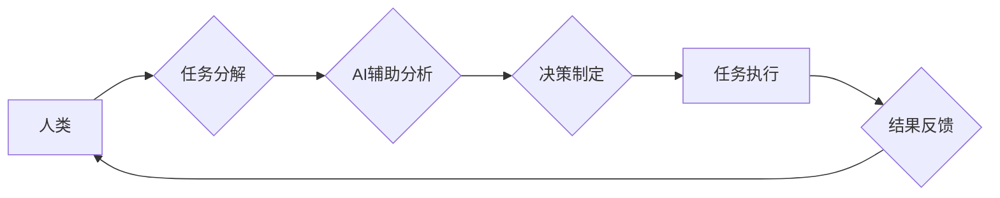

> 人机协同、工作效率、人工智能、机器学习、自然语言处理、自动化、协作模式

## 1. 背景介绍

随着人工智能（AI）技术的飞速发展，人机协同模式已成为未来工作的重要趋势。 人机协同是指人类和人工智能系统共同完成任务，充分发挥各自优势，实现协同增效。这种模式在各个领域，例如制造业、金融、医疗等，都展现出巨大的潜力。

然而，人机协同模式的实施并非一蹴而就，需要深入研究其对工作效率的影响，并探索如何优化协同流程，最大化效率提升。

## 2. 核心概念与联系

**2.1 人机协同模式**

人机协同模式是指人类和人工智能系统在共同完成任务的过程中，相互配合、相互补充，发挥各自优势，实现协同增效的模式。

**2.2 工作效率**

工作效率是指在单位时间内完成工作量的大小，通常用完成的工作量与所需时间之比来衡量。

**2.3 人工智能（AI）**

人工智能是指模拟人类智能行为的计算机系统，包括学习、推理、决策、感知等能力。

**2.4 协作模式**

协作模式是指多个个体或系统在共同完成任务的过程中，相互配合、相互补充，发挥各自优势，实现协同增效的模式。

**2.5 人机协同模式与工作效率的关系**

人机协同模式可以显著提升工作效率，主要体现在以下几个方面：

* **自动化重复性任务:** AI可以自动完成重复性、规则性任务，解放人力，提高效率。
* **智能辅助决策:** AI可以提供数据分析、预测等智能辅助，帮助人类做出更准确、更有效的决策。
* **协同工作效率提升:** 人机协同可以打破时间和空间限制，促进团队协作，提高工作效率。

**2.6 Mermaid 流程图**



## 3. 核心算法原理 & 具体操作步骤

**3.1 算法原理概述**

人机协同模式的实现需要多种算法的支持，例如机器学习、自然语言处理、强化学习等。这些算法可以帮助AI系统理解人类指令、分析数据、做出决策，并与人类进行有效的交互。

**3.2 算法步骤详解**

1. **数据收集与预处理:** 收集相关数据，并进行清洗、转换、格式化等预处理工作。
2. **模型训练:** 使用机器学习算法对数据进行训练，建立AI模型。
3. **模型评估与优化:** 对训练好的模型进行评估，并根据评估结果进行调整和优化。
4. **模型部署与应用:** 将训练好的模型部署到实际应用场景中，并与人类进行交互。

**3.3 算法优缺点**

* **优点:** 
    * 自动化重复性任务，提高效率。
    * 智能辅助决策，提高准确性。
    * 协同工作效率提升，促进团队合作。
* **缺点:** 
    * 需要大量数据进行训练，数据质量对模型性能影响较大。
    * 模型训练成本较高，需要专业技术人员进行操作。
    * AI系统缺乏人类的创造力和灵活性。

**3.4 算法应用领域**

* **制造业:** 自动化生产线，智能质检，预测性维护。
* **金融业:** 风险评估，欺诈检测，个性化金融服务。
* **医疗业:** 疾病诊断，药物研发，远程医疗。
* **教育业:** 个性化学习，智能辅导，自动批改作业。

## 4. 数学模型和公式 & 详细讲解 & 举例说明

**4.1 数学模型构建**

假设我们有一个简单的任务，需要人类和AI系统共同完成。我们可以用以下数学模型来描述他们的协作效率：

```
效率 = (人类效率 * AI效率 * 协作系数)
```

其中：

* 人类效率：人类完成任务的效率，例如每小时完成的任务量。
* AI效率：AI系统完成任务的效率，例如每秒处理的数据量。
* 协作系数：描述人类和AI系统协作效率的系数，取值范围为0到1，其中1表示协作效率最高。

**4.2 公式推导过程**

我们可以通过以下步骤推导协作系数：

1. 首先，我们需要确定人类和AI系统分别完成任务所需的时间。
2. 然后，我们可以计算出人类和AI系统分别完成任务的效率。
3. 最后，我们可以通过比较人类和AI系统协作完成任务所需的时间与各自单独完成任务所需时间的比例来确定协作系数。

**4.3 案例分析与讲解**

例如，假设一个人类需要10小时才能完成一个任务，而一个AI系统只需要1小时才能完成这个任务。如果他们协作完成任务，只需要5小时。那么，他们的协作系数为：

```
协作系数 = 5小时 / (10小时 + 1小时) = 0.33
```

这个例子表明，人类和AI系统协作可以显著提高效率，但协作系数并不总是很高，这取决于任务的复杂度和人类和AI系统的能力。

## 5. 项目实践：代码实例和详细解释说明

**5.1 开发环境搭建**

* 操作系统：Windows/macOS/Linux
* Python版本：3.7+
* 必要的库：numpy, pandas, scikit-learn, tensorflow等

**5.2 源代码详细实现**

```python
import numpy as np
from sklearn.linear_model import LinearRegression

# 数据集
X = np.array([[1, 2], [3, 4], [5, 6]])
y = np.array([7, 9, 11])

# 创建线性回归模型
model = LinearRegression()

# 训练模型
model.fit(X, y)

# 预测
new_data = np.array([[7, 8]])
prediction = model.predict(new_data)

# 打印预测结果
print(prediction)
```

**5.3 代码解读与分析**

这段代码演示了如何使用Scikit-learn库中的线性回归模型进行数据预测。

* 首先，我们定义了数据集X和y，其中X是特征数据，y是目标数据。
* 然后，我们创建了一个线性回归模型，并使用fit()方法对模型进行训练。
* 训练完成后，我们可以使用predict()方法对新的数据进行预测。

**5.4 运行结果展示**

运行这段代码后，会输出预测结果，例如：

```
[13. ]
```

这表示对于新的数据[[7, 8]]，模型预测的目标值为13。

## 6. 实际应用场景

**6.1 制造业**

* **智能工厂:** 人机协同可以实现智能工厂的自动化生产，提高生产效率和产品质量。
* **预测性维护:** AI可以分析设备运行数据，预测设备故障，及时进行维护，降低设备停机时间。

**6.2 金融业**

* **风险管理:** AI可以分析金融数据，识别潜在风险，帮助金融机构进行风险管理。
* **欺诈检测:** AI可以识别异常交易行为，帮助金融机构进行欺诈检测。

**6.3 医疗业**

* **疾病诊断:** AI可以辅助医生进行疾病诊断，提高诊断准确率。
* **药物研发:** AI可以加速药物研发过程，帮助开发新的药物。

**6.4 未来应用展望**

人机协同模式在未来将得到更广泛的应用，例如：

* **个性化教育:** AI可以根据学生的学习情况提供个性化的学习方案，提高学习效率。
* **智能客服:** AI可以提供智能客服服务，解决用户的疑问，提高客户满意度。
* **自动驾驶:** AI可以实现自动驾驶，提高交通安全和效率。

## 7. 工具和资源推荐

**7.1 学习资源推荐**

* **在线课程:** Coursera, edX, Udacity等平台提供人工智能相关的在线课程。
* **书籍:** 《深度学习》、《机器学习实战》等书籍可以帮助你深入了解人工智能相关知识。
* **开源项目:** TensorFlow, PyTorch等开源项目可以帮助你实践人工智能技术。

**7.2 开发工具推荐**

* **Python:** Python是一种流行的编程语言，广泛应用于人工智能领域。
* **Jupyter Notebook:** Jupyter Notebook是一种交互式编程环境，方便进行数据分析和模型开发。
* **TensorFlow:** TensorFlow是一个开源的机器学习框架，可以用于构建和训练深度学习模型。

**7.3 相关论文推荐**

* **《ImageNet Classification with Deep Convolutional Neural Networks》**
* **《Attention Is All You Need》**
* **《BERT: Pre-training of Deep Bidirectional Transformers for Language Understanding》**

## 8. 总结：未来发展趋势与挑战

**8.1 研究成果总结**

近年来，人工智能技术取得了长足的进步，人机协同模式也得到了广泛的研究和应用。

**8.2 未来发展趋势**

* **更智能的AI系统:** 未来，AI系统将更加智能，能够更好地理解人类需求，提供更精准的帮助。
* **更广泛的应用场景:** 人机协同模式将应用于更多领域，例如医疗、教育、娱乐等。
* **更人性化的交互方式:** 人机交互方式将更加人性化，例如语音、图像、情感识别等。

**8.3 面临的挑战**

* **数据安全和隐私保护:** 人机协同模式需要处理大量数据，因此数据安全和隐私保护是一个重要的挑战。
* **算法偏见:** AI算法可能存在偏见，需要进行公平性和可解释性的研究。
* **伦理问题:** 人机协同模式可能引发一些伦理问题，例如工作岗位替代、责任归属等，需要进行深入探讨。

**8.4 研究展望**

未来，我们需要继续深入研究人机协同模式，探索其对工作效率的影响，并解决其面临的挑战，以实现人机协同的和谐发展。

## 9. 附录：常见问题与解答

**9.1 如何提高人机协同效率？**

* 明确任务目标和分工。
* 选择合适的AI工具和技术。
* 建立有效的沟通机制。
* 持续优化协作流程。

**9.2 人机协同模式会取代人类工作吗？**

人机协同模式不会完全取代人类工作，而是会改变工作方式，提高工作效率。人类仍然需要发挥创造力、解决复杂问题和进行情感交流等方面的优势。

**9.3 人机协同模式有哪些伦理问题？**

人机协同模式可能引发一些伦理问题，例如工作岗位替代、责任归属等，需要进行深入探讨和规范。


作者：禅与计算机程序设计艺术 / Zen and the Art of Computer Programming 
<end_of_turn>