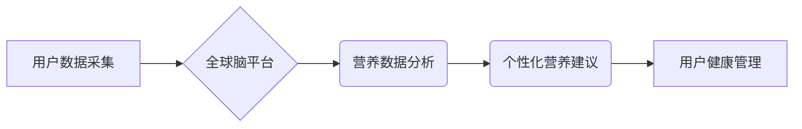

> 全球脑，饮食革命，集体智慧，营养优化，人工智能，大数据，机器学习，个性化营养，健康管理

## 1. 背景介绍

人类文明的进步离不开对自身营养需求的不断探索和满足。从最初的狩猎采集到现代的农业文明，人类始终在寻求最佳的饮食方式，以维持健康和提高生存能力。然而，随着社会发展和生活方式的改变，传统的饮食模式已难以满足现代人的个性化需求。

一方面，现代人面临着越来越多的健康问题，如肥胖、糖尿病、心血管疾病等，这些疾病与不良的饮食习惯密切相关。另一方面，个体对营养的需求因遗传、年龄、性别、活动量等因素而异，传统的“一刀切”的饮食建议难以满足每个人独特的需求。

## 2. 核心概念与联系

**2.1 全球脑**

全球脑是一个由分布式计算网络和人工智能技术构成的虚拟大脑，它能够汇集和处理来自全球各地的海量数据，并通过机器学习和深度学习等算法，模拟人类的认知能力，进行知识发现、决策分析和预测等。

**2.2 集体智慧**

集体智慧是指通过网络连接和协作，将众多个体智慧汇聚起来，形成比单个个体更强大的智慧力量。在全球脑的框架下，集体智慧可以发挥更大的作用，例如：

* **营养数据分析:** 收集全球各地的饮食习惯、营养需求、健康状况等数据，进行大规模的分析和挖掘，发现营养规律和健康模式。
* **个性化营养建议:** 根据个体的基因信息、生活习惯、健康状况等数据，为每个个体提供个性化的营养建议，帮助他们制定最佳的饮食方案。
* **新营养素发现:** 通过对海量数据的分析，发现新的营养素和健康成分，推动营养科学的进步。

**2.3 饮食革命**

饮食革命是指通过科技创新和数据驱动，改变传统的饮食模式，实现个性化、精准、可持续的营养优化。

**2.4 流程图**



## 3. 核心算法原理 & 具体操作步骤

**3.1 算法原理概述**

全球脑与饮食革命的核心算法主要包括：

* **机器学习:** 用于分析营养数据，发现营养规律和健康模式。
* **深度学习:** 用于识别图像和文本数据，例如食物图像和食谱，进行营养成分分析和饮食习惯识别。
* **自然语言处理:** 用于理解用户的饮食需求和健康问题，提供个性化的营养建议。
* **推荐系统:** 用于根据用户的饮食偏好和健康状况，推荐合适的营养方案和食谱。

**3.2 算法步骤详解**

1. **数据采集:** 收集用户的个人信息、基因信息、生活习惯、饮食记录、健康状况等数据。
2. **数据预处理:** 对收集到的数据进行清洗、转换和格式化，以便于算法的训练和应用。
3. **模型训练:** 使用机器学习和深度学习算法，对预处理后的数据进行训练，建立营养分析、个性化建议和健康管理等模型。
4. **模型评估:** 对训练好的模型进行评估，验证其准确性和有效性。
5. **个性化推荐:** 根据用户的个人信息和健康状况，利用训练好的模型，为用户提供个性化的营养建议和食谱推荐。
6. **健康管理:** 跟踪用户的饮食习惯和健康状况，并根据用户的反馈，不断优化营养建议和健康管理方案。

**3.3 算法优缺点**

**优点:**

* **个性化:** 根据用户的个人信息和健康状况，提供个性化的营养建议。
* **精准:** 利用大数据和人工智能技术，提高营养建议的精准度。
* **可持续:** 通过健康管理和营养优化，帮助用户建立健康的生活方式。

**缺点:**

* **数据隐私:** 需要收集和处理用户的个人信息，需要确保数据的安全和隐私。
* **算法偏差:** 算法模型的训练数据可能存在偏差，导致算法结果不准确。
* **技术复杂性:** 需要专业的技术人员进行算法开发和维护。

**3.4 算法应用领域**

* **营养咨询:** 为个人提供个性化的营养建议和食谱推荐。
* **健康管理:** 帮助用户监测和管理自己的健康状况，预防和控制慢性疾病。
* **食品研发:** 开发新的健康食品和营养补充剂。
* **医疗保健:** 为患者提供个性化的营养治疗方案。

## 4. 数学模型和公式 & 详细讲解 & 举例说明

**4.1 数学模型构建**

为了实现个性化营养建议，我们可以构建一个基于机器学习的数学模型，该模型将用户的个人信息、基因信息、生活习惯、饮食记录等数据作为输入，输出个性化的营养建议。

**4.2 公式推导过程**

模型的训练过程可以利用机器学习算法，例如线性回归、逻辑回归、支持向量机等。这些算法通过对训练数据进行拟合，学习出模型的参数，从而能够预测用户的营养需求和健康状况。

**4.3 案例分析与讲解**

假设我们想要预测用户的每日蛋白质需求，我们可以构建一个线性回归模型，将用户的体重、身高、年龄、活动量等数据作为输入变量，蛋白质需求作为输出变量。通过对训练数据的拟合，我们可以得到一个蛋白质需求预测公式：

```latex
蛋白质需求 = a * 体重 + b * 身高 + c * 年龄 + d * 活动量 + e
```

其中，a、b、c、d、e为模型的参数，可以通过训练数据求解。

**举例说明:**

假设用户的体重为60kg，身高为170cm，年龄为30岁，活动量为中等，则蛋白质需求可以根据公式进行计算：

```latex
蛋白质需求 = a * 60 + b * 170 + c * 30 + d * 中等 + e
```

## 5. 项目实践：代码实例和详细解释说明

**5.1 开发环境搭建**

* 操作系统: Ubuntu 20.04
* Python 版本: 3.8
* 必要的库: pandas, numpy, scikit-learn, matplotlib

**5.2 源代码详细实现**

```python
import pandas as pd
from sklearn.linear_model import LinearRegression

# 1. 数据加载
data = pd.read_csv('nutrition_data.csv')

# 2. 特征选择
features = ['体重', '身高', '年龄', '活动量']
target = '蛋白质需求'

# 3. 数据分割
from sklearn.model_selection import train_test_split
X_train, X_test, y_train, y_test = train_test_split(data[features], data[target], test_size=0.2)

# 4. 模型训练
model = LinearRegression()
model.fit(X_train, y_train)

# 5. 模型评估
from sklearn.metrics import mean_squared_error
y_pred = model.predict(X_test)
mse = mean_squared_error(y_test, y_pred)
print(f'模型均方误差: {mse}')

# 6. 个性化预测
new_data = pd.DataFrame({'体重': [60], '身高': [170], '年龄': [30], '活动量': ['中等']})
protein_demand = model.predict(new_data)
print(f'用户的蛋白质需求: {protein_demand[0]}')
```

**5.3 代码解读与分析**

* 代码首先加载营养数据，选择特征变量和目标变量。
* 然后将数据分割为训练集和测试集，用于模型训练和评估。
* 使用线性回归模型进行训练，并评估模型的性能。
* 最后，使用训练好的模型对新的用户数据进行预测，得到个性化的蛋白质需求建议。

**5.4 运行结果展示**

运行代码后，会输出模型的均方误差以及新用户的蛋白质需求预测结果。

## 6. 实际应用场景

**6.1 个人健康管理**

用户可以通过全球脑平台，输入自己的个人信息和健康状况，获得个性化的营养建议和食谱推荐，帮助他们制定健康饮食计划，管理体重，预防慢性疾病。

**6.2 医疗保健**

医生可以通过全球脑平台，为患者提供个性化的营养治疗方案，帮助患者控制血糖、血压、胆固醇等指标，改善健康状况。

**6.3 食品研发**

食品企业可以通过全球脑平台，分析用户的饮食偏好和营养需求，开发新的健康食品和营养补充剂，满足用户的个性化需求。

**6.4 未来应用展望**

随着人工智能和大数据技术的不断发展，全球脑与饮食革命将更加深入地改变我们的生活方式。未来，我们可以期待：

* 更精准的营养建议: 通过基因检测、生物传感器等技术，获取更详细的用户数据，提供更精准的营养建议。
* 更智能的饮食管理: 利用人工智能技术，自动生成个性化的饮食计划，并根据用户的反馈进行调整。
* 更丰富的健康服务: 全球脑平台将提供更丰富的健康服务，例如远程医疗、健康咨询、运动指导等。

## 7. 工具和资源推荐

**7.1 学习资源推荐**

* **书籍:**
    * 《深度学习》
    * 《机器学习实战》
    * 《Python数据科学手册》
* **在线课程:**
    * Coursera: 深度学习
    * edX: 机器学习
    * Udacity: 数据科学

**7.2 开发工具推荐**

* **Python:** 
    * pandas: 数据分析和处理
    * numpy: 数值计算
    * scikit-learn: 机器学习算法
    * matplotlib: 数据可视化
* **云平台:**
    * AWS
    * Azure
    * Google Cloud

**7.3 相关论文推荐**

* **深度学习在营养科学中的应用:**
    * [Deep Learning for Personalized Nutrition Recommendations](https://arxiv.org/abs/1906.04177)
* **人工智能驱动的饮食革命:**
    * [The AI-Powered Food Revolution](https://www.forbes.com/sites/bernardmarr/2020/03/17/the-ai-powered-food-revolution/?sh=6783476b719a)

## 8. 总结：未来发展趋势与挑战

**8.1 研究成果总结**

全球脑与饮食革命是一个前沿的科技领域，已经取得了一些重要的研究成果。例如，利用机器学习算法，可以实现个性化的营养建议，帮助用户制定健康饮食计划。

**8.2 未来发展趋势**

未来，全球脑与饮食革命将朝着以下几个方向发展：

* **更精准的营养建议:** 通过基因检测、生物传感器等技术，获取更详细的用户数据，提供更精准的营养建议。
* **更智能的饮食管理:** 利用人工智能技术，自动生成个性化的饮食计划，并根据用户的反馈进行调整。
* **更丰富的健康服务:** 全球脑平台将提供更丰富的健康服务，例如远程医疗、健康咨询、运动指导等。

**8.3 面临的挑战**

全球脑与饮食革命也面临着一些挑战：

* **数据隐私:** 需要收集和处理用户的个人信息，需要确保数据的安全和隐私。
* **算法偏差:** 算法模型的训练数据可能存在偏差，导致算法结果不准确。
* **技术复杂性:** 需要专业的技术人员进行算法开发和维护。

**8.4 研究展望**

尽管面临着挑战，但全球脑与饮食革命的前景依然光明。随着人工智能和大数据技术的不断发展，相信未来会有更多创新应用涌现，为人类的健康福祉做出更大的贡献。

## 9. 附录：常见问题与解答

**9.1 数据安全和隐私保护**

全球脑平台将严格遵守数据安全和隐私保护政策，采用加密技术和身份验证机制，确保用户的个人信息安全。

**9.2 算法准确性和可靠性**

全球脑平台的算法模型经过 rigorous 的训练和测试