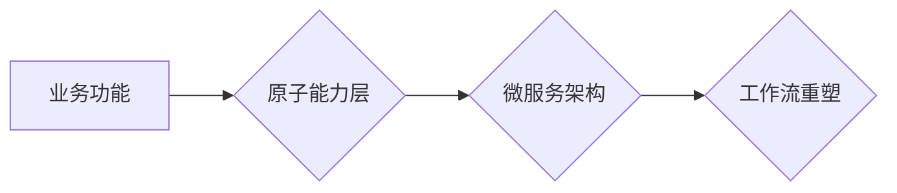

> 工作流重塑，原子能力层，微服务架构，敏捷开发，流程自动化，智能化

## 1. 背景介绍

在当今数字化时代，企业面临着日益激烈的市场竞争和不断变化的客户需求。传统的业务流程往往过于僵化，难以适应快速变化的环境。为了提高效率、降低成本和增强敏捷性，企业纷纷探索新的工作流重塑方法。

原子能力层作为一种新兴的架构模式，为工作流重塑提供了新的思路和方法。它将业务功能分解成一系列独立、可复用的原子能力，并通过微服务架构实现这些能力的松耦合和自治。这种模式能够显著提高工作流的灵活性、可扩展性和可靠性。

## 2. 核心概念与联系

### 2.1 原子能力层

原子能力层是指将业务功能分解成一系列独立、可复用的最小单元，称为原子能力。每个原子能力都专注于完成一个特定的业务任务，并通过清晰的输入和输出接口与其他能力进行交互。

### 2.2 微服务架构

微服务架构是一种将大型应用程序分解成一系列小型、独立的服务的架构模式。每个微服务都专注于实现一个特定的业务功能，并通过轻量级的通信协议（如RESTful API）进行交互。

### 2.3 工作流重塑

工作流重塑是指对现有业务流程进行重新设计和优化，以提高效率、降低成本和增强敏捷性。

**核心概念与联系的Mermaid流程图:**



## 3. 核心算法原理 & 具体操作步骤

### 3.1 算法原理概述

原子能力层的核心算法原理是基于**业务功能分解**和**微服务架构**的组合。

* **业务功能分解:** 将复杂的业务功能分解成一系列独立、可复用的原子能力，每个原子能力都专注于完成一个特定的业务任务。
* **微服务架构:** 将每个原子能力封装成一个独立的微服务，并通过轻量级的通信协议进行交互。

### 3.2 算法步骤详解

1. **业务流程分析:** 对现有业务流程进行详细分析，识别出关键业务功能和流程步骤。
2. **原子能力识别:** 将业务功能分解成一系列独立、可复用的原子能力，每个原子能力都专注于完成一个特定的业务任务。
3. **微服务设计:** 将每个原子能力封装成一个独立的微服务，并定义其输入和输出接口。
4. **微服务开发:** 开发每个微服务的代码，并进行单元测试和集成测试。
5. **部署和监控:** 将微服务部署到生产环境，并进行持续监控和优化。

### 3.3 算法优缺点

**优点:**

* **提高灵活性:** 原子能力层能够灵活地调整和扩展业务功能，适应不断变化的市场需求。
* **增强可扩展性:** 微服务架构能够轻松地水平扩展，以应对流量高峰和业务增长。
* **提高可靠性:** 每个微服务都是独立运行的，如果一个微服务出现故障，不会影响其他微服务的正常运行。

**缺点:**

* **开发复杂度:** 原子能力层的开发和维护相对复杂，需要专业的开发团队和技术支持。
* **数据一致性:** 微服务架构可能会导致数据一致性问题，需要采取相应的措施进行数据同步和管理。
* **监控和调试:** 微服务架构的监控和调试相对复杂，需要专业的监控工具和调试技巧。

### 3.4 算法应用领域

原子能力层的工作流重塑模式适用于各种行业和场景，例如：

* **电商平台:** 分解商品展示、购物车、支付、物流等业务功能，提高平台的灵活性和扩展性。
* **金融服务:** 分解账户管理、交易处理、风险控制等业务功能，提高金融服务的安全性、可靠性和效率。
* **医疗保健:** 分解患者管理、预约挂号、电子病历等业务功能，提高医疗服务的便捷性和效率。

## 4. 数学模型和公式 & 详细讲解 & 举例说明

### 4.1 数学模型构建

原子能力层的数学模型可以基于**状态机**和**事件驱动**的概念构建。

* **状态机:** 描述原子能力的状态转换和行为。每个状态代表原子能力的执行状态，例如“待执行”、“执行中”、“已完成”等。
* **事件驱动:** 描述原子能力之间的交互方式。每个事件代表一个原子能力的触发条件，例如“收到请求”、“完成任务”等。

### 4.2 公式推导过程

原子能力层的性能可以根据以下公式进行评估：

```latex
吞吐量 = 总请求数 / 总处理时间
```

其中：

* **吞吐量:** 指原子能力每单位时间能够处理的请求数量。
* **总请求数:** 指原子能力在特定时间段内接收到的请求数量。
* **总处理时间:** 指原子能力在特定时间段内处理所有请求所花费的时间。

### 4.3 案例分析与讲解

假设一个电商平台的原子能力是“添加商品到购物车”。

* **状态机:**

    * 状态：待执行、执行中、已完成
    * 事件：收到添加商品请求、商品添加成功、商品添加失败

* **性能评估:**

    * 假设该原子能力在1分钟内处理了1000个请求，则其吞吐量为1000个请求/分钟。

## 5. 项目实践：代码实例和详细解释说明

### 5.1 开发环境搭建

* 操作系统：Linux
* 编程语言：Java
* 微服务框架：Spring Boot
* 数据库：MySQL

### 5.2 源代码详细实现

```java
// 添加商品到购物车原子能力的代码示例
public class AddToCartService {

    @Autowired
    private CartRepository cartRepository;

    @Autowired
    private ProductRepository productRepository;

    public void addToCart(Long userId, Long productId, int quantity) {
        // 1. 查询商品信息
        Product product = productRepository.findById(productId).orElseThrow();

        // 2. 查询用户购物车
        Cart cart = cartRepository.findByUserId(userId);

        // 3. 添加商品到购物车
        CartItem cartItem = new CartItem(product, quantity);
        cart.addCartItem(cartItem);

        // 4. 保存购物车信息
        cartRepository.save(cart);

        // 5. 返回结果
        return ResponseEntity.ok("商品已添加到购物车");
    }
}
```

### 5.3 代码解读与分析

* 该代码示例实现了“添加商品到购物车”的原子能力。
* 该原子能力依赖于`CartRepository`和`ProductRepository`两个数据库操作接口。
* 该原子能力通过`addToCart`方法接收用户ID、商品ID和数量作为输入参数。
* 该原子能力首先查询商品信息和用户购物车，然后将商品添加到购物车，并保存购物车信息。
* 最后，该原子能力返回一个成功的响应。

### 5.4 运行结果展示

当用户调用`addToCart`方法添加商品到购物车时，系统会返回一个成功的响应，并更新用户的购物车信息。

## 6. 实际应用场景

### 6.1 原子能力层在电商平台的应用

在电商平台中，原子能力层可以将商品展示、购物车、支付、物流等业务功能分解成一系列独立的原子能力。例如：

* **商品展示能力:** 展示商品信息、图片和价格。
* **购物车能力:** 添加、删除和修改购物车中的商品。
* **支付能力:** 处理用户支付请求，并更新订单状态。
* **物流能力:** 查询物流信息，并更新订单状态。

通过将这些业务功能分解成原子能力，电商平台可以提高系统的灵活性、可扩展性和可靠性。

### 6.2 原子能力层在金融服务的应用

在金融服务中，原子能力层可以将账户管理、交易处理、风险控制等业务功能分解成一系列独立的原子能力。例如：

* **账户管理能力:** 创建、查询和修改账户信息。
* **交易处理能力:** 处理用户转账、充值和提现等交易请求。
* **风险控制能力:** 识别和防范欺诈交易和洗钱行为。

通过将这些业务功能分解成原子能力，金融服务机构可以提高系统的安全性、可靠性和效率。

### 6.4 未来应用展望

原子能力层的工作流重塑模式在未来将得到更广泛的应用，例如：

* **智能制造:** 将生产流程分解成原子能力，实现智能化生产和自动化控制。
* **医疗保健:** 将医疗服务流程分解成原子能力，实现个性化医疗和远程医疗。
* **教育培训:** 将教学内容分解成原子能力，实现个性化学习和在线教育。

## 7. 工具和资源推荐

### 7.1 学习资源推荐

* **书籍:**
    * 《微服务架构》
    * 《分布式系统设计》
    * 《设计模式》
* **在线课程:**
    * Udemy: 微服务架构
    * Coursera: 分布式系统
    * edX: 设计模式

### 7.2 开发工具推荐

* **微服务框架:** Spring Boot, Node.js, Go
* **数据库:** MySQL, PostgreSQL, MongoDB
* **消息队列:** Kafka, RabbitMQ
* **监控工具:** Prometheus, Grafana

### 7.3 相关论文推荐

* **Microservices: Architectural Style and Patterns**
* **Building Microservices: Designing Fine-Grained Systems**
* **The Twelve-Factor App**

## 8. 总结：未来发展趋势与挑战

### 8.1 研究成果总结

原子能力层的工作流重塑模式为企业提供了新的思路和方法，能够显著提高工作流的灵活性、可扩展性和可靠性。

### 8.2 未来发展趋势

* **更细粒度的原子能力:** 将原子能力进一步细化，提高系统的灵活性。
* **更智能化的工作流:** 利用人工智能技术，实现工作流的自动化和智能化。
* **更安全的微服务架构:** 加强微服务架构的安全防护，防止数据泄露和攻击。

### 8.3 面临的挑战

* **开发复杂度:** 原子能力层的开发和维护相对复杂，需要专业的开发团队和技术支持。
* **数据一致性:** 微服务架构可能会导致数据一致性问题，需要采取相应的措施进行数据同步和管理。
* **监控和调试:** 微服务架构的监控和调试相对复杂，需要专业的监控工具和调试技巧。

### 8.4 研究展望

未来，我们将继续研究原子能力层的工作流重塑模式，探索更细粒度、更智能化和更安全的微服务架构，为企业提供更有效的解决方案。

## 9. 附录：常见问题与解答

### 9.1 原子能力层和微服务架构有什么区别？

原子能力层是基于微服务架构的一种更细粒度的设计模式。微服务架构将应用程序分解成一系列独立的服务，而原子能力层将每个服务进一步分解成一系列独立的原子能力。

### 9.2 原子能力层如何提高工作流的灵活性？

原子能力层通过将业务功能分解成独立的原子能力，使得每个能力都可以独立开发、部署和更新。这使得工作流更加灵活，可以根据需要快速调整和扩展。

### 9.3 原子能力层如何解决数据一致性问题？

原子能力层可以通过以下几种方式解决数据一致性问题：

* **分布式事务:** 使用分布式事务技术，确保多个原子能力之间的数据操作原子性。
* **事件驱动:** 使用事件驱动机制，将数据变化作为事件进行传播，并通过事件监听机制进行数据同步。
* **数据缓存:** 使用数据缓存技术，将经常访问的数据缓存在内存中，提高数据访问速度并减少数据库访问次数。


作者：禅与计算机程序设计艺术 / Zen and the Art of Computer Programming 
<end_of_turn>