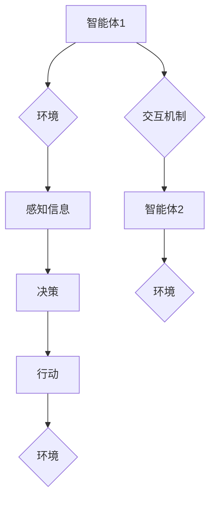

> 多智能体系统，协同工作，复杂项目，人工智能，机器学习，分布式计算，算法设计，项目管理

## 1. 背景介绍

在当今科技飞速发展的时代，复杂项目日益增多，其规模庞大、涉及领域广泛、挑战性强。传统的项目管理模式难以有效应对这些挑战。多智能体协同技术作为一种新兴的解决方案，凭借其强大的协同能力和自适应性，逐渐成为复杂项目管理的热门研究方向。

多智能体协同是指多个智能体在特定环境下，通过信息交互和协作，共同完成复杂任务。智能体可以是机器人、软件代理、人类等，它们各自拥有特定的知识、能力和目标，通过协作可以实现超越单个智能体能力的整体目标。

复杂项目通常具有以下特点：

* **规模庞大:** 项目涉及多个子任务、多个团队、大量资源。
* **跨领域:** 项目涉及多个学科领域，需要不同专业知识的协作。
* **动态变化:** 项目环境复杂多变，需要对变化进行实时响应和调整。
* **风险高:** 项目存在多种风险，需要有效识别和控制。

传统的项目管理模式难以有效应对这些挑战，例如：

* **信息孤岛:** 项目信息分散，难以共享和协同。
* **决策效率低:** 项目决策需要经过多层审批，效率低下。
* **资源分配不合理:** 资源分配缺乏优化，导致资源浪费和项目进度延迟。
* **风险控制不足:** 项目风险难以识别和控制，导致项目失败风险增加。

## 2. 核心概念与联系

多智能体协同系统通常由以下几个核心组件组成：

* **智能体:** 系统中的个体决策者，拥有感知、决策和行动的能力。
* **环境:** 智能体所处的外部世界，包括物理环境和信息环境。
* **交互机制:** 智能体之间进行信息交换和协作的机制。
* **协作策略:** 智能体之间共同完成任务的策略。

**Mermaid 流程图**



## 3. 核心算法原理 & 具体操作步骤

### 3.1  算法原理概述

多智能体协同算法旨在解决多个智能体在复杂环境下共同完成任务的问题。常见的算法包括：

* **中心化控制:** 一个中心控制器协调所有智能体的行动。
* **分布式控制:** 智能体之间直接交互，自主决策和协作。
* **混合控制:** 将中心化控制和分布式控制相结合。

### 3.2  算法步骤详解

以分布式控制为例，其基本步骤如下：

1. **环境感知:** 智能体感知环境信息，例如任务目标、资源状态、其他智能体的位置等。
2. **状态更新:** 智能体根据感知信息更新自身状态，例如位置、能量、任务进度等。
3. **决策制定:** 智能体根据自身状态和任务目标，制定行动计划。
4. **行动执行:** 智能体执行行动计划，改变自身状态和环境状态。
5. **信息交互:** 智能体与其他智能体进行信息交换，例如共享任务进度、资源状态等。

### 3.3  算法优缺点

**优点:**

* **鲁棒性强:** 即使部分智能体失效，系统仍然可以继续运行。
* **自适应性强:** 系统可以根据环境变化动态调整策略。
* **扩展性好:** 可以轻松添加新的智能体。

**缺点:**

* **协调复杂:** 多个智能体之间的协作需要复杂的算法和机制。
* **计算量大:** 智能体需要进行大量的计算和决策。
* **通信成本高:** 智能体之间需要频繁进行信息交互。

### 3.4  算法应用领域

多智能体协同算法广泛应用于以下领域:

* **机器人协作:** 多机器人协同完成复杂任务，例如搜索救援、环境清理等。
* **无人驾驶:** 多车协同行驶，提高交通效率和安全性。
* **智能制造:** 多机器人协同生产，提高生产效率和质量。
* **网络安全:** 多智能体协同防御网络攻击。

## 4. 数学模型和公式 & 详细讲解 & 举例说明

### 4.1  数学模型构建

多智能体协同系统可以用图论模型来表示，其中智能体作为节点，交互关系作为边。每个智能体可以被描述为一个状态向量，包含其当前状态信息。

### 4.2  公式推导过程

可以利用马尔可夫决策过程 (MDP) 模型来描述智能体的决策过程。MDP 模型包含以下元素:

* 状态空间 S: 所有可能的系统状态。
* 动作空间 A: 智能体可以执行的动作。
* 转移概率 P(s', s, a): 从状态 s 执行动作 a 到状态 s' 的概率。
* 奖励函数 R(s, a): 智能体在状态 s 执行动作 a 得到的奖励。
* 折扣因子 γ: 权衡未来奖励和当前奖励的系数。

智能体的目标是找到一个策略 π(s) ，使得在该策略下，其累积奖励最大化。

### 4.3  案例分析与讲解

例如，在多机器人协作任务中，每个机器人可以被视为一个智能体，其状态向量包含其位置、速度、任务进度等信息。机器人之间的交互关系可以表示为边，例如两个机器人需要协同完成一个任务。

可以使用 MDP 模型来描述机器人的决策过程，例如，机器人需要根据其当前状态和任务目标，决定其下一步的动作，例如移动到某个位置、执行某个任务等。

## 5. 项目实践：代码实例和详细解释说明

### 5.1  开发环境搭建

* 操作系统: Ubuntu 20.04
* 编程语言: Python 3.8
* 库依赖: ROS (Robot Operating System), PyTorch, NumPy

### 5.2  源代码详细实现

```python
import rospy
from std_msgs.msg import String

class Robot:
    def __init__(self, name):
        self.name = name
        self.position = [0, 0]
        self.task_progress = 0

    def perceive(self):
        # 模拟感知环境信息
        pass

    def decide(self):
        # 根据感知信息和任务目标，制定行动计划
        pass

    def act(self):
        # 执行行动计划
        pass

    def communicate(self, message):
        # 与其他机器人进行信息交互
        pass

if __name__ == '__main__':
    rospy.init_node('robot_node')
    robot1 = Robot('robot1')
    robot2 = Robot('robot2')

    # ... 其他代码实现 ...
```

### 5.3  代码解读与分析

* `Robot` 类定义了单个机器人的基本属性和行为。
* `perceive()` 方法模拟机器人感知环境信息。
* `decide()` 方法根据感知信息和任务目标，制定行动计划。
* `act()` 方法执行行动计划。
* `communicate()` 方法模拟机器人与其他机器人进行信息交互。

### 5.4  运行结果展示

* 机器人根据任务目标和环境信息，协同完成任务。
* 机器人之间通过信息交互，协调行动，提高效率。

## 6. 实际应用场景

### 6.1  智能制造

多智能体协同技术可以应用于智能制造领域，例如：

* 多机器人协同生产: 多个机器人协同完成生产任务，提高生产效率和质量。
* 智能物流: 多个机器人协同完成物流配送任务，提高效率和准确性。

### 6.2  无人驾驶

多智能体协同技术可以应用于无人驾驶领域，例如：

* 多车协同行驶: 多辆无人驾驶汽车协同行驶，提高交通效率和安全性。
* 自动驾驶交通管理: 多个无人驾驶汽车与交通管理系统协同工作，优化交通流量。

### 6.3  搜索救援

多智能体协同技术可以应用于搜索救援领域，例如：

* 多机器人协同搜索: 多个机器人协同搜索失踪人员或灾害现场。
* 搜索救援决策支持: 多智能体协同分析搜索信息，提供决策支持。

### 6.4  未来应用展望

多智能体协同技术在未来将有更广泛的应用场景，例如：

* 智能城市: 多智能体协同管理城市资源，提高城市效率和可持续性。
* 人机协作: 人类与智能体协同工作，提高工作效率和创造力。
* 科学探索: 多智能体协同进行科学实验和探索，加速科学发现。

## 7. 工具和资源推荐

### 7.1  学习资源推荐

* **书籍:**
    * Multiagent Systems: A Modern Approach
    * Introduction to Multiagent Systems
* **在线课程:**
    * Coursera: Multiagent Systems
    * edX: Introduction to Multiagent Systems

### 7.2  开发工具推荐

* **ROS (Robot Operating System):** 用于机器人开发的开源框架。
* **Gazebo:** 用于机器人仿真和测试的开源软件。
* **PyTorch:** 用于深度学习的开源框架。

### 7.3  相关论文推荐

* **Multi-Agent Reinforcement Learning for Cooperative Robotics**
* **A Survey of Multi-Agent Reinforcement Learning**
* **Multi-Agent Pathfinding: Algorithms and Applications**

## 8. 总结：未来发展趋势与挑战

### 8.1  研究成果总结

多智能体协同技术取得了显著进展，在多个领域取得了成功应用。

### 8.2  未来发展趋势

* **更复杂的协作场景:** 多智能体协同技术将应用于更复杂的协作场景，例如大型复杂系统的控制和管理。
* **更智能的智能体:** 智能体将更加智能，能够自主学习和适应环境变化。
* **更强大的计算能力:** 计算能力的提升将推动多智能体协同技术的进一步发展。

### 8.3  面临的挑战

* **算法设计:** 设计高效、鲁棒、可扩展的多智能体协同算法仍然是一个挑战。
* **资源分配:** 如何公平、高效地分配资源给多个智能体是一个关键问题。
* **安全性和可靠性:** 多智能体系统需要保证安全性和可靠性，防止恶意攻击和系统故障。

### 8.4  研究展望

未来，多智能体协同技术将继续朝着更智能、更复杂、更安全的方向发展，为人类社会带来更多福祉。

## 9. 附录：常见问题与解答

### 9.1  常见问题

* 多智能体协同技术与传统人工智能有什么区别？
* 多智能体协同技术有哪些应用场景？
* 多智能体协同技术的未来发展趋势是什么？

### 9.2  解答

* 多智能体协同技术与传统人工智能的区别在于，多智能体协同技术强调多个智能体之间的协作和交互，而传统人工智能则主要关注单个智能体的智能化。
* 多智能体协同技术的应用场景非常广泛，例如智能制造、无人驾驶、搜索救援等。
* 多智能体协同技术的未来发展趋势是朝着更智能、更复杂、更安全的方向发展。


作者：禅与计算机程序设计艺术 / Zen and the Art of Computer Programming 
<end_of_turn>