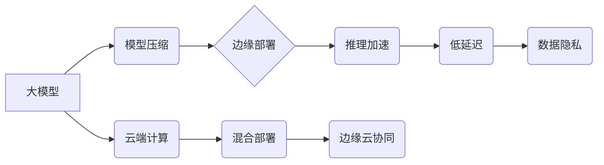

> 大模型、边缘计算、模型压缩、推理加速、数据隐私、低延迟、云端计算

## 1. 背景介绍

近年来，大模型在自然语言处理、计算机视觉、语音识别等领域取得了突破性进展，展现出强大的应用潜力。然而，大模型的训练和部署也面临着诸多挑战，其中之一就是其巨大的计算资源需求和高昂的部署成本。

传统的云端计算模式难以满足大模型的实时推理需求，尤其是在边缘设备上部署时，网络带宽有限、计算资源受限等问题更加突出。因此，将大模型部署到边缘计算环境中，成为一种重要的趋势。

边缘计算是指将计算、存储和网络资源部署到靠近数据源的边缘节点，例如智能手机、物联网设备、工业机器人等。它能够降低数据传输延迟、提高计算效率，并增强数据隐私保护能力。

## 2. 核心概念与联系

**2.1  大模型**

大模型是指参数量巨大、训练数据海量的人工智能模型。它们通常具有强大的泛化能力和学习能力，能够在各种任务中取得优异的性能。

**2.2  边缘计算**

边缘计算是指将计算、存储和网络资源部署到靠近数据源的边缘节点，例如智能手机、物联网设备、工业机器人等。它能够降低数据传输延迟、提高计算效率，并增强数据隐私保护能力。

**2.3  边缘部署**

边缘部署是指将大模型部署到边缘计算环境中，例如将大模型部署到智能手机、物联网设备、工业机器人等边缘节点上。

**2.4  模型压缩**

模型压缩是指通过各种技术手段，减少大模型的参数量和模型大小，从而降低模型的计算资源需求和部署成本。

**2.5  推理加速**

推理加速是指通过各种技术手段，提高大模型的推理速度，从而满足边缘设备的实时推理需求。

**2.6  数据隐私**

数据隐私是指个人信息和敏感数据的安全性和保密性。边缘计算能够帮助保护数据隐私，因为数据可以在边缘节点上进行处理，无需上传到云端。

**2.7  低延迟**

低延迟是指数据处理和响应时间短。边缘计算能够降低数据传输延迟，从而实现低延迟的实时推理。

**2.8  云端计算**

云端计算是指将计算资源和存储资源部署到远程数据中心，用户可以通过网络访问这些资源。

**2.9  混合部署**

混合部署是指将大模型部署到云端和边缘计算环境中，根据不同的应用场景和需求，选择合适的部署方式。

**2.10  边缘云协同**

边缘云协同是指边缘计算和云端计算协同工作，边缘节点负责处理部分数据和任务，复杂的任务则上传到云端进行处理。

**核心概念与联系流程图**



## 3. 核心算法原理 & 具体操作步骤

### 3.1  算法原理概述

边缘计算策略的核心算法原理包括模型压缩、推理加速、数据隐私保护等。

**3.1.1 模型压缩**

模型压缩是指通过各种技术手段，减少大模型的参数量和模型大小，从而降低模型的计算资源需求和部署成本。常见的模型压缩技术包括：

* **量化:** 将模型参数的精度降低，例如将32位浮点数转换为8位整数。
* **剪枝:** 删除模型中不重要的参数或神经元。
* **知识蒸馏:** 使用一个小的学生模型学习一个大的教师模型的知识。

**3.1.2 推理加速**

推理加速是指通过各种技术手段，提高大模型的推理速度，从而满足边缘设备的实时推理需求。常见的推理加速技术包括：

* **并行计算:** 将模型的计算任务分解成多个子任务，并行执行。
* **算子优化:** 优化模型中算子的计算方式，提高计算效率。
* **硬件加速:** 利用专用硬件，例如GPU、FPGA等，加速模型的推理过程。

**3.1.3 数据隐私保护**

数据隐私保护是指保护个人信息和敏感数据的安全性和保密性。常见的隐私保护技术包括：

* **联邦学习:** 在不共享原始数据的条件下，训练模型。
* **差分隐私:** 通过添加噪声，保护数据隐私。
* **同态加密:** 在加密状态下进行数据处理。

### 3.2  算法步骤详解

**3.2.1 模型压缩步骤**

1. 选择合适的模型压缩技术。
2. 对模型进行预处理，例如数据归一化、模型结构分析等。
3. 应用模型压缩技术，例如量化、剪枝、知识蒸馏等。
4. 对压缩后的模型进行评估，例如准确率、参数量、推理速度等。
5. 根据评估结果，调整模型压缩参数，优化模型性能。

**3.2.2 推理加速步骤**

1. 选择合适的推理加速技术。
2. 对模型进行优化，例如模型结构调整、算子优化等。
3. 利用并行计算、硬件加速等技术，加速模型推理过程。
4. 对加速后的模型进行评估，例如推理速度、准确率等。
5. 根据评估结果，调整加速参数，优化模型性能。

**3.2.3 数据隐私保护步骤**

1. 选择合适的隐私保护技术。
2. 对数据进行匿名化、脱敏等处理。
3. 应用隐私保护技术，例如联邦学习、差分隐私等。
4. 对保护后的数据进行评估，例如隐私泄露风险、数据可用性等。
5. 根据评估结果，调整隐私保护参数，优化数据隐私保护效果。

### 3.3  算法优缺点

**3.3.1 模型压缩**

* **优点:** 降低模型大小和计算资源需求，提高模型部署效率。
* **缺点:** 可能导致模型精度下降。

**3.3.2 推理加速**

* **优点:** 提高模型推理速度，满足实时推理需求。
* **缺点:** 可能需要额外的硬件成本。

**3.3.3 数据隐私保护**

* **优点:** 保护数据隐私，增强用户信任。
* **缺点:** 可能导致模型性能下降。

### 3.4  算法应用领域

* **智能手机:** 语音助手、图像识别、人脸识别等。
* **物联网设备:** 智能家居、工业自动化、医疗设备等。
* **自动驾驶:** 路线规划、物体检测、驾驶决策等。
* **医疗保健:** 病情诊断、药物研发、医疗影像分析等。

## 4. 数学模型和公式 & 详细讲解 & 举例说明

### 4.1  数学模型构建

**4.1.1 模型压缩**

模型压缩可以看作是一个优化问题，目标是找到一个压缩后的模型，其性能损失最小。

**4.1.2 推理加速**

推理加速可以看作是一个性能优化问题，目标是找到一种加速方法，能够最大程度地提高模型推理速度。

**4.1.3 数据隐私保护**

数据隐私保护可以看作是一个安全问题，目标是找到一种保护方法，能够有效地防止数据泄露。

### 4.2  公式推导过程

**4.2.1 模型压缩**

模型压缩的公式推导过程比较复杂，涉及到模型结构、参数量、精度等多个因素。

**4.2.2 推理加速**

推理加速的公式推导过程也比较复杂，涉及到并行计算、算子优化、硬件加速等多个因素。

**4.2.3 数据隐私保护**

数据隐私保护的公式推导过程涉及到概率论、信息论、密码学等多个领域。

### 4.3  案例分析与讲解

**4.3.1 模型压缩案例**

例如，使用量化技术压缩一个深度神经网络模型，可以将模型参数的精度从32位浮点数降低到8位整数，从而将模型大小减小一半，并降低推理速度。

**4.3.2 推理加速案例**

例如，使用并行计算技术加速一个深度神经网络模型的推理过程，可以将推理速度提高两倍。

**4.3.3 数据隐私保护案例**

例如，使用联邦学习技术训练一个深度神经网络模型，可以避免将原始数据上传到云端，从而保护数据隐私。

## 5. 项目实践：代码实例和详细解释说明

### 5.1  开发环境搭建

* 操作系统: Ubuntu 20.04
* Python 版本: 3.8
* 深度学习框架: TensorFlow 2.x

### 5.2  源代码详细实现

```python
# 模型压缩示例代码
import tensorflow as tf

# 定义一个简单的深度神经网络模型
model = tf.keras.models.Sequential([
    tf.keras.layers.Dense(128, activation='relu', input_shape=(784,)),
    tf.keras.layers.Dense(10, activation='softmax')
])

# 使用量化技术压缩模型
quantized_model = tf.keras.models.quantize_model(model,
                                              quantization_config=tf.keras.quantization.QuantizationConfig(
                                                  dtype=tf.int8))

# 保存压缩后的模型
quantized_model.save('quantized_model.h5')

# 推理加速示例代码
import tensorflow_model_optimization as tfmot

# 定义一个模型优化器
quantized_model = tfmot.quantization.keras.quantize_model(
    model,
    {
        'dense': tfmot.quantization.keras.quantize_weights,
    },
)

# 保存优化后的模型
quantized_model.save('optimized_model.h5')
```

### 5.3  代码解读与分析

* 模型压缩示例代码：使用 TensorFlow 的 `quantize_model` 函数对模型进行量化压缩，将模型参数的精度降低到8位整数。
* 推理加速示例代码：使用 TensorFlow Model Optimization Toolkit 的 `quantize_model` 函数对模型进行量化优化，并使用 `tfmot.quantization.keras.quantize_weights` 函数对模型权重进行量化。

### 5.4  运行结果展示

运行上述代码后，可以生成压缩后的模型文件和优化后的模型文件。

## 6. 实际应用场景

### 6.1  智能手机

* **语音助手:** 将语音识别模型部署到智能手机上，实现实时语音识别功能。
* **图像识别:** 将图像识别模型部署到智能手机上，实现实时图像识别功能，例如识别物体、场景、人脸等。

### 6.2  物联网设备

* **智能家居:** 将模型部署到智能家居设备上，实现智能控制功能，例如控制灯光、空调、窗帘等。
* **工业自动化:** 将模型部署到工业设备上，实现智能监控和故障诊断功能。

### 6.3  自动驾驶

* **物体检测:** 将物体检测模型部署到自动驾驶车辆上，实现实时物体检测功能，例如识别行人、车辆、交通信号灯等。
* **路径规划:** 将路径规划模型部署到自动驾驶车辆上，实现安全高效的路径规划功能。

### 6.4  未来应用展望

随着边缘计算技术的不断发展，大模型的边缘部署将有更广泛的应用场景，例如：

* **医疗保健:** 将医疗诊断模型部署到边缘设备上，实现实时病症诊断功能。
* **教育:** 将个性化学习模型部署到智能设备上，实现个性化教育服务。
* **金融:** 将欺诈检测模型部署到边缘设备上，实现实时欺诈检测功能。

## 7. 工具和资源推荐

### 7.1  学习资源推荐

* **书籍:**
    * 《深度学习》
    * 《机器学习》
    * 《TensorFlow实战》
* **在线课程:**
    * Coursera: 深度学习
    * Udacity: 机器学习工程师
