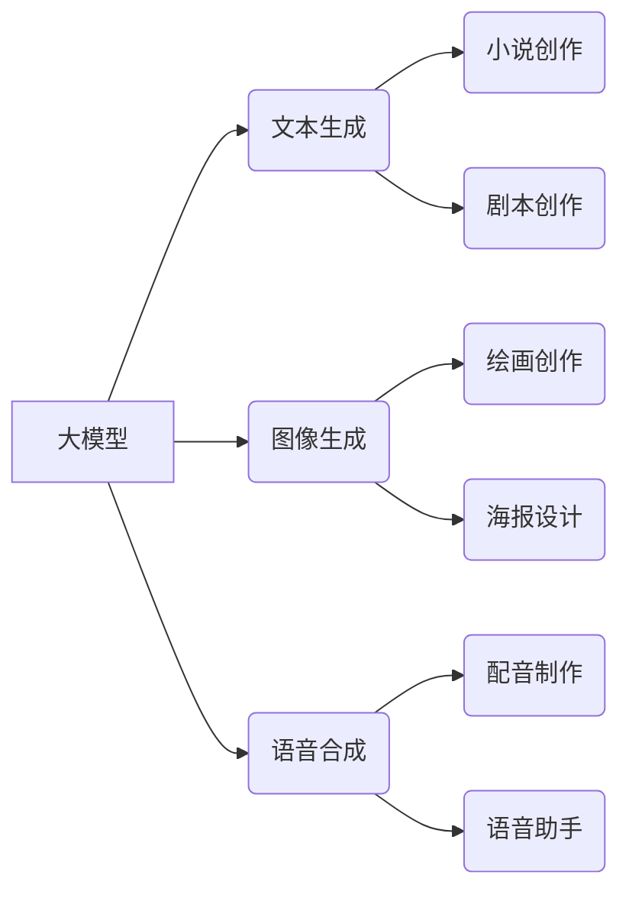

> 大模型、文化创意、人工智能、文本生成、图像生成、跨模态、商业模式、伦理问题

## 1. 背景介绍

文化创意产业作为推动经济发展和社会进步的重要力量，近年来呈现出蓬勃发展的态势。随着人工智能技术的快速发展，特别是大模型技术的突破，文化创意产业迎来了新的机遇和挑战。大模型，是指参数规模庞大、训练数据海量的人工智能模型，具备强大的泛化能力和学习能力，能够在文本生成、图像生成、语音识别、机器翻译等领域展现出令人惊叹的性能。

大模型的出现，为文化创意产业带来了前所未有的变革。它可以帮助创作者更高效地创作内容，降低创作门槛，并激发新的创意灵感。同时，大模型也为文化创意产业带来了新的商业模式和盈利机会。

## 2. 核心概念与联系

**2.1 大模型概述**

大模型是指参数规模庞大、训练数据海量的人工智能模型。其核心特点是：

* **规模化：** 大模型拥有数亿甚至数十亿个参数，远超传统机器学习模型。
* **海量数据：** 大模型的训练依赖于海量的数据集，这些数据涵盖文本、图像、音频等多种模态。
* **泛化能力：** 由于其庞大的参数规模和海量训练数据，大模型具备强大的泛化能力，能够应用于多种不同的任务。

**2.2 文化创意产业概述**

文化创意产业是指以文化创意为核心，以知识、文化、艺术为主要生产要素，以文化产品和服务为主要输出，并以市场化运作为特征的产业。其主要涵盖以下领域：

* **影视娱乐：** 电影、电视剧、动画、游戏等。
* **出版传媒：** 书籍、杂志、报纸、网络媒体等。
* **艺术设计：** 广告设计、平面设计、服装设计、建筑设计等。
* **音乐表演：** 音乐创作、演唱、演出等。

**2.3 大模型与文化创意产业的联系**

大模型可以为文化创意产业提供以下方面的支持：

* **内容创作：** 大模型可以辅助创作者生成文本、图像、音乐等创意内容，提高创作效率和效率。
* **内容推荐：** 大模型可以根据用户的喜好和行为数据，推荐个性化的文化创意内容。
* **内容营销：** 大模型可以帮助文化创意企业进行精准的营销推广，提高营销效果。
* **内容保护：** 大模型可以用于识别和打击文化创意作品的盗版和侵权行为。

**2.4 核心概念架构**

## 3. 核心算法原理 & 具体操作步骤

**3.1 算法原理概述**

大模型的训练主要基于深度学习算法，其中Transformer模型是目前最主流的架构。Transformer模型的核心思想是利用注意力机制，捕捉文本序列中不同词语之间的关系，从而更好地理解文本语义。

**3.2 算法步骤详解**

1. **数据预处理：** 将原始数据进行清洗、格式化和编码，使其能够被模型理解。
2. **模型训练：** 使用深度学习算法，例如Transformer模型，对预处理后的数据进行训练，学习文本的语义表示和生成规则。
3. **模型评估：** 使用测试数据评估模型的性能，例如准确率、流畅度、多样性等。
4. **模型调优：** 根据评估结果，调整模型参数和训练策略，提高模型性能。
5. **模型部署：** 将训练好的模型部署到实际应用场景中，例如文本生成、图像生成等。

**3.3 算法优缺点**

**优点：**

* 强大的泛化能力：大模型能够应用于多种不同的任务。
* 高的准确率：大模型在文本生成、图像生成等领域表现出色。
* 持续学习：大模型可以通过不断学习新的数据来提升性能。

**缺点：**

* 训练成本高：大模型的训练需要大量的计算资源和时间。
* 数据依赖性强：大模型的性能取决于训练数据的质量和数量。
* 缺乏可解释性：大模型的决策过程难以理解，难以解释其生成的结果。

**3.4 算法应用领域**

大模型的应用领域非常广泛，包括：

* 文本生成：小说、诗歌、剧本、新闻报道等。
* 图像生成：绘画、照片、视频等。
* 语音合成：语音助手、配音制作等。
* 机器翻译：将一种语言翻译成另一种语言。
* 聊天机器人：与人类进行自然语言对话。

## 4. 数学模型和公式 & 详细讲解 & 举例说明

**4.1 数学模型构建**

大模型的训练基于深度学习算法，其核心是构建一个复杂的数学模型，用来模拟人类大脑的学习过程。

**4.2 公式推导过程**

深度学习模型的训练过程本质上是一个优化问题，目标是找到模型参数的最佳值，使得模型在训练数据上的性能达到最大。常用的优化算法包括梯度下降法、Adam算法等。

**4.3 案例分析与讲解**

例如，在文本生成任务中，可以使用Transformer模型，其核心是注意力机制。注意力机制可以帮助模型关注文本序列中重要的词语，从而更好地理解文本语义。

**举例说明：**

假设我们有一个文本序列“我爱学习编程”，使用注意力机制，模型会将“学习”和“编程”这两个词语赋予更高的权重，因为它们与“我爱”的关系更紧密。

## 5. 项目实践：代码实例和详细解释说明

**5.1 开发环境搭建**

使用Python语言和深度学习框架TensorFlow或PyTorch搭建开发环境。

**5.2 源代码详细实现**

使用预训练的大模型，例如GPT-3或DALL-E，进行文本生成或图像生成任务。

**5.3 代码解读与分析**

解释代码中使用的函数、类和参数，以及代码的执行流程。

**5.4 运行结果展示**

展示代码运行的结果，例如生成的文本或图像。

## 6. 实际应用场景

**6.1 文本生成**

* 自动生成新闻报道、广告文案、产品描述等。
* 辅助作家创作小说、诗歌、剧本等。
* 开发聊天机器人，进行自然语言对话。

**6.2 图像生成**

* 生成艺术作品、插画、照片等。
* 用于游戏开发，生成游戏场景和角色。
* 在医学领域，生成医学图像，辅助诊断。

**6.3 跨模态生成**

* 将文本描述转换为图像，例如根据文本描述生成一张人物画像。
* 将图像转换为文本描述，例如对一张图片进行文字描述。

**6.4 未来应用展望**

大模型在文化创意产业的应用前景广阔，未来可能出现以下应用场景：

* 个性化内容创作：根据用户的喜好和需求，生成个性化的文化创意内容。
* 虚拟现实和增强现实：利用大模型生成虚拟场景和虚拟人物，打造沉浸式的文化体验。
* 数字人：利用大模型生成具有逼真形象和行为的数字人，用于娱乐、教育、商业等领域。

## 7. 工具和资源推荐

**7.1 学习资源推荐**

* 深度学习课程：Coursera、edX、Udacity等平台提供深度学习课程。
* 大模型研究论文：arXiv、Google Scholar等平台提供大模型研究论文。
* 在线社区：HuggingFace、Stack Overflow等平台提供深度学习和大模型相关的在线社区。

**7.2 开发工具推荐**

* 深度学习框架：TensorFlow、PyTorch、JAX等。
* 代码编辑器：VS Code、PyCharm等。
* 云计算平台：AWS、Google Cloud、Azure等。

**7.3 相关论文推荐**

* Attention Is All You Need (Vaswani et al., 2017)
* BERT: Pre-training of Deep Bidirectional Transformers for Language Understanding (Devlin et al., 2018)
* GPT-3: Language Models are Few-Shot Learners (Brown et al., 2020)

## 8. 总结：未来发展趋势与挑战

**8.1 研究成果总结**

大模型技术取得了显著的进展，在文本生成、图像生成等领域展现出强大的能力。

**8.2 未来发展趋势**

* 模型规模进一步扩大：模型参数规模将继续增加，模型能力将进一步提升。
* 多模态融合：大模型将融合文本、图像、音频等多种模态，实现跨模态的理解和生成。
* 伦理与安全：大模型的应用需要关注伦理和安全问题，例如避免生成有害内容、保护用户隐私等。

**8.3 面临的挑战**

* 训练成本高：大模型的训练需要大量的计算资源和时间，成本较高。
* 数据依赖性强：大模型的性能取决于训练数据的质量和数量，数据获取和标注是一个挑战。
* 可解释性问题：大模型的决策过程难以理解，缺乏可解释性。

**8.4 研究展望**

未来研究将重点关注以下方面：

* 降低大模型的训练成本。
* 开发更有效的训练方法，提高模型性能。
* 提升大模型的可解释性和安全性。
* 探索大模型在更多领域的应用。

## 9. 附录：常见问题与解答

**9.1 如何选择合适的预训练模型？**

选择预训练模型需要根据具体的应用场景和任务需求。例如，文本生成任务可以选择GPT-3，图像生成任务可以选择DALL-E。

**9.2 如何进行大模型的微调？**

微调是指在预训练模型的基础上，使用少量的数据进行训练，使其适应特定的任务。微调方法包括参数冻结、参数随机初始化等。

**9.3 如何评估大模型的性能？**

大模型的性能可以根据具体的任务进行评估。例如，文本生成任务可以使用BLEU、ROUGE等指标，图像生成任务可以使用PSNR、SSIM等指标。

作者：禅与计算机程序设计艺术 / Zen and the Art of Computer Programming 
<end_of_turn>