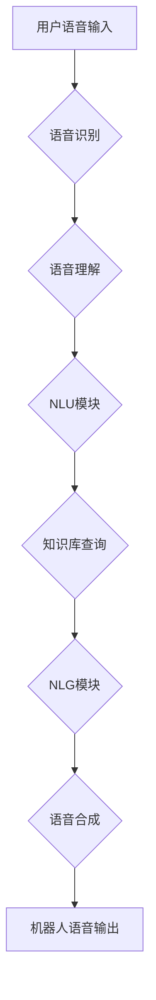

> 大模型、问答机器人、语音交互、自然语言处理、深度学习、Transformer

## 1. 背景介绍

近年来，人工智能技术取得了飞速发展，特别是深度学习的兴起，为自然语言处理（NLP）领域带来了革命性的变革。大模型问答机器人作为一种新型的智能交互系统，凭借其强大的语言理解和生成能力，在客服、教育、娱乐等领域展现出广阔的应用前景。

传统的问答系统主要依赖于规则引擎和知识库，难以应对复杂、开放式的自然语言问题。而大模型问答机器人则通过训练海量文本数据，学习语言的语义和结构，能够理解用户意图，并生成准确、流畅的回答。

语音交互作为一种更加自然、便捷的人机交互方式，与大模型问答机器人的结合，进一步提升了用户体验。语音交互能够消除文本输入的障碍，更贴近人类的自然沟通方式，为用户提供更加便捷、高效的交互体验。

## 2. 核心概念与联系

### 2.1 大模型

大模型是指在海量数据上训练的具有数十亿甚至千亿参数的深度学习模型。其强大的参数规模和训练数据量赋予其强大的泛化能力和语言理解能力。

### 2.2 问答机器人

问答机器人是一种能够理解用户问题并生成相应答案的智能系统。它通常由以下几个模块组成：

* **自然语言理解（NLU）模块：**负责解析用户输入的自然语言，提取关键信息，理解用户意图。
* **知识库模块：**存储着丰富的知识和信息，用于回答用户问题。
* **对话管理模块：**负责控制对话流程，引导用户提问，并生成自然流畅的对话回复。
* **自然语言生成（NLG）模块：**负责根据知识库信息生成准确、流畅的回答。

### 2.3 语音交互

语音交互是指通过语音信号进行人机交互的一种方式。它通常包括语音识别、语音合成和语音理解等技术。

**Mermaid 流程图**



## 3. 核心算法原理 & 具体操作步骤

### 3.1 算法原理概述

大模型问答机器人的语音交互主要基于以下核心算法：

* **语音识别算法：**将语音信号转换为文本。常用的算法包括隐马尔可夫模型（HMM）、条件随机场（CRF）和深度学习模型（如循环神经网络、卷积神经网络）。
* **自然语言理解算法：**将文本转换为机器可理解的语义表示。常用的算法包括词嵌入、句法分析和语义角色标注。
* **知识图谱构建算法：**将知识表示为图结构，方便知识检索和推理。常用的算法包括知识抽取、关系提取和知识图谱融合。
* **自然语言生成算法：**将机器可理解的语义表示转换为自然语言文本。常用的算法包括序列到序列模型（seq2seq）、Transformer和强化学习。

### 3.2 算法步骤详解

1. **语音输入：**用户通过语音输入设备（如麦克风）发出语音信号。
2. **语音识别：**语音识别算法将语音信号转换为文本。
3. **自然语言理解：**NLU模块对文本进行分析，提取关键信息，理解用户意图。
4. **知识库查询：**根据用户意图，从知识库中查询相关信息。
5. **答案生成：**NLG模块根据查询结果生成准确、流畅的答案。
6. **语音合成：**语音合成算法将文本转换为语音信号。
7. **语音输出：**机器人通过语音输出设备（如扬声器）发出语音回复。

### 3.3 算法优缺点

**优点：**

* **自然交互：**语音交互更加自然、便捷，更贴近人类的沟通方式。
* **高效便捷：**语音输入比文本输入更加快速，可以节省用户时间。
* **多模态交互：**可以结合其他模态信息（如图像、视频）进行更丰富的交互。

**缺点：**

* **语音识别准确率：**语音识别技术仍然存在一定的误差，可能会导致理解错误。
* **环境噪声：**环境噪声会影响语音识别效果。
* **个性化定制：**语音合成技术难以完全模拟人类语音的个性化特点。

### 3.4 算法应用领域

大模型问答机器人的语音交互技术在以下领域具有广泛的应用前景：

* **客服服务：**提供24小时在线语音客服，快速解决用户问题。
* **教育培训：**提供个性化语音辅导，帮助学生学习。
* **娱乐休闲：**提供语音互动游戏、故事朗读等娱乐服务。
* **医疗健康：**提供语音问诊、健康咨询等医疗服务。

## 4. 数学模型和公式 & 详细讲解 & 举例说明

### 4.1 数学模型构建

大模型问答机器人的语音交互涉及到多个数学模型，例如：

* **语音识别模型：**通常使用概率模型，例如隐马尔可夫模型（HMM）或条件随机场（CRF），来预测语音信号对应的文本序列。
* **自然语言理解模型：**通常使用深度学习模型，例如循环神经网络（RNN）或Transformer，来学习文本的语义表示。
* **知识图谱模型：**通常使用图数据库或知识表示语言（如RDF）来存储和查询知识。

### 4.2 公式推导过程

由于篇幅限制，这里只列举一个简单的例子，即使用HMM模型进行语音识别。

**HMM模型的三个核心假设：**

1. **齐次马尔可夫性：**当前状态只依赖于前一个状态，与更早的状态无关。
2. **观测独立性：**每个时刻的观测只依赖于当前状态，与其他时刻的观测无关。
3. **状态转移概率：**状态之间的转移概率是固定的。

**HMM模型的三个基本问题：**

1. **概率计算问题：**给定观测序列和模型参数，计算该序列出现的概率。
2. **最优路径问题：**给定观测序列和模型参数，找到最有可能导致该序列的隐藏状态序列。
3. **模型学习问题：**给定观测序列，学习模型参数，使得模型能够更好地描述观测序列的生成过程。

### 4.3 案例分析与讲解

假设我们有一个简单的语音识别任务，要识别“你好”这个词。我们可以使用HMM模型来进行识别。

**状态序列：**

* S1: “你好”的第一个音节
* S2: “你好”的第二个音节

**观测序列：**

* O1: “你好”的第一个音节对应的语音信号
* O2: “你好”的第二个音节对应的语音信号

**模型参数：**

* 状态转移概率矩阵：

```
[0.8 0.2]
[0.2 0.8]
```

* 发音概率矩阵：

```
[0.7 0.3]
[0.3 0.7]
```

我们可以使用前向算法或后向算法来计算观测序列出现的概率，并根据概率最高的路径来识别“你好”这个词。

## 5. 项目实践：代码实例和详细解释说明

### 5.1 开发环境搭建

* 操作系统：Ubuntu 20.04
* Python 版本：3.8
* 必要的库：TensorFlow、PyTorch、SpeechRecognition、NLTK

### 5.2 源代码详细实现

```python
# 导入必要的库
import speech_recognition as sr
import nltk

# 初始化语音识别器
r = sr.Recognizer()

# 使用麦克风进行语音录制
with sr.Microphone() as source:
    print("请说话：")
    audio = r.listen(source)

# 使用Google Speech Recognition进行语音识别
try:
    text = r.recognize_google(audio, language='zh-CN')
    print("您说的是：", text)

    # 使用NLTK进行自然语言理解
    tokens = nltk.word_tokenize(text)
    print("分词结果：", tokens)

except sr.UnknownValueError:
    print("语音识别失败")
except sr.RequestError as e:
    print("无法连接到语音识别服务；{0}".format(e))
```

### 5.3 代码解读与分析

* 使用 `speech_recognition` 库进行语音识别，并使用Google Speech Recognition服务进行识别。
* 使用 `nltk` 库进行自然语言处理，对识别出的文本进行分词。

### 5.4 运行结果展示

当用户说话时，程序会识别用户的语音，并将其转换为文本。然后，程序会对文本进行分词，并输出分词结果。

## 6. 实际应用场景

### 6.1 智能客服

大模型问答机器人的语音交互技术可以用于构建智能客服系统，提供24小时在线语音客服，快速解决用户问题。例如，用户可以通过语音询问产品信息、订单状态等问题，机器人可以根据知识库信息进行准确的回答。

### 6.2 语音教学

大模型问答机器人的语音交互技术可以用于构建语音教学系统，提供个性化语音辅导，帮助学生学习。例如，学生可以通过语音提问，机器人可以根据学生的学习进度和知识水平进行个性化的讲解和答疑。

### 6.3 语音娱乐

大模型问答机器人的语音交互技术可以用于构建语音娱乐系统，提供语音互动游戏、故事朗读等娱乐服务。例如，用户可以通过语音与机器人进行互动游戏，或者让机器人为其朗读故事。

### 6.4 未来应用展望

随着语音识别、自然语言理解和知识图谱技术的不断发展，大模型问答机器人的语音交互技术将有更广泛的应用场景，例如：

* **医疗健康：**提供语音问诊、健康咨询等医疗服务。
* **金融理财：**提供语音理财咨询、投资建议等服务。
* **交通出行：**提供语音导航、交通信息查询等服务。

## 7. 工具和资源推荐

### 7.1 学习资源推荐

* **书籍：**
    * 《深度学习》
    * 《自然语言处理》
    * 《语音信号处理》
* **在线课程：**
    * Coursera
    * edX
    * Udacity

### 7.2 开发工具推荐

* **语音识别库：**
    * SpeechRecognition
    * Kaldi
* **自然语言处理库：**
    * NLTK
    * spaCy
    * Gensim
* **深度学习框架：**
    * TensorFlow
    * PyTorch

### 7.3 相关论文推荐

* **Transformer模型：**
    * Attention Is All You Need
* **语音识别模型：**
    * DeepSpeech
    * Wav2Vec 2.0
* **自然语言理解模型：**
    * BERT
    * RoBERTa

## 8. 总结：未来发展趋势与挑战

### 8.1 研究成果总结

大模型问答机器人的语音交互技术取得了显著的进展，语音识别、自然语言理解和知识图谱技术的不断发展，使得大模型问答机器人能够更好地理解用户意图，并生成更准确、更流畅的回答。

### 8.2 未来发展趋势

* **模型规模和能力的提升：**未来大模型将更加庞大，拥有更强的语言理解和生成能力。
* **多模态交互的融合：**大模型问答机器人将更加注重多模态交互，例如结合图像、视频等信息进行更丰富的交互。
* **个性化定制：**大模型问答机器人将更加注重个性化定制，能够根据用户的喜好和需求进行个性化的服务。

### 8.3 面临的挑战

* **数据获取和标注：**大模型训练需要海量数据，而高质量的数据标注成本较高。
* **模型解释性和可解释性：**大模型的决策过程