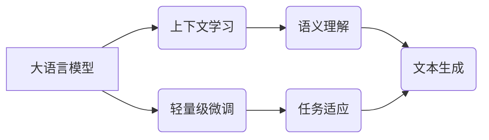

> 大语言模型、上下文学习、微调、Transformer、BERT、GPT、T5、LLM

## 1. 背景介绍

近年来，深度学习技术取得了飞速发展，特别是基于Transformer架构的大语言模型（LLM）的出现，彻底改变了自然语言处理（NLP）领域的面貌。LLM能够理解和生成人类语言，并展现出惊人的能力，例如文本生成、翻译、问答、代码生成等。

传统的NLP模型通常依赖于手工设计的特征工程和规则化方法，而LLM则通过学习海量文本数据，自动提取语言的语义和结构信息。这种数据驱动的方式使得LLM能够学习到更丰富的语言知识，并获得更优的性能。

然而，训练大型语言模型需要大量的计算资源和时间，并且部署到实际应用场景中也存在一定的挑战。为了解决这些问题，上下文学习和轻量级微调技术应运而生。

## 2. 核心概念与联系

**2.1 上下文学习**

上下文学习是指模型在处理文本时，不仅关注当前词的含义，还考虑其前后文语境的信息。这种机制能够帮助模型更好地理解文本的整体含义，并生成更准确、更流畅的文本。

**2.2 轻量级微调**

轻量级微调是指在预训练好的LLM基础上，通过训练少量数据对模型进行微调，从而使其适应特定任务或领域。这种方法能够有效降低训练成本和时间，同时还能提高模型在目标任务上的性能。

**2.3 核心概念关系图**



## 3. 核心算法原理 & 具体操作步骤

### 3.1 算法原理概述

上下文学习和轻量级微调的核心算法是基于Transformer架构的深度神经网络。Transformer模型通过自注意力机制（Self-Attention）能够捕捉文本中的长距离依赖关系，并通过多头注意力机制（Multi-Head Attention）能够学习到不同层面的语义信息。

轻量级微调则通过在预训练好的LLM的基础上，冻结大部分模型参数，只对少数参数进行微调，从而实现高效的模型适配。

### 3.2 算法步骤详解

**3.2.1 上下文学习步骤**

1. 将输入文本序列分割成若干个词或子词。
2. 使用嵌入层将每个词或子词映射到低维向量空间。
3. 通过多层Transformer编码器，对文本序列进行编码，并学习到每个词的上下文信息。
4. 使用解码器生成目标文本序列。

**3.2.2 轻量级微调步骤**

1. 选择预训练好的LLM模型。
2. 冻结大部分模型参数，只对特定层或模块的参数进行微调。
3. 使用目标任务的数据进行微调训练。
4. 评估微调模型在目标任务上的性能。

### 3.3 算法优缺点

**优点:**

* 上下文学习能够更好地理解文本的语义和结构信息。
* 轻量级微调能够有效降低训练成本和时间。
* 能够在特定任务或领域上取得优异的性能。

**缺点:**

* 训练大型语言模型需要大量的计算资源和时间。
* 微调模型的性能仍然依赖于预训练模型的质量和训练数据。

### 3.4 算法应用领域

上下文学习和轻量级微调技术在NLP领域有着广泛的应用，例如：

* 文本分类
* 情感分析
* 机器翻译
* 问答系统
* 代码生成

## 4. 数学模型和公式 & 详细讲解 & 举例说明

### 4.1 数学模型构建

**4.1.1 Transformer模型架构**

Transformer模型由编码器和解码器两部分组成。编码器负责将输入文本序列编码成上下文向量，解码器则根据上下文向量生成目标文本序列。

**4.1.2 自注意力机制**

自注意力机制能够捕捉文本中的长距离依赖关系。对于每个词，它会计算与所有其他词之间的注意力权重，并根据这些权重对词进行加权求和，从而得到该词的上下文表示。

**4.1.3 多头注意力机制**

多头注意力机制通过使用多个注意力头，能够学习到不同层面的语义信息。每个注意力头都学习到不同的注意力权重，并将这些权重进行拼接，从而得到更丰富的上下文表示。

### 4.2 公式推导过程

**4.2.1 自注意力机制公式**

```latex
Attention(Q, K, V) = softmax(Q K^T / sqrt(d_k)) V
```

其中：

* Q：查询矩阵
* K：键矩阵
* V：值矩阵
* d_k：键向量的维度
* softmax：softmax函数

**4.2.2 多头注意力机制公式**

```latex
MultiHead(Q, K, V) = Concat(head_1, head_2, ..., head_h) W^O
```

其中：

* head_1, head_2, ..., head_h：h个注意力头的输出
* W^O：输出权重矩阵

### 4.3 案例分析与讲解

**4.3.1 文本分类案例**

假设我们想要使用上下文学习和轻量级微调技术对文本进行分类，例如判断文本是正面评价还是负面评价。

我们可以使用预训练好的BERT模型，冻结大部分模型参数，只对分类头进行微调。

训练数据包括许多文本和对应的类别标签。通过微调训练，模型能够学习到不同类别文本的特征，并最终能够准确地预测文本的类别。

## 5. 项目实践：代码实例和详细解释说明

### 5.1 开发环境搭建

* Python 3.7+
* PyTorch 1.7+
* Transformers 4.0+

### 5.2 源代码详细实现

```python
from transformers import AutoModelForSequenceClassification, AutoTokenizer

# 加载预训练模型和分词器
model_name = "bert-base-uncased"
tokenizer = AutoTokenizer.from_pretrained(model_name)
model = AutoModelForSequenceClassification.from_pretrained(model_name, num_labels=2)

# 数据加载和预处理

# 模型训练

# 模型评估

# 模型保存
```

### 5.3 代码解读与分析

* 使用`transformers`库加载预训练模型和分词器。
* 数据预处理包括将文本转换为token序列，并添加分类标签。
* 模型训练使用PyTorch框架，并采用交叉熵损失函数和Adam优化器。
* 模型评估使用准确率、召回率和F1-score等指标。
* 模型保存可以使用`model.save_pretrained()`方法。

### 5.4 运行结果展示

* 训练完成后，模型能够在测试数据上达到较高的准确率。
* 可以使用可视化工具展示模型的训练过程和预测结果。

## 6. 实际应用场景

### 6.1 文本分类

* 垃圾邮件过滤
* 情感分析
* 文本摘要

### 6.2 机器翻译

* 自动翻译文本
* 多语言对话系统

### 6.3 问答系统

* 自动回答用户问题
* 智能客服系统

### 6.4 代码生成

* 自动生成代码片段
* 代码补全

### 6.4 未来应用展望

* 更智能的聊天机器人
* 个性化教育系统
* 自动写作工具
* 医疗诊断辅助系统

## 7. 工具和资源推荐

### 7.1 学习资源推荐

* **书籍:**
    * 《深度学习》
    * 《自然语言处理》
    * 《Transformer模型详解》
* **在线课程:**
    * Coursera: 自然语言处理
    * Udacity: 深度学习
    * fast.ai: 深度学习课程

### 7.2 开发工具推荐

* **Python:** 
    * PyTorch
    * TensorFlow
* **Transformers库:** 
    * https://huggingface.co/transformers/

### 7.3 相关论文推荐

* Attention Is All You Need
* BERT: Pre-training of Deep Bidirectional Transformers for Language Understanding
* GPT-3: Language Models are Few-Shot Learners

## 8. 总结：未来发展趋势与挑战

### 8.1 研究成果总结

上下文学习和轻量级微调技术在LLM领域取得了显著进展，使得LLM能够更有效地应用于实际场景。

### 8.2 未来发展趋势

* 更大规模的预训练模型
* 更高效的微调方法
* 更广泛的应用场景

### 8.3 面临的挑战

* 计算资源限制
* 数据标注成本
* 模型可解释性

### 8.4 研究展望

* 研究更有效的训练和微调方法
* 开发更强大的预训练模型
* 探索LLM在更多领域的应用

## 9. 附录：常见问题与解答

* **Q1: 如何选择合适的预训练模型？**

* **A1:** 选择预训练模型需要考虑任务类型、模型规模和性能等因素。

* **Q2: 如何进行轻量级微调？**

* **A2:** 轻量级微调需要冻结大部分模型参数，只对特定层或模块进行微调。

* **Q3: 如何评估模型性能？**

* **A3:** 模型性能可以使用准确率、召回率和F1-score等指标进行评估。


作者：禅与计算机程序设计艺术 / Zen and the Art of Computer Programming 
<end_of_turn>