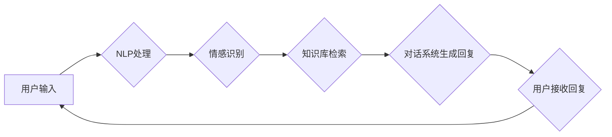

> AI情感咨询、心理健康、深度学习、自然语言处理、机器学习、数据安全

## 1. 背景介绍

在当今社会，心理健康问题日益突出，人们对心理咨询的需求不断增长。然而，传统的心理咨询服务面临着诸多挑战，例如：

* **资源有限:**  qualified的心理咨询师数量不足，难以满足大众的需求。
* **地域限制:**  心理咨询服务主要集中在城市，农村地区和偏远地区的居民难以获得服务。
* **成本高昂:**  传统的心理咨询服务费用较高，部分人群难以负担。

随着人工智能技术的快速发展，AI辅助的心理健康服务应运而生，为解决上述问题提供了新的解决方案。AI情感咨询平台利用人工智能技术，提供便捷、高效、经济的心理咨询服务，为大众心理健康保驾护航。

## 2. 核心概念与联系

**2.1 AI情感咨询的核心概念**

AI情感咨询是指利用人工智能技术，模拟人类心理咨询师的角色，通过与用户进行文本或语音交互，识别用户的情绪状态、心理需求，并提供相应的建议和支持。

**2.2 AI情感咨询的架构**

AI情感咨询平台通常由以下几个模块组成：

* **用户界面:**  提供用户与平台交互的界面，支持文本、语音、视频等多种交互方式。
* **自然语言处理 (NLP):**  负责处理用户输入的文本或语音，识别用户的情绪、意图和需求。
* **情感识别:**  利用机器学习算法，识别用户表达的情绪状态，例如快乐、悲伤、愤怒、焦虑等。
* **知识库:**  存储大量的心理咨询知识和经验，为AI提供参考和指导。
* **对话系统:**  根据用户输入和情感状态，从知识库中检索相关信息，并生成自然流畅的回复。
* **数据分析:**  收集用户交互数据，进行分析和挖掘，不断优化平台的性能和服务质量。

**2.3 AI情感咨询的流程图**



## 3. 核心算法原理 & 具体操作步骤

**3.1 算法原理概述**

AI情感咨询的核心算法主要包括自然语言处理 (NLP)、情感识别和对话系统。

* **自然语言处理 (NLP):**  NLP技术用于理解和处理人类语言，包括文本分析、语音识别、机器翻译等。在AI情感咨询中，NLP技术用于识别用户输入的意图、情感和需求。

* **情感识别:**  情感识别技术用于识别文本或语音中表达的情绪状态。常用的情感识别算法包括机器学习算法、深度学习算法和规则匹配算法。

* **对话系统:**  对话系统是AI情感咨询平台的核心组件，负责与用户进行交互，提供心理咨询服务。对话系统通常基于规则或机器学习算法，能够理解用户的意图，并生成自然流畅的回复。

**3.2 算法步骤详解**

**3.2.1 自然语言处理 (NLP)**

1. **文本预处理:**  去除文本中的停用词、标点符号等无用信息，并将文本转换为标准格式。
2. **词性标注:**  识别文本中每个词的词性，例如名词、动词、形容词等。
3. **依存句法分析:**  分析文本中的句子结构，识别每个词与其他词之间的关系。
4. **语义分析:**  理解文本的语义含义，识别文本中表达的情感、意图和需求。

**3.2.2 情感识别**

1. **特征提取:**  从文本或语音中提取情感相关的特征，例如词语、词组、语气、语调等。
2. **模型训练:**  利用机器学习算法，训练情感识别模型，将特征与情感标签进行关联。
3. **情感分类:**  将新的文本或语音输入到训练好的模型中，预测其情感类别。

**3.2.3 对话系统**

1. **意图识别:**  识别用户输入的意图，例如询问问题、寻求建议、表达情感等。
2. **实体识别:**  识别用户输入中的关键信息，例如时间、地点、人物等。
3. **对话管理:**  根据用户输入的意图和实体，选择合适的回复，并引导对话的进行。

**3.3 算法优缺点**

**优点:**

* **高效便捷:**  AI情感咨询平台可以24小时在线提供服务，用户随时随地可以获得帮助。
* **成本低廉:**  相比传统的心理咨询服务，AI情感咨询平台的成本更低，更易于普及。
* **数据安全:**  AI情感咨询平台可以保障用户隐私，不会泄露用户的个人信息。

**缺点:**

* **缺乏人情味:**  AI情感咨询平台无法完全替代人类心理咨询师，缺乏人情味和同理心。
* **算法局限性:**  现有的AI算法还无法完全理解人类的情感和需求，可能会出现误判的情况。
* **伦理问题:**  AI情感咨询平台的应用也引发了一些伦理问题，例如数据隐私、算法偏见等。

**3.4 算法应用领域**

AI情感咨询技术可以应用于以下领域:

* **心理健康服务:**  为大众提供便捷、高效的心理咨询服务。
* **教育领域:**  帮助学生缓解学习压力，提高学习效率。
* **企业管理:**  帮助员工缓解工作压力，提高工作满意度。
* **医疗保健:**  辅助医生诊断和治疗心理疾病。

## 4. 数学模型和公式 & 详细讲解 & 举例说明

**4.1 数学模型构建**

情感识别模型通常基于机器学习算法，例如支持向量机 (SVM)、随机森林 (RF) 和深度学习算法。

**4.1.1 支持向量机 (SVM)**

SVM是一种监督学习算法，用于分类问题。SVM的目标是找到一个超平面，将不同类别的样本分开。

**4.1.2 随机森林 (RF)**

RF是一种集成学习算法，由多个决策树组成。每个决策树对样本进行分类，最终结果通过投票决定。

**4.1.3 深度学习算法**

深度学习算法，例如卷积神经网络 (CNN) 和循环神经网络 (RNN)，能够学习更复杂的特征，提高情感识别的准确率。

**4.2 公式推导过程**

由于篇幅限制，这里只列举一些常用的情感识别算法的公式，并进行简要的解释。

**4.2.1 SVM分类公式**

$$
f(x) = \text{sign}(w^T x + b)
$$

其中：

* $x$ 是输入样本
* $w$ 是权重向量
* $b$ 是偏置项
* $\text{sign}(x)$ 是符号函数，返回x的符号

**4.2.2 RF分类公式**

$$
f(x) = \text{argmax}_{c} \sum_{i=1}^{N} I(h_i(x) = c)
$$

其中：

* $x$ 是输入样本
* $h_i(x)$ 是第i棵决策树对样本x的预测
* $N$ 是决策树的数量
* $\text{argmax}_{c}$ 是找到最大值的函数

**4.3 案例分析与讲解**

假设我们有一个情感识别模型，用于识别文本中的情感类别，例如正面、负面和中性。我们可以使用测试集来评估模型的性能，例如准确率、召回率和F1-score。

**4.3.1 准确率**

准确率是指模型正确分类的样本数占总样本数的比例。

$$
\text{Accuracy} = \frac{\text{TP} + \text{TN}}{\text{TP} + \text{TN} + \text{FP} + \text{FN}}
$$

其中：

* TP: 真阳性 (正确预测为正类的样本)
* TN: 真阴性 (正确预测为负类的样本)
* FP: 假阳性 (错误预测为正类的样本)
* FN: 假阴性 (错误预测为负类的样本)

**4.3.2 召回率**

召回率是指模型正确预测为正类的样本数占所有正类样本数的比例。

$$
\text{Recall} = \frac{\text{TP}}{\text{TP} + \text{FN}}
$$

**4.3.3 F1-score**

F1-score 是准确率和召回率的调和平均数，用于衡量模型的整体性能。

$$
\text{F1-score} = 2 \times \frac{\text{Precision} \times \text{Recall}}{\text{Precision} + \text{Recall}}
$$

## 5. 项目实践：代码实例和详细解释说明

**5.1 开发环境搭建**

* 操作系统: Ubuntu 20.04
* Python 版本: 3.8
* 虚拟环境: venv
* 必要的库: numpy, pandas, scikit-learn, tensorflow

**5.2 源代码详细实现**

```python
# 导入必要的库
import numpy as np
from sklearn.model_selection import train_test_split
from sklearn.linear_model import LogisticRegression
from sklearn.metrics import accuracy_score, recall_score, f1_score

# 加载情感数据
data = np.loadtxt("emotion_data.csv", delimiter=",")
X = data[:, :-1]  # 特征数据
y = data[:, -1]  # 标签数据

# 将数据分成训练集和测试集
X_train, X_test, y_train, y_test = train_test_split(X, y, test_size=0.2, random_state=42)

# 创建逻辑回归模型
model = LogisticRegression()

# 训练模型
model.fit(X_train, y_train)

# 对测试集进行预测
y_pred = model.predict(X_test)

# 计算模型的性能指标
accuracy = accuracy_score(y_test, y_pred)
recall = recall_score(y_test, y_pred)
f1 = f1_score(y_test, y_pred)

# 打印结果
print(f"Accuracy: {accuracy:.4f}")
print(f"Recall: {recall:.4f}")
print(f"F1-score: {f1:.4f}")
```

**5.3 代码解读与分析**

* 该代码示例演示了如何使用逻辑回归模型进行情感识别。
* 首先，加载情感数据并将其分成训练集和测试集。
* 然后，创建逻辑回归模型并训练模型。
* 最后，对测试集进行预测并计算模型的性能指标。

**5.4 运行结果展示**

运行该代码后，会输出模型的准确率、召回率和F1-score。

## 6. 实际应用场景

**6.1 在线心理咨询平台**

AI情感咨询平台可以提供在线心理咨询服务，帮助用户缓解压力、焦虑和抑郁等心理问题。

**6.2 企业员工心理健康管理**

企业可以利用AI情感咨询平台，为员工提供心理健康管理服务，帮助员工缓解工作压力，提高工作效率和幸福感。

**6.3 教育领域心理辅导**

AI情感咨询平台可以帮助学生缓解学习压力，提高学习效率，并提供个性化的学习建议。

**6.4 医疗保健辅助诊断**

AI情感咨询平台可以辅助医生诊断和治疗心理疾病，例如抑郁症、焦虑症等。

**6.4 未来应用展望**

随着人工智能技术的不断发展，AI情感咨询平台将拥有更强大的功能和更广泛的应用场景。例如：

* **更精准的情感识别:**  利用深度学习算法，能够更精准地识别用户的复杂情感状态。
* **个性化心理咨询:**  根据用户的个人情况和需求，提供个性化的心理咨询服务。
* **多模态交互:**  支持文本、语音、视频等多种交互方式，提供更丰富的用户体验。
* **远程医疗