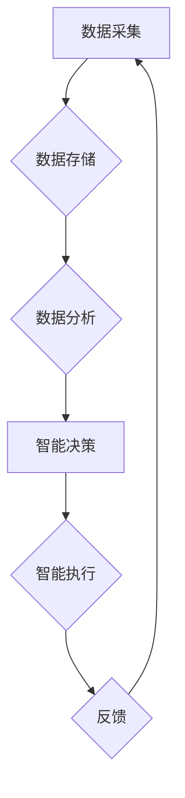

> 数智化、人工智能、大数据、云计算、区块链、物联网、边缘计算

## 1. 背景介绍

我们正处在一个前所未有的时代，科技发展日新月异，深刻地改变着人类社会的面貌。数字技术正在以指数级速度发展，并与物理世界紧密融合，催生出“数智化”这一全新的概念。数智化时代，数据成为重要的生产要素，人工智能、大数据、云计算等技术蓬勃发展，为社会经济发展提供了强大的动力。

传统工业社会以生产要素为核心，而数智化时代以数据为核心，以智能化、数字化、网络化为特征。数智化时代，生产方式、生活方式、商业模式都将发生根本性改变。

## 2. 核心概念与联系

**2.1 数智化**

数智化是指将数字技术与物理世界深度融合，通过数据驱动、智能化、网络化等手段，实现生产、生活、商业等各个领域的智能化升级。

**2.2 核心技术**

数智化时代的核心技术包括：

* **人工智能 (AI)**：通过算法模拟人类智能，实现自动学习、决策、推理等功能。
* **大数据 (Big Data)**：处理海量数据，挖掘数据价值，为决策提供支持。
* **云计算 (Cloud Computing)**：提供弹性、可扩展的计算资源，降低IT成本，提高效率。
* **物联网 (IoT)**：通过传感器、网络等技术，将物理设备连接起来，实现数据采集、传输和分析。
* **区块链 (Blockchain)**：提供安全、透明、不可篡改的数据存储和交易机制。
* **边缘计算 (Edge Computing)**：将计算资源部署到靠近数据源的位置，降低数据传输延迟，提高实时性。

**2.3 技术架构**



**2.4 核心概念联系**

数智化时代的核心技术相互关联，共同构建起一个完整的数智化生态系统。数据采集、存储、分析是数智化发展的基础，人工智能、云计算、物联网等技术为数据赋能，实现智能化决策和执行，最终形成闭环反馈，不断提升数智化水平。

## 3. 核心算法原理 & 具体操作步骤

**3.1 算法原理概述**

深度学习算法是人工智能领域的核心算法之一，它能够通过多层神经网络模拟人类大脑的学习过程，实现对复杂数据的识别、分类、预测等任务。

**3.2 算法步骤详解**

1. **数据预处理**: 将原始数据进行清洗、转换、特征提取等操作，使其适合深度学习模型的训练。
2. **网络结构设计**: 根据任务需求，设计多层神经网络的结构，包括输入层、隐藏层和输出层。
3. **参数初始化**: 为神经网络中的每个参数赋予初始值。
4. **前向传播**: 将输入数据通过神经网络传递，计算输出结果。
5. **反向传播**: 计算输出结果与真实值的误差，并根据误差反向调整神经网络的参数，使模型的预测结果越来越准确。
6. **训练与验证**: 将训练数据和验证数据分别用于模型的训练和评估，不断调整模型参数，提高模型的性能。

**3.3 算法优缺点**

**优点**:

* 能够处理复杂的数据，学习复杂的模式。
* 具有强大的泛化能力，能够应用于不同的领域。

**缺点**:

* 训练数据量大，训练时间长。
* 对硬件资源要求高。
* 模型解释性差，难以理解模型的决策过程。

**3.4 算法应用领域**

深度学习算法广泛应用于图像识别、语音识别、自然语言处理、机器翻译、推荐系统等领域。

## 4. 数学模型和公式 & 详细讲解 & 举例说明

**4.1 数学模型构建**

深度学习模型可以看作是一个多层神经网络，每个神经元都接收来自前一层神经元的输入，并通过激活函数进行处理，输出到下一层神经元。

**4.2 公式推导过程**

深度学习模型的训练过程基于梯度下降算法，目标是找到最优的参数，使模型的预测结果与真实值之间的误差最小化。

损失函数用来衡量模型的预测结果与真实值的差异，常用的损失函数包括均方误差 (MSE) 和交叉熵 (Cross-Entropy)。

梯度下降算法通过计算损失函数对参数的梯度，不断调整参数，使损失函数的值逐渐减小。

**4.3 案例分析与讲解**

假设我们有一个简单的深度学习模型，用于预测房价。

输入特征包括房屋面积、房间数量、地理位置等，输出结果是房价。

我们可以使用均方误差作为损失函数，梯度下降算法作为优化算法，训练模型。

训练过程中，模型会不断调整参数，使预测的房价与实际房价之间的误差最小化。

## 5. 项目实践：代码实例和详细解释说明

**5.1 开发环境搭建**

* 操作系统：Ubuntu 20.04
* Python 版本：3.8
* 深度学习框架：TensorFlow 2.0

**5.2 源代码详细实现**

```python
import tensorflow as tf

# 定义模型结构
model = tf.keras.models.Sequential([
    tf.keras.layers.Dense(64, activation='relu', input_shape=(4,)),
    tf.keras.layers.Dense(32, activation='relu'),
    tf.keras.layers.Dense(1)
])

# 定义损失函数和优化器
model.compile(loss='mse', optimizer='adam')

# 训练模型
model.fit(x_train, y_train, epochs=10)

# 评估模型
loss = model.evaluate(x_test, y_test)
print('Loss:', loss)
```

**5.3 代码解读与分析**

* `tf.keras.models.Sequential`：定义一个顺序模型，层级结构清晰。
* `tf.keras.layers.Dense`：定义全连接层，每个神经元都连接到上一层的所有神经元。
* `activation='relu'`：使用ReLU激活函数，提高模型的非线性表达能力。
* `loss='mse'`：使用均方误差作为损失函数，衡量模型预测结果与真实值的差异。
* `optimizer='adam'`：使用Adam优化器，调整模型参数，使损失函数最小化。
* `model.fit`：训练模型，使用训练数据进行训练，并记录训练过程中的损失值。
* `model.evaluate`：评估模型，使用测试数据评估模型的性能，并输出损失值。

**5.4 运行结果展示**

训练完成后，我们可以使用测试数据评估模型的性能，并观察损失值的变化趋势。

## 6. 实际应用场景

**6.1 智能制造**

数智化技术可以应用于智能制造，实现生产过程的自动化、智能化和优化。例如，通过传感器收集生产设备的数据，利用人工智能算法进行故障预测和预防，提高生产效率和产品质量。

**6.2 智能医疗**

数智化技术可以应用于智能医疗，实现医疗诊断、治疗和管理的智能化升级。例如，通过深度学习算法分析医学影像，辅助医生进行疾病诊断；通过人工智能算法分析患者数据，提供个性化的治疗方案。

**6.3 智能交通**

数智化技术可以应用于智能交通，实现交通流量的优化、道路安全和出行效率的提升。例如，通过传感器收集道路交通数据，利用人工智能算法进行交通流量预测和控制；通过自动驾驶技术实现车辆的自动驾驶，提高交通安全和出行效率。

**6.4 未来应用展望**

数智化技术的发展将带来更多新的应用场景，例如：

* 智能家居：通过传感器和人工智能算法，实现家居环境的智能化控制和管理。
* 智能教育：通过人工智能算法，提供个性化的学习方案和教学辅助。
* 智能金融：通过人工智能算法，提高金融服务的效率和安全性。

## 7. 工具和资源推荐

**7.1 学习资源推荐**

* **在线课程**: Coursera, edX, Udacity 等平台提供深度学习、人工智能等领域的在线课程。
* **书籍**: 《深度学习》、《人工智能：一种现代方法》等书籍对人工智能和深度学习有深入的讲解。
* **开源项目**: TensorFlow, PyTorch 等开源深度学习框架提供了丰富的学习资源和示例代码。

**7.2 开发工具推荐**

* **Python**: 深度学习开发的主要编程语言。
* **TensorFlow**: Google 开发的开源深度学习框架。
* **PyTorch**: Facebook 开发的开源深度学习框架。
* **Jupyter Notebook**: 用于深度学习开发和可视化的交互式笔记本环境。

**7.3 相关论文推荐**

* **《ImageNet Classification with Deep Convolutional Neural Networks》**: 介绍了AlexNet模型，标志着深度学习在图像识别领域的突破。
* **《Deep Residual Learning for Image Recognition》**: 介绍了ResNet模型，解决了深度神经网络训练中的梯度消失问题。
* **《Attention Is All You Need》**: 介绍了Transformer模型，在自然语言处理领域取得了突破性进展。

## 8. 总结：未来发展趋势与挑战

**8.1 研究成果总结**

数智化时代，人工智能、大数据、云计算等技术取得了长足发展，为社会经济发展提供了强大的动力。深度学习算法在图像识别、语音识别、自然语言处理等领域取得了突破性进展，为数智化应用提供了技术支撑。

**8.2 未来发展趋势**

* **模型更加强大**: 深度学习模型将更加强大，能够处理更加复杂的数据，学习更加复杂的模式。
* **应用更加广泛**: 深度学习将应用于更多领域，例如医疗、教育、金融等。
* **边缘计算更加重要**: 随着物联网的发展，边缘计算将更加重要，能够降低数据传输延迟，提高实时性。

**8.3 面临的挑战**

* **数据安全**: 数据安全是数智化时代面临的重要挑战，需要加强数据保护和隐私保护措施。
* **算法可解释性**: 深度学习模型的决策过程难以解释，需要提高算法的可解释性，增强用户信任。
* **伦理问题**: 人工智能的快速发展引发了伦理问题，需要制定相应的伦理规范和法律法规。

**8.4 研究展望**

未来，我们需要继续加强对数智化技术的研发，探索更强大的算法和更广泛的应用场景，同时也要关注数据安全、算法可解释性和伦理问题，确保数智化技术能够安全、可持续地发展，造福人类社会。

## 9. 附录：常见问题与解答

**9.1 如何选择合适的深度学习框架？**

选择深度学习框架需要根据具体项目需求和个人偏好。TensorFlow 和 PyTorch 是目前最流行的深度学习框架，各有优缺点。

**9.2 如何处理不平衡数据集？**

不平衡数据集是指类别分布不均匀的数据集，例如，识别恶意软件的数据集，恶意软件样本数量远少于正常样本。

处理不平衡数据集的方法包括：

* **数据采样**: 随机抽取正负样本，使样本分布更加均衡。
* **权重调整**: 给予少数类样本更高的权重，提高模型对少数类的学习能力。
* **生成对抗网络 (GAN)**: 使用 GAN 生成更多的少数类样本，增加训练数据量。

**9.3 如何评估深度学习模型的性能？**

常用的评估指标包括准确率、召回率、F1-score、AUC 等。选择合适的评估指标需要根据具体任务需求。

作者：禅与计算机程序设计艺术 / Zen and the Art of Computer Programming


<end_of_turn>