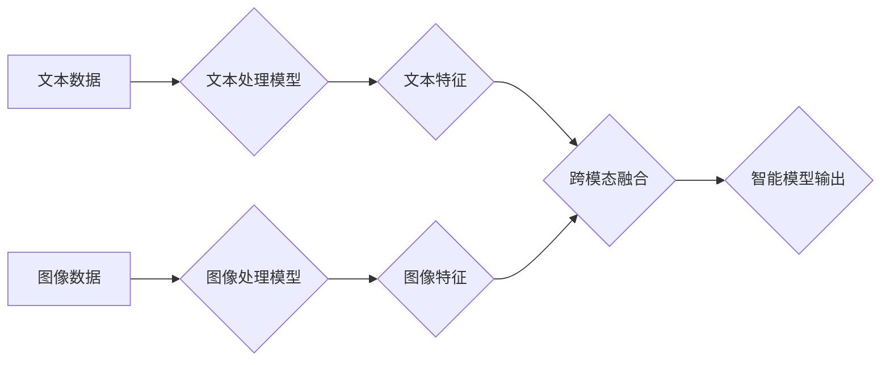

> 深度学习，自然语言处理，计算机视觉，图像识别，文本生成，Transformer，BERT，CNN，RNN，GAN

## 1. 背景介绍

在信息爆炸的时代，文本和图像已成为人类获取和传播信息的主要形式。如何有效地理解、处理和利用这些信息，是人工智能领域的重要研究方向。文本与图像处理的智能模型，作为人工智能的核心技术之一，在自然语言处理（NLP）、计算机视觉（CV）等领域取得了显著进展，并广泛应用于搜索引擎、机器翻译、图像识别、自动驾驶等领域。

传统的文本和图像处理方法主要依赖于手工设计的特征工程，效率低且难以捕捉复杂模式。随着深度学习技术的兴起，基于深度神经网络的智能模型逐渐成为主流，其强大的学习能力和泛化能力，使得文本和图像处理取得了突破性进展。

## 2. 核心概念与联系

文本和图像处理的智能模型主要基于深度学习架构，包括卷积神经网络（CNN）、循环神经网络（RNN）和Transformer等。

**2.1  核心概念**

* **深度学习：**一种机器学习的子领域，利用多层神经网络学习数据特征，实现复杂模式的识别和预测。
* **卷积神经网络（CNN）：**擅长处理图像数据，通过卷积操作提取图像特征，并进行分类、识别等任务。
* **循环神经网络（RNN）：**擅长处理序列数据，例如文本，通过循环结构记忆历史信息，实现文本理解、生成等任务。
* **Transformer：**一种新型的深度学习架构，通过注意力机制学习文本之间的关系，在自然语言处理任务中取得了优异的性能。

**2.2  核心联系**

文本和图像处理的智能模型之间存在着密切的联系，例如：

* **跨模态学习：**利用文本和图像的联合信息，提升模型的理解和生成能力。
* **图像字幕生成：**利用CNN提取图像特征，结合RNN生成文本描述。
* **文本到图像生成：**利用Transformer生成描述文本对应的图像。

**2.3  Mermaid 流程图**



## 3. 核心算法原理 & 具体操作步骤

### 3.1  算法原理概述

深度学习算法的核心是神经网络，它由多个层级的神经元组成，每个神经元接收输入信号，进行计算并输出信号。通过训练，神经网络可以学习到数据中的特征和模式。

文本和图像处理的智能模型通常采用以下几种深度学习算法：

* **卷积神经网络（CNN）：**利用卷积操作提取图像特征，并进行分类、识别等任务。
* **循环神经网络（RNN）：**利用循环结构记忆历史信息，处理序列数据，例如文本。
* **Transformer：**利用注意力机制学习文本之间的关系，在自然语言处理任务中取得了优异的性能。

### 3.2  算法步骤详解

**3.2.1  CNN 算法步骤**

1. **输入图像数据：**将图像数据输入到 CNN 的第一层卷积层。
2. **卷积操作：**卷积层使用卷积核对图像进行卷积操作，提取图像特征。
3. **池化操作：**池化层对卷积层的输出进行池化操作，降低特征图的维度，提高模型的鲁棒性。
4. **全连接层：**将池化层的输出连接到全连接层，进行分类或其他任务。

**3.2.2  RNN 算法步骤**

1. **输入文本序列：**将文本序列输入到 RNN 的第一层循环单元。
2. **循环操作：**循环单元根据当前输入和历史信息，计算输出。
3. **输出结果：**最后输出层的输出结果，例如文本分类或文本生成。

**3.2.3  Transformer 算法步骤**

1. **输入文本序列：**将文本序列输入到 Transformer 的编码器和解码器。
2. **编码器：**编码器利用多层 Transformer 块，学习文本之间的关系。
3. **解码器：**解码器利用编码器的输出，生成目标文本序列。

### 3.3  算法优缺点

| 算法 | 优点 | 缺点 |
|---|---|---|
| CNN | 擅长处理图像数据，提取图像特征 | 难以处理序列数据 |
| RNN | 擅长处理序列数据，记忆历史信息 | 训练困难，梯度消失问题 |
| Transformer | 性能优异，可以处理长序列数据 | 计算量大，参数量大 |

### 3.4  算法应用领域

* **CNN：**图像识别、物体检测、图像分类、图像分割
* **RNN：**文本分类、机器翻译、语音识别、文本生成
* **Transformer：**机器翻译、文本摘要、问答系统、对话系统

## 4. 数学模型和公式 & 详细讲解 & 举例说明

### 4.1  数学模型构建

深度学习模型的数学模型主要基于神经网络，其核心是激活函数、权重和偏置。

**4.1.1  激活函数**

激活函数用于引入非线性，使得神经网络能够学习复杂模式。常见的激活函数包括：

* **ReLU（Rectified Linear Unit）：** f(x) = max(0, x)
* **Sigmoid：** f(x) = 1 / (1 + exp(-x))
* **Tanh（Hyperbolic tangent）：** f(x) = (exp(x) - exp(-x)) / (exp(x) + exp(-x))

**4.1.2  权重和偏置**

权重和偏置是神经网络的参数，通过训练学习得到。

* **权重：**连接神经元之间的强度，决定信号传递的幅度。
* **偏置：**神经元的阈值，决定神经元是否被激活。

**4.1.3  损失函数**

损失函数用于衡量模型预测结果与真实值的差距，其目标是最小化损失函数的值。常见的损失函数包括：

* **均方误差（MSE）：** L = (y - y')^2
* **交叉熵损失（Cross-entropy loss）：** L = -y * log(y') - (1 - y) * log(1 - y')

### 4.2  公式推导过程

深度学习模型的训练过程是通过反向传播算法来更新权重和偏置的。反向传播算法的核心是计算梯度，并根据梯度更新参数。

**4.2.1  梯度计算**

梯度表示损失函数对参数的偏导数，方向指示参数更新的方向，大小指示更新幅度。

**4.2.2  参数更新**

参数更新公式为：

```
参数 = 参数 - 学习率 * 梯度
```

其中，学习率是一个超参数，控制参数更新的步长。

### 4.3  案例分析与讲解

**4.3.1  图像分类案例**

假设我们有一个图像分类任务，目标是将图像分类为猫、狗或鸟。我们可以使用 CNN 模型进行训练，训练数据包括大量带标签的图像。

训练过程中，CNN 模型会学习到图像特征，并根据这些特征预测图像类别。损失函数用于衡量模型预测结果与真实值的差距，反向传播算法用于更新模型参数。

**4.3.2  文本生成案例**

假设我们有一个文本生成任务，目标是根据给定的文本提示生成一段文本。我们可以使用 RNN 或 Transformer 模型进行训练，训练数据包括大量文本对。

训练过程中，模型会学习到文本之间的关系，并根据给定的文本提示生成相应的文本。损失函数用于衡量模型生成文本与真实文本的差距，反向传播算法用于更新模型参数。

## 5. 项目实践：代码实例和详细解释说明

### 5.1  开发环境搭建

* **操作系统：** Linux 或 macOS
* **编程语言：** Python
* **深度学习框架：** TensorFlow 或 PyTorch
* **其他工具：** Git、Jupyter Notebook

### 5.2  源代码详细实现

以下是一个使用 TensorFlow 实现图像分类的简单代码示例：

```python
import tensorflow as tf

# 定义模型结构
model = tf.keras.models.Sequential([
    tf.keras.layers.Conv2D(32, (3, 3), activation='relu', input_shape=(28, 28, 1)),
    tf.keras.layers.MaxPooling2D((2, 2)),
    tf.keras.layers.Conv2D(64, (3, 3), activation='relu'),
    tf.keras.layers.MaxPooling2D((2, 2)),
    tf.keras.layers.Flatten(),
    tf.keras.layers.Dense(10, activation='softmax')
])

# 编译模型
model.compile(optimizer='adam',
              loss='sparse_categorical_crossentropy',
              metrics=['accuracy'])

# 训练模型
model.fit(x_train, y_train, epochs=10)

# 评估模型
loss, accuracy = model.evaluate(x_test, y_test)
print('Test loss:', loss)
print('Test accuracy:', accuracy)
```

### 5.3  代码解读与分析

* **模型结构：**代码定义了一个简单的 CNN 模型，包含两层卷积层、两层池化层、一层全连接层和一层输出层。
* **激活函数：**模型使用 ReLU 作为激活函数，可以引入非线性，提高模型的表达能力。
* **损失函数：**模型使用 sparse_categorical_crossentropy 作为损失函数，用于分类任务。
* **优化器：**模型使用 Adam 作为优化器，用于更新模型参数。
* **训练过程：**模型使用训练数据进行训练，epochs 参数控制训练轮数。
* **评估过程：**模型使用测试数据进行评估，计算测试损失和测试准确率。

### 5.4  运行结果展示

训练完成后，模型可以用于预测新的图像类别。

## 6. 实际应用场景

### 6.1  图像识别

* **人脸识别：**用于解锁手机、验证身份、监控安全。
* **物体检测：**用于自动驾驶、安防监控、医疗诊断。
* **图像分类：**用于电商商品分类、图片搜索、内容推荐。

### 6.2  文本处理

* **机器翻译：**将文本从一种语言翻译成另一种语言。
* **文本摘要：**提取文本的关键信息，生成简短的摘要。
* **问答系统：**根据给定的问题，从文本中找到答案。

### 6.3  跨模态学习

* **图像字幕生成：**根据图像生成文本描述。
* **文本到图像生成：**根据文本描述生成图像。
* **视频理解：**理解视频内容，例如动作识别、事件检测。

### 6.4  未来应用展望

文本与图像处理的智能模型在未来将有更广泛的应用，例如：

* **个性化教育：**根据学生的学习情况，提供个性化的学习内容和辅导。
* **医疗诊断：**辅助医生进行疾病诊断，提高诊断准确率。
* **智能客服：**提供更智能、更人性化的客户服务。

## 7. 工具和资源推荐

### 7.1  学习资源推荐

* **书籍：**
    * 深度学习
    * 自然语言处理
    * 计算机视觉
* **在线课程：**
    * Coursera
    * edX
    * Udacity

### 7.2  开发工具推荐

* **深度学习框架：** TensorFlow、PyTorch、Keras
* **编程语言：** Python
* **数据处理工具：** Pandas、NumPy

### 7.3  相关论文推荐

* Attention Is All You Need
* BERT: Pre-training of Deep Bidirectional Transformers for Language Understanding
* ImageNet Classification with Deep Convolutional Neural Networks

## 8. 总结：未来发展趋势与挑战

### 8.1  研究成果总结

