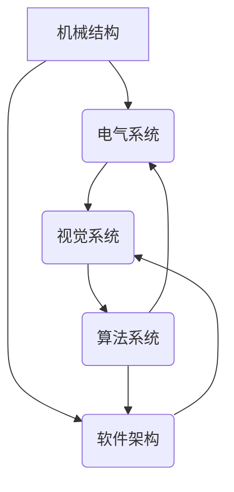

> 机器人、机械结构、电气系统、软件架构、视觉系统、算法、人工智能

## 1. 背景介绍

机器人技术作为一门跨学科的领域，近年来发展迅速，在工业自动化、医疗保健、服务业等领域发挥着越来越重要的作用。一个功能强大的机器人需要多个子系统协同工作，包括机械结构、电气系统、软件架构、视觉系统和算法系统。本文将深入探讨机器人整体设计的各个方面，从基础原理到实际应用，为读者提供全面的了解。

## 2. 核心概念与联系

机器人设计是一个复杂的过程，需要将机械、电气、软件和算法等多个领域知识融合在一起。

**2.1 机械结构**

机械结构是机器人的物理基础，决定了机器人的运动能力、稳定性以及负载能力。常见的机械结构包括：

* **关节类型:** 机器人的关节类型决定了其运动范围和精度。常见的关节类型包括旋转关节、滑块关节、球形关节等。
* **传动系统:** 传动系统将电机或伺服器的动力传递到关节，实现机器人的运动。常见的传动系统包括齿轮传动、链条传动、弹簧传动等。
* **材料选择:** 机器人的材料选择需要考虑强度、重量、耐磨性、成本等因素。常见的材料包括金属、塑料、复合材料等。

**2.2 电气系统**

电气系统为机器人的运动和感知提供动力和信号。主要包括：

* **电源系统:** 为机器人提供电力，包括电池、充电器、电源管理电路等。
* **控制系统:** 控制机器人的运动和功能，包括微控制器、传感器接口、驱动电路等。
* **通信系统:** 允许机器人与外部设备进行通信，包括无线通信模块、串口通信模块等。

**2.3 软件架构**

软件架构是机器人的控制逻辑和数据处理的核心。主要包括：

* **操作系统:** 为机器人提供运行环境和资源管理。
* **驱动程序:** 控制机器人的硬件设备，例如电机、传感器等。
* **应用程序:** 实现机器人的特定功能，例如导航、抓取、识别等。

**2.4 视觉系统**

视觉系统是机器人的感知系统之一，允许机器人“看”周围环境。主要包括：

* **摄像头:** 采集图像数据。
* **图像处理算法:** 对图像数据进行处理，提取特征信息。
* **视觉识别算法:** 将图像特征与数据库进行匹配，识别物体。

**2.5 算法系统**

算法系统是机器人的智能核心，决定了机器人的决策和行为。主要包括：

* **路径规划算法:** 规划机器人运动路径。
* **运动控制算法:** 控制机器人的运动速度和姿态。
* **决策算法:** 根据传感器数据和环境信息，做出决策。

**2.6 系统交互关系**

所有子系统之间相互关联，共同完成机器人的任务。例如，视觉系统采集图像数据，图像处理算法提取特征信息，决策算法根据特征信息做出决策，控制系统驱动机器人运动。



## 3. 核心算法原理 & 具体操作步骤

### 3.1  算法原理概述

机器人算法是机器人的智能核心，决定了机器人的决策和行为。常见的机器人算法包括路径规划算法、运动控制算法、决策算法等。

**3.1.1 路径规划算法**

路径规划算法是指在给定起点和终点的情况下，找到机器人能够到达的最佳路径。常见的路径规划算法包括：

* **A* 算法:** 基于启发式搜索的算法，能够找到最短路径。
* **Dijkstra 算法:** 基于贪婪搜索的算法，能够找到最短路径。
* **RRT 算法:** 基于随机采样的算法，能够在复杂环境中规划路径。

**3.1.2 运动控制算法**

运动控制算法是指控制机器人的运动速度、姿态和轨迹。常见的运动控制算法包括：

* **PID 控制:** 基于比例、积分、微分控制的算法，能够实现精确的运动控制。
* **神经网络控制:** 基于神经网络的算法，能够学习复杂的运动模式。
* **模型预测控制:** 基于系统模型的算法，能够预测未来状态并进行控制。

**3.1.3 决策算法**

决策算法是指根据传感器数据和环境信息，做出机器人的决策。常见的决策算法包括：

* **状态机:** 基于状态转换的算法，能够实现简单的决策。
* **行为树:** 基于树状结构的算法，能够实现复杂的决策。
* **强化学习:** 基于奖励机制的算法，能够学习最佳决策策略。

### 3.2  算法步骤详解

**3.2.1 A* 算法**

A* 算法是一种启发式搜索算法，能够找到最短路径。其步骤如下：

1. 将起点加入到开放列表中。
2. 从开放列表中选择评估值最低的节点。
3. 如果选择的节点是终点，则找到路径并结束搜索。
4. 否则，将选择的节点的邻居节点加入到开放列表中，并更新邻居节点的评估值。
5. 重复步骤2-4，直到找到终点或开放列表为空。

**3.2.2 PID 控制**

PID 控制是一种经典的控制算法，其原理是通过比例、积分、微分三个控制项来调节控制量，实现对被控变量的精确控制。其步骤如下：

1. 计算误差值：被控变量与设定值之间的差值。
2. 计算比例项：误差值乘以比例系数。
3. 计算积分项：误差值累积乘以积分系数。
4. 计算微分项：误差值变化率乘以微分系数。
5. 计算控制量：比例项、积分项和微分项的总和。

### 3.3  算法优缺点

**3.3.1 A* 算法**

优点：能够找到最短路径，效率较高。

缺点：需要预先定义启发函数，启发函数的选择会影响算法的性能。

**3.3.2 PID 控制**

优点：简单易实现，能够实现精确的控制。

缺点：需要手动调整比例、积分、微分系数，对系统模型要求较高。

### 3.4  算法应用领域

**3.4.1 A* 算法**

应用于路径规划、地图构建、游戏人工智能等领域。

**3.4.2 PID 控制**

应用于工业自动化、机器人控制、车辆控制等领域。

## 4. 数学模型和公式 & 详细讲解 & 举例说明

### 4.1  数学模型构建

**4.1.1 路径规划算法**

A* 算法的数学模型可以表示为：

$$g(n) + h(n)$$

其中：

* $g(n)$ 是从起点到节点 $n$ 的实际代价。
* $h(n)$ 是从节点 $n$ 到终点的估计代价。

**4.1.2 运动控制算法**

PID 控制的数学模型可以表示为：

$$u(t) = K_p e(t) + K_i \int e(t) dt + K_d \frac{de(t)}{dt}$$

其中：

* $u(t)$ 是控制量。
* $e(t)$ 是误差值。
* $K_p$ 是比例系数。
* $K_i$ 是积分系数。
* $K_d$ 是微分系数。

### 4.2  公式推导过程

**4.2.1 A* 算法**

A* 算法的评估函数 $f(n)$ 是 $g(n)$ 和 $h(n)$ 的和，其目的是找到评估值最低的节点。

**4.2.2 PID 控制**

PID 控制的公式推导过程是基于控制系统的微分方程，通过引入比例、积分、微分三个控制项来调节控制量，实现对被控变量的精确控制。

### 4.3  案例分析与讲解

**4.3.1 A* 算法**

在无人驾驶汽车的路径规划中，A* 算法可以用来规划汽车行驶的最佳路径，避免障碍物，并到达目的地。

**4.3.2 PID 控制**

在工业机器人手臂的控制中，PID 控制可以用来控制机器人手臂的运动速度和姿态，实现精确的抓取和放置动作。

## 5. 项目实践：代码实例和详细解释说明

### 5.1  开发环境搭建

* 操作系统：Ubuntu 20.04
* 编程语言：Python 3.8
* 库依赖：ROS、OpenCV、NumPy、Scikit-learn

### 5.2  源代码详细实现

```python
# A* 路径规划算法示例代码

import heapq

class Node:
    def __init__(self, position, parent=None):
        self.position = position
        self.parent = parent
        self.g = 0
        self.h = 0

    def __lt__(self, other):
        return (self.g + self.h) < (other.g + other.h)

def astar(grid, start, goal):
    open_list = []
    closed_list = set()

    start_node = Node(start)
    start_node.g = 0
    start_node.h = heuristic(start, goal)
    heapq.heappush(open_list, start_node)

    while open_list:
        current_node = heapq.heappop(open_list)
        closed_list.add(current_node.position)

        if current_node.position == goal:
            return reconstruct_path(current_node)

        for neighbor in get_neighbors(grid, current_node.position):
            if neighbor in closed_list:
                continue

            neighbor_node = Node(neighbor, current_node)
            neighbor_node.g = current_node.g + 1
            neighbor_node.h = heuristic(neighbor, goal)
            heapq.heappush(open_list, neighbor_node)

    return None

def heuristic(a, b):
    # Manhattan distance heuristic
    return abs(a[0] - b[0]) + abs(a[1] - b[1])

def reconstruct_path(node):
    path = []
    while node:
        path.append(node.position)
        node = node.parent
    return path[::-1]

# ... 其他代码 ...
```

### 5.3  代码解读与分析

* **Node 类:** 定义了节点的结构，包括位置、父节点、实际代价和估计代价。
* **astar 函数:** 实现 A* 路径规划算法，包括打开列表、关闭列表、节点评估、邻居搜索等步骤。
* **heuristic 函数:** 计算节点到目标节点的估计代价，这里使用曼哈顿距离作为启发函数。
* **reconstruct_path 函数:** 根据路径节点的父节点关系，重建完整的路径。

### 5.4  运行结果展示

运行代码后，可以得到机器人从起点到终点的最佳路径，并可视化路径。

## 6. 实际应用场景

### 6.1  工业自动化

机器人广泛应用于工业自动化领域，例如：

* **焊接机器人:** 自动完成焊接任务，提高效率和精度。
* **喷涂机器人:** 自动完成喷涂任务，减少人工成本和环境污染。
* **搬运机器人:** 自动搬运货物，提高生产效率。

### 6.2  医疗保健

机器人应用于医疗保健领域，例如：

* **手术机器人:** 辅助医生进行微创手术，提高手术精度和安全性。
* **康复机器人:** 帮助患者进行康复训练，提高患者的行动能力。
* **护理机器人:** 协助