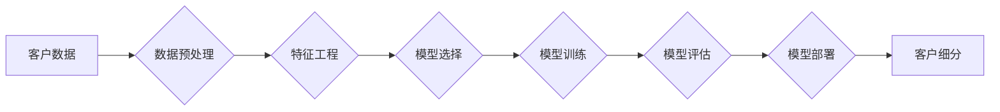

> 客户细分，机器学习，数据挖掘，预测建模，聚类算法，深度学习，个性化营销

## 1. 背景介绍

在当今数据爆炸的时代，企业拥有海量客户数据，但如何有效地将这些数据转化为商业价值，是企业面临的重大挑战。客户细分作为一种重要的营销策略，能够帮助企业根据客户的不同特征和需求，进行精准的营销，提高营销效率和客户满意度。传统的客户细分方法往往依赖于人工经验和规则，效率低下，难以捕捉到数据中潜在的细分模式。

机器学习作为一种强大的数据分析技术，能够从海量数据中自动学习客户的特征和行为模式，为客户细分提供新的思路和方法。通过机器学习算法，企业可以对客户进行更精准的细分，并根据不同的客户群体的特征，制定个性化的营销策略，从而提高营销效果。

## 2. 核心概念与联系

**2.1 客户细分**

客户细分是指根据客户的某些共同特征，将客户群体划分为若干个相对独立的子群体，每个子群体具有相似的需求、行为和价值。

**2.2 机器学习**

机器学习是一种人工智能技术，它通过算法学习数据中的模式和规律，从而能够对新数据进行预测和分类。

**2.3 数据挖掘**

数据挖掘是指从海量数据中发现隐藏的知识和模式，并将其转化为可用的信息。

**2.4 预测建模**

预测建模是指利用机器学习算法，根据历史数据预测未来的趋势或事件。

**2.5 聚类算法**

聚类算法是一种无监督学习算法，它能够将数据点根据相似性进行分组，形成不同的簇。

**2.6 深度学习**

深度学习是一种基于多层神经网络的机器学习算法，它能够学习更复杂的模式和特征。

**2.7 个性化营销**

个性化营销是指根据客户的个人特征和需求，提供定制化的产品和服务。

**2.8 流程图**



## 3. 核心算法原理 & 具体操作步骤

### 3.1 算法原理概述

机器学习在客户细分中的应用主要依赖于以下几种算法：

* **聚类算法:** 聚类算法能够将客户根据相似性进行分组，形成不同的客户群。常用的聚类算法包括K-means聚类、层次聚类和DBSCAN聚类等。
* **预测建模:** 预测建模可以根据客户的历史行为和特征，预测客户未来的行为，例如购买意愿、 churn率等。常用的预测建模算法包括逻辑回归、决策树和支持向量机等。
* **深度学习:** 深度学习算法能够学习更复杂的客户特征和行为模式，从而实现更精准的客户细分。常用的深度学习算法包括卷积神经网络和循环神经网络等。

### 3.2 算法步骤详解

**3.2.1 聚类算法步骤:**

1. **数据预处理:** 对客户数据进行清洗、转换和标准化，去除噪声和异常值。
2. **特征工程:** 选择合适的客户特征，例如年龄、性别、购买历史、浏览记录等，并进行特征提取和转换。
3. **聚类模型选择:** 根据客户数据特点和细分目标，选择合适的聚类算法，例如K-means聚类、层次聚类等。
4. **模型训练:** 使用训练数据训练聚类模型，并根据模型输出结果，将客户划分为不同的客户群。
5. **模型评估:** 使用测试数据评估模型的性能，例如聚类准确率、轮廓系数等。
6. **模型部署:** 将训练好的模型部署到生产环境中，用于实时客户细分。

**3.2.2 预测建模步骤:**

1. **数据预处理:** 对客户数据进行清洗、转换和标准化。
2. **特征工程:** 选择合适的客户特征，并进行特征提取和转换。
3. **模型选择:** 根据预测目标和数据特点，选择合适的预测建模算法，例如逻辑回归、决策树等。
4. **模型训练:** 使用训练数据训练预测模型，并根据模型输出结果，预测客户未来的行为。
5. **模型评估:** 使用测试数据评估模型的性能，例如准确率、召回率等。
6. **模型部署:** 将训练好的模型部署到生产环境中，用于实时预测客户行为。

### 3.3 算法优缺点

**3.3.1 聚类算法:**

* **优点:** 无需预先定义客户类别，能够自动发现数据中的潜在模式。
* **缺点:** 难以确定最佳聚类数，聚类结果可能存在模糊性和不确定性。

**3.3.2 预测建模:**

* **优点:** 可以预测客户未来的行为，为营销决策提供依据。
* **缺点:** 需要大量的历史数据进行训练，模型的准确性依赖于数据质量。

### 3.4 算法应用领域

* **精准营销:** 根据客户细分结果，制定个性化的营销策略，提高营销效率。
* **客户关系管理:** 根据客户行为和特征，提供个性化的客户服务，提升客户满意度。
* **产品开发:** 根据客户需求和偏好，开发更符合市场需求的产品。
* **风险控制:** 根据客户风险特征，进行风险评估和控制。

## 4. 数学模型和公式 & 详细讲解 & 举例说明

### 4.1 数学模型构建

**4.1.1 聚类算法数学模型:**

K-means聚类算法的目标是将数据点划分为K个簇，使得每个簇内的点尽可能接近，而不同簇之间的点尽可能远离。

**4.1.2 预测建模数学模型:**

逻辑回归模型是一种用于二分类问题的线性模型，其目标是学习一个能够将数据点分类到不同类别中的决策边界。

### 4.2 公式推导过程

**4.2.1 K-means聚类算法公式:**

* **距离度量:** 使用欧氏距离作为距离度量，计算数据点之间的距离。
* **聚类中心更新:** 使用每个簇内的平均值作为新的聚类中心。

**4.2.2 逻辑回归模型公式:**

* **sigmoid函数:** 用于将线性模型的输出映射到0到1之间的概率区间。
* **损失函数:** 使用交叉熵损失函数来衡量模型的预测结果与真实标签之间的差异。

### 4.3 案例分析与讲解

**4.3.1 K-means聚类案例:**

假设我们有一组客户数据，包含客户的年龄、收入和消费水平等特征。我们可以使用K-means聚类算法将客户划分为不同的客户群，例如高收入、高消费的客户群、低收入、低消费的客户群等。

**4.3.2 逻辑回归案例:**

假设我们想要预测客户是否会购买某个产品。我们可以使用逻辑回归模型，根据客户的年龄、收入、购买历史等特征，预测客户购买该产品的概率。

## 5. 项目实践：代码实例和详细解释说明

### 5.1 开发环境搭建

* **操作系统:** Windows/macOS/Linux
* **编程语言:** Python
* **机器学习库:** scikit-learn, TensorFlow, PyTorch
* **数据处理库:** Pandas, NumPy

### 5.2 源代码详细实现

```python
# 导入必要的库
import pandas as pd
from sklearn.cluster import KMeans

# 加载客户数据
data = pd.read_csv('customer_data.csv')

# 选择合适的特征进行聚类
features = ['age', 'income', 'spending']
X = data[features]

# 使用K-means聚类算法进行客户细分
kmeans = KMeans(n_clusters=3)
kmeans.fit(X)

# 将客户分配到不同的客户群
data['cluster'] = kmeans.labels_

# 查看聚类结果
print(data.groupby('cluster').mean())
```

### 5.3 代码解读与分析

* **数据加载:** 使用Pandas库加载客户数据。
* **特征选择:** 选择合适的客户特征进行聚类。
* **模型训练:** 使用K-means聚类算法训练模型，并指定聚类数为3。
* **客户分配:** 将客户分配到不同的客户群。
* **结果展示:** 使用Pandas库查看每个客户群的平均特征值。

### 5.4 运行结果展示

运行代码后，会输出每个客户群的平均特征值，例如年龄、收入和消费水平等。通过分析这些特征值，可以了解不同客户群的特点，并制定相应的营销策略。

## 6. 实际应用场景

**6.1 电商平台:**

电商平台可以利用机器学习算法对用户进行细分，例如根据用户的购买历史、浏览记录、评价等信息，将用户划分为不同的用户群，并针对不同的用户群提供个性化的商品推荐、促销活动和服务。

**6.2 金融机构:**

金融机构可以利用机器学习算法对客户进行风险评估和信用评分，例如根据用户的收入、支出、信用记录等信息，评估用户的贷款风险，并制定相应的贷款利率和放款额度。

**6.3 医疗机构:**

医疗机构可以利用机器学习算法对患者进行诊断和治疗方案推荐，例如根据患者的症状、病史、检查结果等信息，预测患者的疾病类型和治疗效果，并制定相应的治疗方案。

**6.4 教育机构:**

教育机构可以利用机器学习算法对学生进行个性化学习推荐，例如根据学生的学习进度、学习风格、知识掌握情况等信息，推荐相应的学习资源和学习计划。

**6.5 未来应用展望:**

随着机器学习技术的不断发展，其在客户细分领域的应用将更加广泛和深入。例如，可以利用深度学习算法学习更复杂的客户特征和行为模式，实现更精准的客户细分；可以利用强化学习算法优化客户细分策略，提高营销效果。

## 7. 工具和资源推荐

### 7.1 学习资源推荐

* **书籍:**
    * 《机器学习》 - 周志华
    * 《深入理解机器学习》 -  李航
* **在线课程:**
    * Coursera: Machine Learning by Andrew Ng
    * edX: Artificial Intelligence by Columbia University
* **博客和网站:**
    * Towards Data Science
    * Machine Learning Mastery

### 7.2 开发工具推荐

* **Python:** 
    * Jupyter Notebook
    * PyCharm
* **机器学习库:**
    * scikit-learn
    * TensorFlow
    * PyTorch

### 7.3 相关论文推荐

* **K-means聚类算法:**
    * Lloyd, S. (1982). Least squares quantization in PCM. IEEE Transactions on Information Theory, 28(4), 40-48.
* **逻辑回归模型:**
    * Cox, D. R. (1970). Regression models and life tables. Journal of the Royal Statistical Society: Series B (Methodological), 32(2), 205-222.

## 8. 总结：未来发展趋势与挑战

### 8.1 研究成果总结

机器学习在客户细分领域取得了显著的成果，能够帮助企业更精准地了解客户，制定更有效的营销策略。

### 8.2 未来发展趋势

* **更精准的客户细分:** 利用深度学习算法学习更复杂的客户特征和行为模式，实现更精准的客户细分。
* **个性化营销的升级:** 基于客户细分结果，提供更个性化的产品推荐、促销活动和服务。
* **跨渠道营销的整合:** 将客户细分结果与其他营销渠道整合，实现跨渠道的个性化营销。

### 8.3 面临的挑战

* **数据质量问题:** 机器学习算法的性能依赖于数据质量，数据不完整、不准确或存在偏差都会影响模型的准确性。
* **隐私保护问题:** 客户数据涉及个人隐私，需要采取措施保护客户数据安全。
* **算法解释性问题:** 一些机器学习算法的