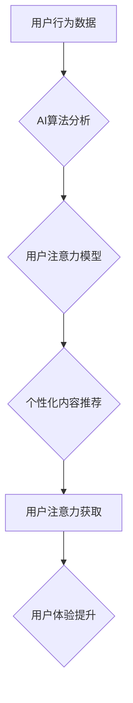

>  注意力经济学, AI, 稀缺资源, 人工智能, 认知科学, 用户体验, 数据分析, 算法设计

## 1. 背景介绍

在信息爆炸的时代，我们每天都被海量的信息所包围。从新闻推送到社交媒体，从邮件通知到广告轰炸，各种信息源源不断地涌入我们的视野。然而，我们的注意力却始终是有限的，就像一个宝贵的资源，需要我们谨慎地分配和管理。

注意力经济学正是研究这种注意力资源的学科。它探讨了注意力是如何被分配、如何被获取、如何被消耗的，以及如何更好地利用注意力来提升效率和幸福感。

随着人工智能技术的飞速发展，注意力经济学的重要性日益凸显。AI算法能够精准地识别用户的兴趣和需求，并通过个性化推荐、精准广告等方式，有效地吸引用户的注意力。然而，这也引发了新的伦理和社会问题，例如信息茧房、算法操控、隐私泄露等。

## 2. 核心概念与联系

**2.1 注意力经济学核心概念**

* **注意力：** 指的是对特定信息或刺激的集中和持续的认知活动。
* **注意力资源：** 指的是我们大脑有限的认知能力，能够同时处理的信息量。
* **注意力分配：** 指的是我们根据自身需求和环境变化，将注意力分配到不同信息或任务上的过程。
* **注意力获取：** 指的是通过各种手段吸引用户的注意力，使其关注特定的信息或内容。
* **注意力消耗：** 指的是注意力在使用过程中逐渐减少的过程。

**2.2 AI与注意力经济学的联系**

AI技术在注意力经济学领域扮演着越来越重要的角色。

* **数据分析：** AI算法能够分析海量用户数据，识别用户的兴趣偏好、行为模式和注意力流向。
* **个性化推荐：** 基于用户数据分析，AI算法可以提供个性化的内容推荐，提高用户注意力获取率。
* **精准广告：** AI算法可以精准地定位目标用户，并根据用户的兴趣和行为特征，投放更有效的广告。
* **内容创作：** AI算法可以辅助内容创作者，生成更吸引用户的标题、内容和格式。

**2.3  注意力经济学与AI的未来发展趋势**

* **更精准的注意力分析：** 未来，AI算法将能够更精准地分析用户的注意力行为，识别更细粒度的注意力模式。
* **更个性化的注意力管理：** AI将帮助用户更好地管理自己的注意力，提供个性化的注意力训练和提醒。
* **更负责任的注意力应用：** 随着AI技术的进步，我们需要更加关注AI在注意力经济学领域的伦理和社会影响，确保AI技术被用于促进人类福祉。

**Mermaid 流程图**



## 3. 核心算法原理 & 具体操作步骤

### 3.1  算法原理概述

注意力机制的核心思想是模拟人类的注意力机制，通过学习哪些信息更重要，哪些信息可以忽略，从而提高模型的学习效率和准确性。

注意力机制主要分为两种类型：

* **软注意力机制：** 通过计算每个输入元素的权重，将注意力分配到不同元素上。权重通常通过一个注意力函数计算，该函数根据输入元素之间的相关性来确定权重。
* **硬注意力机制：** 直接选择其中一个输入元素作为注意力焦点，忽略其他元素。

### 3.2  算法步骤详解

**3.2.1  输入数据预处理**

首先，将输入数据进行预处理，例如文本数据需要进行分词和词向量化。

**3.2.2  计算注意力权重**

使用注意力函数计算每个输入元素的权重。注意力函数通常包含以下步骤：

* 计算每个输入元素与查询向量的相似度。
* 将相似度通过一个激活函数进行变换，得到注意力权重。

**3.2.3  加权求和**

将每个输入元素与其对应的注意力权重相乘，然后对所有元素进行加权求和，得到最终的输出。

### 3.3  算法优缺点

**优点：**

* 可以学习到输入数据中的重要信息，提高模型的学习效率和准确性。
* 可以处理长序列数据，例如文本和音频。

**缺点：**

* 计算复杂度较高，训练时间较长。
* 需要大量的训练数据。

### 3.4  算法应用领域

注意力机制在自然语言处理、计算机视觉、机器翻译、语音识别等领域都有广泛的应用。

## 4. 数学模型和公式 & 详细讲解 & 举例说明

### 4.1  数学模型构建

**4.1.1  注意力机制数学模型**

注意力机制的核心是计算每个输入元素的注意力权重。假设我们有一个输入序列 X = {x1, x2, ..., xn}，以及一个查询向量 q。

注意力权重计算公式如下：

```latex
a_i = softmax(score(x_i, q))
```

其中，score(x_i, q) 是输入元素 x_i 与查询向量 q 的相似度，softmax 函数将相似度转换为概率分布。

**4.1.2  注意力函数**

注意力函数可以采用多种形式，例如点积注意力、多头注意力等。

* **点积注意力：**

```latex
score(x_i, q) = x_i^T * q
```

* **多头注意力：**

多头注意力机制将注意力机制扩展到多个头，每个头学习不同的注意力模式。

**4.1.3  加权求和**

将每个输入元素 x_i 与其对应的注意力权重 a_i 相乘，然后对所有元素进行加权求和，得到最终的输出：

```latex
output = \sum_{i=1}^{n} a_i * x_i
```

### 4.2  公式推导过程

注意力机制的公式推导过程主要基于以下几个假设：

* 输入序列中的每个元素都具有不同的重要性。
* 查询向量代表了模型当前关注的主题或任务。
* 注意力权重可以用来衡量每个输入元素与查询向量之间的相关性。

通过这些假设，我们可以推导出注意力机制的数学模型，并通过训练模型来学习注意力权重。

### 4.3  案例分析与讲解

**4.3.1  机器翻译**

在机器翻译任务中，注意力机制可以帮助模型关注源语言中与目标语言中对应词语相关的部分，从而提高翻译的准确性和流畅度。

**4.3.2  文本摘要**

在文本摘要任务中，注意力机制可以帮助模型识别文本中最关键的信息，并将其提取出来生成摘要。

## 5. 项目实践：代码实例和详细解释说明

### 5.1  开发环境搭建

* Python 3.6+
* TensorFlow 2.0+
* PyTorch 1.0+

### 5.2  源代码详细实现

```python
import tensorflow as tf

# 定义注意力机制
def attention_layer(inputs, query, key, value, mask=None):
    # 计算注意力权重
    scores = tf.matmul(query, key, transpose_b=True)
    if mask is not None:
        scores += (mask * -1e9)
    attention_weights = tf.nn.softmax(scores, axis=-1)
    # 加权求和
    context_vector = tf.matmul(attention_weights, value)
    return context_vector

# 定义一个简单的文本分类模型
class TextClassifier(tf.keras.Model):
    def __init__(self, vocab_size, embedding_dim, hidden_dim):
        super(TextClassifier, self).__init__()
        self.embedding = tf.keras.layers.Embedding(vocab_size, embedding_dim)
        self.lstm = tf.keras.layers.LSTM(hidden_dim)
        self.attention = attention_layer
        self.dense = tf.keras.layers.Dense(1, activation='sigmoid')

    def call(self, inputs):
        # 词嵌入
        embedded = self.embedding(inputs)
        # LSTM
        lstm_output = self.lstm(embedded)
        # 注意力机制
        context_vector = self.attention(lstm_output, lstm_output, lstm_output, lstm_output)
        # 全连接层
        output = self.dense(context_vector)
        return output

# 实例化模型
model = TextClassifier(vocab_size=10000, embedding_dim=128, hidden_dim=64)

# 训练模型
# ...

```

### 5.3  代码解读与分析

* **注意力层：** `attention_layer` 函数实现了一个基本的注意力机制，计算每个输入元素的注意力权重，并对输入元素进行加权求和。
* **文本分类模型：** `TextClassifier` 类定义了一个简单的文本分类模型，包含词嵌入层、LSTM层、注意力层和全连接层。
* **模型训练：** 代码中省略了模型训练部分，但可以根据实际需求进行训练。

### 5.4  运行结果展示

训练完成后，可以将模型应用于文本分类任务，并评估模型的性能。

## 6. 实际应用场景

### 6.1  搜索引擎

搜索引擎利用注意力机制来识别用户搜索意图，并返回更相关的搜索结果。

### 6.2  推荐系统

推荐系统利用注意力机制来分析用户的行为数据，并推荐更符合用户兴趣的内容。

### 6.3  机器翻译

机器翻译利用注意力机制来关注源语言中与目标语言中对应词语相关的部分，从而提高翻译的准确性和流畅度。

### 6.4  未来应用展望

注意力机制在未来将有更广泛的应用，例如：

* **个性化教育：** 根据学生的学习进度和理解能力，提供个性化的学习内容和辅导。
* **医疗诊断：** 分析患者的病历和检查结果，帮助医生做出更准确的诊断。
* **自动驾驶：** 帮助自动驾驶系统识别道路上的障碍物和行人。

## 7. 工具和资源推荐

### 7.1  学习资源推荐

* **书籍：**
    * 《深度学习》
    * 《自然语言处理》
* **在线课程：**
    * Coursera
    * edX
* **博客和论坛：**
    * TensorFlow Blog
    * PyTorch Blog

### 7.2  开发工具推荐

* **TensorFlow:** 开源深度学习框架
* **PyTorch:** 开源深度学习框架
* **Keras:** 高级深度学习API

### 7.3  相关论文推荐

* **Attention Is All You Need:** https://arxiv.org/abs/1706.03762
* **BERT: Pre-training of Deep Bidirectional Transformers for Language Understanding:** https://arxiv.org/abs/1810.04805

## 8. 总结：未来发展趋势与挑战

### 8.1  研究成果总结

注意力机制在人工智能领域取得了显著的成果，在自然语言处理、计算机视觉等领域取得了突破性的进展。

### 8.2  未来发展趋势

* **更强大的注意力机制：** 研究更强大的注意力机制，例如自注意力、交叉注意力等，提高模型的学习能力和泛化能力。
* **注意力机制的解释性：** 研究注意力机制的解释性，理解模型是如何分配注意力的，并将其应用于模型的可解释性研究。
* **注意力机制的应用扩展：** 将注意力机制应用于更多领域，例如机器人、自动驾驶、医疗诊断等。

### 8.3  面临的挑战

* **计算复杂度：** 某些注意力机制的计算复杂度较高，难以在资源有限的设备上运行。
* **数据依赖性：** 注意力机制需要大量的训练数据，否则模型的性能会下降。
* **伦理问题：** 注意力机制可能被用于操纵用户行为，需要关注其伦理问题。

### 8