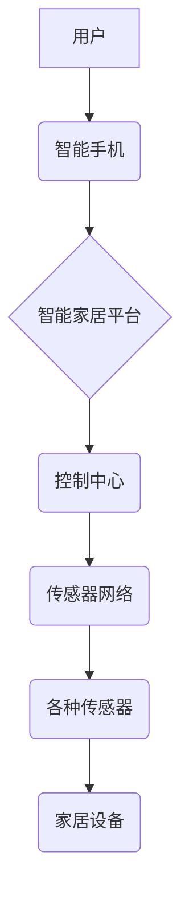

> 物联网(IoT)、传感器、智能家居、数据采集、数据分析、云计算、机器学习、安全

## 1. 背景介绍

物联网(IoT)技术正在迅速发展，并深刻地改变着我们的生活方式。智能家居作为物联网应用的一个重要领域，正在逐渐成为人们日常生活不可或缺的一部分。智能家居通过将各种传感器设备、智能控制系统和网络技术相结合，能够实现对家居环境的智能化控制和管理，为用户提供更加舒适、便捷、安全的生活体验。

随着物联网技术的不断发展，传感器设备的种类和功能也在不断丰富。各种各样的传感器，例如温度传感器、湿度传感器、光照传感器、运动传感器、气体传感器等，能够实时采集家居环境中的各种数据信息。这些数据信息可以被用于控制家居设备，例如空调、照明、窗帘等，也可以被用于监测家居环境的安全状况，例如火灾、漏水、入侵等。

## 2. 核心概念与联系

**2.1 物联网(IoT)**

物联网是指将各种物理设备、传感器、软件和网络技术连接在一起，形成一个互联互通的网络系统。物联网的核心概念是“万物互联”，即通过网络连接各种设备，使其能够相互感知、相互通信、相互协作。

**2.2 传感器**

传感器是一种能够将物理量转化为电信号的装置。常见的传感器类型包括温度传感器、湿度传感器、光照传感器、运动传感器、气体传感器等。传感器是物联网系统的重要组成部分，负责采集各种物理量的数据信息。

**2.3 智能家居**

智能家居是指通过物联网技术，将家居环境中的各种设备和系统连接起来，实现对家居环境的智能化控制和管理。智能家居系统通常包括以下几个核心组件：

* **传感器网络:** 用于采集家居环境中的各种数据信息。
* **控制中心:** 用于处理传感器数据，并控制家居设备。
* **用户界面:** 用于用户与智能家居系统进行交互。
* **云平台:** 用于存储和分析传感器数据，并提供远程控制功能。

**2.4 架构图**



## 3. 核心算法原理 & 具体操作步骤

**3.1 算法原理概述**

智能家居系统中，需要使用各种算法来处理传感器数据，控制家居设备，并提供用户体验。常见的算法包括：

* **数据采集和处理算法:** 用于从传感器中采集数据，并进行预处理、过滤等操作。
* **模式识别算法:** 用于识别传感器数据中的模式，例如用户行为模式、环境变化模式等。
* **预测算法:** 用于预测未来环境变化趋势，例如温度变化、湿度变化等。
* **控制算法:** 用于根据传感器数据和用户指令，控制家居设备的运行状态。

**3.2 算法步骤详解**

以数据采集和处理算法为例，其具体操作步骤如下：

1. **数据采集:** 从传感器中采集原始数据。
2. **数据预处理:** 对原始数据进行清洗、过滤、转换等操作，去除噪声和异常值，并将数据转换为统一格式。
3. **数据分析:** 对预处理后的数据进行分析，例如计算平均值、标准差、趋势等，提取有用的信息。
4. **数据存储:** 将分析结果存储到数据库或云平台中。

**3.3 算法优缺点**

不同的算法具有不同的优缺点，需要根据实际应用场景选择合适的算法。例如，模式识别算法能够识别复杂模式，但计算复杂度较高；预测算法能够预测未来趋势，但预测精度受限于历史数据。

**3.4 算法应用领域**

数据采集和处理算法在智能家居系统中应用广泛，例如：

* **环境监测:** 监测家居环境中的温度、湿度、光照等参数，并根据设定值自动调节设备运行状态。
* **安全监控:** 监测家居环境中的异常情况，例如火灾、漏水、入侵等，并及时报警。
* **用户行为分析:** 分析用户的行为模式，例如使用习惯、生活规律等，并提供个性化服务。

## 4. 数学模型和公式 & 详细讲解 & 举例说明

**4.1 数学模型构建**

智能家居系统中的数据分析和控制通常需要建立数学模型来描述系统行为。例如，可以建立一个温度控制模型，描述空调的运行状态与家居环境温度之间的关系。

**4.2 公式推导过程**

假设家居环境温度为T，空调运行功率为P，空调制冷系数为COP，则温度控制模型可以表示为：

```latex
dT/dt = (P * COP - Q) / C
```

其中：

* dT/dt: 居家环境温度变化率
* P: 空调运行功率
* COP: 空调制冷系数
* Q: 居家环境热损失
* C: 居家环境热容量

**4.3 案例分析与讲解**

假设家居环境初始温度为25℃，目标温度为22℃，空调制冷系数为3，家居环境热容量为10000J/℃，则可以根据上述公式计算空调运行功率。

```python
import numpy as np

# 参数设置
T_initial = 25  # 初始温度
T_target = 22  # 目标温度
COP = 3  # 制冷系数
C = 10000  # 热容量
dt = 1  # 时间步长

# 计算温度变化率
dT_dt = (P * COP - Q) / C

# 计算空调运行功率
P = (C * dT_dt + Q) / COP

# 打印结果
print("空调运行功率:", P)
```

## 5. 项目实践：代码实例和详细解释说明

**5.1 开发环境搭建**

智能家居系统开发通常需要使用以下开发环境：

* **操作系统:** Linux、Windows、macOS
* **编程语言:** Python、C++、Java
* **开发工具:** Eclipse、Visual Studio Code、IntelliJ IDEA
* **物联网平台:** AWS IoT、Azure IoT、Google Cloud IoT

**5.2 源代码详细实现**

以下是一个简单的智能家居系统代码示例，用于控制灯泡的开关状态：

```python
import RPi.GPIO as GPIO

# 设置GPIO引脚
GPIO.setmode(GPIO.BCM)
GPIO.setup(17, GPIO.OUT)

# 控制灯泡开关
def turn_on_light():
    GPIO.output(17, GPIO.HIGH)
    print("灯泡已打开")

def turn_off_light():
    GPIO.output(17, GPIO.LOW)
    print("灯泡已关闭")

# 主程序
if __name__ == "__main__":
    turn_on_light()
    input("按任意键关闭灯泡...")
    turn_off_light()
    GPIO.cleanup()
```

**5.3 代码解读与分析**

该代码示例使用Python语言和RPi.GPIO库控制Raspberry Pi上的GPIO引脚，实现灯泡的开关控制。

* `GPIO.setmode(GPIO.BCM)`: 设置GPIO引脚模式为BCM模式。
* `GPIO.setup(17, GPIO.OUT)`: 设置GPIO引脚17为输出模式。
* `GPIO.output(17, GPIO.HIGH)`: 将GPIO引脚17设置为高电平，打开灯泡。
* `GPIO.output(17, GPIO.LOW)`: 将GPIO引脚17设置为低电平，关闭灯泡。

**5.4 运行结果展示**

运行该代码后，灯泡将打开，并在控制台输出“灯泡已打开”的提示信息。用户输入任意键后，灯泡将关闭，并在控制台输出“灯泡已关闭”的提示信息。

## 6. 实际应用场景

**6.1 环境监测**

智能家居系统可以利用传感器监测家居环境中的温度、湿度、光照等参数，并根据设定值自动调节空调、除湿器、照明等设备的运行状态，实现舒适、节能的居住环境。

**6.2 安全监控**

智能家居系统可以利用传感器监测家居环境中的异常情况，例如火灾、漏水、入侵等，并及时报警，保障家居安全。

**6.3 用户行为分析**

智能家居系统可以分析用户的行为模式，例如使用习惯、生活规律等，并提供个性化服务，例如自动调节灯光亮度、播放用户喜欢的音乐等。

**6.4 未来应用展望**

随着物联网技术的不断发展，智能家居系统将更加智能化、个性化、安全可靠。未来，智能家居系统将能够实现以下功能：

* **语音控制:** 通过语音指令控制家居设备。
* **远程控制:** 通过手机、平板电脑等设备远程控制家居设备。
* **场景联动:** 多个设备协同工作，实现场景联动控制。
* **人工智能:** 利用人工智能技术，实现更加智能化的家居服务。

## 7. 工具和资源推荐

**7.1 学习资源推荐**

* **书籍:**
    * 《物联网技术》
    * 《智能家居系统设计与实现》
* **在线课程:**
    * Coursera: 物联网
    * edX: 智能家居
* **网站:**
    * 物联网联盟 (IoTA)
    * 智能家居联盟 (HSA)

**7.2 开发工具推荐**

* **物联网平台:** AWS IoT、Azure IoT、Google Cloud IoT
* **编程语言:** Python、C++、Java
* **开发工具:** Eclipse、Visual Studio Code、IntelliJ IDEA

**7.3 相关论文推荐**

* **物联网安全:**
    * "A Survey on Security Issues and Solutions in Internet of Things"
* **智能家居系统:**
    * "Smart Home Systems: A Survey"
* **物联网数据分析:**
    * "Data Analytics in the Internet of Things: A Survey"

## 8. 总结：未来发展趋势与挑战

**8.1 研究成果总结**

物联网技术和智能家居应用取得了显著进展，为人们的生活带来了便利和舒适。

**8.2 未来发展趋势**

未来，智能家居系统将更加智能化、个性化、安全可靠，并与其他领域，例如医疗、教育、交通等融合发展。

**8.3 面临的挑战**

智能家居系统的发展还面临着一些挑战，例如：

* **数据安全:** 智能家居系统收集大量用户数据，需要保障数据安全和隐私。
* **系统可靠性:** 智能家居系统需要保证高可靠性，避免系统故障导致安全隐患。
* **用户体验:** 智能家居系统需要提供良好的用户体验，方便用户使用和管理。

**8.4 研究展望**

未来，需要进一步研究智能家居系统的安全、可靠性和用户体验，并探索智能家居与其他领域的融合应用，推动智能家居技术的发展。

## 9. 附录：常见问题与解答

**9.1 如何选择合适的智能家居设备？**

选择智能家居设备时，需要考虑以下因素：

* **功能需求:** 确定自己需要哪些功能，例如温度控制、灯光控制、安全监控等。
* **兼容性:** 确保选择的设备与现有的家居网络和设备兼容。
* **价格:** 选择性价比高的设备。
* **品牌和口碑:** 选择知名品牌，并参考用户评价。

**9.2 如何保障智能家居系统的安全？**

保障智能家居系统的安全，可以采取以下措施：

* **使用强密码:** 设置强密码保护设备和账户。
* **定期更新软件:** 及时更新设备软件，修复安全漏洞。
* **使用安全网络:** 使用安全的Wi-Fi网络连接设备。
* **启用设备安全功能:** 启用设备的安全功能，例如设备认证、数据加密等。


作者：禅与计算机程序设计艺术 / Zen and the Art of Computer Programming 
<end_of_turn>