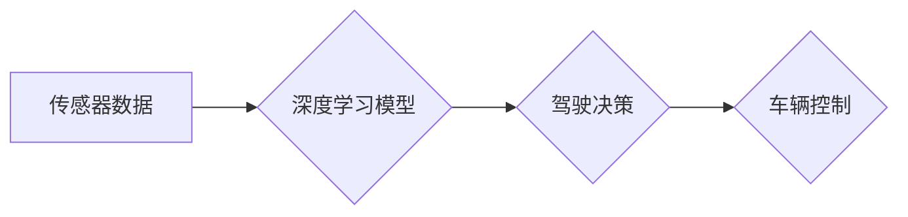

>  特斯拉, 自动驾驶, 端到端学习, 深度学习, 计算机视觉, 

## 1. 背景介绍

自动驾驶技术作为未来交通运输的重要发展方向，近年来备受关注。特斯拉作为一家领先的电动汽车制造商，在自动驾驶领域投入了巨额资金和资源，并致力于实现完全自动驾驶的目标。特斯拉的自动驾驶系统基于端到端学习的理念，利用深度学习算法从海量数据中学习驾驶技能，从而实现车辆的自主驾驶。

## 2. 核心概念与联系

**2.1 端到端学习 (End-to-End Learning)**

端到端学习是一种机器学习方法，它将输入数据直接映射到输出结果，无需人工设计中间特征。在自动驾驶领域，端到端学习可以将摄像头、雷达、激光雷达等传感器获取的原始数据直接输入到神经网络中，学习驾驶策略，从而简化了系统设计和开发过程。

**2.2 深度学习 (Deep Learning)**

深度学习是一种基于多层神经网络的机器学习方法，能够学习复杂的数据模式。在自动驾驶领域，深度学习算法被广泛应用于图像识别、目标检测、路径规划等任务，帮助车辆感知周围环境、理解道路信息并做出决策。

**2.3 计算机视觉 (Computer Vision)**

计算机视觉是赋予计算机“看”的能力，使其能够理解和解释图像和视频信息。在自动驾驶领域，计算机视觉技术用于识别道路标线、交通信号灯、行人、车辆等物体，为车辆提供感知环境的信息。

**2.4 架构图**



## 3. 核心算法原理 & 具体操作步骤

**3.1 算法原理概述**

特斯拉的自动驾驶系统主要基于深度学习算法，包括卷积神经网络 (CNN)、循环神经网络 (RNN) 和强化学习 (RL)。

* **CNN** 用于图像识别和目标检测，例如识别道路标线、交通信号灯、行人、车辆等物体。
* **RNN** 用于处理时间序列数据，例如车辆速度、方向、加速度等信息，帮助车辆预测未来道路情况。
* **RL** 用于训练车辆的驾驶策略，通过奖励机制引导车辆学习安全、高效的驾驶行为。

**3.2 算法步骤详解**

1. **数据采集:** 收集大量驾驶场景的图像、视频、传感器数据等。
2. **数据预处理:** 对采集到的数据进行清洗、格式化、标注等处理，使其适合深度学习模型的训练。
3. **模型训练:** 利用深度学习算法训练模型，使模型能够从数据中学习驾驶技能。
4. **模型评估:** 对训练好的模型进行评估，测试其在不同驾驶场景下的性能。
5. **模型部署:** 将训练好的模型部署到车辆上，实现自动驾驶功能。

**3.3 算法优缺点**

* **优点:**
    * 能够学习复杂的数据模式，实现高精度驾驶。
    * 自动化程度高，简化了系统设计和开发过程。
* **缺点:**
    * 训练数据量大，需要大量计算资源和时间。
    * 对数据质量要求高，数据标注工作量大。
    * 算法解释性差，难以理解模型的决策过程。

**3.4 算法应用领域**

* 自动驾驶汽车
* 无人机
* 机器人
* 智能监控

## 4. 数学模型和公式 & 详细讲解 & 举例说明

**4.1 数学模型构建**

在自动驾驶领域，深度学习模型通常采用多层神经网络结构，其中每一层都包含多个神经元。每个神经元接收来自上一层的输入信号，并通过激活函数进行处理，输出到下一层。

**4.2 公式推导过程**

深度学习模型的训练过程基于梯度下降算法，其目标是找到模型参数，使模型的预测结果与真实值之间的误差最小化。

**损失函数 (Loss Function):** 用于衡量模型预测结果与真实值的差异。常见的损失函数包括均方误差 (MSE) 和交叉熵损失 (Cross-Entropy Loss)。

**梯度下降 (Gradient Descent):** 用于更新模型参数，使其朝着损失函数最小化的方向进行调整。

**4.3 案例分析与讲解**

例如，在目标检测任务中，深度学习模型会输出每个图像中目标的边界框和类别概率。损失函数会计算预测边界框与真实边界框之间的距离，以及类别概率与真实类别的差异。梯度下降算法会根据损失函数的梯度，更新模型参数，使其能够预测更准确的目标边界框和类别。

## 5. 项目实践：代码实例和详细解释说明

**5.1 开发环境搭建**

* 操作系统: Ubuntu 20.04
* 编程语言: Python 3.8
* 深度学习框架: TensorFlow 2.0

**5.2 源代码详细实现**

```python
import tensorflow as tf

# 定义模型结构
model = tf.keras.models.Sequential([
    tf.keras.layers.Conv2D(32, (3, 3), activation='relu', input_shape=(64, 64, 3)),
    tf.keras.layers.MaxPooling2D((2, 2)),
    tf.keras.layers.Conv2D(64, (3, 3), activation='relu'),
    tf.keras.layers.MaxPooling2D((2, 2)),
    tf.keras.layers.Flatten(),
    tf.keras.layers.Dense(10, activation='softmax')
])

# 编译模型
model.compile(optimizer='adam',
              loss='sparse_categorical_crossentropy',
              metrics=['accuracy'])

# 训练模型
model.fit(x_train, y_train, epochs=10)

# 评估模型
loss, accuracy = model.evaluate(x_test, y_test)
print('Loss:', loss)
print('Accuracy:', accuracy)
```

**5.3 代码解读与分析**

这段代码定义了一个简单的卷积神经网络模型，用于图像分类任务。模型包含两层卷积层、两层最大池化层、一层全连接层和一层输出层。

* **Conv2D层:** 用于提取图像特征。
* **MaxPooling2D层:** 用于降维，减少计算量。
* **Flatten层:** 将多维特征转换为一维向量。
* **Dense层:** 用于分类。

**5.4 运行结果展示**

训练完成后，模型可以用于预测新的图像类别。

## 6. 实际应用场景

特斯拉的自动驾驶系统已在部分车型上实现，例如Model S、Model X、Model 3 和 Model Y。

**6.1 自动驾驶辅助功能**

* **自动紧急制动 (AEB):** 在车辆前方检测到障碍物时，自动紧急制动，避免碰撞。
* **车道保持辅助 (LKA):** 在行驶过程中，自动保持车辆在车道内行驶。
* **主动巡航控制 (ACC):** 自动调节车辆速度，保持与前车安全距离。

**6.2 自动驾驶功能**

* **自动泊车 (AP):** 自动寻找停车位并自动泊车。
* **自动换道 (ALC):** 自动判断安全情况，并自动换道。
* **自动驾驶 (FSD):** 在特定条件下，车辆可以自动驾驶，无需人工干预。

**6.3 未来应用展望**

随着自动驾驶技术的不断发展，特斯拉的自动驾驶系统将实现更高级的功能，例如：

* **无人工干预的自动驾驶:** 在所有道路条件下，车辆能够自动驾驶，无需人工干预。
* **自动驾驶出租车:** 利用自动驾驶技术，提供自动驾驶出租车服务。
* **自动驾驶物流:** 利用自动驾驶技术，提高物流效率和安全性。

## 7. 工具和资源推荐

**7.1 学习资源推荐**

* **书籍:**
    * 深度学习 (Deep Learning) - Ian Goodfellow, Yoshua Bengio, Aaron Courville
    * 构建深度学习模型 (Hands-On Machine Learning with Scikit-Learn, Keras & TensorFlow) - Aurélien Géron
* **在线课程:**
    * 深度学习 Specialization - Andrew Ng (Coursera)
    * fast.ai - Practical Deep Learning for Coders

**7.2 开发工具推荐**

* **深度学习框架:** TensorFlow, PyTorch, Keras
* **编程语言:** Python
* **数据标注工具:** LabelImg, CVAT

**7.3 相关论文推荐**

* **End to End Learning for Self-Driving Cars** - Bojarski et al. (2016)
* **Learning to Drive with Deep Reinforcement Learning** - Wang et al. (2017)
* **Attention Is All You Need** - Vaswani et al. (2017)

## 8. 总结：未来发展趋势与挑战

**8.1 研究成果总结**

特斯拉在自动驾驶领域取得了显著的成果，其端到端学习的理念和深度学习算法在自动驾驶技术的发展中发挥了重要作用。

**8.2 未来发展趋势**

* **更强大的计算能力:** 自动驾驶系统需要处理海量数据，因此更强大的计算能力是未来发展的趋势。
* **更安全的算法:** 自动驾驶算法需要更加安全可靠，能够应对各种复杂场景。
* **更完善的法律法规:** 自动驾驶技术的普及需要完善的法律法规，规范自动驾驶车辆的使用。

**8.3 面临的挑战**

* **数据安全:** 自动驾驶系统需要收集大量用户数据，数据安全是一个重要的挑战。
* **伦理问题:** 自动驾驶系统在遇到紧急情况时，如何做出决策是一个伦理问题。
* **公众接受度:** 自动驾驶技术需要公众的信任和接受，这需要时间和努力。

**8.4 研究展望**

未来，自动驾驶技术将继续发展，并应用于更广泛的领域。研究人员将继续探索新的算法和技术，以提高自动驾驶系统的安全性、可靠性和效率。


## 9. 附录：常见问题与解答

**9.1 自动驾驶系统是否安全可靠？**

特斯拉的自动驾驶系统经过了严格的测试和验证，但仍处于发展阶段，并非完全安全可靠。驾驶员需要时刻保持警惕，随时准备接管车辆控制。

**9.2 自动驾驶系统需要哪些硬件条件？**

特斯拉的自动驾驶系统需要配备摄像头、雷达、激光雷达等传感器，以及强大的计算能力。

**9.3 自动驾驶系统是否可以替代人类驾驶员？**

目前，自动驾驶系统仍无法完全替代人类驾驶员。人类驾驶员仍然需要在某些情况下接管车辆控制。


作者：禅与计算机程序设计艺术 / Zen and the Art of Computer Programming 
<end_of_turn>