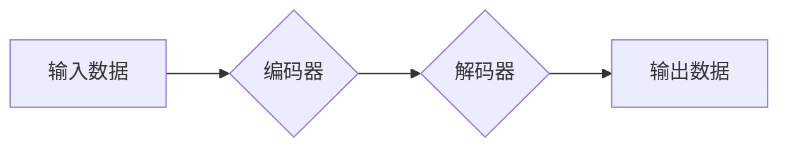

> 生成式AI、Transformer、自然语言处理、图像生成、文本摘要、代码生成、伦理问题、可解释性

## 1. 背景介绍

近年来，人工智能（AI）领域取得了令人瞩目的进展，其中生成式AI作为一类重要的AI应用，展现出强大的潜力，正在深刻地改变着我们生活和工作方式。生成式AI是指能够根据输入数据生成新内容的AI模型，例如文本、图像、音频、视频等。与传统的AI模型相比，生成式AI更加注重创造性和表达能力，能够生成具有原创性和艺术性的内容。

生成式AI技术的兴起与以下几个因素密切相关：

* **大规模数据量的积累:**  互联网时代，海量数据被不断生成和积累，为训练强大的生成式AI模型提供了充足的素材。
* **深度学习算法的突破:**  深度学习算法，特别是Transformer模型的出现，为生成式AI模型的训练和性能提升带来了革命性的变化。
* **计算能力的提升:**  近年来，计算能力的飞速发展，使得训练大型生成式AI模型成为可能。

## 2. 核心概念与联系

生成式AI的核心概念是**概率模型**。这些模型学习输入数据之间的概率关系，并根据这些关系生成新的数据。

**核心架构：**



**核心概念：**

* **编码器:** 将输入数据转换为潜在表示，捕捉数据的语义信息。
* **解码器:** 根据潜在表示生成新的数据。
* **注意力机制:**  允许模型关注输入数据中的重要部分，提高生成内容的质量和相关性。

## 3. 核心算法原理 & 具体操作步骤

### 3.1  算法原理概述

生成式AI模型的训练主要基于**无监督学习**和**最大似然估计**。

* **无监督学习:** 模型从未标记的数据中学习数据之间的模式和关系。
* **最大似然估计:** 模型的目标是找到最能解释观测数据的参数，即最大化观测数据的似然概率。

### 3.2  算法步骤详解

1. **数据预处理:**  收集和预处理训练数据，例如文本清洗、图像裁剪等。
2. **模型构建:**  选择合适的生成式AI模型架构，例如Transformer、GAN等。
3. **模型训练:**  使用训练数据训练模型，调整模型参数以最小化损失函数。
4. **模型评估:**  使用测试数据评估模型的性能，例如生成文本的流畅度、图像的真实度等。
5. **模型部署:**  将训练好的模型部署到实际应用场景中。

### 3.3  算法优缺点

**优点:**

* 能够生成高质量、原创性的内容。
* 应用范围广泛，涵盖文本、图像、音频等多种数据类型。
* 能够自动学习数据模式，无需人工标注数据。

**缺点:**

* 训练成本高，需要大量数据和计算资源。
* 模型的可解释性较差，难以理解模型的决策过程。
* 存在生成虚假信息和偏见等伦理问题。

### 3.4  算法应用领域

* **自然语言处理:** 文本生成、机器翻译、文本摘要、对话系统等。
* **计算机视觉:** 图像生成、图像编辑、目标检测等。
* **音频处理:** 音频合成、语音识别、音乐创作等。
* **代码生成:** 自动生成代码、代码修复等。

## 4. 数学模型和公式 & 详细讲解 & 举例说明

### 4.1  数学模型构建

生成式AI模型通常基于概率模型，例如**条件概率分布**。

**条件概率分布:**  P(y|x)，表示给定输入数据x，输出数据y的概率分布。

**目标函数:**  模型训练的目标是最大化条件概率分布的似然概率。

### 4.2  公式推导过程

**似然函数:**  L(θ) = ∏i P(yi|xi; θ)

其中，θ表示模型参数，yi表示第i个样本的输出数据，xi表示第i个样本的输入数据。

**对数似然函数:**  log L(θ) = ∑i log P(yi|xi; θ)

**梯度下降:**  使用梯度下降算法优化模型参数，使得对数似然函数最大化。

### 4.3  案例分析与讲解

**文本生成:**

假设我们训练一个生成文本的模型，输入是一个句子开头，模型需要生成接下来的句子。

* **输入数据:**  “今天天气真好”
* **输出数据:**  “适合出去散步”

模型会根据输入句子和训练数据中的语义关系，预测下一个词的概率分布，并选择概率最高的词作为输出。

## 5. 项目实践：代码实例和详细解释说明

### 5.1  开发环境搭建

* **操作系统:**  Linux/macOS
* **编程语言:**  Python
* **深度学习框架:**  TensorFlow/PyTorch
* **其他工具:**  Git、Jupyter Notebook

### 5.2  源代码详细实现

```python
# 使用TensorFlow构建一个简单的文本生成模型

import tensorflow as tf

# 定义模型架构
model = tf.keras.Sequential([
    tf.keras.layers.Embedding(input_dim=vocab_size, output_dim=embedding_dim),
    tf.keras.layers.LSTM(units=lstm_units),
    tf.keras.layers.Dense(units=vocab_size, activation='softmax')
])

# 编译模型
model.compile(optimizer='adam', loss='sparse_categorical_crossentropy', metrics=['accuracy'])

# 训练模型
model.fit(x_train, y_train, epochs=epochs)

# 生成文本
text = "今天天气真好"
for _ in range(10):
    predictions = model.predict(tf.expand_dims(text, 0))
    predicted_index = tf.argmax(predictions[0]).numpy()
    text += tokenizer.index_word[predicted_index]
```

### 5.3  代码解读与分析

* **Embedding层:** 将单词转换为稠密的向量表示。
* **LSTM层:**  捕捉文本序列中的长短时依赖关系。
* **Dense层:**  将LSTM输出映射到每个单词的概率分布。
* **softmax激活函数:**  将输出概率分布归一化到0到1之间。

### 5.4  运行结果展示

运行代码后，模型将根据输入文本生成新的文本。

## 6. 实际应用场景

### 6.1  文本生成

* **内容创作:**  生成新闻报道、小说、诗歌等。
* **聊天机器人:**  构建更自然、更智能的对话系统。
* **机器翻译:**  实现更高效、更准确的语言翻译。

### 6.2  图像生成

* **图像合成:**  生成逼真的图像，例如人物肖像、风景画等。
* **图像编辑:**  修复图像缺陷、增强图像细节等。
* **艺术创作:**  生成具有艺术性的图像作品。

### 6.3  音频生成

* **语音合成:**  生成自然流畅的语音，用于语音助手、播报系统等。
* **音乐创作:**  生成原创音乐作品，例如旋律、伴奏等。
* **音频特效:**  生成各种音效，用于游戏、电影等。

### 6.4  未来应用展望

* **个性化内容生成:**  根据用户的喜好和需求生成个性化的内容。
* **跨模态生成:**  生成多种模态数据，例如文本、图像、音频的组合。
* **增强现实/虚拟现实:**  生成逼真的虚拟环境和交互体验。

## 7. 工具和资源推荐

### 7.1  学习资源推荐

* **书籍:**  《深度学习》、《生成对抗网络》
* **在线课程:**  Coursera、edX、Udacity
* **博客:**  OpenAI Blog、Google AI Blog

### 7.2  开发工具推荐

* **深度学习框架:**  TensorFlow、PyTorch
* **文本处理工具:**  NLTK、spaCy
* **图像处理工具:**  OpenCV、Pillow

### 7.3  相关论文推荐

* **Generative Pre-trained Transformer 2 (GPT-2)**
* **Generative Adversarial Networks (GANs)**
* **Transformer-XL**

## 8. 总结：未来发展趋势与挑战

### 8.1  研究成果总结

生成式AI技术取得了显著进展，在文本、图像、音频等领域展现出强大的应用潜力。

### 8.2  未来发展趋势

* **模型规模和能力的提升:**  训练更大规模、更强大的生成式AI模型。
* **跨模态生成:**  实现文本、图像、音频等多种模态数据的生成。
* **可解释性和安全性:**  提高模型的可解释性和安全性，解决伦理问题。

### 8.3  面临的挑战

* **数据获取和标注:**  高质量的数据是训练生成式AI模型的关键，但获取和标注数据成本高。
* **计算资源:**  训练大型生成式AI模型需要大量的计算资源。
* **伦理问题:**  生成式AI模型可能被用于生成虚假信息、侵犯隐私等，需要谨慎使用和监管。

### 8.4  研究展望

未来，生成式AI技术将继续发展，在更多领域发挥重要作用。需要加强对模型可解释性和安全性的研究，并制定相应的伦理规范，确保其安全、可控地发展。

## 9. 附录：常见问题与解答

* **什么是生成式AI？**

生成式AI是指能够根据输入数据生成新内容的AI模型，例如文本、图像、音频等。

* **生成式AI有哪些应用场景？**

生成式AI的应用场景广泛，包括文本生成、图像生成、音频生成、代码生成等。

* **如何训练生成式AI模型？**

训练生成式AI模型需要使用大量数据和计算资源，并使用深度学习算法，例如Transformer、GAN等。

* **生成式AI有哪些伦理问题？**

生成式AI可能被用于生成虚假信息、侵犯隐私等，需要谨慎使用和监管。


作者：禅与计算机程序设计艺术 / Zen and the Art of Computer Programming 
<end_of_turn>