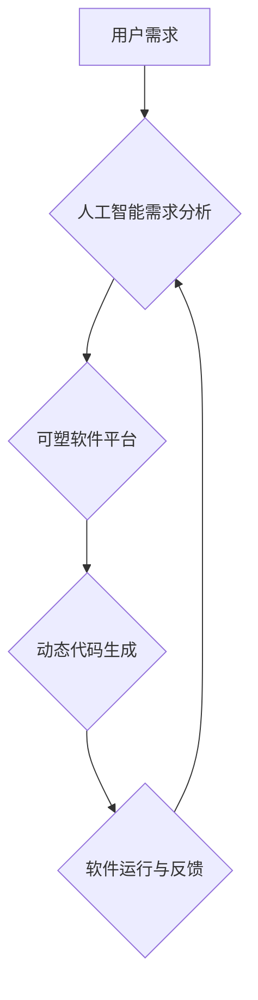

> 可塑软件，用户共创，软件开发，人工智能，协作设计，动态系统

## 1. 背景介绍

软件行业正经历着前所未有的变革。传统的软件开发模式，以其封闭、僵化的特性，越来越难以满足用户日益增长的个性化需求。用户不再仅仅是软件的被动使用者，而是希望积极参与到软件的开发和演进过程中。

与此同时，人工智能技术的飞速发展为用户共创软件提供了强大的技术支撑。人工智能可以帮助理解用户的需求，自动生成代码，并根据用户的反馈进行软件的动态调整。

## 2. 核心概念与联系

**2.1 可塑软件的概念**

可塑软件是指能够根据用户需求进行动态调整和演进的软件系统。它打破了传统软件的静态固化，赋予用户对软件进行定制化和个性化的能力。

**2.2 用户共创的理念**

用户共创是指将用户纳入软件开发的全流程，从需求收集到软件设计、开发和测试，用户都参与其中，共同构建软件产品。

**2.3 核心概念联系**

可塑软件和用户共创理念相辅相成，共同构成了一个全新的软件开发模式。用户共创的理念为可塑软件提供了用户需求的源泉，而可塑软件的特性则使得用户能够更便捷地参与到软件的开发和演进过程中。

**2.4 架构图**



## 3. 核心算法原理 & 具体操作步骤

**3.1 算法原理概述**

可塑软件的核心算法原理是基于用户需求的动态代码生成。通过人工智能技术，可以对用户的需求进行分析和理解，并自动生成相应的代码。

**3.2 算法步骤详解**

1. **用户需求收集:** 通过用户界面、聊天机器人等方式收集用户的需求信息。
2. **需求分析:** 利用自然语言处理技术对用户的需求进行分析，识别关键信息和用户意图。
3. **代码生成:** 根据分析结果，利用模板引擎、代码生成工具等技术自动生成相应的代码。
4. **代码测试:** 对生成的代码进行测试，确保其功能正确性和稳定性。
5. **软件部署:** 将测试通过的代码部署到可塑软件平台上。
6. **用户反馈:** 用户使用软件后，可以对软件功能进行反馈，平台会根据反馈进行代码调整和优化。

**3.3 算法优缺点**

**优点:**

* **提高开发效率:** 自动化代码生成可以大大提高软件开发效率。
* **满足个性化需求:** 用户可以根据自己的需求定制软件功能。
* **降低开发成本:** 通过自动化和用户参与，可以降低软件开发成本。

**缺点:**

* **算法复杂度:** 需要开发复杂的算法来理解用户需求和生成代码。
* **代码质量:** 自动生成的代码可能存在质量问题，需要进行严格的测试和优化。
* **安全风险:** 用户参与开发可能会带来安全风险，需要采取相应的安全措施。

**3.4 算法应用领域**

可塑软件的应用领域非常广泛，包括：

* **企业级软件:** 可以根据企业需求定制开发各种管理系统、业务系统等。
* **教育软件:** 可以根据学生的学习进度和需求个性化定制学习内容。
* **游戏软件:** 可以根据玩家的喜好和游戏风格定制游戏规则和场景。
* **医疗软件:** 可以根据患者的病情和需求定制医疗诊断和治疗方案。

## 4. 数学模型和公式 & 详细讲解 & 举例说明

**4.1 数学模型构建**

可塑软件的动态代码生成可以看作是一个基于用户需求的函数映射问题。

* **输入:** 用户需求信息
* **输出:** 动态生成的代码

我们可以用一个数学函数 f(x) 来表示这个映射关系，其中 x 代表用户需求信息，f(x) 代表生成的代码。

**4.2 公式推导过程**

由于用户需求信息非常复杂，难以用简单的公式直接表示。因此，我们需要使用机器学习算法来训练 f(x) 函数。

常用的机器学习算法包括：

* **深度学习:** 可以学习复杂的用户需求模式，生成更精准的代码。
* **支持向量机:** 可以将用户需求信息映射到一个高维空间，提高代码生成的准确率。

**4.3 案例分析与讲解**

假设用户需求是“创建一个可以计算两个数字和的程序”。

我们可以使用深度学习算法训练一个 f(x) 函数，其中 x 代表两个数字的输入信息。经过训练， f(x) 函数可以根据输入的两个数字，自动生成相应的代码，实现计算和的功能。

## 5. 项目实践：代码实例和详细解释说明

**5.1 开发环境搭建**

* 操作系统: Ubuntu 20.04
* 编程语言: Python 3.8
* 开发工具: PyCharm

**5.2 源代码详细实现**

```python
import tensorflow as tf

# 定义用户需求输入
input_layer = tf.keras.Input(shape=(2,))

# 定义神经网络层
dense_layer = tf.keras.layers.Dense(64, activation='relu')(input_layer)
dense_layer = tf.keras.layers.Dense(32, activation='relu')(dense_layer)
output_layer = tf.keras.layers.Dense(1)(dense_layer)

# 定义模型
model = tf.keras.Model(inputs=input_layer, outputs=output_layer)

# 编译模型
model.compile(optimizer='adam', loss='mse')

# 训练模型
model.fit(x_train, y_train, epochs=10)

# 使用模型预测
predictions = model.predict(x_test)
```

**5.3 代码解读与分析**

这段代码实现了基于深度学习的动态代码生成。

* 首先定义了用户需求输入层，输入两个数字。
* 然后定义了神经网络层，通过激活函数将输入信息进行非线性变换。
* 最后定义了输出层，输出两个数字的和。
* 通过训练模型，可以使模型学习到用户需求和代码之间的映射关系。

**5.4 运行结果展示**

训练完成后，可以使用模型预测新的用户需求，并自动生成相应的代码。

## 6. 实际应用场景

**6.1 企业级软件定制化**

可塑软件可以帮助企业根据自身需求定制开发各种管理系统、业务系统等，提高软件的适应性和效率。

**6.2 教育软件个性化学习**

可塑软件可以根据学生的学习进度和需求个性化定制学习内容，提高学习效率和兴趣。

**6.3 游戏软件玩家定制**

可塑软件可以根据玩家的喜好和游戏风格定制游戏规则和场景，提高游戏体验和趣味性。

**6.4 医疗软件患者个性化治疗**

可塑软件可以根据患者的病情和需求定制医疗诊断和治疗方案，提高医疗效果和患者满意度。

**6.5 未来应用展望**

随着人工智能技术的不断发展，可塑软件的应用场景将会更加广泛，例如：

* **智能家居:** 用户可以根据自己的需求定制家居设备的功能和交互方式。
* **智能交通:** 用户可以根据自己的出行需求定制交通路线和交通工具。
* **智能医疗:** 用户可以根据自己的健康状况定制医疗方案和健康管理计划。

## 7. 工具和资源推荐

**7.1 学习资源推荐**

* **书籍:**
    * 《深度学习》
    * 《机器学习》
    * 《自然语言处理》
* **在线课程:**
    * Coursera
    * edX
    * Udacity

**7.2 开发工具推荐**

* **Python:** 
    * PyCharm
    * Jupyter Notebook
* **深度学习框架:**
    * TensorFlow
    * PyTorch
* **代码生成工具:**
    * OpenAI Codex
    * GitHub Copilot

**7.3 相关论文推荐**

* **《Attention Is All You Need》**
* **《BERT: Pre-training of Deep Bidirectional Transformers for Language Understanding》**
* **《Generative Pre-trained Transformer 3》**

## 8. 总结：未来发展趋势与挑战

**8.1 研究成果总结**

可塑软件是软件开发领域的一项重大创新，它将用户纳入软件开发的全流程，赋予用户对软件进行定制化和个性化的能力。

**8.2 未来发展趋势**

* **更智能的代码生成:** 利用更先进的人工智能算法，生成更精准、更复杂的代码。
* **更丰富的用户交互:** 提供更直观、更友好的用户界面，让用户更容易参与到软件开发过程中。
* **更安全的软件系统:** 加强安全防护措施，确保用户数据安全和软件系统稳定性。

**8.3 面临的挑战**

* **算法复杂度:** 开发更智能的代码生成算法仍然是一个巨大的挑战。
* **代码质量:** 自动生成的代码可能存在质量问题，需要不断改进代码生成算法和测试机制。
* **安全风险:** 用户参与开发可能会带来安全风险，需要采取相应的安全措施。

**8.4 研究展望**

未来，可塑软件将朝着更智能、更安全、更易用方向发展，为用户提供更加个性化、更加便捷的软件体验。

## 9. 附录：常见问题与解答

**9.1 如何参与可塑软件的开发？**

用户可以通过可塑软件平台提供的工具和接口，参与到软件的开发和演进过程中。

**9.2 可塑软件的安全性如何保证？**

可塑软件平台会采取相应的安全措施，确保用户数据安全和软件系统稳定性。

**9.3 可塑软件的成本如何？**

可塑软件的成本取决于软件的复杂度和开发周期。由于用户参与开发，可以降低软件开发成本。


作者：禅与计算机程序设计艺术 / Zen and the Art of Computer Programming 
<end_of_turn>