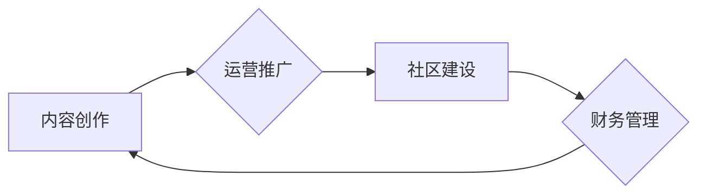

> 知识付费、创业者、日常工作安排、时间管理、内容创作、运营推广、社区建设、财务管理

## 1. 背景介绍

知识付费行业近年来发展迅速，成为新兴的商业模式之一。越来越多的专家学者、行业从业者选择通过知识付费平台分享自己的专业知识和经验，并从中获得收益。然而，知识付费创业者面临着诸多挑战，例如内容创作、运营推广、社区建设、财务管理等。如何合理安排日常工作，提高工作效率，是知识付费创业者需要思考的重要问题。

## 2. 核心概念与联系

知识付费创业者的日常工作安排可以概括为以下几个核心概念：

* **内容创作:**  这是知识付费创业的核心，需要不断输出高质量、有价值的内容，满足用户的学习需求。
* **运营推广:**  需要通过多种渠道推广自己的知识付费产品，吸引用户购买。
* **社区建设:**  建立一个活跃的学习社区，帮助用户互相交流学习，提升用户粘性。
* **财务管理:**  合理规划财务支出，控制成本，提高盈利能力。

这些核心概念相互关联，共同构成了知识付费创业者的日常工作体系。

**Mermaid 流程图:**



## 3. 核心算法原理 & 具体操作步骤

### 3.1  算法原理概述

知识付费创业者的日常工作安排可以看作是一个时间管理算法，其核心原理是：

* **时间规划:**  合理分配时间，将工作任务分解成一个个小的单元，并安排在不同的时间段内完成。
* **优先级排序:**  根据任务的重要性、紧急程度等因素，对工作任务进行优先级排序，确保重要任务得到及时完成。
* **效率提升:**  采用一些效率提升的方法，例如番茄工作法、Pomodoro Technique等，提高工作效率。

### 3.2  算法步骤详解

1. **目标设定:**  明确自己的知识付费创业目标，例如：每月销售多少课程、建立多少用户群体等。
2. **时间规划:**  根据目标设定，制定详细的时间表，将每天的工作任务分配到不同的时间段内。
3. **任务分解:**  将大任务分解成一个个小的任务，例如：撰写课程内容、录制视频、设计课程页面等。
4. **优先级排序:**  根据任务的重要性、紧急程度等因素，对工作任务进行优先级排序。
5. **效率提升:**  采用一些效率提升的方法，例如番茄工作法、Pomodoro Technique等，提高工作效率。
6. **定期评估:**  定期评估自己的工作进度和效率，根据实际情况进行调整。

### 3.3  算法优缺点

**优点:**

* **提高工作效率:**  通过合理安排时间和优先级排序，可以提高工作效率。
* **保证目标达成:**  通过制定详细的时间表和任务分解，可以保证目标的达成。
* **减少压力:**  通过将大任务分解成一个个小的任务，可以减少压力。

**缺点:**

* **需要自律性:**  需要具备较强的自律性，才能严格按照时间表执行工作任务。
* **缺乏灵活性:**  时间表一旦制定，就比较难以调整，缺乏灵活性。

### 3.4  算法应用领域

时间管理算法广泛应用于各个领域，例如：

* **个人生活:**  帮助个人合理安排时间，提高生活效率。
* **企业管理:**  帮助企业合理安排员工工作时间，提高工作效率。
* **项目管理:**  帮助项目经理合理安排项目进度，确保项目按时完成。

## 4. 数学模型和公式 & 详细讲解 & 举例说明

### 4.1  数学模型构建

知识付费创业者的日常工作安排可以抽象为一个时间分配模型，其中：

* **T:**  总时间
* **Ti:**  第i个任务所需要的时间
* **Pi:**  第i个任务的优先级
* **Wi:**  第i个任务的完成度

**模型目标:**  最大化完成高优先级任务的完成度，同时保证所有任务的完成。

### 4.2  公式推导过程

根据优先级和时间分配，可以推导出以下公式：

```latex
Wi = Ti / T * Pi
```

其中：

* **Wi:**  第i个任务的完成度
* **Ti:**  第i个任务所需要的时间
* **T:**  总时间
* **Pi:**  第i个任务的优先级

### 4.3  案例分析与讲解

假设一个知识付费创业者每天有8小时的时间，需要完成以下三个任务：

* **任务1:**  撰写课程内容，需要4小时，优先级为3。
* **任务2:**  录制视频，需要2小时，优先级为2。
* **任务3:**  运营推广，需要2小时，优先级为1。

根据公式，可以计算出每个任务的完成度：

* **任务1:**  Wi = 4 / 8 * 3 = 1.5
* **任务2:**  Wi = 2 / 8 * 2 = 0.5
* **任务3:**  Wi = 2 / 8 * 1 = 0.25

根据完成度，可以看出，知识付费创业者应该优先完成任务3，其次是任务1，最后是任务2。

## 5. 项目实践：代码实例和详细解释说明

### 5.1  开发环境搭建

知识付费创业者的日常工作安排可以借助一些工具和软件来实现，例如：

* **时间管理软件:**  番茄工作法、Trello、Asana等
* **内容创作工具:**  Markdown编辑器、视频录制软件、图片编辑软件等
* **运营推广工具:**  社交媒体平台、邮件营销软件、广告平台等

### 5.2  源代码详细实现

由于知识付费创业者的日常工作安排是一个复杂的过程，无法用简单的代码实现。但是，可以使用一些编程语言和框架来开发一些辅助工具，例如：

* **时间管理工具:**  可以使用Python或JavaScript开发一个时间管理工具，帮助用户规划时间、设置提醒、跟踪进度等。
* **内容创作工具:**  可以使用Python或Node.js开发一个内容创作工具，帮助用户撰写文章、生成视频脚本、编辑图片等。

### 5.3  代码解读与分析

代码的解读和分析需要根据具体的代码实现进行。

### 5.4  运行结果展示

运行结果展示需要根据具体的代码实现进行。

## 6. 实际应用场景

知识付费创业者可以将时间管理算法应用于以下场景：

* **课程开发:**  合理安排课程开发时间，确保按时完成课程录制、编辑、发布等工作。
* **用户运营:**  制定用户运营计划，合理安排时间进行用户互动、答疑解惑、社区建设等工作。
* **营销推广:**  制定营销推广计划，合理安排时间进行内容创作、渠道推广、活动策划等工作。

### 6.4  未来应用展望

随着人工智能技术的不断发展，未来知识付费创业者可以利用人工智能技术来辅助时间管理，例如：

* **智能日程安排:**  利用人工智能技术自动安排日程，根据用户的任务优先级和时间安排，自动生成日程表。
* **智能任务分配:**  利用人工智能技术自动分配任务，根据用户的技能和时间安排，自动分配任务。
* **智能效率提升:**  利用人工智能技术分析用户的工作习惯，提供个性化的效率提升建议。

## 7. 工具和资源推荐

### 7.1  学习资源推荐

* **书籍:**  《Getting Things Done》、《Eat That Frog!》、《The 7 Habits of Highly Effective People》
* **网站:**  Zen Habits、Lifehacker、Mind Tools
* **课程:**  Coursera、Udemy、edX

### 7.2  开发工具推荐

* **时间管理软件:**  番茄工作法、Trello、Asana
* **内容创作工具:**  Markdown编辑器、视频录制软件、图片编辑软件
* **运营推广工具:**  社交媒体平台、邮件营销软件、广告平台

### 7.3  相关论文推荐

* **时间管理算法研究:**  "A Survey of Time Management Algorithms"
* **人工智能辅助时间管理:**  "AI-Powered Time Management: A Review and Future Directions"

## 8. 总结：未来发展趋势与挑战

### 8.1  研究成果总结

知识付费创业者的日常工作安排是一个复杂的过程，需要结合时间管理算法、人工智能技术等多种因素进行优化。

### 8.2  未来发展趋势

未来知识付费创业者的日常工作安排将更加智能化、个性化，人工智能技术将扮演越来越重要的角色。

### 8.3  面临的挑战

知识付费创业者在日常工作安排方面面临着一些挑战，例如：

* **时间管理能力:**  需要具备较强的自律性和时间管理能力。
* **技术应用能力:**  需要掌握一些相关工具和技术的应用。
* **市场竞争:**  知识付费市场竞争激烈，需要不断创新和提升。

### 8.4  研究展望

未来研究方向可以包括：

* **更智能的时间管理算法:**  开发更智能、更个性化的时间管理算法。
* **人工智能辅助时间管理:**  开发更强大的人工智能辅助时间管理工具。
* **知识付费市场研究:**  深入研究知识付费市场，寻找新的发展机会。

## 9. 附录：常见问题与解答

**常见问题:**

* 如何提高时间管理能力？
* 如何选择合适的工具和软件？
* 如何应对知识付费市场竞争？

**解答:**

* 提高时间管理能力可以通过学习相关书籍、课程、网站等方式，并不断实践和总结经验。
* 选择合适的工具和软件需要根据自己的实际需求和工作习惯进行选择。
* 应对知识付费市场竞争可以通过不断创新、提升产品质量、加强用户运营等方式。


作者：禅与计算机程序设计艺术 / Zen and the Art of Computer Programming 
<end_of_turn>