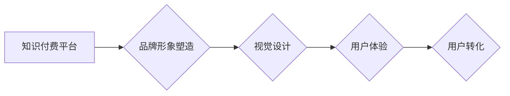

> 知识付费, 品牌形象, 视觉设计, 营销策略, 用户体验

## 1. 背景介绍

知识付费行业近年来发展迅速，成为互联网经济的重要组成部分。随着人们对知识的需求不断增长，以及互联网技术的不断发展，知识付费模式也呈现出多元化、个性化的趋势。然而，在激烈的市场竞争中，如何打造独特的品牌形象，吸引用户，并实现可持续发展，成为知识付费平台和创作者面临的共同挑战。

品牌形象塑造是知识付费平台和创作者成功的重要因素之一。良好的品牌形象能够提升用户信任度，增强品牌辨识度，最终促进用户转化和复购。而视觉设计作为品牌形象的重要组成部分，在传递品牌理念、塑造品牌气质、吸引用户眼球方面发挥着至关重要的作用。

## 2. 核心概念与联系

### 2.1 知识付费

知识付费是指通过付费的方式获取知识、技能或服务的商业模式。它涵盖了各种形式的知识产品，例如在线课程、电子书、付费咨询、直播讲座等。

### 2.2 品牌形象

品牌形象是指消费者对品牌的整体感知和印象，包括品牌名称、logo、视觉风格、品牌故事、价值观等方面。良好的品牌形象能够提升品牌价值，增强用户粘性，促进品牌发展。

### 2.3 视觉设计

视觉设计是指通过图像、色彩、排版等视觉元素来传达信息、表达情感、引导用户行为的设计过程。在知识付费领域，视觉设计可以帮助平台和创作者打造独特的品牌形象，吸引用户关注，提升用户体验。

**Mermaid 流程图**

## 3. 核心算法原理 & 具体操作步骤

### 3.1 算法原理概述

在知识付费平台的品牌形象塑造与视觉设计中，并没有特定的算法原理。 

### 3.2 算法步骤详解

品牌形象塑造与视觉设计是一个综合性的过程，需要结合多种因素进行分析和设计。

1. **市场调研:** 了解目标用户群体、竞争对手情况、行业趋势等信息。
2. **品牌定位:** 明确品牌的核心价值观、目标受众、竞争优势等。
3. **视觉风格设计:** 确定品牌logo、色彩、字体、排版等视觉元素，打造独特的品牌视觉识别系统。
4. **内容创作:** 打造优质、有价值的知识内容，并进行有效的视觉呈现。
5. **用户体验优化:** 提升用户在平台上的浏览体验、学习体验、互动体验等。
6. **品牌推广:** 通过线上线下多种渠道进行品牌推广，扩大品牌影响力。

### 3.3 算法优缺点

由于没有特定的算法原理，因此也不存在算法的优缺点。

### 3.4 算法应用领域

品牌形象塑造与视觉设计广泛应用于各个领域，包括：

* 知识付费平台
* 教育机构
* 企业品牌
* 个人品牌

## 4. 数学模型和公式 & 详细讲解 & 举例说明

在品牌形象塑造与视觉设计中，可以利用一些数学模型和公式来辅助设计，例如：

* **色彩心理学:** 利用色彩心理学原理，选择合适的色彩搭配，来传达不同的品牌情感和价值观。
* **视觉感知模型:** 利用视觉感知模型，优化视觉元素的布局和排列，提升用户视觉体验。
* **用户行为分析:** 利用用户行为分析数据，了解用户偏好和行为模式，从而进行更精准的品牌设计和营销策略。

## 5. 项目实践：代码实例和详细解释说明

由于品牌形象塑造与视觉设计主要依赖于创意和审美，因此并不需要大量的代码实现。

## 6. 实际应用场景

知识付费平台可以利用品牌形象塑造与视觉设计来提升用户体验，增强用户粘性，促进用户转化。例如：

* **打造独特的品牌视觉识别系统:** 通过设计独特的logo、色彩、字体等视觉元素，提升品牌辨识度，增强用户记忆点。
* **优化用户界面设计:** 通过合理布局、清晰导航、简洁排版等设计，提升用户浏览体验，降低用户学习门槛。
* **利用视觉元素传达品牌理念:** 通过图片、视频、动画等视觉元素，生动形象地展现品牌理念和价值观，增强用户情感共鸣。

## 7. 工具和资源推荐

### 7.1 学习资源推荐

* **书籍:** 《品牌管理》、《视觉传达设计》、《用户体验设计》等
* **网站:** 
    *  Dribbble: https://dribbble.com/
    *  Behance: https://www.behance.net/
    *  Awwwards: https://www.awwwards.com/

### 7.2 开发工具推荐

* **设计软件:** Adobe Photoshop, Adobe Illustrator, Sketch等
* **前端开发框架:** React, Vue.js, Angular等

### 7.3 相关论文推荐

* **品牌形象与消费者行为关系研究**
* **视觉设计与用户体验研究**
* **知识付费平台用户行为分析**

## 8. 总结：未来发展趋势与挑战

### 8.1 研究成果总结

品牌形象塑造与视觉设计对于知识付费平台的成功至关重要。通过深入了解目标用户群体、明确品牌定位、打造独特的视觉风格、优化用户体验，知识付费平台可以提升用户信任度、增强品牌辨识度，最终实现可持续发展。

### 8.2 未来发展趋势

* **个性化定制:** 未来知识付费平台将更加注重个性化定制，根据用户的不同需求和喜好，提供个性化的品牌形象和视觉设计方案。
* **沉浸式体验:** 未来知识付费平台将更加注重沉浸式体验，利用VR、AR等新技术，为用户提供更加生动、互动、沉浸式的学习体验。
* **数据驱动设计:** 未来知识付费平台将更加注重数据驱动设计，通过用户行为数据分析，不断优化品牌形象和视觉设计，提升用户体验。

### 8.3 面临的挑战

* **创意创新:** 在激烈的市场竞争中，知识付费平台需要不断进行创意创新，打造出独具特色的品牌形象和视觉设计。
* **技术应用:** 如何将新技术应用于品牌形象塑造与视觉设计，提升用户体验，也是一个需要不断探索的课题。
* **用户隐私保护:** 在收集和使用用户数据时，知识付费平台需要更加注重用户隐私保护，确保用户数据安全。

### 8.4 研究展望

未来，我们将继续深入研究品牌形象塑造与视觉设计在知识付费领域的应用，探索更有效的品牌设计方法和技术，为知识付费平台和创作者提供更专业的服务。

## 9. 附录：常见问题与解答

**Q1: 如何打造独特的品牌形象？**

A1: 打造独特的品牌形象需要从以下几个方面入手：

* 明确品牌定位：确定品牌的核心理念、目标受众、竞争优势等。
* 设计独特的视觉识别系统：包括logo、色彩、字体、排版等。
* 打造有价值的品牌故事：讲述品牌的起源、发展历程、价值观等。
* 提升用户体验：提供优质的产品和服务，并注重用户体验的设计。

**Q2: 如何优化用户界面设计？**

A2: 优化用户界面设计需要考虑以下几个方面：

* 简洁排版：避免过于复杂的布局和设计，保持界面简洁明了。
* 清晰导航：提供清晰的导航菜单，方便用户快速找到所需信息。
* 突出重点：通过颜色、字体、大小等方式，突出重要的信息和功能。
* 响应式设计：确保界面在不同设备上都能正常显示和使用。

**作者：禅与计算机程序设计艺术 / Zen and the Art of Computer Programming**

<end_of_turn>