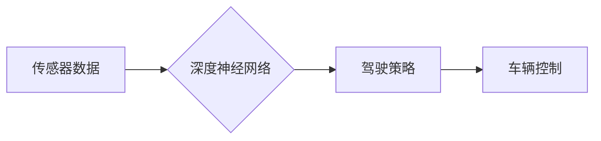

> 自动驾驶, 端到端学习, 安全性, 鲁棒性, 泛化能力, 误判, 伦理问题

## 1. 背景介绍

自动驾驶技术作为未来交通运输的重要发展方向，近年来取得了显著进展。端到端自动驾驶系统，通过深度学习算法直接从传感器数据中学习驾驶策略，展现出强大的学习能力和适应性。然而，端到端自动驾驶系统的安全性仍然是一个巨大的挑战，需要深入研究和解决。

## 2. 核心概念与联系

端到端自动驾驶系统将整个驾驶过程视为一个单一的端到端任务，利用深度神经网络直接将传感器数据映射到控制指令。

**核心概念:**

* **传感器数据:**  自动驾驶系统依赖于各种传感器，例如摄像头、雷达、激光雷达等，获取车辆周围环境的信息。
* **深度神经网络:**  深度神经网络是一种强大的机器学习模型，能够从大量数据中学习复杂的特征和关系。
* **驾驶策略:**  驾驶策略是指车辆在不同场景下采取的控制动作，例如加速、减速、转向等。

**架构图:**



## 3. 核心算法原理 & 具体操作步骤

### 3.1  算法原理概述

端到端自动驾驶系统的核心算法是深度神经网络，通常采用卷积神经网络（CNN）和循环神经网络（RNN）的组合结构。CNN擅长提取图像特征，RNN擅长处理时间序列数据，两者结合可以有效地处理传感器数据中的空间和时间信息。

### 3.2  算法步骤详解

1. **数据采集:** 收集大量真实驾驶场景的数据，包括传感器数据和对应的驾驶策略。
2. **数据预处理:** 对传感器数据进行清洗、格式化和增强，例如图像裁剪、噪声去除、数据扩增等。
3. **模型训练:** 利用深度神经网络模型，将预处理后的数据进行训练，学习驾驶策略与传感器数据之间的映射关系。
4. **模型评估:** 使用测试数据集评估模型的性能，例如准确率、召回率、平均位移误差等。
5. **模型部署:** 将训练好的模型部署到自动驾驶系统中，用于实时决策。

### 3.3  算法优缺点

**优点:**

* **学习能力强:** 深度神经网络能够从大量数据中学习复杂的驾驶策略。
* **适应性强:** 可以适应不同的驾驶场景和环境条件。
* **端到端训练:** 简化了系统设计和开发过程。

**缺点:**

* **数据依赖性强:** 需要大量高质量的训练数据。
* **黑盒效应:** 模型的决策过程难以解释和理解。
* **鲁棒性差:** 对异常数据和恶劣环境的适应能力有限。

### 3.4  算法应用领域

端到端自动驾驶算法广泛应用于自动驾驶汽车、无人机、机器人等领域。

## 4. 数学模型和公式 & 详细讲解 & 举例说明

### 4.1  数学模型构建

端到端自动驾驶系统的数学模型通常基于深度神经网络，其结构可以表示为多层神经元网络。每个神经元接收来自前一层神经元的输入，并通过激活函数进行处理，输出到下一层神经元。

### 4.2  公式推导过程

深度神经网络的训练过程基于反向传播算法，其核心公式包括损失函数、梯度下降法和激活函数。

* **损失函数:** 用于衡量模型预测结果与真实值的差异。常见的损失函数包括均方误差（MSE）和交叉熵损失（CE）。
* **梯度下降法:** 用于更新模型参数，使其朝着最小化损失函数的方向进行调整。
* **激活函数:** 用于引入非线性，使神经网络能够学习复杂的映射关系。常见的激活函数包括ReLU、Sigmoid和Tanh。

### 4.3  案例分析与讲解

假设我们使用MSE损失函数训练一个简单的深度神经网络，其目标是预测车辆的下一步行驶方向。

* **输入:** 传感器数据，例如摄像头图像和雷达数据。
* **输出:** 车辆行驶方向，例如左转、右转或直行。
* **损失函数:** MSE = 1/N * Σ(y_i - y_hat_i)^2，其中N为样本数量，y_i为真实值，y_hat_i为预测值。
* **梯度下降法:** 更新模型参数，使其朝着最小化MSE的方向进行调整。

## 5. 项目实践：代码实例和详细解释说明

### 5.1  开发环境搭建

* **操作系统:** Ubuntu 20.04
* **编程语言:** Python 3.8
* **深度学习框架:** TensorFlow 2.0
* **硬件环境:** GPU (NVIDIA GeForce RTX 3090)

### 5.2  源代码详细实现

```python
import tensorflow as tf

# 定义模型结构
model = tf.keras.models.Sequential([
    tf.keras.layers.Conv2D(32, (3, 3), activation='relu', input_shape=(64, 64, 3)),
    tf.keras.layers.MaxPooling2D((2, 2)),
    tf.keras.layers.Conv2D(64, (3, 3), activation='relu'),
    tf.keras.layers.MaxPooling2D((2, 2)),
    tf.keras.layers.Flatten(),
    tf.keras.layers.Dense(10, activation='softmax')
])

# 编译模型
model.compile(optimizer='adam',
              loss='sparse_categorical_crossentropy',
              metrics=['accuracy'])

# 训练模型
model.fit(x_train, y_train, epochs=10)

# 评估模型
loss, accuracy = model.evaluate(x_test, y_test)
print('Loss:', loss)
print('Accuracy:', accuracy)
```

### 5.3  代码解读与分析

* **模型结构:** 该代码定义了一个简单的卷积神经网络模型，用于分类任务。
* **编译模型:** 使用Adam优化器、稀疏类别交叉熵损失函数和准确率作为评估指标。
* **训练模型:** 使用训练数据训练模型，设置训练轮数为10。
* **评估模型:** 使用测试数据评估模型的性能，输出损失值和准确率。

### 5.4  运行结果展示

训练完成后，可以查看模型的训练曲线和测试结果，评估模型的性能。

## 6. 实际应用场景

端到端自动驾驶系统已在一些实际应用场景中得到应用，例如：

* **自动驾驶汽车:** Tesla Autopilot、Waymo等公司开发的自动驾驶汽车都采用了端到端学习算法。
* **无人机:** 无人机自动驾驶系统也利用端到端学习算法，实现自主飞行和任务执行。
* **机器人:** 机器人导航和路径规划也应用了端到端学习算法，提高了机器人的自主性和适应性。

### 6.4  未来应用展望

未来，端到端自动驾驶系统将应用于更广泛的领域，例如：

* **智能交通系统:** 优化交通流量、提高道路安全。
* **物流运输:** 自动化物流配送，提高效率和降低成本。
* **公共交通:** 自动驾驶公交车、出租车等，提供更便捷的出行体验。

## 7. 工具和资源推荐

### 7.1  学习资源推荐

* **书籍:**
    * Deep Learning by Ian Goodfellow, Yoshua Bengio, and Aaron Courville
    * Hands-On Machine Learning with Scikit-Learn, Keras & TensorFlow by Aurélien Géron
* **在线课程:**
    * TensorFlow Tutorials: https://www.tensorflow.org/tutorials
    * Deep Learning Specialization by Andrew Ng: https://www.deeplearning.ai/

### 7.2  开发工具推荐

* **深度学习框架:** TensorFlow, PyTorch, Keras
* **数据处理工具:** Pandas, NumPy
* **可视化工具:** Matplotlib, Seaborn

### 7.3  相关论文推荐

* **End to End Learning for Self-Driving Cars** by Bojarski et al. (2016)
* **Learning to Drive with Deep Reinforcement Learning** by Schulman et al. (2015)
* **Attention Is All You Need** by Vaswani et al. (2017)

## 8. 总结：未来发展趋势与挑战

### 8.1  研究成果总结

端到端自动驾驶系统取得了显著进展，但仍面临着许多挑战。

### 8.2  未来发展趋势

* **模型复杂度提升:** 探索更深、更广的网络结构，提高模型的学习能力和泛化能力。
* **数据增强技术:** 开发更有效的图像和传感器数据增强技术，提高训练数据的质量和多样性。
* **安全性和鲁棒性:** 加强对安全性和鲁棒性的研究，提高系统在恶劣环境和异常情况下的性能。

### 8.3  面临的挑战

* **数据安全和隐私:** 自动驾驶系统需要收集大量用户数据，如何保障数据安全和隐私是一个重要挑战。
* **伦理问题:** 自动驾驶系统在面临道德困境时，如何做出正确的决策是一个需要深入探讨的伦理问题。
* **法规和标准:** 自动驾驶技术的应用需要完善的法律法规和技术标准，才能确保其安全可靠。

### 8.4  研究展望

未来，端到端自动驾驶系统将继续朝着更安全、更可靠、更智能的方向发展。需要加强多学科交叉研究，推动自动驾驶技术与人工智能、机器人、通信等领域的融合发展。

## 9. 附录：常见问题与解答

* **Q1: 端到端自动驾驶系统与传统自动驾驶系统的区别是什么？**

* **A1:** 端到端自动驾驶系统将整个驾驶过程视为一个单一的端到端任务，利用深度神经网络直接学习驾驶策略，而传统自动驾驶系统则采用规则和模型组合的方式，将驾驶过程分解成多个子任务。

* **Q2: 端到端自动驾驶系统的安全性如何保障？**

* **A2:** 端到端自动驾驶系统的安全性需要从多个方面进行保障，例如数据安全、模型鲁棒性、系统冗余等。

* **Q3: 端到端自动驾驶系统何时能够实现完全自动驾驶？**

* **A3:** 端到端自动驾驶系统实现完全自动驾驶还需要克服许多技术挑战，预计还需要一段时间。


作者：禅与计算机程序设计艺术 / Zen and the Art of Computer Programming 
<end_of_turn>