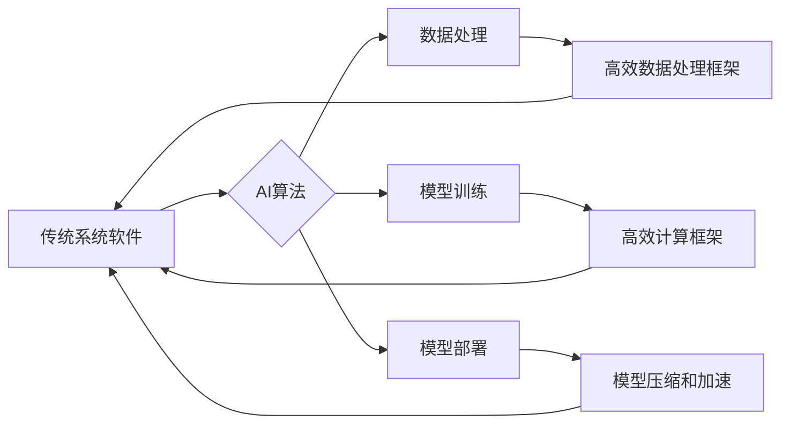

> 系统软件，人工智能，底层创新，机器学习，深度学习，神经网络，优化算法，云计算，安全

## 1. 背景介绍

随着人工智能（AI）技术的飞速发展，其应用场景不断拓展，从语音识别、图像处理到自然语言理解，AI已经渗透到我们生活的方方面面。然而，AI技术的广泛应用也对系统软件提出了新的挑战。传统的系统软件架构难以满足AI算法对计算资源、数据处理和模型部署的需求。因此，系统软件的AI底层创新成为推动AI技术发展和应用的关键。

传统的系统软件主要关注于效率、稳定性和安全性，而AI算法则更加注重学习能力、适应性以及泛化能力。两者在设计理念、功能需求和性能指标上存在着显著差异。为了更好地支持AI应用，系统软件需要进行一系列的底层创新，包括：

* **计算资源优化:** AI算法通常需要大量的计算资源，因此需要开发高效的计算框架和调度机制，以充分利用硬件资源，提高计算效率。
* **数据处理加速:** AI算法依赖于海量数据进行训练和推理，因此需要开发高效的数据处理和传输机制，以降低数据处理延迟，提高数据吞吐量。
* **模型部署优化:** AI模型通常体积庞大，部署到实际应用场景中需要考虑模型压缩、加速和高效的推理机制。
* **安全保障:** AI算法的安全性也需要得到保障，需要开发针对AI算法的安全性机制，防止恶意攻击和数据泄露。

## 2. 核心概念与联系

**2.1 核心概念**

* **人工智能 (AI):** 人工智能是指模拟人类智能行为的计算机系统。
* **深度学习 (Deep Learning):** 深度学习是一种机器学习的子领域，它使用多层神经网络来学习数据特征，并进行预测或分类。
* **神经网络 (Neural Network):** 神经网络是一种模仿人脑神经网络结构的计算模型，它由多个神经元组成，通过连接和权重来学习数据。
* **系统软件:** 系统软件是计算机硬件和应用程序之间桥梁的软件，它负责管理计算机资源和提供基础服务。

**2.2 核心概念联系**

AI技术的发展离不开系统软件的支持。系统软件为AI算法提供计算资源、数据处理和模型部署等基础设施，而AI算法则推动了系统软件的创新，使其更加智能化、高效化和安全化。

**2.3 架构图**



## 3. 核心算法原理 & 具体操作步骤

### 3.1 算法原理概述

深度学习算法的核心是神经网络，它通过多层神经元网络来学习数据特征。每个神经元接收来自前一层神经元的输入，并通过权重进行加权求和，然后经过激活函数进行非线性变换，输出到下一层神经元。通过不断调整神经网络的权重，使网络的输出与真实值之间的误差最小化，从而实现对数据的学习和预测。

### 3.2 算法步骤详解

1. **数据预处理:** 将原始数据进行清洗、转换和特征工程，使其适合深度学习算法的训练。
2. **网络结构设计:** 根据任务需求设计神经网络的结构，包括神经元的数量、连接方式和激活函数等。
3. **参数初始化:** 为神经网络的参数（权重和偏置）进行随机初始化。
4. **前向传播:** 将输入数据通过神经网络进行前向传播，计算网络的输出。
5. **损失函数计算:** 计算网络输出与真实值的误差，使用损失函数衡量误差的大小。
6. **反向传播:** 使用梯度下降算法反向传播误差，更新神经网络的参数。
7. **训练迭代:** 重复步骤4-6，直到网络的误差达到预设阈值。
8. **模型评估:** 使用测试数据评估模型的性能，例如准确率、召回率和F1-score等。

### 3.3 算法优缺点

**优点:**

* **学习能力强:** 深度学习算法能够自动学习数据特征，无需人工特征工程。
* **泛化能力强:** 深度学习模型能够对新的数据进行泛化，并进行预测。
* **应用范围广:** 深度学习算法可以应用于图像识别、语音识别、自然语言处理等多个领域。

**缺点:**

* **数据依赖性强:** 深度学习算法需要大量的训练数据才能达到良好的性能。
* **计算资源消耗大:** 深度学习算法的训练过程需要大量的计算资源。
* **可解释性差:** 深度学习模型的决策过程难以解释，难以理解模型的内部机制。

### 3.4 算法应用领域

深度学习算法已广泛应用于以下领域：

* **计算机视觉:** 图像识别、物体检测、图像分割、人脸识别等。
* **自然语言处理:** 文本分类、情感分析、机器翻译、对话系统等。
* **语音识别:** 语音转文本、语音助手等。
* **推荐系统:** 商品推荐、内容推荐等。
* **医疗诊断:** 病理图像分析、疾病预测等。

## 4. 数学模型和公式 & 详细讲解 & 举例说明

### 4.1 数学模型构建

深度学习算法的核心是神经网络，其数学模型可以表示为多层感知机（MLP）。

**4.1.1 单层感知机模型:**

假设输入向量为 **x** = (x1, x2, ..., xn)，权重向量为 **w** = (w1, w2, ..., wn)，偏置项为 b，激活函数为 f(x)，则单层感知机的输出为：

**y = f(w · x + b)**

其中，w · x 表示权重向量和输入向量的点积。

**4.1.2 多层感知机模型:**

多层感知机由多个单层感知机组成，每个单层感知机称为一个隐藏层。隐藏层之间的连接权重和偏置项也需要进行学习。

**4.1.3 损失函数:**

损失函数用于衡量模型预测值与真实值的误差。常用的损失函数包括均方误差（MSE）和交叉熵损失（Cross-Entropy Loss）。

**4.1.4 梯度下降算法:**

梯度下降算法用于更新神经网络的参数，使其能够最小化损失函数。

### 4.2 公式推导过程

**4.2.1 梯度计算:**

梯度表示损失函数在某个参数方向上的变化率。

**4.2.2 参数更新:**

参数更新公式为：

**w = w - α ∇L(w)**

其中，α 为学习率，∇L(w) 为损失函数对参数w的梯度。

### 4.3 案例分析与讲解

**4.3.1 MNIST 手写数字识别:**

MNIST 数据集包含 60,000 张手写数字图像，用于训练和测试深度学习模型。

**4.3.2 模型结构:**

可以使用一个简单的多层感知机模型，包含输入层、隐藏层和输出层。

**4.3.3 训练过程:**

使用梯度下降算法训练模型，并使用交叉熵损失函数衡量模型性能。

**4.3.4 评估结果:**

训练好的模型能够准确识别手写数字。

## 5. 项目实践：代码实例和详细解释说明

### 5.1 开发环境搭建

* **操作系统:** Ubuntu 20.04 LTS
* **编程语言:** Python 3.8
* **深度学习框架:** TensorFlow 2.0

### 5.2 源代码详细实现

```python
import tensorflow as tf

# 定义模型结构
model = tf.keras.models.Sequential([
    tf.keras.layers.Flatten(input_shape=(28, 28)),
    tf.keras.layers.Dense(128, activation='relu'),
    tf.keras.layers.Dense(10, activation='softmax')
])

# 编译模型
model.compile(optimizer='adam',
              loss='sparse_categorical_crossentropy',
              metrics=['accuracy'])

# 加载 MNIST 数据集
(x_train, y_train), (x_test, y_test) = tf.keras.datasets.mnist.load_data()

# 数据预处理
x_train = x_train.astype('float32') / 255
x_test = x_test.astype('float32') / 255

# 训练模型
model.fit(x_train, y_train, epochs=5)

# 评估模型
loss, accuracy = model.evaluate(x_test, y_test)
print('Test loss:', loss)
print('Test accuracy:', accuracy)
```

### 5.3 代码解读与分析

* **模型结构:** 模型结构由一个 Flatten 层、一个全连接层和一个输出层组成。
* **激活函数:** 使用 ReLU 激活函数，可以提高模型的学习能力。
* **损失函数:** 使用交叉熵损失函数，适合多分类问题。
* **优化器:** 使用 Adam 优化器，可以加速模型训练。
* **数据预处理:** 将图像数据归一化到 [0, 1] 范围内，可以提高模型的训练效率。

### 5.4 运行结果展示

训练完成后，模型能够准确识别手写数字。

## 6. 实际应用场景

### 6.1 智能客服

AI驱动的智能客服系统可以自动处理客户的咨询和问题，提高客户服务效率。

### 6.2 自动驾驶

AI算法可以用于自动驾驶汽车的感知、决策和控制，实现无人驾驶功能。

### 6.3 医疗诊断

AI算法可以辅助医生进行疾病诊断，提高诊断准确率和效率。

### 6.4 未来应用展望

随着AI技术的不断发展，其应用场景将更加广泛，例如：

* **个性化教育:** AI可以根据学生的学习情况提供个性化的学习方案。
* **精准医疗:** AI可以帮助医生制定个性化的治疗方案。
* **智能制造:** AI可以提高制造业的效率和自动化程度。

## 7. 工具和资源推荐

### 7.1 学习资源推荐

* **在线课程:** Coursera, edX, Udacity
* **书籍:** 深度学习，机器学习

### 7.2 开发工具推荐

* **深度学习框架:** TensorFlow, PyTorch, Keras
* **编程语言:** Python

### 7.3 相关论文推荐

* **ImageNet Classification with Deep Convolutional Neural Networks**
* **Attention Is All You Need**

## 8. 总结：未来发展趋势与挑战

### 8.1 研究成果总结

AI底层创新取得了显著成果，例如：

* **高效计算框架:** TensorFlow, PyTorch 等深度学习框架提供了高效的计算机制，加速了模型训练和推理。
* **模型压缩和加速:** 模型压缩和加速技术可以减小模型体积，提高推理速度。
* **安全保障机制:** 开发了针对AI算法的安全保障机制，防止恶意攻击和数据泄露。

### 8.2 未来发展趋势

* **更加高效的计算框架:** 探索新的计算架构和算法，提高计算效率。
* **更强大的模型:** 开发更强大的深度学习模型，提高模型的学习能力和泛化能力。
* **更广泛的应用场景:** 将AI技术应用到更多领域，例如医疗、教育、金融等。

### 8.3 面临的挑战

* **数据安全和隐私保护:** AI算法依赖于大量数据，如何保证数据安全和隐私保护是一个重要挑战。
* **算法可解释性:** 深度学习模型的决策过程难以解释，如何提高算法的可解释性是一个重要的研究方向。
* **伦理问题:** AI技术的应用可能带来一些伦理问题，例如算法偏见、工作岗位替代等，需要进行深入探讨和解决。

### 8.4 研究展望

未来，AI底层创新将继续推动