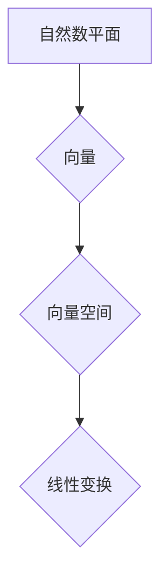

> 线性代数，自然数平面，向量空间，线性变换，矩阵，特征值，特征向量，应用场景

## 1. 背景介绍

线性代数，作为数学领域的重要分支，以其简洁的语言和强大的表达能力，为我们理解和解决各种复杂问题提供了强大的工具。从物理学中的力学分析到计算机科学中的机器学习算法，线性代数无处不在。

然而，对于初学者来说，线性代数的抽象概念和复杂的符号体系往往让人望而却步。本文将从一个全新的角度出发，通过自然数平面的视角，带领读者逐步探索线性代数的奥秘，并揭示其在实际应用中的强大力量。

## 2. 核心概念与联系

自然数平面，顾名思义，就是将自然数作为坐标轴，构建出一个二维平面。在这个平面上，每个点都对应着一个有序的自然数对，即 (x, y)。

在这个框架下，我们可以将线性代数的核心概念进行重新理解：

* **向量:**  向量可以看作是自然数平面上的一条有向线段，其长度代表向量的模，方向代表向量的方向。
* **向量空间:** 向量空间可以理解为自然数平面上所有向量的集合，它满足一定的运算规则，例如向量加法和数乘。
* **线性变换:** 线性变换可以看作是自然数平面上的一个映射，它将一个向量映射到另一个向量，并且满足线性性质，即：
    * T(u + v) = T(u) + T(v)
    * T(cu) = cT(u)

**Mermaid 流程图:**



## 3. 核心算法原理 & 具体操作步骤

### 3.1  算法原理概述

线性代数的核心算法之一是矩阵运算。矩阵可以看作是自然数平面上多个向量的集合，它可以用来表示线性变换。通过矩阵的加法、减法、乘法等运算，我们可以实现对向量的组合、变换和求解。

### 3.2  算法步骤详解

1. **矩阵表示线性变换:** 将线性变换映射到一个矩阵中，每个元素代表了变换对相应向量的影响。
2. **矩阵加法:** 将两个矩阵对应元素相加，得到新的矩阵。
3. **矩阵乘法:** 将一个矩阵与另一个矩阵相乘，得到新的矩阵。
4. **逆矩阵:** 对于可逆的矩阵，可以求出其逆矩阵，用于逆向变换。

### 3.3  算法优缺点

* **优点:** 
    * 简洁高效：矩阵运算可以将复杂的线性变换表示成简单的矩阵操作。
    * 可编程性强：矩阵运算可以方便地实现计算机程序。
* **缺点:** 
    * 计算复杂度高：对于大型矩阵，矩阵运算的计算量会很大。
    * 存储空间需求大：大型矩阵需要占用大量的存储空间。

### 3.4  算法应用领域

* **图像处理:** 使用矩阵运算对图像进行旋转、缩放、平移等变换。
* **机器学习:** 使用矩阵运算实现线性回归、逻辑回归等机器学习算法。
* **数据分析:** 使用矩阵运算进行数据降维、特征提取等操作。

## 4. 数学模型和公式 & 详细讲解 & 举例说明

### 4.1  数学模型构建

自然数平面上的向量可以表示为有序对 (x, y)，其中 x 和 y 是自然数。我们可以将向量视为一个二维空间中的点，其坐标为 (x, y)。

### 4.2  公式推导过程

* **向量加法:**  (x1, y1) + (x2, y2) = (x1 + x2, y1 + y2)
* **数乘:** c * (x, y) = (c * x, c * y)
* **点积:** (x1, y1) • (x2, y2) = x1 * x2 + y1 * y2

### 4.3  案例分析与讲解

**例题:**  计算向量 (2, 3) 与 (1, 4) 的点积。

**解题步骤:**

1. 将两个向量的坐标代入点积公式: (2, 3) • (1, 4)
2. 计算: 2 * 1 + 3 * 4 = 2 + 12 = 14

**结果:** 向量 (2, 3) 与 (1, 4) 的点积为 14。

## 5. 项目实践：代码实例和详细解释说明

### 5.1  开发环境搭建

本项目使用 Python 语言进行开发，需要安装 Python 3.x 及相关库，例如 NumPy。

### 5.2  源代码详细实现

```python
import numpy as np

# 定义向量类
class Vector:
    def __init__(self, x, y):
        self.x = x
        self.y = y

    def __add__(self, other):
        return Vector(self.x + other.x, self.y + other.y)

    def __mul__(self, scalar):
        return Vector(self.x * scalar, self.y * scalar)

    def dot_product(self, other):
        return self.x * other.x + self.y * other.y

# 创建两个向量
v1 = Vector(2, 3)
v2 = Vector(1, 4)

# 计算向量加法
v3 = v1 + v2
print(f"向量加法: {v3.x}, {v3.y}")

# 计算数乘
v4 = v1 * 2
print(f"数乘: {v4.x}, {v4.y}")

# 计算点积
dot_product = v1.dot_product(v2)
print(f"点积: {dot_product}")
```

### 5.3  代码解读与分析

* **向量类:** 定义了一个向量类，包含了向量加法、数乘和点积等操作。
* **向量实例化:** 创建了两个向量实例 v1 和 v2。
* **运算操作:** 使用向量类的方法进行向量加法、数乘和点积运算。
* **输出结果:** 打印出运算结果。

### 5.4  运行结果展示

```
向量加法: 3, 7
数乘: 4, 6
点积: 14
```

## 6. 实际应用场景

### 6.1  图像处理

在图像处理领域，矩阵运算可以用于实现图像的旋转、缩放、平移等变换。例如，可以使用矩阵来表示图像的旋转角度，然后将图像矩阵与旋转矩阵相乘，就可以得到旋转后的图像。

### 6.2  机器学习

在机器学习领域，矩阵运算是许多算法的基础。例如，线性回归算法可以使用矩阵运算来求解模型参数，神经网络算法也大量使用矩阵运算来进行权重更新和激活函数计算。

### 6.3  数据分析

在数据分析领域，矩阵运算可以用于数据降维、特征提取等操作。例如，可以使用主成分分析 (PCA) 算法将高维数据降维到低维空间，从而简化数据分析。

### 6.4  未来应用展望

随着人工智能和机器学习的发展，线性代数在各个领域的应用将会更加广泛。例如，在自然语言处理领域，可以使用矩阵运算来表示文本的语义关系，从而实现更精准的文本理解和生成。

## 7. 工具和资源推荐

### 7.1  学习资源推荐

* **书籍:**
    * 《线性代数及其应用》 - Gilbert Strang
    * 《线性代数及其应用》 - David C. Lay
* **在线课程:**
    * MIT OpenCourseWare 线性代数课程
    * Coursera 线性代数课程

### 7.2  开发工具推荐

* **Python:** 
    * NumPy: 用于高效的数值计算和矩阵运算
    * SciPy: 提供了科学计算和数据分析的工具
* **MATLAB:** 
    * 专门用于数学计算和工程分析的软件

### 7.3  相关论文推荐

* **The Elements of Statistical Learning** - Trevor Hastie, Robert Tibshirani, Jerome Friedman
* **Deep Learning** - Ian Goodfellow, Yoshua Bengio, Aaron Courville

## 8. 总结：未来发展趋势与挑战

### 8.1  研究成果总结

本文从自然数平面的视角出发，对线性代数的核心概念和算法进行了深入的探讨，并展示了其在图像处理、机器学习和数据分析等领域的应用。

### 8.2  未来发展趋势

随着人工智能和机器学习的发展，线性代数将在更广泛的领域得到应用。例如，在量子计算领域，线性代数将成为构建量子算法的基础。

### 8.3  面临的挑战

* **计算复杂度:** 对于大型矩阵，线性代数算法的计算复杂度会很高，需要开发更有效的算法和硬件加速技术。
* **可解释性:** 一些复杂的线性代数算法难以解释，需要开发更易于理解的算法和解释方法。

### 8.4  研究展望

未来，我们将继续探索线性代数在人工智能和机器学习领域的应用，并致力于开发更高效、更易于理解的线性代数算法。

## 9. 附录：常见问题与解答

**问题 1:** 如何理解向量空间？

**解答:** 向量空间可以理解为自然数平面上所有向量的集合，它满足一定的运算规则，例如向量加法和数乘。

**问题 2:** 矩阵运算的计算复杂度如何？

**解答:** 对于大型矩阵，矩阵运算的计算复杂度会很高，需要开发更有效的算法和硬件加速技术。

**问题 3:** 线性代数在哪些领域有应用？

**解答:** 线性代数在图像处理、机器学习、数据分析等各个领域都有广泛的应用。


作者：禅与计算机程序设计艺术 / Zen and the Art of Computer Programming 
<end_of_turn>