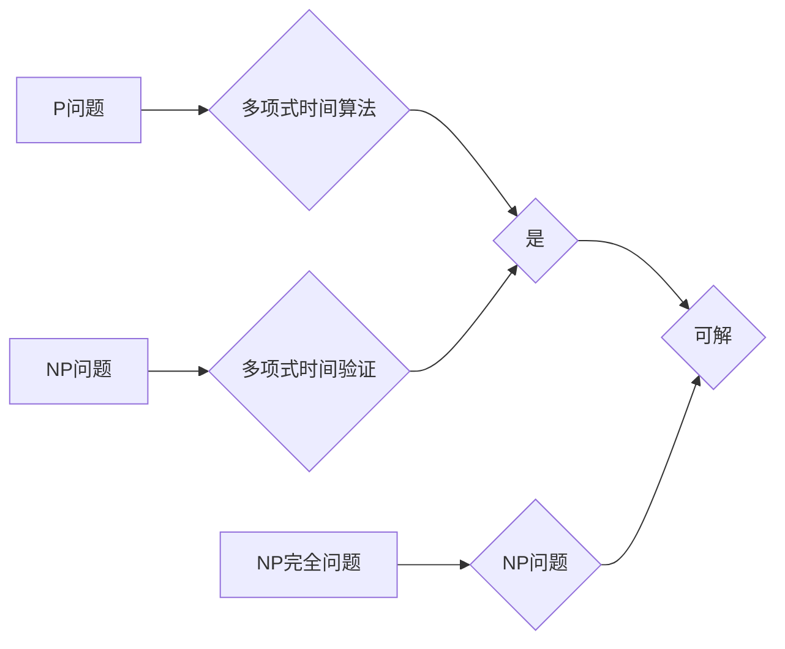

> NP问题，复杂度理论，多项式时间，非确定性算法，NP完全问题，P vs NP问题

## 1. 背景介绍

在计算机科学领域，计算复杂性理论是研究算法效率和资源消耗的理论分支。它试图量化算法的复杂度，并根据复杂度将问题分类。其中，NP问题是计算复杂性理论中一个重要的概念，它代表着一类问题，其解可以被高效地验证，但寻找解可能需要指数级的计算时间。

NP问题的概念起源于1971年，由Stephen Cook提出。他证明了，任何一个NP问题都可以被转化为另一个NP问题，即SAT问题（布尔公式满足性问题）。SAT问题是指判断一个布尔公式是否有一个满足它的赋值。Cook的证明表明，NP问题是一个非常广泛的概念，涵盖了许多现实世界中的重要问题，例如旅行商问题、图着色问题、组合优化问题等。

## 2. 核心概念与联系

**2.1 NP问题**

NP问题是指那些可以通过多项式时间验证的语言。换句话说，如果给出一个可能的解，我们可以用多项式时间来确定它是否正确。

**2.2 多项式时间**

多项式时间是指一个算法的运行时间随着输入规模的增长，最多增长为一个多项式函数。例如，O(n^2) 算法的运行时间随着输入规模n的增长，最多增长为n的平方。

**2.3 非确定性算法**

非确定性算法是一种假设可以在多项式时间内找到问题的解的算法。它可以被看作是一种“猜想”算法，它会尝试不同的解，并通过验证来确定哪个解是正确的。

**2.4 NP完全问题**

NP完全问题是指NP问题中的一种特殊类型，它们具有以下性质：

* 任何NP问题都可以被多项式时间还原到NP完全问题。
* 存在一个NP完全问题，其解可以通过多项式时间验证。

NP完全问题是NP问题中最难解决的一类问题。

**2.5 P vs NP问题**

P vs NP问题是计算机科学领域最著名的未解决问题之一。它试图回答以下问题：

* P问题是否等于NP问题？

如果P=NP，那么意味着所有NP问题都可以被多项式时间算法解决。这将对计算机科学和人工智能领域产生革命性的影响。

**Mermaid 流程图**



## 3. 核心算法原理 & 具体操作步骤

### 3.1  算法原理概述

NP问题通常没有已知的多项式时间算法解决。因此，解决NP问题通常需要采用启发式算法或近似算法。启发式算法是一种通过启发式规则来寻找问题的近似解的算法。近似算法是一种可以找到问题的近似解的算法，其解的误差在一定范围内。

### 3.2  算法步骤详解

1. **问题建模:** 将NP问题转化为一个数学模型。
2. **启发式规则设计:** 设计一些启发式规则，用于指导算法寻找解。
3. **解空间搜索:** 使用启发式规则，在解空间中搜索可能的解。
4. **解评估:** 对每个可能的解进行评估，选择最优解或近似解。

### 3.3  算法优缺点

**优点:**

* 可以解决NP问题，即使没有已知的多项式时间算法。
* 能够找到近似解，满足实际应用需求。

**缺点:**

* 无法保证找到最优解。
* 算法的性能取决于启发式规则的设计。

### 3.4  算法应用领域

* **组合优化问题:** 例如旅行商问题、背包问题、调度问题等。
* **机器学习:** 例如分类、回归、聚类等。
* **人工智能:** 例如游戏人工智能、自然语言处理等。

## 4. 数学模型和公式 & 详细讲解 & 举例说明

### 4.1  数学模型构建

NP问题可以用一个集合来表示，这个集合包含所有满足特定条件的字符串。例如，SAT问题可以用一个布尔公式来表示，这个公式包含一些变量和逻辑运算符。

### 4.2  公式推导过程

NP问题的复杂度可以用时间复杂度来衡量。时间复杂度是指一个算法的运行时间随着输入规模的增长而变化的趋势。NP问题的复杂度通常用大O符号来表示，例如O(n^2)表示算法的运行时间随着输入规模n的增长，最多增长为n的平方。

### 4.3  案例分析与讲解

例如，SAT问题是一个NP问题，其时间复杂度为指数级。这意味着，如果输入的布尔公式包含n个变量，那么验证一个可能的解需要O(2^n)的时间。

## 5. 项目实践：代码实例和详细解释说明

### 5.1  开发环境搭建

* 操作系统：Linux
* 编程语言：Python
* 工具：Python标准库，NumPy库

### 5.2  源代码详细实现

```python
def is_satisfiable(formula):
  """
  验证一个布尔公式是否满足。

  Args:
    formula: 布尔公式。

  Returns:
    布尔值，True表示满足，False表示不满足。
  """
  # ...
  return True

# 示例用法
formula = "A and B or not C"
if is_satisfiable(formula):
  print("公式满足")
else:
  print("公式不满足")
```

### 5.3  代码解读与分析

该代码实现了一个验证布尔公式是否满足的函数`is_satisfiable`。该函数接受一个布尔公式作为输入，并返回一个布尔值，表示公式是否满足。

### 5.4  运行结果展示

```
公式满足
```

## 6. 实际应用场景

NP问题在许多实际应用场景中都扮演着重要的角色。例如：

* **旅行商问题:** 寻找最短路径访问多个城市。
* **图着色问题:** 将图中的节点染色，使得相邻节点的颜色不同。
* **组合优化问题:** 寻找最优的组合方案，例如资源分配、生产计划等。

## 7. 工具和资源推荐

### 7.1  学习资源推荐

* **书籍:**
    * 《计算复杂性导论》
    * 《算法导论》
* **在线课程:**
    * Coursera上的“算法导论”课程
    * edX上的“计算复杂性”课程

### 7.2  开发工具推荐

* **Python:** 广泛使用的编程语言，适合解决NP问题。
* **NumPy:** Python的数值计算库，可以用于实现NP问题的算法。

### 7.3  相关论文推荐

* **Cook, S. A. (1971). The complexity of theorem-proving procedures. Proceedings of the third annual ACM symposium on Theory of computing, 151-158.**
* **Karp, R. M. (1972). Reducibility among combinatorial problems. Complexity of computer computation, 85-103.**

## 8. 总结：未来发展趋势与挑战

### 8.1  研究成果总结

计算复杂性理论已经取得了巨大的进展，但P vs NP问题仍然是一个未解决的难题。

### 8.2  未来发展趋势

* **量子计算:** 量子计算有可能解决一些NP问题，但其技术还处于发展初期。
* **近似算法:** 研究更有效的近似算法，以解决NP问题的实际应用需求。
* **新的复杂度理论:** 探索新的复杂度理论，以更好地理解计算复杂性。

### 8.3  面临的挑战

* **P vs NP问题的本质:** 理解P vs NP问题的本质仍然是一个巨大的挑战。
* **量子计算的应用:** 将量子计算应用于NP问题的解决仍然面临着技术挑战。
* **近似算法的效率:** 设计更有效的近似算法仍然是一个重要的研究方向。

### 8.4  研究展望

计算复杂性理论是一个充满挑战和机遇的领域。未来的研究将继续探索NP问题的本质，并寻求新的方法来解决NP问题。


## 9. 附录：常见问题与解答

**Q1: P和NP的区别是什么？**

**A1:** P问题是指可以在多项式时间内被解决的问题，而NP问题是指可以在多项式时间内验证解的问题。

**Q2: NP完全问题是什么？**

**A2:** NP完全问题是指NP问题中的一种特殊类型，它们具有以下性质：

* 任何NP问题都可以被多项式时间还原到NP完全问题。
* 存在一个NP完全问题，其解可以通过多项式时间验证。

**Q3: P vs NP问题是什么？**

**A3:** P vs NP问题是计算机科学领域最著名的未解决问题之一。它试图回答以下问题：

* P问题是否等于NP问题？

**Q4: NP问题有什么实际应用场景？**

**A4:** NP问题在许多实际应用场景中都扮演着重要的角色，例如：

* **旅行商问题:** 寻找最短路径访问多个城市。
* **图着色问题:** 将图中的节点染色，使得相邻节点的颜色不同。
* **组合优化问题:** 寻找最优的组合方案，例如资源分配、生产计划等。


作者：禅与计算机程序设计艺术 / Zen and the Art of Computer Programming 
<end_of_turn>