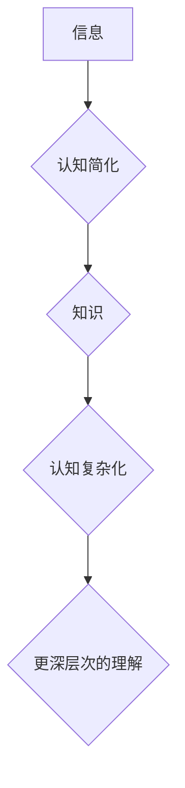

> 认知简化, 复杂化, 人工智能, 深度学习, 算法, 模型, 应用场景, 未来趋势

## 1. 背景介绍

在信息爆炸的时代，人类面临着海量数据的处理和理解挑战。如何有效地从复杂的信息中提取知识，简化认知过程，是人工智能领域的核心问题之一。认知简化与复杂化是人类认知的两个基本过程，它们相互关联，共同构成了我们理解世界的机制。

认知简化是指将复杂的信息转化为更易理解、更简洁的形式，例如将大量数据抽象成模型，将复杂的逻辑关系简化为规则。认知复杂化则是将简单的信息进行扩展和丰富，例如将已有的知识应用到新的领域，将抽象的概念具体化。

人工智能的发展离不开对认知简化与复杂化过程的理解和模拟。深度学习算法的出现，为认知简化提供了强大的工具，它能够从海量数据中自动学习特征，构建复杂的模型，从而简化人类的认知负担。然而，深度学习模型的复杂性也带来了新的挑战，例如模型的可解释性、泛化能力等问题。

## 2. 核心概念与联系

**2.1 认知简化**

认知简化是将复杂的信息转化为更易理解、更简洁的形式，其核心目标是降低认知负担，提高信息处理效率。

**2.2 认知复杂化**

认知复杂化是指将简单的信息进行扩展和丰富，其核心目标是加深对事物的理解，拓展知识范围。

**2.3 认知简化与复杂化的关系**

认知简化与复杂化是相互关联、相互促进的两个过程。认知简化为认知复杂化提供了基础，而认知复杂化又推动了认知简化的发展。

**2.4 认知简化与复杂化的模型**

我们可以用一个简单的模型来描述认知简化与复杂化的过程：



**2.5 认知简化与复杂化的应用场景**

认知简化与复杂化在各个领域都有广泛的应用，例如：

* **人工智能:** 深度学习算法通过认知简化，从海量数据中学习特征，构建复杂的模型。
* **自然语言处理:** 机器翻译、文本摘要等任务都需要通过认知简化和复杂化来处理语言信息。
* **图像识别:** 图像识别算法需要将图像信息简化为特征，并进行复杂化的推理，才能识别出目标物体。

## 3. 核心算法原理 & 具体操作步骤

### 3.1 算法原理概述

**3.1.1 深度学习算法**

深度学习算法是一种基于人工神经网络的机器学习算法，它能够从数据中自动学习特征，构建复杂的模型。深度学习算法的核心思想是通过多层神经网络，将输入数据逐步抽象，最终得到最终的输出结果。

**3.1.2 认知简化与复杂化在深度学习中的应用**

在深度学习中，认知简化与复杂化分别对应于特征提取和模型构建两个阶段。

* **特征提取:** 深度学习算法通过多层神经网络，将原始数据进行逐步抽象，提取出更具代表性的特征。
* **模型构建:** 通过连接多个特征提取层，构建复杂的模型，能够对复杂的信息进行处理和理解。

### 3.2 算法步骤详解

**3.2.1 数据预处理**

首先需要对原始数据进行预处理，例如数据清洗、数据归一化等操作，以提高算法的训练效率和准确性。

**3.2.2 网络结构设计**

根据任务需求，设计合适的深度学习网络结构，例如卷积神经网络、循环神经网络等。

**3.2.3 训练模型**

使用训练数据训练深度学习模型，通过调整模型参数，使模型能够准确地预测输出结果。

**3.2.4 模型评估**

使用测试数据评估模型的性能，例如准确率、召回率等指标。

**3.2.5 模型部署**

将训练好的模型部署到实际应用场景中，例如图像识别、自然语言处理等。

### 3.3 算法优缺点

**3.3.1 优点**

* **自动特征提取:** 深度学习算法能够自动学习特征，无需人工特征工程。
* **高准确率:** 深度学习算法在许多任务中能够达到很高的准确率。
* **可扩展性:** 深度学习算法可以处理海量数据，并可以扩展到更复杂的模型。

**3.3.2 缺点**

* **数据依赖:** 深度学习算法需要大量的训练数据，否则性能会下降。
* **训练时间长:** 深度学习模型的训练时间通常较长。
* **可解释性差:** 深度学习模型的内部机制难以理解，难以解释模型的决策结果。

### 3.4 算法应用领域

深度学习算法在各个领域都有广泛的应用，例如：

* **计算机视觉:** 图像识别、目标检测、图像分割等。
* **自然语言处理:** 机器翻译、文本摘要、情感分析等。
* **语音识别:** 语音转文本、语音合成等。
* **医疗诊断:** 病理图像分析、疾病预测等。
* **金融分析:** 欺诈检测、风险评估等。

## 4. 数学模型和公式 & 详细讲解 & 举例说明

### 4.1 数学模型构建

**4.1.1 神经网络模型**

神经网络模型是一种模仿人脑神经网络结构的数学模型。它由多个神经元组成，每个神经元接收来自其他神经元的输入信号，并通过激活函数进行处理，输出到下一个神经元。

**4.1.2 激活函数**

激活函数是神经网络中一个重要的组成部分，它决定了神经元的输出信号。常见的激活函数包括 sigmoid 函数、ReLU 函数、tanh 函数等。

**4.1.3 损失函数**

损失函数用于衡量模型预测结果与真实结果之间的差异。常见的损失函数包括均方误差、交叉熵等。

### 4.2 公式推导过程

**4.2.1 反向传播算法**

反向传播算法是深度学习模型训练的核心算法，它用于更新模型参数，使模型的预测结果更加准确。

**4.2.2 梯度下降法**

梯度下降法是一种常用的优化算法，它用于更新模型参数，使损失函数的值最小化。

### 4.3 案例分析与讲解

**4.3.1 图像分类案例**

使用卷积神经网络对图像进行分类，例如识别猫和狗的图片。

**4.3.2 文本生成案例**

使用循环神经网络生成文本，例如写诗、写故事等。

## 5. 项目实践：代码实例和详细解释说明

### 5.1 开发环境搭建

使用 Python 语言和 TensorFlow 或 PyTorch 深度学习框架进行开发。

### 5.2 源代码详细实现

```python
# 导入必要的库
import tensorflow as tf

# 定义模型结构
model = tf.keras.models.Sequential([
    tf.keras.layers.Conv2D(32, (3, 3), activation='relu', input_shape=(28, 28, 1)),
    tf.keras.layers.MaxPooling2D((2, 2)),
    tf.keras.layers.Conv2D(64, (3, 3), activation='relu'),
    tf.keras.layers.MaxPooling2D((2, 2)),
    tf.keras.layers.Flatten(),
    tf.keras.layers.Dense(10, activation='softmax')
])

# 编译模型
model.compile(optimizer='adam',
              loss='sparse_categorical_crossentropy',
              metrics=['accuracy'])

# 训练模型
model.fit(x_train, y_train, epochs=5)

# 评估模型
loss, accuracy = model.evaluate(x_test, y_test)
print('Test loss:', loss)
print('Test accuracy:', accuracy)
```

### 5.3 代码解读与分析

* **模型结构:** 代码定义了一个简单的卷积神经网络模型，用于图像分类任务。
* **编译模型:** 使用 Adam 优化器、交叉熵损失函数和准确率指标编译模型。
* **训练模型:** 使用训练数据训练模型，训练 epochs 次。
* **评估模型:** 使用测试数据评估模型的性能。

### 5.4 运行结果展示

训练完成后，可以查看模型的训练和测试准确率，以及损失函数的变化趋势。

## 6. 实际应用场景

### 6.1 图像识别

深度学习算法在图像识别领域取得了突破性的进展，例如人脸识别、物体检测、场景理解等。

### 6.2 自然语言处理

深度学习算法在自然语言处理领域也取得了显著的成果，例如机器翻译、文本摘要、情感分析等。

### 6.3 语音识别

深度学习算法可以用于语音识别、语音合成等任务，例如将语音转换为文本、将文本转换为语音。

### 6.4 未来应用展望

随着深度学习算法的不断发展，其应用场景将更加广泛，例如：

* **自动驾驶:** 深度学习算法可以用于感知周围环境、规划路径、控制车辆等。
* **医疗诊断:** 深度学习算法可以辅助医生进行疾病诊断、预测患者病情等。
* **个性化推荐:** 深度学习算法可以根据用户的兴趣爱好，推荐个性化的商品、服务等。

## 7. 工具和资源推荐

### 7.1 学习资源推荐

* **书籍:**
    * 深度学习
    * 人工智能：一个现代方法
* **在线课程:**
    * Coursera 深度学习课程
    * Udacity 深度学习工程师 Nanodegree

### 7.2 开发工具推荐

* **Python:** 深度学习开发的主要编程语言。
* **TensorFlow:** Google 开发的开源深度学习框架。
* **PyTorch:** Facebook 开发的开源深度学习框架。

### 7.3 相关论文推荐

* **AlexNet:** ImageNet Classification with Deep Convolutional Neural Networks
* **VGGNet:** Very Deep Convolutional Networks for Large-Scale Image Recognition
* **ResNet:** Deep Residual Learning for Image Recognition

## 8. 总结：未来发展趋势与挑战

### 8.1 研究成果总结

认知简化与复杂化是人工智能领域的核心问题，深度学习算法为认知简化提供了强大的工具。

### 8.2 未来发展趋势

* **模型解释性:** 研究更可解释的深度学习模型，以便更好地理解模型的决策过程。
* **数据效率:** 研究更有效的训练方法，减少对大量训练数据的依赖。
* **跨模态学习:** 研究能够处理多种模态数据（例如文本、图像、音频）的深度学习模型。

### 8.3 面临的挑战

* **数据安全:** 深度学习模型的训练需要大量数据，如何保证数据的安全和隐私是一个重要的挑战。
* **算法公平性:** 深度学习模型可能存在偏见，如何确保算法的公平性和公正性是一个重要的研究方向。
* **伦理问题:** 深度学习技术的应用可能带来一些伦理问题，例如人工智能的责任和义务等，需要进行深入的探讨和研究。

### 8.4 研究展望

未来，认知简化与复杂化将继续是人工智能领域的重要研究方向。随着技术的不断发展，我们相信深度学习算法将能够更好地模拟人类的认知过程，为我们带来更多便利和福祉。

## 9. 附录：常见问题与解答

**9.1 深度学习模型为什么需要大量的训练数据？**

深度学习模型需要大量的训练数据来学习特征，因为模型的复杂度很高，需要大量的样本才能保证模型能够泛化到新的数据上。

**9.2 如何评估深度学习模型的性能？**

常用的评估指标包括准确率、召回率、F1-score等。

**9.3 如何解决深度学习模型的可解释性问题？**

目前，一些研究方法可以提高深度学习模型的可解释性，例如：

* **梯度分析:** 分析模型参数对输出的影响。
* **注意力机制:** 突出模型在处理输入数据时关注的区域。
* **局部