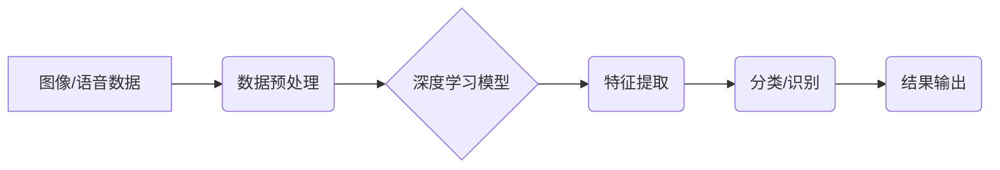

> 软件 2.0, 图像识别, 语音识别, 深度学习, 计算机视觉, 自然语言处理, 算法原理, 应用场景, 未来趋势

## 1. 背景介绍

软件 2.0 时代正在到来，它标志着软件从传统的基于规则的编程向数据驱动、智能化的方向发展。深度学习作为软件 2.0 的核心技术之一，正在深刻地改变着我们与世界交互的方式。其中，图像识别和语音识别作为深度学习的代表性应用，在各个领域展现出巨大的潜力。

传统的图像识别和语音识别技术主要依赖于人工设计的规则和特征提取方法，效率低、准确率有限。而深度学习通过构建多层神经网络，能够自动学习图像和语音的特征，从而实现更准确、更智能的识别。

## 2. 核心概念与联系

**2.1 图像识别与语音识别**

图像识别是指计算机能够理解和解释图像内容的技术，包括物体识别、场景理解、图像分类等。语音识别是指计算机能够将语音信号转换为文本的技术，包括语音转文本、语音识别、语音合成等。

**2.2 深度学习**

深度学习是一种机器学习的子领域，它利用多层神经网络来模拟人类大脑的学习过程。深度学习模型能够自动学习数据中的复杂特征，从而实现更准确的预测和识别。

**2.3 核心概念架构**



## 3. 核心算法原理 & 具体操作步骤

**3.1 算法原理概述**

深度学习算法的核心是多层神经网络。神经网络由多个节点（神经元）组成，每个节点都连接着其他节点，并通过权重来控制信息传递。通过训练神经网络，可以调整权重，使网络能够学习数据中的特征。

**3.2 算法步骤详解**

1. **数据预处理:** 将图像或语音数据转换为深度学习模型可以理解的格式，例如将图像转换为像素矩阵，将语音信号转换为音频特征。
2. **模型构建:** 选择合适的深度学习模型架构，例如卷积神经网络（CNN）用于图像识别，循环神经网络（RNN）用于语音识别。
3. **模型训练:** 使用训练数据训练深度学习模型，通过调整模型参数，使模型能够准确地识别图像或语音。
4. **模型评估:** 使用测试数据评估模型的性能，例如准确率、召回率、F1-score等。
5. **模型部署:** 将训练好的模型部署到实际应用场景中，例如将图像识别模型部署到手机应用中，将语音识别模型部署到智能家居设备中。

**3.3 算法优缺点**

**优点:**

* **高准确率:** 深度学习算法能够学习数据中的复杂特征，从而实现更高的识别准确率。
* **自动化特征提取:** 深度学习模型能够自动学习特征，无需人工设计特征，简化了开发过程。
* **泛化能力强:** 深度学习模型能够泛化到新的数据，即使是未见过的图像或语音也能进行识别。

**缺点:**

* **数据依赖:** 深度学习算法需要大量的训练数据才能达到较高的准确率。
* **计算资源消耗大:** 训练深度学习模型需要大量的计算资源，例如GPU。
* **模型解释性差:** 深度学习模型的内部工作机制比较复杂，难以解释模型的决策过程。

**3.4 算法应用领域**

* **图像识别:** 物体检测、人脸识别、图像分类、医学图像分析等。
* **语音识别:** 语音转文本、语音助手、语音搜索、语音控制等。
* **自然语言处理:** 文本分类、情感分析、机器翻译、聊天机器人等。

## 4. 数学模型和公式 & 详细讲解 & 举例说明

**4.1 数学模型构建**

深度学习模型通常使用神经网络来构建数学模型。神经网络由多个层组成，每一层包含多个神经元。每个神经元接收来自上一层的输入信号，并通过激活函数进行处理，输出到下一层。

**4.2 公式推导过程**

深度学习模型的训练过程是通过反向传播算法来进行的。反向传播算法的核心是计算模型输出与真实值的误差，并根据误差反向传播，调整模型参数。

**损失函数:** 用于衡量模型预测结果与真实值的差异。常见的损失函数包括均方误差（MSE）、交叉熵损失（Cross-Entropy Loss）等。

**梯度下降:** 用于更新模型参数的方法。梯度下降算法通过计算损失函数的梯度，沿着梯度方向调整模型参数，以最小化损失函数的值。

**4.3 案例分析与讲解**

以图像分类为例，假设我们有一个包含猫和狗的图像数据集。我们使用卷积神经网络（CNN）来构建图像分类模型。

1. **数据预处理:** 将图像数据转换为合适的格式，例如将图像尺寸调整为224x224像素。
2. **模型构建:** 使用CNN架构构建模型，包括卷积层、池化层、全连接层等。
3. **模型训练:** 使用训练数据训练模型，并使用交叉熵损失函数和梯度下降算法来更新模型参数。
4. **模型评估:** 使用测试数据评估模型的准确率。

## 5. 项目实践：代码实例和详细解释说明

**5.1 开发环境搭建**

* Python 3.x
* TensorFlow 或 PyTorch 深度学习框架
* CUDA 和 cuDNN（可选，用于GPU加速）

**5.2 源代码详细实现**

```python
import tensorflow as tf

# 定义模型架构
model = tf.keras.models.Sequential([
    tf.keras.layers.Conv2D(32, (3, 3), activation='relu', input_shape=(224, 224, 3)),
    tf.keras.layers.MaxPooling2D((2, 2)),
    tf.keras.layers.Conv2D(64, (3, 3), activation='relu'),
    tf.keras.layers.MaxPooling2D((2, 2)),
    tf.keras.layers.Flatten(),
    tf.keras.layers.Dense(10, activation='softmax')
])

# 编译模型
model.compile(optimizer='adam',
              loss='sparse_categorical_crossentropy',
              metrics=['accuracy'])

# 训练模型
model.fit(x_train, y_train, epochs=10)

# 评估模型
loss, accuracy = model.evaluate(x_test, y_test)
print('Test loss:', loss)
print('Test accuracy:', accuracy)
```

**5.3 代码解读与分析**

* 代码首先定义了卷积神经网络的模型架构，包括卷积层、池化层和全连接层。
* 然后，模型被编译，指定了优化器、损失函数和评估指标。
* 接着，模型使用训练数据进行训练，训练过程持续多个epochs。
* 最后，模型使用测试数据进行评估，并打印出测试损失和准确率。

**5.4 运行结果展示**

训练完成后，模型的准确率会随着训练epochs的增加而提高。最终的准确率取决于训练数据、模型架构和训练参数等因素。

## 6. 实际应用场景

**6.1 图像识别应用场景**

* **人脸识别:** 用于身份验证、安全监控、人脸搜索等。
* **物体检测:** 用于自动驾驶、机器人视觉、安防监控等。
* **医学图像分析:** 用于疾病诊断、肿瘤检测、器官分割等。

**6.2 语音识别应用场景**

* **语音助手:** 例如 Siri、Alexa、Google Assistant 等。
* **语音搜索:** 例如语音搜索引擎、语音控制等。
* **语音翻译:** 例如实时语音翻译、语音字幕等。

**6.3 未来应用展望**

* **更精准的识别:** 深度学习算法将继续提高识别精度，实现更精准的图像和语音识别。
* **更广泛的应用场景:** 深度学习技术将应用于更多领域，例如医疗、教育、金融等。
* **更智能的交互:** 深度学习将使人与机器的交互更加智能和自然。

## 7. 工具和资源推荐

**7.1 学习资源推荐**

* **书籍:**
    * 深度学习
    * 构建深度学习模型
* **在线课程:**
    * Coursera 深度学习课程
    * Udacity 深度学习工程师 Nanodegree

**7.2 开发工具推荐**

* **TensorFlow:** 开源深度学习框架，支持多种硬件平台。
* **PyTorch:** 开源深度学习框架，以其灵活性和易用性而闻名。
* **Keras:** 高级深度学习API，可以运行在TensorFlow、Theano或CNTK后端。

**7.3 相关论文推荐**

* AlexNet: ImageNet Classification with Deep Convolutional Neural Networks
* VGGNet: Very Deep Convolutional Networks for Large-Scale Image Recognition
* ResNet: Deep Residual Learning for Image Recognition

## 8. 总结：未来发展趋势与挑战

**8.1 研究成果总结**

深度学习在图像识别和语音识别领域取得了显著的成果，大幅提高了识别精度，并推动了这些技术的广泛应用。

**8.2 未来发展趋势**

* **模型更深更广:** 研究更深层次、更广阔的网络架构，以提高识别精度和泛化能力。
* **数据更丰富更智能:** 利用更多数据和更智能的数据标注方法，提高模型训练质量。
* **模型更解释性更可控:** 研究更可解释、更可控的深度学习模型，提高模型透明度和安全性。

**8.3 面临的挑战**

* **数据获取和标注:** 深度学习模型需要大量的训练数据，数据获取和标注成本较高。
* **计算资源需求:** 训练深度学习模型需要大量的计算资源，成本较高。
* **模型解释性和安全性:** 深度学习模型的内部工作机制比较复杂，难以解释模型的决策过程，也存在安全风险。

**8.4 研究展望**

未来，深度学习技术将继续发展，在图像识别和语音识别领域取得更大的突破，并应用于更多领域，为人类社会带来更多便利和福祉。

## 9. 附录：常见问题与解答

**9.1 如何选择合适的深度学习框架？**

选择深度学习框架需要根据具体项目需求和个人经验进行选择。TensorFlow 和 PyTorch 是目前最流行的深度学习框架，各有优缺点。

**9.2 如何处理图像数据？**

图像数据需要进行预处理，例如调整尺寸、归一化等，以使其适合深度学习模型的输入。

**9.3 如何评估深度学习模型的性能？**

常用的评估指标包括准确率、召回率、F1-score等。

**9.4 如何部署深度学习模型？**

深度学习模型可以部署到服务器、云平台、移动设备等平台。

作者：禅与计算机程序设计艺术 / Zen and the Art of Computer Programming


<end_of_turn>