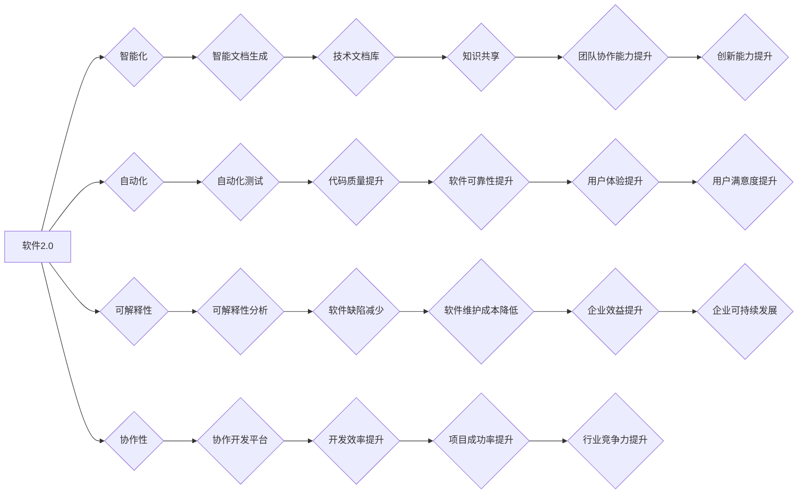

> 软件2.0, 技术文档, 新范式, 人工智能, 自动化, 可解释性, 协作, 知识图谱, 元数据

## 1. 背景介绍

软件开发行业正处于一个前所未有的变革时期。随着人工智能 (AI)、自动化和云计算等技术的快速发展，传统的软件开发模式和技术文档体系面临着越来越大的挑战。传统的技术文档往往以静态、单向、难以理解的形式存在，难以满足现代软件开发的动态、协作和知识共享的需求。

软件2.0 作为一种新的软件开发范式，强调智能化、自动化、可解释性和协作性。它将人工智能技术融入到软件开发的全生命周期中，从需求分析、设计、开发、测试到部署和维护，旨在提高软件开发效率、质量和可维护性。

技术文档作为软件开发的重要组成部分，也需要适应软件2.0 的发展趋势，进行相应的革新。传统的技术文档体系需要向更加智能化、自动化、可解释性和协作性的方向发展，以更好地支持软件2.0 的开发和维护。

## 2. 核心概念与联系

**2.1 软件2.0 的核心概念**

* **智能化:** 利用人工智能技术，例如机器学习和自然语言处理，自动生成代码、测试用例、文档等，提高开发效率。
* **自动化:** 通过自动化工具和流程，简化重复性任务，例如代码构建、测试和部署，降低开发成本。
* **可解释性:** 使软件的决策过程更加透明和可理解，方便开发人员进行调试和维护。
* **协作性:** 通过协作平台和工具，促进开发团队成员之间的沟通和协作，提高开发效率和质量。

**2.2 技术文档新范式的核心概念**

* **动态化:** 技术文档不再是静态的文本文件，而是可以根据需求动态生成和更新的知识库。
* **交互式:** 技术文档可以支持用户交互，例如搜索、提问和讨论，提供更丰富的学习体验。
* **个性化:** 技术文档可以根据用户的角色、权限和需求进行个性化定制，提供更精准的信息。
* **可搜索性:** 技术文档可以利用人工智能技术进行智能搜索，帮助用户快速找到所需的信息。

**2.3 核心概念联系**

软件2.0 的核心概念与技术文档新范式的核心概念相互关联，共同推动技术文档的革新。例如，软件2.0 中的智能化和自动化可以帮助生成更准确、更全面的技术文档；而技术文档新范式的动态化和交互式性可以更好地支持软件2.0 的开发和维护。

**Mermaid 流程图**



## 3. 核心算法原理 & 具体操作步骤

**3.1 算法原理概述**

技术文档新范式的核心算法原理主要包括：

* **自然语言处理 (NLP):** 用于理解和生成自然语言文本，例如自动生成技术文档、提取关键信息、进行文本摘要等。
* **机器学习 (ML):** 用于从数据中学习模式和规律，例如预测用户需求、推荐相关文档、自动生成代码等。
* **知识图谱 (KG):** 用于构建和管理知识的结构化表示，例如将技术文档中的知识点进行关联和组织，方便用户查询和理解。

**3.2 算法步骤详解**

1. **数据收集和预处理:** 收集各种类型的技术文档数据，例如代码、文档、论坛讨论等，并进行清洗、格式化和标注等预处理工作。
2. **知识图谱构建:** 利用 NLP 和 ML 算法，从技术文档数据中提取知识点，构建知识图谱，并进行关联和组织。
3. **智能文档生成:** 利用 NLP 和 ML 算法，根据用户需求和知识图谱信息，自动生成个性化、动态化的技术文档。
4. **交互式体验:** 利用交互式技术，例如搜索、提问和讨论，提供更丰富的技术文档学习体验。
5. **持续更新和改进:** 利用用户反馈和数据分析，不断更新和改进技术文档内容和算法模型。

**3.3 算法优缺点**

**优点:**

* **提高效率:** 自动化生成和更新技术文档，节省开发人员的时间和精力。
* **提升质量:** 利用人工智能技术，生成更准确、更全面的技术文档。
* **增强可理解性:** 通过可解释性分析，帮助用户更好地理解软件的决策过程。
* **促进协作:** 提供协作平台和工具，促进开发团队成员之间的沟通和协作。

**缺点:**

* **数据依赖:** 算法性能依赖于高质量的数据，数据不足或质量差会导致算法效果下降。
* **解释性问题:** 一些人工智能算法的决策过程难以解释，可能导致用户难以理解和信任。
* **技术门槛:** 需要一定的技术知识和经验才能开发和维护人工智能技术驱动的技术文档系统。

**3.4 算法应用领域**

* **软件开发:** 自动生成代码注释、API 文档、用户手册等。
* **软件测试:** 自动生成测试用例、测试报告等。
* **软件维护:** 自动识别和修复软件缺陷、提供软件维护建议等。
* **教育培训:** 提供个性化、交互式的软件开发培训课程。

## 4. 数学模型和公式 & 详细讲解 & 举例说明

**4.1 数学模型构建**

技术文档新范式的核心算法模型可以抽象为一个知识图谱构建和推理模型。该模型主要包括以下几个部分：

* **节点:** 代表知识图谱中的实体，例如软件组件、功能模块、API 接口等。
* **边:** 代表知识图谱中的关系，例如“包含”、“依赖”、“调用”等。
* **属性:** 描述节点的特征，例如名称、类型、描述等。
* **推理规则:** 用于从知识图谱中推理新的知识，例如“如果组件A依赖组件B，则组件A的故障可能导致组件B的故障”。

**4.2 公式推导过程**

知识图谱构建和推理模型的构建可以基于图论、逻辑推理和机器学习等数学理论。例如，可以使用 PageRank 算法计算节点的重要性，使用逻辑规则引擎进行知识推理，使用机器学习算法进行知识图谱的自动扩展和完善。

**4.3 案例分析与讲解**

假设我们构建一个关于软件开发工具的知识图谱。

* 节点: 包括软件开发工具、编程语言、开发框架等。
* 边: 包括“支持”、“依赖”、“集成”等关系。
* 属性: 包括工具名称、功能描述、版本号等。

通过知识图谱的构建和推理，我们可以回答一些问题，例如：

* 哪些编程语言支持某个特定的开发框架？
* 哪些开发工具可以集成某个特定的软件组件？
* 某个软件工具的最新版本有哪些改进？

## 5. 项目实践：代码实例和详细解释说明

**5.1 开发环境搭建**

* 操作系统: Ubuntu 20.04 LTS
* 编程语言: Python 3.8
* 开发工具: Jupyter Notebook, PyCharm

**5.2 源代码详细实现**

```python
# 知识图谱构建示例代码

import networkx as nx

# 创建知识图谱
graph = nx.Graph()

# 添加节点
graph.add_node("Eclipse IDE")
graph.add_node("Java")
graph.add_node("Spring Boot")

# 添加边
graph.add_edge("Eclipse IDE", "Java", relation="支持")
graph.add_edge("Eclipse IDE", "Spring Boot", relation="集成")
graph.add_edge("Java", "Spring Boot", relation="依赖")

# 打印知识图谱
print(graph.nodes())
print(graph.edges(data=True))
```

**5.3 代码解读与分析**

* 使用 `networkx` 库构建知识图谱。
* 添加节点和边，定义知识图谱中的实体和关系。
* 打印知识图谱的节点和边信息。

**5.4 运行结果展示**

```
['Eclipse IDE', 'Java', 'Spring Boot']
[('Eclipse IDE', 'Java', {'relation': '支持'}), ('Eclipse IDE', 'Spring Boot', {'relation': '集成'}), ('Java', 'Spring Boot', {'relation': '依赖'})]
```

## 6. 实际应用场景

**6.1 软件开发文档自动化生成**

利用技术文档新范式，可以自动生成软件开发文档，例如代码注释、API 文档、用户手册等，提高开发效率和文档质量。

**6.2 软件测试用例自动生成**

利用技术文档新范式，可以自动生成软件测试用例，例如基于代码注释和API 文档生成测试用例，提高测试效率和覆盖率。

**6.3 软件缺陷自动识别和修复**

利用技术文档新范式，可以自动识别和修复软件缺陷，例如基于代码注释和API 文档分析代码逻辑，识别潜在的缺陷，并提供修复建议。

**6.4 未来应用展望**

技术文档新范式在未来将有更广泛的应用场景，例如：

* **个性化学习:** 根据用户的学习进度和需求，提供个性化的技术文档学习路径。
* **虚拟助手:** 利用技术文档新范式构建虚拟助手，帮助用户解决技术问题。
* **跨语言技术文档:** 利用机器翻译技术，将技术文档翻译成多种语言，方便全球用户使用。

## 7. 工具和资源推荐

**7.1 学习资源推荐**

* **书籍:**
    * 《软件工程》
    * 《人工智能》
    * 《自然语言处理》
* **在线课程:**
    * Coursera: 人工智能、自然语言处理
    * edX: 软件工程、数据科学

**7.2 开发工具推荐**

* **知识图谱构建工具:**
    * Neo4j
    * RDF4J
* **自然语言处理工具:**
    * spaCy
    * NLTK
* **机器学习工具:**
    * scikit-learn
    * TensorFlow

**7.3 相关论文推荐**

* **知识图谱构建:**
    * Knowledge Graph Embedding Techniques
* **自然语言处理:**
    * Transformer Networks for Natural Language Processing
* **机器学习:**
    * Deep Learning

## 8. 总结：未来发展趋势与挑战

**8.1 研究成果总结**

技术文档新范式在软件开发领域取得了显著的成果，例如提高了开发效率、文档质量和可理解性。

**8.2 未来发展趋势**

* **更智能化:** 利用更先进的人工智能技术，例如深度学习和强化学习，实现更智能的文档生成、理解和推理。
* **更个性化:** 根据用户的角色、权限和需求，提供更个性化的技术文档学习体验。
* **更协作性:** 提供更强大的协作平台和工具，促进开发团队成员之间的沟通和协作。

**8.3 面临的挑战**

* **数据质量:** 技术文档新范式的性能依赖于高质量的数据，数据不足或质量差会导致算法效果下降。
* **解释性问题:** 一些人工智能算法的决策过程难以解释，可能导致用户难以理解和信任。
* **技术门槛:** 需要一定的技术知识和经验才能开发和维护人工智能技术驱动的技术文档系统。

**8.4 研究展望