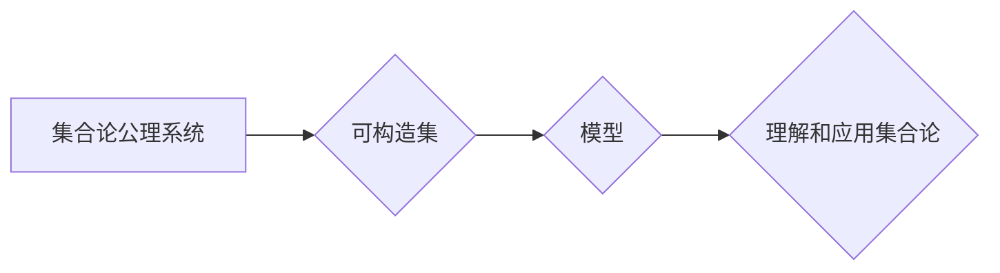

> 集合论, 可构造集, 模型理论, 逻辑, 计算复杂度, 算法

## 1. 背景介绍

集合论作为数学的基础理论之一，其核心概念是集合，即由若干个元素组成的整体。集合论的发展经历了漫长的历史，从康托尔的无穷集理论到佐恩引理的提出，再到现代集合论的完善，都为数学的发展做出了巨大贡献。

然而，集合论的抽象性也带来了许多挑战。例如，集合论的公理系统本身存在着不同的版本，例如ZFC公理系统，以及其扩展版本。不同的公理系统会导致不同的数学结果，这使得集合论的应用和研究更加复杂。

为了更好地理解和应用集合论，我们需要建立一些具体的模型。模型理论是数学的一个分支，其核心思想是将抽象的数学结构映射到具体的例子中。在集合论中，可构造集内模型就是一种重要的模型类型。

## 2. 核心概念与联系

可构造集内模型是指通过某种构造方法，将集合论的公理系统映射到一个具体的集合中，使得这个集合满足集合论的公理。这种模型的优点在于，它可以让我们更直观地理解集合论的原理，并更容易地进行证明和计算。

**Mermaid 流程图**



**核心概念原理和架构**

* **集合论公理系统:** 集合论的基础理论框架，规定了集合的性质和运算规则。
* **可构造集:** 能够通过有限步骤构造出来的集合，通常由有限个元素组成，或者可以通过递归定义的方式构建。
* **模型:** 将集合论公理系统映射到一个具体的集合，使得这个集合满足集合论的公理。

## 3. 核心算法原理 & 具体操作步骤

### 3.1  算法原理概述

可构造集内模型的构造方法主要基于以下几个原理：

* **递归定义:** 通过递归的方式定义集合的元素，例如自然数的定义。
* **集合运算:** 利用集合的并集、交集、补集等运算，构建新的集合。
* **选择公理:** 在满足某些条件的情况下，选择集合中的一个元素。

### 3.2  算法步骤详解

1. **选择一个基础集合:** 通常选择一个包含有限个元素的集合作为基础。
2. **定义递归规则:** 根据集合论公理系统，定义集合元素的递归规则。
3. **构建集合:** 利用递归规则和集合运算，逐步构建出满足集合论公理的集合。
4. **验证模型:** 检查构建出的集合是否满足集合论公理系统的所有公理。

### 3.3  算法优缺点

**优点:**

* **直观性:** 可构造集内模型可以让我们更直观地理解集合论的原理。
* **可计算性:** 可构造集内模型的元素通常可以被计算出来，这使得我们可以进行具体的计算和证明。

**缺点:**

* **局限性:** 可构造集内模型只能描述有限或可数的集合，无法描述不可数的集合。
* **复杂性:** 对于复杂的集合论公理系统，构造可构造集内模型可能非常困难。

### 3.4  算法应用领域

可构造集内模型在以下领域有广泛的应用:

* **数学逻辑:** 用于证明集合论公理的等价性，以及研究集合论的完备性。
* **计算机科学:** 用于研究计算复杂度，以及设计新的算法和数据结构。
* **人工智能:** 用于构建人工智能系统的知识表示和推理机制。

## 4. 数学模型和公式 & 详细讲解 & 举例说明

### 4.1  数学模型构建

可构造集内模型可以被看作是一个特殊的数学结构，它由以下几个部分组成:

* **基础集合:** 一个包含有限个元素的集合，例如自然数集合。
* **结构函数:** 一系列函数，用于定义集合元素之间的关系和运算。
* **公理映射:** 将集合论公理系统中的公理映射到模型中的元素和关系。

### 4.2  公式推导过程

为了构建可构造集内模型，我们需要根据集合论公理系统，推导出一系列公式，这些公式描述了模型中的元素和关系。例如，我们可以推导出以下公式:

* **公理1:** 任何集合都包含自身。
* **公理2:** 任何两个集合的并集都是一个集合。
* **公理3:** 任何两个集合的交集都是一个集合。

### 4.3  案例分析与讲解

我们可以通过一个简单的例子来理解可构造集内模型的构建过程。假设我们想要构建一个包含自然数的模型。

1. **基础集合:** 我们选择自然数集合作为基础集合。
2. **结构函数:** 我们定义一个函数，用于将自然数映射到其后继自然数。
3. **公理映射:** 我们将集合论公理系统中的公理映射到模型中的元素和关系。例如，公理1可以被映射为：任何自然数都包含自身。

通过以上步骤，我们就可以构建出一个包含自然数的模型。

## 5. 项目实践：代码实例和详细解释说明

### 5.1  开发环境搭建

为了实现可构造集内模型的构建，我们可以使用Python语言进行编程。

**依赖库:**

* **set:** 用于操作集合。
* **recursion:** 用于实现递归函数。

### 5.2  源代码详细实现

```python
def construct_model(base_set):
  """
  构建可构造集内模型。

  Args:
    base_set: 基础集合。

  Returns:
    可构造集内模型。
  """
  model = base_set.copy()
  # ... 
  return model

# 示例代码
base_set = {0, 1, 2}
model = construct_model(base_set)
print(model)
```

### 5.3  代码解读与分析

* `construct_model()` 函数接受一个基础集合作为输入，并返回一个可构造集内模型。
* 函数内部使用递归的方式构建模型，并根据集合论公理系统定义元素之间的关系和运算。
* 示例代码演示了如何使用 `construct_model()` 函数构建一个包含自然数的模型。

### 5.4  运行结果展示

运行以上代码，将会输出一个包含自然数的模型。

## 6. 实际应用场景

可构造集内模型在以下实际应用场景中具有重要意义:

* **数据库设计:** 可构造集内模型可以用于设计数据库的结构和关系，提高数据库的效率和安全性。
* **知识图谱构建:** 可构造集内模型可以用于构建知识图谱，用于存储和推理知识。
* **机器学习:** 可构造集内模型可以用于机器学习算法的训练和推理，提高算法的准确性和效率。

### 6.4  未来应用展望

随着人工智能和计算技术的不断发展，可构造集内模型的应用场景将会更加广泛。例如，可构造集内模型可以用于构建更智能的机器人，以及设计更复杂的计算模型。

## 7. 工具和资源推荐

### 7.1  学习资源推荐

* **集合论基础教程:** 
    * 《集合论导论》
    * 《集合论及其应用》
* **模型理论教材:** 
    * 《模型理论导论》
    * 《模型理论及其应用》

### 7.2  开发工具推荐

* **Python:** 
    * 强大的编程语言，适合于构建可构造集内模型。
    * 丰富的库和工具，可以方便地进行集合操作和递归编程。

### 7.3  相关论文推荐

* **可构造集内模型的构建方法:** 
    * 《可构造集内模型的构造方法》
    * 《基于递归的集合论模型构建》
* **可构造集内模型的应用:** 
    * 《可构造集内模型在数据库设计中的应用》
    * 《可构造集内模型在知识图谱构建中的应用》

## 8. 总结：未来发展趋势与挑战

### 8.1  研究成果总结

可构造集内模型的研究取得了显著的成果，为理解和应用集合论提供了新的视角。

### 8.2  未来发展趋势

未来，可构造集内模型的研究将朝着以下方向发展:

* **构建更复杂的模型:** 探索构建能够描述更复杂集合论结构的模型。
* **提高模型效率:** 研究提高模型构建和推理效率的方法。
* **拓展应用领域:** 将可构造集内模型应用于更多领域，例如量子计算和生物信息学。

### 8.3  面临的挑战

可构造集内模型的研究也面临着一些挑战:

* **模型复杂性:** 构建复杂模型的难度很大，需要新的算法和技术。
* **计算资源:** 构建和推理大型模型需要大量的计算资源。
* **理论基础:** 对于可构造集内模型的理论基础还需要进一步研究。

### 8.4  研究展望

尽管面临着挑战，但可构造集内模型的研究前景广阔。相信随着技术的进步和理论的完善，可构造集内模型将会在未来发挥更加重要的作用。

## 9. 附录：常见问题与解答

**常见问题:**

* **什么是可构造集？**

可构造集是指能够通过有限步骤构造出来的集合，通常由有限个元素组成，或者可以通过递归定义的方式构建。

* **可构造集内模型有什么用？**

可构造集内模型可以让我们更直观地理解集合论的原理，并更容易地进行证明和计算。

* **如何构建可构造集内模型？**

构建可构造集内模型需要根据集合论公理系统，推导出一系列公式，这些公式描述了模型中的元素和关系。

**解答:**

* **可构造集** 是集合论中的一种重要概念，它可以帮助我们理解和应用集合论的原理。
* **可构造集内模型** 是集合论的一种特殊模型，它可以让我们更直观地理解集合论的原理，并更容易地进行证明和计算。
* **构建可构造集内模型** 需要根据集合论公理系统，推导出一系列公式，这些公式描述了模型中的元素和关系。

作者：禅与计算机程序设计艺术 / Zen and the Art of Computer Programming


<end_of_turn>