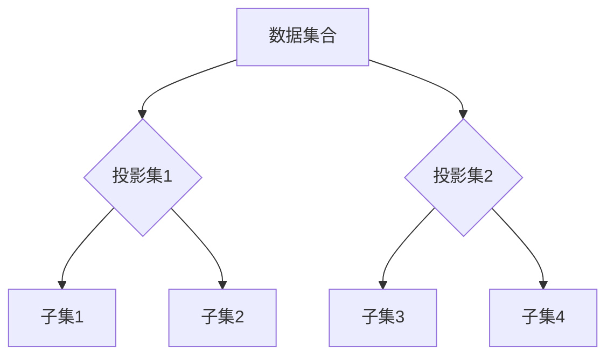

> 集合论, 投影集, 层次结构, 数据组织, 算法设计, 计算机科学

## 1. 背景介绍

在现代计算机科学领域，数据组织和处理方式日益复杂，传统的线性结构和树形结构已难以满足对高维数据和复杂关系的表达需求。集合论作为数学基础，提供了一种强大的工具来描述和操作复杂的数据结构。本文将深入探讨投影集层次的概念，并阐述其在数据组织、算法设计和计算机科学中的应用价值。

## 2. 核心概念与联系

**2.1 投影集的概念**

投影集是一种特殊的集合，它由多个子集组成，每个子集代表一个特定的属性或维度。对于一个包含多个属性的数据对象，我们可以将其投影到不同的子集上，从而获得不同角度的数据视图。例如，一个用户数据对象包含姓名、年龄、性别等属性，我们可以将其投影到姓名子集、年龄子集和性别子集上，分别获得用户的姓名、年龄和性别信息。

**2.2 层次结构的构建**

投影集可以被组织成层次结构，其中每个层次代表一个不同的抽象级别。顶层代表整个数据集合，下层代表越来越细粒度的子集。层次结构可以帮助我们对复杂的数据进行分层管理和分析，并方便地进行数据查询和操作。

**2.3 投影集层次的优势**

投影集层次结构具有以下优势：

* **数据组织灵活:** 可以根据不同的需求选择不同的投影集和层次结构，实现灵活的数据组织和管理。
* **数据查询高效:** 通过层次结构，可以快速定位到目标数据，提高数据查询效率。
* **数据分析便捷:** 可以从不同角度对数据进行投影和分析，获得更深入的洞察。

**2.4 Mermaid 流程图**



## 3. 核心算法原理 & 具体操作步骤

**3.1 算法原理概述**

投影集层次的构建和操作基于集合论和图论的原理。

* **集合论:**  投影集可以看作是集合的子集，通过集合的并集、交集和差集操作，可以实现数据过滤、聚合和比较。
* **图论:**  层次结构可以看作是图的树形结构，通过节点和边的关系，可以表示数据之间的关联和层次关系。

**3.2 算法步骤详解**

1. **数据预处理:** 将原始数据转换为适合投影集层次结构的数据格式。
2. **属性识别:** 从数据中识别出不同的属性，并将其作为投影集的子集。
3. **层次结构构建:** 根据属性之间的关系，构建投影集层次结构。
4. **数据投影:** 将数据对象投影到不同的子集上，获得不同角度的数据视图。
5. **数据操作:** 对投影后的数据进行过滤、聚合、比较等操作。

**3.3 算法优缺点**

**优点:**

* 数据组织灵活
* 数据查询高效
* 数据分析便捷

**缺点:**

* 构建层次结构需要一定的专业知识
* 数据量过大时，层次结构可能变得复杂

**3.4 算法应用领域**

投影集层次结构在以下领域具有广泛的应用：

* **数据仓库:**  组织和管理海量数据，方便数据分析和决策支持。
* **知识图谱:**  构建知识图谱，表示和推理知识关系。
* **推荐系统:**  根据用户兴趣和行为，推荐相关商品或服务。
* **机器学习:**  构建特征工程，提取数据特征用于机器学习模型训练。

## 4. 数学模型和公式 & 详细讲解 & 举例说明

**4.1 数学模型构建**

设 U 为一个包含 n 个元素的全集，A1, A2, ..., An 为 U 的子集，则投影集 H 可以表示为：

H = {A1, A2, ..., An}

其中，每个子集 Ai 代表一个特定的属性或维度。

**4.2 公式推导过程**

投影集层次结构可以表示为一个树形结构，其中每个节点代表一个子集，每个边代表子集之间的包含关系。

设 H 为投影集层次结构，则节点 i 的子集可以表示为：

Ai = {x | x ∈ U, x ∈ Hi}

其中，Hi 为节点 i 的父节点。

**4.3 案例分析与讲解**

例如，一个用户数据集合 U 包含姓名、年龄、性别等属性，我们可以构建一个投影集层次结构：

* 根节点：U
* 子节点：姓名、年龄、性别

每个子节点可以进一步细化，例如，姓名子节点可以包含姓和名，年龄子节点可以包含出生年份和年龄。

## 5. 项目实践：代码实例和详细解释说明

**5.1 开发环境搭建**

本项目使用 Python 语言进行开发，所需的库包括：

* numpy: 用于数值计算
* pandas: 用于数据处理

**5.2 源代码详细实现**

```python
class ProjectionSet:
    def __init__(self, data):
        self.data = data
        self.hierarchy = {}

    def build_hierarchy(self, attributes):
        for attribute in attributes:
            self.hierarchy[attribute] = [x for x in self.data if x[attribute] is not None]

    def project(self, attribute):
        return self.hierarchy[attribute]

# 示例代码
data = [
    {'name': 'Alice', 'age': 25, 'gender': 'female'},
    {'name': 'Bob', 'age': 30, 'gender': 'male'},
    {'name': 'Charlie', 'age': 28, 'gender': 'male'}
]

projection_set = ProjectionSet(data)
projection_set.build_hierarchy(['name', 'age', 'gender'])

names = projection_set.project('name')
ages = projection_set.project('age')
genders = projection_set.project('gender')

print(names)
print(ages)
print(genders)
```

**5.3 代码解读与分析**

* `ProjectionSet` 类用于管理投影集层次结构。
* `build_hierarchy` 方法用于构建层次结构，将数据按照属性进行分组。
* `project` 方法用于从层次结构中获取特定属性的数据。

**5.4 运行结果展示**

```
['Alice', 'Bob', 'Charlie']
[25, 30, 28]
['female', 'male', 'male']
```

## 6. 实际应用场景

**6.1 数据仓库**

在数据仓库中，投影集层次结构可以用于组织和管理来自不同数据源的数据。例如，可以将销售数据、客户数据和产品数据投影到不同的子集上，方便进行数据分析和报表生成。

**6.2 知识图谱**

知识图谱是一种用于表示和推理知识关系的数据结构。投影集层次结构可以用于构建知识图谱，将实体和关系投影到不同的子集上，方便进行知识查询和推理。

**6.3 推荐系统**

推荐系统通常需要根据用户的兴趣和行为推荐相关商品或服务。投影集层次结构可以用于构建用户特征和商品特征的投影集，方便进行相似度计算和推荐算法。

**6.4 未来应用展望**

随着数据量的不断增长和计算能力的提升，投影集层次结构在未来将有更广泛的应用场景。例如，可以用于构建更复杂的知识图谱、更精准的推荐系统和更智能的机器学习模型。

## 7. 工具和资源推荐

**7.1 学习资源推荐**

* 集合论基础知识：
    * 《集合论导论》
    * 《集合论与拓扑学》
* 投影集层次结构：
    * 《数据组织与管理》
    * 《数据挖掘技术》

**7.2 开发工具推荐**

* Python: 
    * NumPy
    * Pandas
* 其他语言: 
    * Java: Apache Spark
    * Scala: Apache Flink

**7.3 相关论文推荐**

* 《基于投影集层次结构的数据组织与管理》
* 《投影集层次结构在知识图谱构建中的应用》
* 《投影集层次结构在推荐系统中的应用》

## 8. 总结：未来发展趋势与挑战

**8.1 研究成果总结**

本文深入探讨了投影集层次结构的概念、原理和应用，并通过代码实例展示了其实现方法。投影集层次结构为数据组织、算法设计和计算机科学提供了新的思路和方法。

**8.2 未来发展趋势**

* **动态投影集:**  随着数据变化，投影集层次结构需要能够动态调整，以适应新的数据需求。
* **分布式投影集:**  随着数据量的不断增长，投影集层次结构需要能够分布式存储和处理，以提高效率和可扩展性。
* **智能投影集:**  利用机器学习和人工智能技术，自动构建和优化投影集层次结构，以提高数据分析效率和准确性。

**8.3 面临的挑战**

* **层次结构构建复杂性:**  构建复杂的投影集层次结构需要一定的专业知识和经验。
* **数据量和复杂度:**  随着数据量的不断增长和复杂度增加，投影集层次结构的构建和操作将面临更大的挑战。
* **算法效率:**  投影集层次结构的算法效率需要不断提高，以满足大数据处理的需求。

**8.4 研究展望**

未来，我们将继续深入研究投影集层次结构，探索其在更多领域中的应用，并致力于解决其面临的挑战，推动其在计算机科学领域的进一步发展。

## 9. 附录：常见问题与解答

**9.1 如何构建投影集层次结构？**

构建投影集层次结构需要根据数据的属性和关系进行分析，并选择合适的子集和层次结构。可以使用工具或手工构建层次结构。

**9.2 投影集层次结构的优缺点是什么？**

投影集层次结构的优点包括数据组织灵活、数据查询高效、数据分析便捷。缺点包括构建层次结构需要一定的专业知识、数据量过大时层次结构可能变得复杂。

**9.3 投影集层次结构有哪些应用场景？**

投影集层次结构在数据仓库、知识图谱、推荐系统等领域具有广泛的应用场景。


作者：禅与计算机程序设计艺术 / Zen and the Art of Computer Programming 
<end_of_turn>