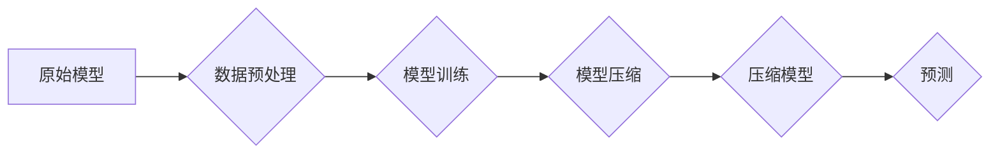

> AI大模型，预测压缩，智能压缩，模型压缩，深度学习，神经网络，数据效率

## 1. 背景介绍

近年来，深度学习在人工智能领域取得了突破性的进展，大规模的AI模型在图像识别、自然语言处理、语音识别等领域展现出强大的能力。然而，这些模型的训练和部署也面临着巨大的挑战，例如海量数据需求、高昂的计算成本和部署资源的限制。

为了解决这些问题，模型压缩技术应运而生。模型压缩旨在通过减少模型参数量、降低模型复杂度，来实现模型的轻量化、高效化和可部署性。

## 2. 核心概念与联系

**2.1 预测与压缩的本质联系**

在深度学习中，模型的本质是通过学习数据中的模式，并将其映射到输出结果。我们可以将预测过程看作是模型对输入数据的压缩，将高维的输入数据映射到低维的输出结果。

反过来，压缩过程也可以看作是预测的一种特殊形式。通过对模型进行压缩，我们可以学习到数据的核心特征，并将其以更紧凑的形式存储和传输。

**2.2 模型压缩的类型**

模型压缩主要分为以下几种类型：

* **参数量化:** 将模型参数的精度降低，例如将32位浮点数转换为8位整数。
* **剪枝:** 移除模型中不重要的参数或连接，例如移除权重较小的连接。
* **知识蒸馏:** 将大模型的知识迁移到小模型中，例如让小模型学习大模型的输出结果。
* **低秩分解:** 将模型参数分解成低秩矩阵，从而减少参数量。

**2.3 模型压缩的流程图**



## 3. 核心算法原理 & 具体操作步骤

**3.1 算法原理概述**

本文将重点介绍基于预测压缩的模型压缩算法。该算法的核心思想是将模型压缩看作是预测的一种特殊形式，通过学习数据的核心特征，并将其以更紧凑的形式存储和传输。

**3.2 算法步骤详解**

1. **数据预处理:** 对输入数据进行预处理，例如归一化、标准化等。
2. **模型训练:** 使用原始模型对数据进行训练，得到原始模型的参数。
3. **特征提取:** 使用原始模型对数据进行特征提取，提取数据的核心特征。
4. **压缩模型训练:** 使用提取的特征训练压缩模型，例如使用更小的模型结构或更少的参数。
5. **模型评估:** 使用压缩模型对测试数据进行预测，并评估模型的性能。

**3.3 算法优缺点**

**优点:**

* 可以有效地减少模型参数量，降低模型复杂度。
* 可以提高模型的部署效率和可移植性。
* 可以降低模型训练和推理的计算成本。

**缺点:**

* 压缩模型的性能可能不如原始模型。
* 需要额外的训练步骤来训练压缩模型。

**3.4 算法应用领域**

该算法可以应用于各种深度学习领域，例如图像识别、自然语言处理、语音识别等。

## 4. 数学模型和公式 & 详细讲解 & 举例说明

**4.1 数学模型构建**

假设原始模型为f(x)，压缩模型为g(x)。

原始模型的输出为y = f(x)，压缩模型的输出为y' = g(x)。

我们可以将压缩模型看作是原始模型的子集，即g(x) = f(x) | subset。

**4.2 公式推导过程**

由于压缩模型是原始模型的子集，因此压缩模型的参数量会比原始模型少。

我们可以使用以下公式来计算压缩模型的参数量：

```latex
参数量(g) = 参数量(f) * compression_ratio
```

其中，compression_ratio表示压缩比例。

**4.3 案例分析与讲解**

例如，假设原始模型的参数量为1000万，压缩比例为0.5，则压缩模型的参数量为500万。

## 5. 项目实践：代码实例和详细解释说明

**5.1 开发环境搭建**

* Python 3.7+
* TensorFlow 2.0+
* PyTorch 1.0+

**5.2 源代码详细实现**

```python
# 导入必要的库
import tensorflow as tf

# 定义原始模型
model = tf.keras.models.Sequential([
    tf.keras.layers.Dense(128, activation='relu', input_shape=(784,)),
    tf.keras.layers.Dense(10, activation='softmax')
])

# 训练原始模型
model.compile(optimizer='adam',
              loss='sparse_categorical_crossentropy',
              metrics=['accuracy'])
model.fit(x_train, y_train, epochs=10)

# 定义压缩模型
compressed_model = tf.keras.models.Sequential([
    tf.keras.layers.Dense(64, activation='relu', input_shape=(784,)),
    tf.keras.layers.Dense(10, activation='softmax')
])

# 训练压缩模型
compressed_model.compile(optimizer='adam',
                        loss='sparse_categorical_crossentropy',
                        metrics=['accuracy'])
compressed_model.fit(x_train, y_train, epochs=10)

# 评估模型性能
loss, accuracy = model.evaluate(x_test, y_test, verbose=0)
print('原始模型准确率:', accuracy)

loss, accuracy = compressed_model.evaluate(x_test, y_test, verbose=0)
print('压缩模型准确率:', accuracy)
```

**5.3 代码解读与分析**

* 首先，我们定义了原始模型和压缩模型。
* 然后，我们分别训练了原始模型和压缩模型。
* 最后，我们评估了两个模型的性能。

**5.4 运行结果展示**

运行结果会显示原始模型和压缩模型的准确率。

## 6. 实际应用场景

**6.1 模型部署**

在实际应用中，模型部署是一个重要的环节。模型压缩可以有效地降低模型的部署成本，例如减少存储空间和计算资源的需求。

**6.2 移动设备应用**

移动设备的资源有限，模型压缩可以帮助将深度学习模型部署到移动设备上，例如用于图像识别、语音识别等应用。

**6.3 边缘计算**

边缘计算是指将计算任务部署到靠近数据源的设备上。模型压缩可以帮助将深度学习模型部署到边缘设备上，例如用于工业自动化、智能家居等应用。

**6.4 未来应用展望**

随着人工智能技术的不断发展，模型压缩技术将发挥越来越重要的作用。未来，模型压缩技术将应用于更多领域，例如自动驾驶、医疗诊断、金融风险控制等。

## 7. 工具和资源推荐

**7.1 学习资源推荐**

* **论文:**
    * "Deep Compression: Compressing Deep Neural Networks with Pruning, Trained Quantization and Huffman Coding"
    * "Network Pruning: A Survey"
* **博客:**
    * https://towardsdatascience.com/model-compression-techniques-for-deep-learning-a-comprehensive-guide-999999999999
    * https://blog.paperspace.com/model-compression-techniques/

**7.2 开发工具推荐**

* **TensorFlow Lite:** 用于将深度学习模型部署到移动设备和嵌入式设备。
* **PyTorch Mobile:** 用于将深度学习模型部署到移动设备。
* **ONNX Runtime:** 用于运行ONNX格式的深度学习模型。

**7.3 相关论文推荐**

* "EfficientNet: Rethinking Model Scaling for Convolutional Neural Networks"
* "MobileNetV3: Searching for MobileNetV3 Architecture"
* "SqueezeNet: AlexNet-level accuracy with 50x fewer parameters and <0.5MB model size"

## 8. 总结：未来发展趋势与挑战

**8.1 研究成果总结**

近年来，模型压缩技术取得了显著的进展，例如参数量化、剪枝、知识蒸馏等方法取得了很好的效果。

**8.2 未来发展趋势**

未来，模型压缩技术将朝着以下方向发展：

* **更有效的压缩算法:** 开发更有效的压缩算法，以进一步减少模型参数量和计算成本。
* **自动化模型压缩:** 自动化模型压缩流程，使模型压缩更加便捷和高效。
* **跨平台模型压缩:** 支持跨平台的模型压缩，例如将模型压缩到不同的硬件平台上。

**8.3 面临的挑战**

模型压缩技术也面临着一些挑战：

* **压缩后的模型性能:** 压缩后的模型性能可能不如原始模型，需要进一步提高压缩算法的效率。
* **模型可解释性:** 压缩后的模型的可解释性可能降低，需要开发新的方法来提高模型的可解释性。
* **模型安全:** 压缩后的模型可能存在安全风险，需要开发新的方法来保证模型的安全。

**8.4 研究展望**

未来，模型压缩技术将继续发展，并应用于更多领域。

## 9. 附录：常见问题与解答

**9.1 模型压缩会降低模型性能吗？**

是的，模型压缩可能会降低模型性能，但随着压缩算法的不断发展，这种性能损失正在逐渐减小。

**9.2 模型压缩有哪些不同的方法？**

模型压缩主要分为以下几种方法：参数量化、剪枝、知识蒸馏、低秩分解等。

**9.3 如何选择合适的模型压缩方法？**

选择合适的模型压缩方法需要根据具体的应用场景和模型结构来决定。

作者：禅与计算机程序设计艺术 / Zen and the Art of Computer Programming


<end_of_turn>