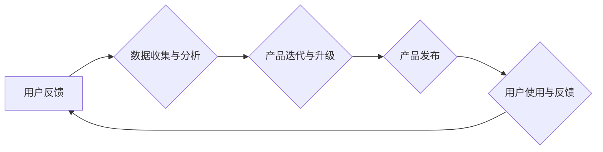

> AI创业公司,产品迭代,用户反馈,数据驱动,产品升级,敏捷开发,A/B测试,数据分析,机器学习

## 1. 背景介绍

在当今科技飞速发展的时代，人工智能（AI）技术正在各个领域掀起一场革命。AI创业公司应运而生，涌现出许多创新产品和服务。然而，在激烈的市场竞争中，如何快速迭代产品，不断升级产品功能，以满足用户不断变化的需求，成为AI创业公司面临的重大挑战。

传统的软件开发模式往往以瀑布式开发为主，产品开发周期长，难以快速响应市场变化。而敏捷开发模式则强调迭代开发、快速反馈，更适合快速迭代的产品开发。

数据驱动是AI创业公司产品迭代与升级的核心驱动力。通过收集用户反馈、分析用户行为数据，AI创业公司可以洞察用户需求，优化产品功能，提升用户体验。

## 2. 核心概念与联系

**2.1 用户反馈**

用户反馈是AI创业公司产品迭代与升级的重要来源。用户反馈可以是直接的，例如用户在产品评论区或邮件中表达的意见；也可以是间接的，例如用户使用产品的行为数据。

**2.2 数据驱动**

数据驱动是指利用数据分析和机器学习等技术，为产品开发和决策提供依据。数据驱动可以帮助AI创业公司更好地理解用户需求，优化产品功能，提升产品质量。

**2.3 敏捷开发**

敏捷开发是一种迭代开发模式，强调快速反馈、持续改进。敏捷开发可以帮助AI创业公司快速响应市场变化，更快地推出新产品和功能。

**2.4 流程图**



## 3. 核心算法原理 & 具体操作步骤

**3.1 算法原理概述**

用户反馈数据分析和产品迭代升级通常涉及到以下算法：

* **自然语言处理（NLP）:** 用于分析用户文本反馈，提取关键信息和情感倾向。
* **机器学习（ML）:** 用于分析用户行为数据，预测用户需求和行为模式。
* **推荐系统:** 用于根据用户历史行为和偏好，推荐相关产品和服务。

**3.2 算法步骤详解**

**3.2.1 用户反馈数据分析**

1. 收集用户反馈数据，包括产品评论、用户邮件、论坛讨论等。
2. 使用NLP算法对文本数据进行预处理，例如分词、去停用词、词性标注等。
3. 使用情感分析算法识别用户反馈的情感倾向，例如正面、负面、中性等。
4. 使用主题模型算法提取用户反馈的主要主题，例如产品功能、用户体验、价格等。

**3.2.2 产品迭代与升级**

1. 根据用户反馈数据分析结果，确定需要改进的产品功能和体验。
2. 使用敏捷开发方法，快速迭代开发新功能和改进现有功能。
3. 进行A/B测试，比较不同版本产品的性能和用户体验，选择最佳版本进行发布。

**3.3 算法优缺点**

* **NLP算法:** 优点是能够理解和分析自然语言文本，缺点是处理复杂文本语义仍然存在挑战。
* **ML算法:** 优点是能够从数据中学习模式和规律，缺点是需要大量的数据进行训练。
* **推荐系统:** 优点是能够根据用户偏好推荐相关产品和服务，缺点是容易陷入推荐偏差。

**3.4 算法应用领域**

* **电商平台:** 用于分析用户评论，推荐商品，优化用户体验。
* **社交媒体:** 用于分析用户帖子，识别用户情绪，推荐内容。
* **在线教育:** 用于分析用户学习行为，个性化推荐学习资源。

## 4. 数学模型和公式 & 详细讲解 & 举例说明

**4.1 数学模型构建**

用户反馈数据分析可以构建以下数学模型：

* **情感分析模型:** 使用机器学习算法，将文本数据映射到情感维度，例如正负情感得分。

* **主题模型:** 使用概率模型，例如LDA主题模型，从文本数据中提取主题分布。

**4.2 公式推导过程**

* **情感分析模型:** 可以使用逻辑回归、支持向量机等算法，训练情感分类模型。模型的输出是一个情感得分，例如-1到1之间，表示负面到正面的情感倾向。

* **主题模型:** LDA主题模型使用贝叶斯概率理论，假设文本是由多个主题组成的混合分布。模型的目标是学习每个主题的词语分布和每个文档的主题分布。

**4.3 案例分析与讲解**

假设我们有一个电商平台，收集了用户对产品的评论数据。我们可以使用情感分析模型，计算每个产品的平均情感得分。如果产品的平均情感得分较低，则表明该产品存在问题，需要进行改进。

## 5. 项目实践：代码实例和详细解释说明

**5.1 开发环境搭建**

* Python 3.x
* Jupyter Notebook
* NLTK
* Scikit-learn
* Gensim

**5.2 源代码详细实现**

```python
# 情感分析示例代码

from nltk.sentiment import SentimentIntensityAnalyzer

sia = SentimentIntensityAnalyzer()

text = "这个产品非常好用，我很满意！"

scores = sia.polarity_scores(text)

print(scores)
```

**5.3 代码解读与分析**

* 该代码使用NLTK库中的SentimentIntensityAnalyzer类，对文本进行情感分析。
* `polarity_scores()`方法返回一个字典，包含文本的正面、负面、中性情感得分以及综合情感得分。

**5.4 运行结果展示**

```
{'neg': 0.0, 'neu': 0.333, 'pos': 0.667, 'compound': 0.8933}
```

结果表明，该文本的情感倾向为正面。

## 6. 实际应用场景

**6.1 电商平台**

* 分析用户对产品的评论，识别产品缺陷和用户需求。
* 根据用户反馈，优化产品功能和设计。
* 推送个性化产品推荐，提升用户购买体验。

**6.2 社交媒体**

* 分析用户对品牌的评论和讨论，了解用户对品牌的认知和态度。
* 识别用户情绪变化，及时调整营销策略。
* 推送个性化内容推荐，提升用户粘性。

**6.3 在线教育**

* 分析用户对课程的评价和反馈，了解课程的优缺点。
* 根据用户学习行为，个性化推荐学习资源。
* 优化课程内容和教学方法，提升用户学习效果。

**6.4 未来应用展望**

* 人工智能技术将更加成熟，能够更好地理解和分析用户反馈数据。
* 数据驱动将成为AI创业公司产品迭代与升级的核心驱动力。
* 产品迭代与升级将更加快速、高效、个性化。

## 7. 工具和资源推荐

**7.1 学习资源推荐**

* **书籍:**
    * 《Python数据科学手册》
    * 《机器学习实战》
    * 《自然语言处理入门》
* **在线课程:**
    * Coursera: 机器学习
    * edX: 自然语言处理
    * Udemy: Python数据科学

**7.2 开发工具推荐**

* **Python:** 
    * Jupyter Notebook
    * PyCharm
* **机器学习库:**
    * Scikit-learn
    * TensorFlow
    * PyTorch
* **自然语言处理库:**
    * NLTK
    * SpaCy
    * Gensim

**7.3 相关论文推荐**

* **情感分析:**
    * Pang, B., Lee, L., & Vaithyanathan, S. (2002). Thumbs up? Sentiment classification using machine learning techniques. Proceedings of the ACL-02 conference on Empirical methods in natural language processing-Volume 10, 79-86.
* **主题模型:**
    * Blei, D. M., Ng, A. Y., & Jordan, M. I. (2003). Latent dirichlet allocation. Journal of machine Learning research, 3(Jan), 993-1022.

## 8. 总结：未来发展趋势与挑战

**8.1 研究成果总结**

* 用户反馈数据分析和产品迭代升级是AI创业公司发展的重要方向。
* 数据驱动、敏捷开发、NLP、ML等技术为AI创业公司产品迭代与升级提供了强大的工具和方法。

**8.2 未来发展趋势**

* 人工智能技术将更加成熟，能够更好地理解和分析用户反馈数据。
* 数据驱动将成为AI创业公司产品迭代与升级的核心驱动力。
* 产品迭代与升级将更加快速、高效、个性化。

**8.3 面临的挑战**

* 如何收集和处理海量用户反馈数据。
* 如何准确地分析用户反馈数据，提取关键信息。
* 如何将用户反馈数据转化为实际的产品改进。

**8.4 研究展望**

* 研究更先进的用户反馈分析算法，提高分析准确性和效率。
* 研究更有效的产品迭代与升级方法，缩短产品开发周期。
* 研究如何将用户反馈数据与其他数据源结合，进行更深入的分析和决策。

## 9. 附录：常见问题与解答

**9.1 如何收集用户反馈数据？**

* 产品评论区
* 用户邮件
* 论坛讨论
* 问卷调查
* 社交媒体

**9.2 如何分析用户反馈数据？**

* 使用NLP算法进行文本分析
* 使用ML算法进行数据挖掘
* 使用主题模型提取主题分布

**9.3 如何将用户反馈数据转化为产品改进？**

* 优先解决用户反馈中出现的常见问题
* 根据用户反馈，优化产品功能和设计
* 进行A/B测试，验证产品改进效果


作者：禅与计算机程序设计艺术 / Zen and the Art of Computer Programming 
<end_of_turn>