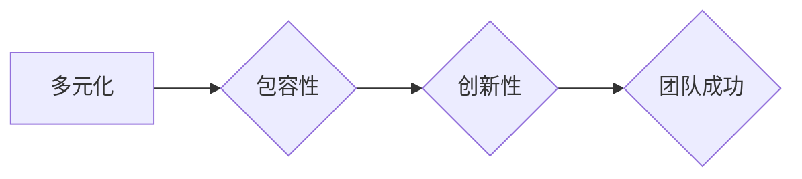

# AI创业公司的团队建设与文化塑造：多元化、包容性与创新性

> 关键词：

> AI创业公司,团队建设,文化塑造,多元化,包容性,创新性,人才培养,协作机制,领导力

## 1. 背景介绍

人工智能（AI）技术正在以惊人的速度发展，并深刻地改变着各行各业。AI创业公司正涌现，致力于利用AI技术解决各种现实问题，创造新的价值。然而，AI创业公司的成功并非仅仅依赖于先进的技术，更需要一支优秀的团队和良好的文化氛围。

团队建设和文化塑造是AI创业公司发展的关键因素。一支优秀的团队能够有效地集思广益、协同创新，并克服技术和市场上的挑战。而良好的文化氛围能够激发团队成员的热情和创造力，促进团队的凝聚力和战斗力。

## 2. 核心概念与联系

### 2.1 多元化

多元化是指团队成员来自不同背景、拥有不同技能、经验和思维方式。多元化的团队能够带来更广泛的视角和更丰富的创意，从而提高团队的创新能力和解决问题的能力。

### 2.2 包容性

包容性是指团队成员能够互相尊重、理解和接纳彼此的差异。包容性的团队能够营造一个安全、舒适的工作环境，鼓励团队成员积极表达自己的想法和意见，从而促进团队的协作和沟通。

### 2.3 创新性

创新性是指团队能够不断地提出新的想法、探索新的解决方案，并将其付诸实践。创新性的团队能够保持竞争优势，并适应不断变化的市场环境。

**Mermaid 流程图**

## 3. 核心算法原理 & 具体操作步骤

### 3.1 算法原理概述

团队建设和文化塑造是一个复杂的过程，需要综合考虑多个因素，并采用多种方法。

### 3.2 算法步骤详解

1. **人才招聘:** 

    * 制定明确的人才招聘策略，明确团队所需的技能和经验。
    * 利用多种渠道进行人才招聘，例如线上招聘平台、校园招聘、行业活动等。
    * 采用科学的招聘流程，包括简历筛选、面试、技能测试等环节。

2. **团队建设:**

    * 构建高效的团队结构，明确每个成员的职责和权限。
    * 组织团队建设活动，增进团队成员之间的了解和沟通。
    * 建立有效的沟通机制，确保信息畅通。

3. **文化塑造:**

    * 制定明确的企业文化，并将其融入到团队的日常工作中。
    * 鼓励团队成员积极参与文化建设，并分享自己的想法和建议。
    * 通过各种活动和仪式，强化团队文化的认同感。

4. **人才培养:**

    * 提供员工培训和发展机会，帮助员工提升技能和知识。
    * 建立员工成长路径，帮助员工规划职业发展。
    * 鼓励员工学习和创新，并为其提供支持和资源。

5. **绩效管理:**

    * 建立科学的绩效考核体系，并定期进行绩效评估。
    * 为优秀员工提供奖励和晋升机会，激励员工不断进步。
    * 对绩效不佳的员工进行及时辅导和帮助。

### 3.3 算法优缺点

* **优点:**

    * 能够有效地提升团队的凝聚力和战斗力。
    * 能够促进团队的创新能力和解决问题的能力。
    * 能够提高团队成员的满意度和忠诚度。

* **缺点:**

    * 需要投入大量的时间和精力。
    * 需要领导者具备良好的沟通和管理能力。
    * 需要团队成员积极参与和配合。

### 3.4 算法应用领域

该算法适用于所有类型的AI创业公司，无论其规模大小、业务领域。

## 4. 数学模型和公式 & 详细讲解 & 举例说明

### 4.1 数学模型构建

团队建设和文化塑造是一个复杂的过程，可以抽象为一个多变量的优化问题。

其中，目标函数是团队的整体绩效，包括创新能力、协作能力、效率等方面。

变量包括团队成员的技能、经验、性格、价值观等因素。

### 4.2 公式推导过程

由于团队建设和文化塑造是一个复杂的过程，没有一个通用的公式可以精确地描述其过程。

但是，我们可以通过一些数学模型和统计方法来分析团队的绩效，并找到影响团队绩效的因素。

例如，我们可以使用协方差矩阵来分析团队成员之间的协作关系，或者使用主成分分析来识别影响团队绩效的关键因素。

### 4.3 案例分析与讲解

假设我们有一个AI创业公司，其目标是开发一款新的语音识别技术。

为了实现这个目标，公司需要组建一个具有丰富经验和专业技能的团队。

我们可以使用数学模型来分析团队成员的技能和经验，并选择最合适的候选人。

例如，我们可以使用线性回归模型来预测团队成员的开发效率，并选择效率最高的候选人。

## 5. 项目实践：代码实例和详细解释说明

### 5.1 开发环境搭建

为了实现团队建设和文化塑造的目标，我们可以使用一些工具和平台来辅助我们的工作。

例如，我们可以使用Slack来进行团队沟通，使用Trello来管理项目进度，使用GitHub来进行代码管理。

### 5.2 源代码详细实现

由于团队建设和文化塑造是一个复杂的过程，没有一个简单的代码实例可以完全实现其目标。

但是，我们可以使用一些代码片段来实现一些具体的功能，例如：

* 使用Python的自然语言处理库来分析团队成员的沟通内容，识别团队成员之间的关系和情绪。
* 使用机器学习算法来预测团队成员的绩效，并提供个性化的培训建议。

### 5.3 代码解读与分析

这些代码片段可以帮助我们更好地了解团队成员的行为模式，并找到改进团队建设和文化塑造的方法。

### 5.4 运行结果展示

通过运行这些代码片段，我们可以获得一些有价值的数据和 insights，例如：

* 团队成员之间的沟通频率和内容。
* 团队成员的积极性和参与度。
* 团队成员的技能和经验分布。

## 6. 实际应用场景

### 6.1 案例分析

我们可以将团队建设和文化塑造的理念应用到各种实际场景中，例如：

* **创业公司:** 帮助创业公司组建高效的团队，并建立良好的企业文化。
* **大型企业:** 帮助大型企业进行组织变革，提升团队协作能力和创新能力。
* **教育机构:** 帮助教育机构构建良好的学习氛围，促进学生之间的合作和交流。

### 6.2 未来应用展望

随着人工智能技术的不断发展，团队建设和文化塑造将更加智能化和个性化。

未来，我们可以使用人工智能技术来：

* 自动化团队成员的匹配和分配。
* 个性化推荐培训和发展机会。
* 预测团队成员的离职风险。

## 7. 工具和资源推荐

### 7.1 学习资源推荐

* **书籍:**

    * 《The Lean Startup》 by Eric Ries
    * 《Radical Candor》 by Kim Scott
    * 《Measure What Matters》 by John Doerr

* **在线课程:**

    * Coursera: "Building a Successful Startup"
    * Udemy: "Teamwork and Collaboration Skills"

### 7.2 开发工具推荐

* **沟通工具:** Slack, Microsoft Teams
* **项目管理工具:** Trello, Asana, Jira
* **代码管理工具:** GitHub, GitLab

### 7.3 相关论文推荐

* "The Impact of Team Diversity on Innovation" by Page et al.
* "The Role of Psychological Safety in Team Performance" by Edmondson
* "Building a Culture of Innovation" by Amabile

## 8. 总结：未来发展趋势与挑战

### 8.1 研究成果总结

团队建设和文化塑造是AI创业公司成功的关键因素。

通过多元化、包容性和创新性的团队文化，AI创业公司能够吸引和留住优秀人才，并激发团队的创造力和协作能力。

### 8.2 未来发展趋势

未来，团队建设和文化塑造将更加智能化和个性化。

人工智能技术将被广泛应用于团队建设和文化塑造领域，帮助企业更好地了解团队成员的需求，并提供个性化的支持和服务。

### 8.3 面临的挑战

尽管团队建设和文化塑造具有重要的意义，但仍然面临一些挑战，例如：

* 如何建立一个真正包容和多元化的团队文化。
* 如何激励团队成员积极参与文化建设。
* 如何平衡团队的创新能力和执行力。

### 8.4 研究展望

未来，我们需要继续研究团队建设和文化塑造的最佳实践，并探索人工智能技术在该领域的应用。

我们也需要关注团队建设和文化塑造的伦理问题，确保其能够公平、公正地对待所有团队成员。

## 9. 附录：常见问题与解答

### 9.1 如何建立一个多元化团队？

* 制定明确的人才招聘策略，明确团队所需的技能和经验。
* 利用多种渠道进行人才招聘，例如线上招聘平台、校园招聘、行业活动等。
* 采用科学的招聘流程，包括简历筛选、面试、技能测试等环节。

### 9.2 如何营造一个包容性的团队文化？

* 制定明确的企业文化，并将其融入到团队的日常工作中。
* 鼓励团队成员积极参与文化建设，并分享自己的想法和建议。
* 通过各种活动和仪式，强化团队文化的认同感。

### 9.3 如何激发团队的创新能力？

* 建立有效的沟通机制，确保信息畅通。
* 组织团队建设活动，增进团队成员之间的了解和沟通。
* 鼓励团队成员积极提出新的想法和解决方案。

作者：禅与计算机程序设计艺术 / Zen and the Art of Computer Programming