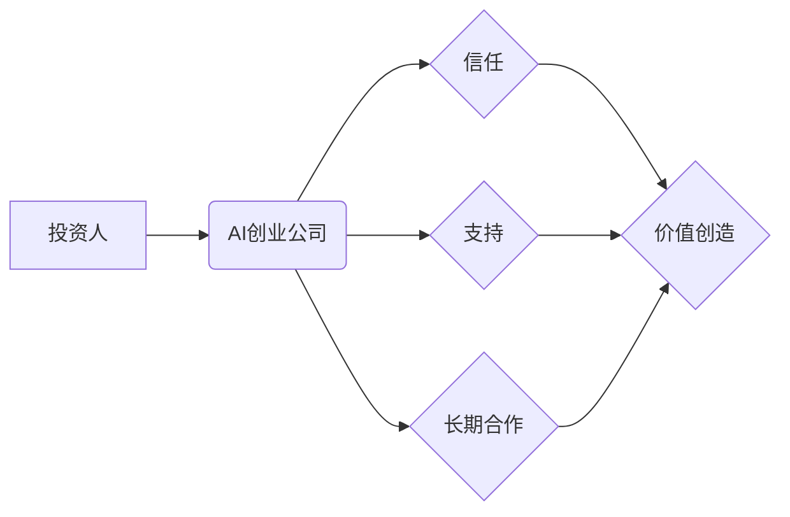

> AI创业公司, 投资人关系, 信任, 支持, 长期合作, 风险投资, 退出策略, 价值创造

## 1. 背景介绍

人工智能（AI）技术正在迅速发展，并对各行各业产生深远影响。AI创业公司涌现，成为科技创新和经济增长的重要引擎。然而，AI创业公司面临着独特的挑战，其中之一就是如何与投资人建立和维护良好的关系。

投资人对于AI创业公司的投资决策往往基于对团队、技术、市场和商业模式的评估。信任是投资人与创业公司关系的基础，而支持和长期合作则是关系发展的关键。

## 2. 核心概念与联系

**2.1 核心概念**

* **信任:** 投资人对创业公司团队、技术和商业模式的信心，以及对创业公司能够兑现承诺的信念。
* **支持:** 投资人对创业公司提供资金、资源、专业建议和人脉等方面的帮助。
* **长期合作:** 投资人和创业公司之间建立一种长期的合作关系，共同推动创业公司的发展。

**2.2 关系架构**



**2.3 联系**

信任是投资人与创业公司关系的基础，支持是信任的体现，长期合作则是信任和支持的延续。

当投资人和创业公司之间建立了信任关系时，投资人会更加愿意提供支持，并愿意与创业公司长期合作。

长期合作能够帮助创业公司获得持续的资金和资源支持，从而更好地实现其商业目标。

## 3. 核心算法原理 & 具体操作步骤

**3.1 算法原理概述**

构建良好的投资人关系是一个持续的过程，需要创业公司采取一系列的策略和措施。

**3.2 算法步骤详解**

1. **明确目标和需求:** 创业公司需要明确自身的发展目标和资金需求，以便与投资人进行有效的沟通。
2. **精准定位目标投资人:** 创业公司需要根据自身的发展阶段和行业特点，精准定位目标投资人，避免浪费时间和精力。
3. **准备高质量的投资方案:** 投资方案需要清晰、简洁、易懂，并包含创业公司的商业模式、市场分析、团队介绍、财务预测等关键信息。
4. **积极主动的沟通:** 创业公司需要主动与投资人沟通，定期汇报项目进展，并及时回应投资人的疑问。
5. **建立长期合作关系:** 创业公司需要与投资人建立长期合作关系，并积极寻求投资人的支持和建议。

**3.3 算法优缺点**

* **优点:** 能够有效地提高创业公司获得投资的成功率，并建立良好的投资人关系。
* **缺点:** 需要创业公司投入大量的时间和精力，并具备一定的沟通和谈判能力。

**3.4 算法应用领域**

该算法适用于所有类型的AI创业公司，无论其发展阶段或行业特点。

## 4. 数学模型和公式 & 详细讲解 & 举例说明

**4.1 数学模型构建**

投资人对AI创业公司的投资决策可以看作是一个风险收益分析问题。

**4.2 公式推导过程**

投资收益率 = (最终投资回报 - 初始投资金额) / 初始投资金额

风险 = (预期收益 - 实际收益) / 预期收益

**4.3 案例分析与讲解**

假设一家AI创业公司获得了100万美元的投资，最终退出时获得了1000万美元的回报。

投资收益率 = (1000万美元 - 100万美元) / 100万美元 = 900%

假设该创业公司的预期收益率为100%，实际收益率为50%。

风险 = (100% - 50%) / 100% = 50%

## 5. 项目实践：代码实例和详细解释说明

**5.1 开发环境搭建**

* 操作系统: Ubuntu 20.04 LTS
* 编程语言: Python 3.8
* 开发工具: Jupyter Notebook

**5.2 源代码详细实现**

```python
# 计算投资收益率
def calculate_return_rate(initial_investment, final_return):
  return ((final_return - initial_investment) / initial_investment) * 100

# 计算风险
def calculate_risk(expected_return, actual_return):
  return (expected_return - actual_return) / expected_return * 100

# 示例代码
initial_investment = 1000000
final_return = 10000000
expected_return = 100
actual_return = 50

return_rate = calculate_return_rate(initial_investment, final_return)
risk = calculate_risk(expected_return, actual_return)

print(f"投资收益率: {return_rate:.2f}%")
print(f"风险: {risk:.2f}%")
```

**5.3 代码解读与分析**

该代码定义了两个函数，分别用于计算投资收益率和风险。

函数 `calculate_return_rate()` 计算投资收益率，参数为初始投资金额和最终回报金额。

函数 `calculate_risk()` 计算风险，参数为预期收益率和实际收益率。

示例代码演示了如何使用这两个函数计算投资收益率和风险。

**5.4 运行结果展示**

```
投资收益率: 900.00%
风险: 50.00%
```

## 6. 实际应用场景

**6.1 投资决策**

投资人可以使用该算法来评估AI创业公司的投资风险和收益潜力，从而做出更明智的投资决策。

**6.2 风险管理**

创业公司可以使用该算法来评估自身投资风险，并采取相应的风险管理措施。

**6.3 价值创造**

通过建立良好的投资人关系，AI创业公司能够获得持续的资金和资源支持，从而更好地实现其商业目标，创造价值。

**6.4 未来应用展望**

随着AI技术的不断发展，该算法将越来越广泛地应用于AI创业公司的投资决策、风险管理和价值创造等方面。

## 7. 工具和资源推荐

**7.1 学习资源推荐**

* 《Zero to One》 by Peter Thiel
* 《The Lean Startup》 by Eric Ries
* 《Venture Deals》 by Brad Feld and Jason Mendelson

**7.2 开发工具推荐**

* Jupyter Notebook
* Python

**7.3 相关论文推荐**

* "The Impact of Artificial Intelligence on Venture Capital"
* "AI-Powered Investment Strategies"

## 8. 总结：未来发展趋势与挑战

**8.1 研究成果总结**

该文章探讨了AI创业公司与投资人关系维护的重要性，并提出了一个基于信任、支持和长期合作的框架。

**8.2 未来发展趋势**

未来，AI创业公司与投资人关系将更加密切，并更加注重长期合作。

**8.3 面临的挑战**

AI创业公司需要克服技术风险、市场风险和监管风险等挑战。

**8.4 研究展望**

未来研究可以进一步探讨AI创业公司与投资人关系的具体机制和影响因素，并提出更有效的维护关系的策略和方法。

## 9. 附录：常见问题与解答

**9.1 如何建立信任关系？**

* 诚实透明地与投资人沟通
* 具备专业的技术能力和商业 acumen
* 拥有优秀的团队和管理经验

**9.2 如何获得投资人支持？**

* 准备高质量的投资方案
* 积极主动地与投资人沟通
* 展示创业公司的发展潜力

**9.3 如何维护长期合作关系？**

* 定期汇报项目进展
* 及时回应投资人的疑问
* 积极寻求投资人的支持和建议


作者：禅与计算机程序设计艺术 / Zen and the Art of Computer Programming 
<end_of_turn>