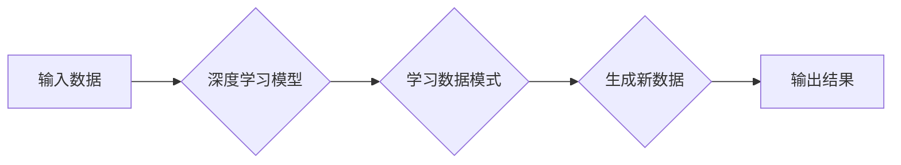

> 生成式AI, 产业升级, 深度学习, Transformer, 自然语言处理, 图像生成, 代码生成

## 1. 背景介绍

人工智能（AI）技术近年来发展迅速，特别是深度学习的突破性进展，为人工智能的应用带来了前所未有的机遇。其中，生成式AI作为人工智能领域的一支重要力量，正在深刻地改变着我们生活和工作的方式。

生成式AI是指能够根据输入数据生成新数据的AI模型。它与传统的AI模型不同，传统的AI模型主要用于分类、预测等任务，而生成式AI则能够创造新的内容，例如文本、图像、音频、视频等。

生成式AI技术的出现，为各行各业带来了巨大的潜力，它可以帮助企业自动化流程、提高效率、创造新的价值。例如，在营销领域，生成式AI可以帮助企业自动生成广告文案、社交媒体内容等；在教育领域，生成式AI可以帮助老师自动生成学习材料、个性化辅导等；在医疗领域，生成式AI可以帮助医生诊断疾病、预测患者病情等。

## 2. 核心概念与联系

**2.1 生成式AI的核心概念**

生成式AI的核心概念是学习数据中的模式和规律，并根据这些模式和规律生成新的数据。

**2.2 生成式AI与深度学习的关系**

深度学习是生成式AI的基础。深度学习模型能够学习到数据中复杂的非线性关系，从而实现更精准的生成。

**2.3 生成式AI的常见架构**

生成式AI的常见架构包括：

* **Generative Adversarial Networks (GANs)**：GANs由两个网络组成：生成器和判别器。生成器试图生成逼真的数据，而判别器试图区分真实数据和生成数据。两者相互竞争，最终使得生成器能够生成逼真的数据。
* **Variational Autoencoders (VAEs)**：VAEs是一种无监督学习的生成模型。它将输入数据编码成一个低维的表示，然后解码成新的数据。

**2.4 生成式AI与Transformer的关系**

Transformer是一种新的深度学习架构，它能够处理序列数据，例如文本和音频。Transformer在自然语言处理领域取得了巨大的成功，也为生成式AI带来了新的可能性。

**Mermaid 流程图**



## 3. 核心算法原理 & 具体操作步骤

### 3.1 算法原理概述

生成式AI的核心算法原理是学习数据中的模式和规律，并根据这些模式和规律生成新的数据。

### 3.2 算法步骤详解

1. **数据收集和预处理**: 收集大量相关数据，并进行清洗、格式化等预处理工作。
2. **模型选择**: 根据具体应用场景选择合适的生成式AI模型，例如GANs、VAEs等。
3. **模型训练**: 使用训练数据训练模型，使得模型能够学习到数据中的模式和规律。
4. **模型评估**: 使用测试数据评估模型的生成效果，并根据评估结果进行模型调优。
5. **数据生成**: 使用训练好的模型生成新的数据。

### 3.3 算法优缺点

**优点**:

* 可以生成逼真的数据，例如文本、图像、音频等。
* 可以自动化流程，提高效率。
* 可以创造新的价值。

**缺点**:

* 需要大量的训练数据。
* 模型训练时间长，计算资源消耗大。
* 生成的数据可能存在偏差或错误。

### 3.4 算法应用领域

* **自然语言处理**: 文本生成、机器翻译、对话系统等。
* **计算机视觉**: 图像生成、图像编辑、目标检测等。
* **音频处理**: 音频合成、语音识别、音乐创作等。
* **其他领域**: 代码生成、药物设计、金融预测等。

## 4. 数学模型和公式 & 详细讲解 & 举例说明

### 4.1 数学模型构建

生成式AI模型通常基于概率模型，例如概率分布或概率图模型。这些模型试图学习数据中潜在的概率分布，并根据这个分布生成新的数据。

### 4.2 公式推导过程

具体的公式推导过程取决于具体的生成式AI模型。例如，GANs模型的训练过程涉及到生成器和判别器的损失函数，这些损失函数通常是基于概率分布的。

### 4.3 案例分析与讲解

**举例说明：**

假设我们有一个生成文本的GANs模型。生成器试图生成一段文本，判别器试图判断这段文本是真实文本还是生成文本。

* 生成器的损失函数是判别器对生成文本的预测概率的负值。
* 判别器的损失函数是真实文本和生成文本的预测概率的交叉熵损失。

通过训练，生成器和判别器相互竞争，最终使得生成器能够生成逼真的文本。

## 5. 项目实践：代码实例和详细解释说明

### 5.1 开发环境搭建

* Python 3.x
* TensorFlow 或 PyTorch
* CUDA 和 cuDNN (可选，用于GPU加速)

### 5.2 源代码详细实现

```python
# 生成器模型
class Generator(nn.Module):
    def __init__(self):
        super(Generator, self).__init__()
        # 定义生成器网络结构
        # ...

    def forward(self, z):
        # 生成文本
        # ...

# 判别器模型
class Discriminator(nn.Module):
    def __init__(self):
        super(Discriminator, self).__init__()
        # 定义判别器网络结构
        # ...

    def forward(self, text):
        # 判断文本真实性
        # ...

# 训练模型
optimizer_G = optim.Adam(generator.parameters(), lr=0.0002)
optimizer_D = optim.Adam(discriminator.parameters(), lr=0.0002)

for epoch in range(num_epochs):
    for batch_idx, (real_text, _) in enumerate(train_loader):
        # 训练判别器
        # ...

        # 训练生成器
        # ...

```

### 5.3 代码解读与分析

* 生成器模型负责生成新的文本数据。
* 判别器模型负责判断文本的真实性。
* 训练过程通过优化生成器和判别器的损失函数来实现。

### 5.4 运行结果展示

训练完成后，可以使用生成器模型生成新的文本数据。

## 6. 实际应用场景

### 6.1 文本生成

* **内容创作**: 自动生成新闻报道、博客文章、小说等。
* **聊天机器人**: 构建更自然、更智能的聊天机器人。
* **代码生成**: 自动生成代码片段，提高开发效率。

### 6.2 图像生成

* **图像合成**: 生成逼真的图像，例如人物肖像、风景画等。
* **图像编辑**: 自动修复图像缺陷、改变图像风格等。
* **艺术创作**: 辅助艺术家创作新的艺术作品。

### 6.3 音频生成

* **语音合成**: 生成逼真的语音，用于语音助手、语音播报等。
* **音乐创作**: 生成新的音乐旋律、伴奏等。
* **音频编辑**: 自动去除音频噪声、调整音频音量等。

### 6.4 未来应用展望

* **个性化内容**: 根据用户的喜好生成个性化的内容，例如新闻推荐、广告推送等。
* **虚拟现实**: 生成逼真的虚拟场景，用于游戏、教育、医疗等领域。
* **人工智能辅助设计**: 辅助设计师进行产品设计、建筑设计等。

## 7. 工具和资源推荐

### 7.1 学习资源推荐

* **书籍**:
    * 《Deep Learning》 by Ian Goodfellow, Yoshua Bengio, and Aaron Courville
    * 《Generative Deep Learning》 by David Foster
* **在线课程**:
    * Coursera: Deep Learning Specialization
    * Udacity: Deep Learning Nanodegree
* **博客**:
    * OpenAI Blog
    * Google AI Blog

### 7.2 开发工具推荐

* **TensorFlow**: 开源深度学习框架
* **PyTorch**: 开源深度学习框架
* **Hugging Face**: 提供预训练模型和工具

### 7.3 相关论文推荐

* **Generative Adversarial Networks** by Ian Goodfellow et al. (2014)
* **Variational Autoencoders** by Diederik P. Kingma and Max Welling (2013)
* **Attention Is All You Need** by Ashish Vaswani et al. (2017)

## 8. 总结：未来发展趋势与挑战

### 8.1 研究成果总结

生成式AI技术取得了显著的进展，在文本生成、图像生成、音频生成等领域取得了突破性成果。

### 8.2 未来发展趋势

* **模型规模和能力的提升**: 模型规模和能力将继续提升，生成更逼真、更复杂的數據。
* **多模态生成**: 将文本、图像、音频等多种模态数据融合，实现多模态生成。
* **可解释性增强**: 研究生成式AI模型的决策过程，提高模型的可解释性。
* **伦理和安全问题**: 关注生成式AI技术的伦理和安全问题，防止其被用于恶意目的。

### 8.3 面临的挑战

* **数据获取和质量**: 生成式AI模型需要大量的训练数据，数据获取和质量是关键挑战。
* **计算资源**: 训练大型生成式AI模型需要大量的计算资源，成本较高。
* **模型训练效率**: 模型训练时间长，需要提高模型训练效率。

### 8.4 研究展望

未来，生成式AI技术将继续发展，在更多领域发挥重要作用。研究者将继续探索新的算法、模型和应用场景，推动生成式AI技术向更智能、更安全、更可解释的方向发展。

## 9. 附录：常见问题与解答

**常见问题**:

* 生成式AI模型的训练数据需要多大规模？
* 生成式AI模型的训练时间有多长？
* 如何评估生成式AI模型的生成效果？

**解答**:

* 生成式AI模型的训练数据规模取决于具体应用场景，一般来说，需要大量的训练数据。
* 生成式AI模型的训练时间取决于模型规模、数据规模和硬件资源，通常需要几天到几周甚至更长时间。
* 生成式AI模型的生成效果可以通过多种指标评估，例如BLEU分数、FID分数等。


作者：禅与计算机程序设计艺术 / Zen and the Art of Computer Programming 
<end_of_turn>