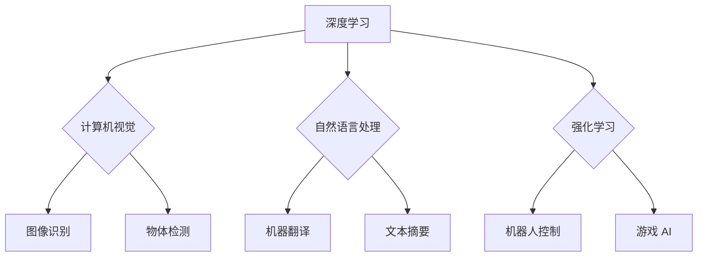

> 人工智能，深度学习，计算机视觉，自然语言处理，强化学习，应用场景，Andrej Karpathy

## 1. 背景介绍

人工智能（AI）正以惊人的速度发展，深刻地改变着我们生活的方方面面。从自动驾驶汽车到智能语音助手，从医疗诊断到金融交易，AI技术的应用场景日益广泛。Andrej Karpathy，一位享誉全球的人工智能专家，在深度学习领域做出了杰出的贡献，并致力于探索AI技术的应用场景，推动其在各个领域的落地。

## 2. 核心概念与联系

**2.1 深度学习**

深度学习是机器学习的一个子领域，它利用多层神经网络来模拟人类大脑的学习过程。通过训练大量的样本数据，深度学习模型能够自动学习特征，并进行复杂的模式识别和预测。

**2.2 计算机视觉**

计算机视觉是人工智能的一个重要分支，它致力于使计算机能够“看”和理解图像和视频。深度学习在计算机视觉领域取得了突破性的进展，例如图像识别、物体检测、图像分割等。

**2.3 自然语言处理**

自然语言处理（NLP）是人工智能的另一个重要分支，它致力于使计算机能够理解和处理人类语言。深度学习在NLP领域也取得了显著的成果，例如机器翻译、文本摘要、情感分析等。

**2.4 强化学习**

强化学习是一种基于奖励机制的机器学习方法，它训练智能体在环境中采取最优行动以获得最大奖励。强化学习在机器人控制、游戏 AI 等领域具有广泛的应用前景。

**2.5 应用场景**

深度学习、计算机视觉、自然语言处理和强化学习等人工智能技术在各个领域都有着广泛的应用场景，例如：

* **医疗保健:** 疾病诊断、药物研发、医疗影像分析
* **金融服务:** 欺诈检测、风险管理、投资决策
* **交通运输:** 自动驾驶汽车、交通流量预测、物流优化
* **零售业:** 商品推荐、个性化营销、库存管理
* **教育:** 个性化学习、智能辅导、自动批改

**2.6 Mermaid 流程图**

## 3. 核心算法原理 & 具体操作步骤

### 3.1 算法原理概述

深度学习的核心算法是多层神经网络，它由多个神经元层组成。每个神经元接收来自上一层的输入信号，并对其进行处理，然后将处理后的信号传递到下一层。通过训练大量的样本数据，神经网络的权重和偏置会不断调整，最终能够学习到数据的特征和模式。

### 3.2 算法步骤详解

1. **数据预处理:** 将原始数据转换为深度学习模型可以理解的格式，例如归一化、编码等。
2. **网络结构设计:** 根据任务需求设计神经网络的结构，包括神经元数量、层数、激活函数等。
3. **模型训练:** 使用训练数据训练神经网络，通过反向传播算法调整网络参数，使模型的预测结果与真实值尽可能接近。
4. **模型评估:** 使用测试数据评估模型的性能，例如准确率、召回率、F1-score等。
5. **模型部署:** 将训练好的模型部署到实际应用场景中，例如云平台、边缘设备等。

### 3.3 算法优缺点

**优点:**

* 能够自动学习特征，无需人工特征工程。
* 能够处理大规模数据，并取得较高的准确率。
* 在图像识别、自然语言处理等领域取得了突破性的进展。

**缺点:**

* 训练数据量大，需要大量的计算资源和时间。
* 模型解释性差，难以理解模型的决策过程。
* 对数据质量要求高，数据偏差会影响模型性能。

### 3.4 算法应用领域

深度学习算法广泛应用于各个领域，例如：

* **计算机视觉:** 图像识别、物体检测、图像分割、人脸识别、视频分析等。
* **自然语言处理:** 机器翻译、文本摘要、情感分析、问答系统、聊天机器人等。
* **语音识别:** 语音转文本、语音搜索、语音助手等。
* **推荐系统:** 商品推荐、内容推荐、用户画像等。
* **医疗保健:** 疾病诊断、药物研发、医疗影像分析等。

## 4. 数学模型和公式 & 详细讲解 & 举例说明

### 4.1 数学模型构建

深度学习模型通常采用多层感知机（MLP）或卷积神经网络（CNN）等结构。

**4.1.1 多层感知机（MLP）**

MLP由多个全连接层组成，每个神经元接收来自上一层的所有输入信号，并对其进行线性变换和非线性激活函数处理。

**4.1.2 卷积神经网络（CNN）**

CNN利用卷积层和池化层来提取图像特征。卷积层通过卷积核对图像进行卷积运算，提取图像局部特征。池化层对卷积层的输出进行降维，减少计算量并提高模型鲁棒性。

### 4.2 公式推导过程

**4.2.1 激活函数**

激活函数用于引入非线性，使神经网络能够学习复杂的模式。常见的激活函数包括 sigmoid 函数、ReLU 函数、tanh 函数等。

**4.2.2 反向传播算法**

反向传播算法用于更新神经网络的权重和偏置。它通过计算误差信号并反向传播到各层，调整参数以最小化损失函数。

### 4.3 案例分析与讲解

**4.3.1 图像分类**

使用 CNN 模型对图像进行分类，例如识别猫、狗、鸟等。

**4.3.2 机器翻译**

使用 RNN 模型进行机器翻译，例如将英文翻译成中文。

## 5. 项目实践：代码实例和详细解释说明

### 5.1 开发环境搭建

使用 Python 语言和深度学习框架 TensorFlow 或 PyTorch 搭建开发环境。

### 5.2 源代码详细实现

使用 TensorFlow 或 PyTorch 框架实现一个简单的图像分类模型，例如识别 MNIST 手写数字。

### 5.3 代码解读与分析

解释代码中的关键部分，例如网络结构、损失函数、优化算法等。

### 5.4 运行结果展示

展示模型的训练过程和测试结果，例如准确率、损失函数的变化趋势等。

## 6. 实际应用场景

### 6.1 自动驾驶汽车

使用深度学习算法进行图像识别、物体检测和路径规划，实现自动驾驶汽车的功能。

### 6.2 智能语音助手

使用语音识别和自然语言处理算法，实现智能语音助手，例如 Siri、Alexa 等。

### 6.3 医疗诊断

使用深度学习算法进行医疗影像分析，辅助医生进行疾病诊断。

### 6.4 未来应用展望

人工智能技术将继续发展，在更多领域得到应用，例如：

* **个性化教育:** 根据学生的学习情况提供个性化的学习方案。
* **智能制造:** 利用人工智能技术提高生产效率和产品质量。
* **城市管理:** 利用人工智能技术优化城市交通、能源管理等。

## 7. 工具和资源推荐

### 7.1 学习资源推荐

* **书籍:**
    * 深度学习
    * 人工智能：一个现代方法
* **在线课程:**
    * Coursera 深度学习课程
    * Udacity 人工智能工程师 Nanodegree

### 7.2 开发工具推荐

* **深度学习框架:** TensorFlow, PyTorch, Keras
* **编程语言:** Python
* **数据处理工具:** Pandas, NumPy

### 7.3 相关论文推荐

* **ImageNet Classification with Deep Convolutional Neural Networks**
* **Attention Is All You Need**
* **Deep Reinforcement Learning**

## 8. 总结：未来发展趋势与挑战

### 8.1 研究成果总结

深度学习技术取得了显著的进展，在各个领域都有着广泛的应用。

### 8.2 未来发展趋势

* **模型规模和复杂度提升:** 训练更大规模、更复杂的神经网络模型。
* **算法效率和鲁棒性提升:** 开发更有效的训练算法和更鲁棒的模型。
* **跨模态学习:** 融合不同模态的数据，例如文本、图像、音频等。
* **可解释性增强:** 提高模型的解释性，使人类能够更好地理解模型的决策过程。

### 8.3 面临的挑战

* **数据获取和隐私保护:** 训练深度学习模型需要大量的训练数据，如何获取高质量数据并保护用户隐私是一个挑战。
* **计算资源需求:** 训练大型神经网络模型需要大量的计算资源，这对于资源有限的机构或个人来说是一个障碍。
* **模型安全性:** 深度学习模型可能存在安全漏洞，例如对抗攻击，需要加强模型的安全性。

### 8.4 研究展望

未来，人工智能技术将继续发展，并对我们的生活产生更深远的影响。我们需要加强对人工智能技术的研究和应用，并积极应对其带来的挑战，以确保人工智能技术能够造福人类。

## 9. 附录：常见问题与解答

**9.1 什么是深度学习？**

深度学习是一种机器学习的子领域，它利用多层神经网络来模拟人类大脑的学习过程。

**9.2 深度学习有哪些应用场景？**

深度学习在各个领域都有着广泛的应用场景，例如图像识别、自然语言处理、语音识别、推荐系统等。

**9.3 如何学习深度学习？**

可以通过阅读书籍、参加在线课程、参与开源项目等方式学习深度学习。

**9.4 深度学习有哪些挑战？**

深度学习面临着数据获取、计算资源、模型安全性等挑战。

**9.5 深度学习的未来发展趋势是什么？**

深度学习技术将继续发展，模型规模和复杂度将提升，算法效率和鲁棒性将增强，跨模态学习将得到发展，模型可解释性将得到提高。

作者：禅与计算机程序设计艺术 / Zen and the Art of Computer Programming 
<end_of_turn>