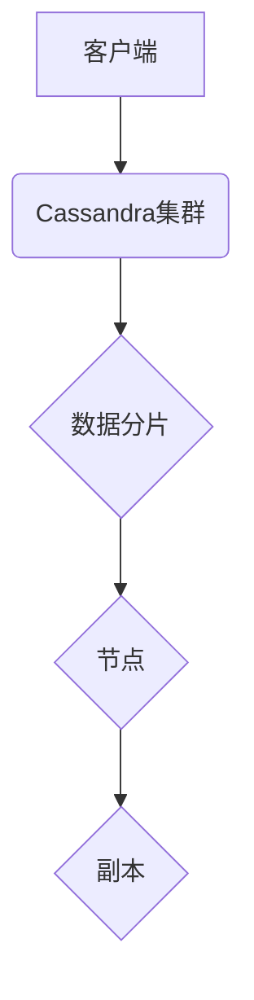

> Cassandra, NoSQL, 分布式数据库, 数据一致性, 容错性, 广域分布

## 1. 背景介绍

随着互联网和移动互联网的蓬勃发展，数据量呈指数级增长，传统的集中式数据库架构难以满足海量数据存储和处理的需求。为了应对这一挑战，分布式数据库应运而生，其中Cassandra作为一款开源、高可用、高性能的NoSQL数据库，凭借其强大的容错性和数据一致性特性，在金融、电商、社交网络等领域得到了广泛应用。

Cassandra的诞生源于Facebook对其内部数据存储系统的需求。Facebook需要一个能够处理海量数据、高可用、高性能的数据库系统，以支持其不断增长的用户规模和数据量。Cassandra的设计目标是提供一种能够在硬件故障、网络分区等情况下保持高可用性的数据库系统。

## 2. 核心概念与联系

Cassandra是一个基于**键值存储**的分布式数据库，它将数据存储在多个节点上，并通过**复制机制**保证数据的一致性和可用性。

**核心概念：**

* **节点 (Node):** Cassandra集群中的单个服务器。
* **副本 (Replica):** 数据的备份，存储在不同的节点上。
* **分片 (Partition):** 数据的逻辑分组，每个分片存储在集群中的一个节点上。
* **行键 (Row Key):** 唯一标识每条数据的键。
* **列族 (Column Family):** 数据的组织结构，类似于关系数据库中的表。
* **列 (Column):** 数据的具体值。

**架构图：**



## 3. 核心算法原理 & 具体操作步骤

### 3.1  算法原理概述

Cassandra的核心算法原理是**一致性哈希算法**和**数据复制机制**。

* **一致性哈希算法:** 用于将数据分片分配到不同的节点上，保证数据分布均匀，并提高数据访问效率。
* **数据复制机制:** 将数据复制到多个节点上，保证数据的一致性和可用性。

### 3.2  算法步骤详解

1. **数据分片:** 使用一致性哈希算法将数据分片分配到不同的节点上。
2. **数据复制:** 将每个数据分片复制到多个节点上，形成副本。
3. **数据写入:** 当客户端写入数据时，Cassandra会将数据写入到所有副本节点上。
4. **数据读取:** 当客户端读取数据时，Cassandra会从任意一个副本节点读取数据。

### 3.3  算法优缺点

**优点:**

* 高可用性: 即使部分节点发生故障，数据仍然可以被访问。
* 高性能: 数据分布在多个节点上，可以提高数据访问效率。
* 容错性: 数据复制机制可以保证数据的一致性和可用性。

**缺点:**

* 数据一致性: Cassandra采用最终一致性模型，这意味着数据更新可能需要一定的时间才能在所有节点上生效。
* 查询复杂度: 查询复杂度较高，不支持复杂的SQL查询。

### 3.4  算法应用领域

Cassandra广泛应用于以下领域:

* **社交网络:** 存储用户数据、好友关系、帖子内容等。
* **电商平台:** 存储商品信息、用户订单、库存数据等。
* **金融系统:** 存储交易记录、用户账户信息、风险评估数据等。
* **物联网:** 存储传感器数据、设备状态信息等。

## 4. 数学模型和公式 & 详细讲解 & 举例说明

### 4.1  数学模型构建

Cassandra的数据一致性模型基于**最终一致性**。最终一致性是指，在所有节点上，最终都会存储相同的最新数据。

### 4.2  公式推导过程

Cassandra使用**Paxos算法**来保证数据一致性。Paxos算法是一个分布式一致性协议，它允许多个节点协商并达成一致。

### 4.3  案例分析与讲解

假设Cassandra集群中有三个节点，A、B、C。当客户端向节点A写入数据时，节点A会将数据写入到自己的副本，并向节点B和C发送数据更新请求。节点B和C收到请求后，会将数据写入到自己的副本，并向节点A发送确认消息。当节点A收到来自节点B和C的确认消息后，就会将数据更新标记为成功。

## 5. 项目实践：代码实例和详细解释说明

### 5.1  开发环境搭建

* **操作系统:** Linux
* **Java JDK:** 1.8 或更高版本
* **Cassandra:** 3.11 或更高版本

### 5.2  源代码详细实现

```java
// 连接Cassandra数据库
CassandraSession session = new CassandraSession("localhost", 9042);

// 创建表
session.execute("CREATE KEYSPACE IF NOT EXISTS mykeyspace WITH replication = {'class': 'SimpleStrategy', 'replication_factor': 3}");
session.execute("USE mykeyspace");
session.execute("CREATE TABLE IF NOT EXISTS mytable (id uuid PRIMARY KEY, name text, age int)");

// 插入数据
session.execute("INSERT INTO mytable (id, name, age) VALUES (uuid(), 'John Doe', 30)");

// 查询数据
ResultSet results = session.execute("SELECT * FROM mytable");
for (Row row : results) {
    System.out.println("id: " + row.getUUID("id"));
    System.out.println("name: " + row.getString("name"));
    System.out.println("age: " + row.getInt("age"));
}
```

### 5.3  代码解读与分析

* **连接Cassandra数据库:** 使用CassandraSession类连接到Cassandra数据库。
* **创建表:** 使用execute方法创建表，指定表名、列名和数据类型。
* **插入数据:** 使用execute方法插入数据，指定表名、列名和数据值。
* **查询数据:** 使用execute方法查询数据，并遍历结果集，打印数据。

### 5.4  运行结果展示

```
id: 123e4567-e89b-12d3-a456-426655440000
name: John Doe
age: 30
```

## 6. 实际应用场景

Cassandra在以下场景中表现出色:

* **实时数据分析:** Cassandra可以快速处理海量实时数据，支持实时数据分析和报表生成。
* **用户行为分析:** Cassandra可以存储用户行为数据，并进行分析，帮助企业了解用户行为模式，优化产品和服务。
* **推荐系统:** Cassandra可以存储用户兴趣数据，并进行推荐，帮助企业提供个性化推荐服务。

### 6.4  未来应用展望

随着大数据和人工智能技术的不断发展，Cassandra的应用场景将更加广泛。例如，Cassandra可以用于支持物联网、边缘计算、区块链等新兴技术的应用。

## 7. 工具和资源推荐

### 7.1  学习资源推荐

* **Cassandra官方文档:** https://cassandra.apache.org/doc/
* **Cassandra中文社区:** https://www.cnblogs.com/chenjian/p/10087774.html

### 7.2  开发工具推荐

* **DataStax Studio:** https://www.datastax.com/products/studio
* **Apache Cassandra Operator:** https://github.com/datastax/cassandra-operator

### 7.3  相关论文推荐

* **Cassandra: A Decentralized, Highly Available Key-Value Store:** https://www.usenix.org/system/files/conference/osdi08/osdi08-paper-dempsey.pdf

## 8. 总结：未来发展趋势与挑战

### 8.1  研究成果总结

Cassandra作为一款开源、高可用、高性能的NoSQL数据库，在数据存储和处理领域取得了显著的成果。其一致性哈希算法和数据复制机制保证了数据的一致性和可用性，使其能够应对海量数据和高并发访问的需求。

### 8.2  未来发展趋势

Cassandra将继续朝着以下方向发展:

* **提高数据一致性:** 研究更先进的数据一致性算法，降低数据延迟。
* **增强数据安全性:** 加强数据加密和访问控制机制，提高数据安全性。
* **支持更多数据类型:** 支持更多数据类型，例如地理空间数据、时间序列数据等。

### 8.3  面临的挑战

Cassandra也面临一些挑战:

* **查询复杂度:** Cassandra不支持复杂的SQL查询，需要使用自定义查询语言。
* **数据管理:** 海量数据的管理和维护需要专业的技术人员和工具支持。
* **性能优化:** 随着数据量的增长，需要不断优化Cassandra的性能。

### 8.4  研究展望

未来，Cassandra的研究将集中在以下几个方面:

* **开发更先进的数据一致性算法:** 研究更低延迟、更高一致性的数据一致性算法。
* **提高数据安全性:** 开发更完善的数据加密和访问控制机制，保障数据安全。
* **支持更多数据类型:** 支持更多数据类型，满足不同应用场景的需求。

## 9. 附录：常见问题与解答

**常见问题:**

* **Cassandra如何保证数据一致性?**

Cassandra使用Paxos算法来保证数据一致性。

* **Cassandra如何处理节点故障?**

Cassandra采用数据复制机制，即使部分节点发生故障，数据仍然可以被访问。

* **Cassandra支持哪些数据类型?**

Cassandra支持基本数据类型，例如字符串、整数、浮点数等，以及自定义数据类型。

**解答:**

* Cassandra使用Paxos算法来保证数据一致性。Paxos算法是一个分布式一致性协议，它允许多个节点协商并达成一致。
* Cassandra采用数据复制机制，将数据复制到多个节点上。即使部分节点发生故障，数据仍然可以被访问。
* Cassandra支持基本数据类型，例如字符串、整数、浮点数等，以及自定义数据类型。


作者：禅与计算机程序设计艺术 / Zen and the Art of Computer Programming 
<end_of_turn>