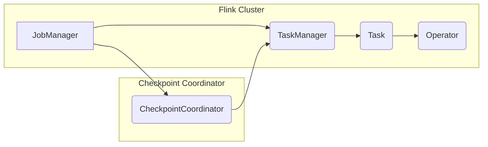

> Flink, CheckpointCoordinator, 状态保存, 容错, 分布式系统, 流处理

## 1. 背景介绍

Apache Flink 作为一款高性能、分布式流处理引擎，在处理海量实时数据方面展现出强大的能力。然而，在分布式环境下，数据可靠性和容错机制显得尤为重要。Flink 通过 Checkpoints 机制来保证数据的一致性和容错性。CheckpointCoordinator 是 Flink 中负责管理 Checkpoint 的核心组件，它协调各个 Task 的 Checkpoint 操作，确保 Checkpoint 的成功执行和数据一致性。

## 2. 核心概念与联系

**2.1 核心概念**

* **Checkpoint:**  Flink 中用于定期保存状态的机制。Checkpoint 会将所有 Task 的状态序列化并持久化到外部存储系统中，例如 HDFS 或 S3。
* **CheckpointCoordinator:**  Flink 中负责管理 Checkpoint 的核心组件。它协调各个 Task 的 Checkpoint 操作，确保 Checkpoint 的成功执行和数据一致性。
* **Task:**  Flink 中处理数据的最小单元，每个 Task 负责处理一部分数据流。
* **Operator:**  Flink 中处理数据的逻辑单元，例如 Source、Sink、Transform 等。

**2.2 架构关系**



**2.3 工作流程**

1. JobManager 向 CheckpointCoordinator 发送 Checkpoint 请求。
2. CheckpointCoordinator 通知所有 TaskManager 执行 Checkpoint。
3. TaskManager 协调各个 Task 执行 Checkpoint 操作。
4. Task 将状态序列化并发送到 CheckpointCoordinator。
5. CheckpointCoordinator 收集所有 Task 的状态，并将其持久化到外部存储系统。
6. CheckpointCoordinator 通知 JobManager Checkpoint 完成。

## 3. 核心算法原理 & 具体操作步骤

**3.1 算法原理概述**

CheckpointCoordinator 的核心算法是基于 **分布式一致性** 和 **状态同步** 的原理。它通过以下步骤来实现 Checkpoint 的可靠性和一致性：

* **状态序列化:**  每个 Task 将其状态序列化成二进制数据。
* **状态传输:**  Task 将序列化后的状态数据发送到 CheckpointCoordinator。
* **状态持久化:**  CheckpointCoordinator 将接收到的状态数据持久化到外部存储系统。
* **状态一致性:**  CheckpointCoordinator 确保所有 Task 的状态数据都成功持久化，并保证数据的一致性。

**3.2 算法步骤详解**

1. **Checkpoint 请求:** JobManager 向 CheckpointCoordinator 发送 Checkpoint 请求，并指定 Checkpoint 的 ID。
2. **TaskManager 通知:** CheckpointCoordinator 将 Checkpoint 请求转发给所有 TaskManager。
3. **Task 执行 Checkpoint:**  每个 TaskManager 协调其下属的 Task 执行 Checkpoint 操作。
4. **状态序列化:**  每个 Task 将其状态序列化成二进制数据。
5. **状态传输:**  每个 Task 将序列化后的状态数据发送到 CheckpointCoordinator。
6. **状态确认:**  CheckpointCoordinator 收到所有 Task 的状态数据后，会向每个 Task 发送确认消息。
7. **状态持久化:**  CheckpointCoordinator 将接收到的所有状态数据持久化到外部存储系统。
8. **Checkpoint 完成:**  CheckpointCoordinator 通知 JobManager Checkpoint 完成。

**3.3 算法优缺点**

* **优点:**
    * **数据一致性:**  CheckpointCoordinator 确保所有 Task 的状态数据都成功持久化，并保证数据的一致性。
    * **容错性:**  Checkpoint 可以恢复到上次成功 Checkpoint 的状态，从而保证数据可靠性。
    * **灵活配置:**  Flink 提供多种 Checkpoint 配置选项，可以根据实际需求进行调整。
* **缺点:**
    * **性能开销:**  Checkpoint 操作会带来一定的性能开销，需要根据实际情况进行权衡。
    * **存储空间:**  Checkpoint 数据需要存储在外部存储系统中，会占用一定的存储空间。

**3.4 算法应用领域**

CheckpointCoordinator 的算法广泛应用于各种分布式流处理系统，例如：

* **实时数据分析:**  实时监控数据流，进行实时分析和报警。
* **实时推荐系统:**  根据用户行为数据，实时推荐感兴趣的内容。
* **实时交易系统:**  处理高频交易数据，保证交易的实时性和可靠性。

## 4. 数学模型和公式 & 详细讲解 & 举例说明

**4.1 数学模型构建**

CheckpointCoordinator 的工作流程可以抽象为一个状态机模型，其中状态代表 Checkpoint 的执行阶段，事件代表 Checkpoint 操作的触发条件。

**状态:**

* **IDLE:**  CheckpointCoordinator 处于空闲状态，等待 Checkpoint 请求。
* **REQUESTING:**  CheckpointCoordinator 正在向 TaskManager 发送 Checkpoint 请求。
* **EXECUTING:**  TaskManager 正在执行 Checkpoint 操作。
* **COMMITTING:**  CheckpointCoordinator 正在将状态数据持久化到外部存储系统。
* **COMPLETED:**  Checkpoint 操作已完成。

**事件:**

* **CheckpointRequest:**  JobManager 发送 Checkpoint 请求。
* **TaskStatusUpdate:**  TaskManager 发送 Task 状态更新消息。
* **CheckpointComplete:**  TaskManager 发送 Checkpoint 完成消息。

**4.2 公式推导过程**

CheckpointCoordinator 的状态转移规则可以表示为以下公式：

```
状态(t+1) = f(状态(t), 事件(t))
```

其中：

* 状态(t) 表示 CheckpointCoordinator 在时间 t 的状态。
* 事件(t) 表示在时间 t 发生的事件。
* f() 表示状态转移函数，根据当前状态和事件，决定 CheckpointCoordinator 的下一个状态。

**4.3 案例分析与讲解**

假设 JobManager 发送 Checkpoint 请求，CheckpointCoordinator 的状态转移过程如下：

1. 状态(0) = IDLE
2. 事件(0) = CheckpointRequest
3. 状态(1) = REQUESTING
4. CheckpointCoordinator 向所有 TaskManager 发送 Checkpoint 请求。
5. TaskManager 发送 TaskStatusUpdate 消息，表示正在执行 Checkpoint 操作。
6. 状态(2) = EXECUTING
7. 所有 Task 完成 Checkpoint 操作，发送 CheckpointComplete 消息。
8. 状态(3) = COMMITTING
9. CheckpointCoordinator 将状态数据持久化到外部存储系统。
10. 状态(4) = COMPLETED

## 5. 项目实践：代码实例和详细解释说明

**5.1 开发环境搭建**

* Java Development Kit (JDK) 8 或以上
* Apache Flink 1.13 或以上
* Maven 或 Gradle

**5.2 源代码详细实现**

```java
// CheckpointCoordinator.java
public class CheckpointCoordinator {

    private final JobManager jobManager;
    private final List<TaskManager> taskManagers;

    public CheckpointCoordinator(JobManager jobManager, List<TaskManager> taskManagers) {
        this.jobManager = jobManager;
        this.taskManagers = taskManagers;
    }

    public void triggerCheckpoint(long checkpointId) {
        // 向所有 TaskManager 发送 Checkpoint 请求
        for (TaskManager taskManager : taskManagers) {
            taskManager.triggerCheckpoint(checkpointId);
        }
    }

    public void waitForCheckpointCompletion(long checkpointId) {
        // 等待所有 TaskManager 完成 Checkpoint 操作
        while (!isCheckpointCompleted(checkpointId)) {
            // ...
        }
    }

    private boolean isCheckpointCompleted(long checkpointId) {
        // 检查所有 TaskManager 是否已完成 Checkpoint 操作
        // ...
        return true;
    }
}
```

**5.3 代码解读与分析**

* `triggerCheckpoint()` 方法负责向所有 TaskManager 发送 Checkpoint 请求。
* `waitForCheckpointCompletion()` 方法负责等待所有 TaskManager 完成 Checkpoint 操作。
* `isCheckpointCompleted()` 方法负责检查所有 TaskManager 是否已完成 Checkpoint 操作。

**5.4 运行结果展示**

当 JobManager 调用 `triggerCheckpoint()` 方法时，CheckpointCoordinator 会向所有 TaskManager 发送 Checkpoint 请求。TaskManager 会协调其下属的 Task 执行 Checkpoint 操作，并将状态数据发送到 CheckpointCoordinator。CheckpointCoordinator 会收集所有 Task 的状态数据，并将其持久化到外部存储系统。

## 6. 实际应用场景

CheckpointCoordinator 在各种实际应用场景中发挥着重要作用，例如：

* **实时数据分析:**  实时监控数据流，进行实时分析和报警。例如，可以利用 CheckpointCoordinator 来监控网站访问流量，并及时报警异常流量。
* **实时推荐系统:**  根据用户行为数据，实时推荐感兴趣的内容。例如，可以利用 CheckpointCoordinator 来记录用户浏览历史，并根据历史数据实时推荐商品。
* **实时交易系统:**  处理高频交易数据，保证交易的实时性和可靠性。例如，可以利用 CheckpointCoordinator 来记录交易记录，并保证交易数据的可靠性。

**6.4 未来应用展望**

随着分布式系统和流处理技术的不断发展，CheckpointCoordinator 的应用场景将会更加广泛。未来，CheckpointCoordinator 可能在以下方面得到进一步发展：

* **更智能的 Checkpoint 调度:**  根据实际应用场景，自动调整 Checkpoint 的频率和时间。
* **更高效的 Checkpoint 算法:**  降低 Checkpoint 的性能开销，提高系统吞吐量。
* **更强大的容错机制:**  提高 Checkpoint 的可靠性，保证数据的一致性和完整性。

## 7. 工具和资源推荐

**7.1 学习资源推荐**

* Apache Flink 官方文档: https://flink.apache.org/docs/stable/
* Apache Flink 中文社区: https://flink.apache.org/zh-cn/

**7.2 开发工具推荐**

* IntelliJ IDEA
* Eclipse

**7.3 相关论文推荐**

* [Flink: A Unified Platform for Batch and Stream Processing](https://www.usenix.org/system/files/conference/osdi15/osdi15-paper-gu.pdf)

## 8. 总结：未来发展趋势与挑战

**8.1 研究成果总结**

CheckpointCoordinator 是 Flink 中一个重要的组件，它保证了 Flink 的数据一致性和容错性。通过 Checkpoint 机制，Flink 可以处理海量实时数据，并保证数据的可靠性。

**8.2 未来发展趋势**

随着分布式系统和流处理技术的不断发展，CheckpointCoordinator 将会朝着以下方向发展：

* 更智能的 Checkpoint 调度
* 更高效的 Checkpoint 算法
* 更强大的容错机制

**8.3 面临的挑战**

CheckpointCoordinator 还面临着一些挑战，例如：

* 如何在保证数据一致性的同时降低 Checkpoint 的性能开销
* 如何在分布式环境下实现高效的 Checkpoint 数据持久化
* 如何应对大规模数据流的 Checkpoint 挑战

**8.4 研究展望**

未来，CheckpointCoordinator 的研究方向将集中在以下几个方面：

* 研究更智能的 Checkpoint 调度算法，根据实际应用场景自动调整 Checkpoint 的频率和时间。
* 研究更高效的 Checkpoint 算法，降低 Checkpoint 的性能开销，提高系统吞吐量。
* 研究更强大的容错机制，提高 Checkpoint 的可靠性，保证数据的一致性和完整性。

## 9. 附录：常见问题与解答

**9.1  问题:**  Checkpoint 操作会带来一定的性能开销，如何降低 Checkpoint 的性能开销？

**9.2  答案:**  

* 可以通过调整 Checkpoint 的频率来降低性能开销。
* 可以使用更高效的 Checkpoint 算法，例如异步 Checkpoint。
* 可以使用更快的存储系统来持久化 Checkpoint 数据。

**9.3  问题:**  Checkpoint 数据丢失怎么办？

**9.4  答案:**  

* 可以将 Checkpoint 数据存储在多个副本中，以提高数据可靠性。
* 可以使用数据校验机制来检测 Checkpoint 数据的完整性。
* 可以使用恢复机制来恢复 Checkpoint 数据丢失的情况。


作者：禅与计算机程序设计艺术 / Zen and the Art of Computer Programming 
<end_of_turn>