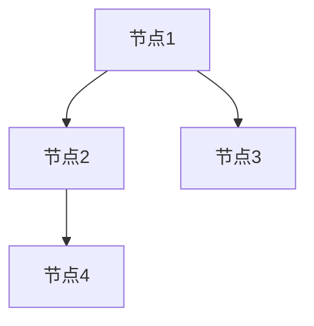

> Graph Edge, 图结构, 邻接表, 邻接矩阵, 图算法, 深度优先搜索, 广度优先搜索, 代码实例

## 1. 背景介绍

在现代数据科学和软件工程领域，图结构（Graph）作为一种强大的数据模型，被广泛应用于社交网络分析、推荐系统、知识图谱构建、路径规划等多个领域。图结构能够有效地表示现实世界中的复杂关系和连接，并通过图算法进行分析和处理。

图的本质是节点（Node）和边（Edge）的集合。节点代表图中的实体，边代表实体之间的关系。例如，在社交网络中，节点可以表示用户，边可以表示用户之间的友谊关系。

Graph Edge是图结构中边的基本组成部分，它描述了两个节点之间的连接关系。理解 Graph Edge 的原理和操作方式对于掌握图算法和应用图结构至关重要。

## 2. 核心概念与联系

**2.1 图结构的组成部分**

* **节点（Node）：** 图结构中的基本单元，代表图中的实体。
* **边（Edge）：** 连接两个节点的线段，代表实体之间的关系。
* **权重（Weight）：** 边的属性，表示边上的关系强度或成本。

**2.2 图的表示方法**

* **邻接表（Adjacency List）：** 使用列表存储每个节点及其相邻节点的信息。
* **邻接矩阵（Adjacency Matrix）：** 使用矩阵存储节点之间的连接关系，其中矩阵元素为 1 表示连接， 0 表示不连接。

**2.3 Mermaid 流程图**



**2.4 Graph Edge 的特性**

* **方向性：** 边的方向可以是单向的（指向一个节点）或双向的（指向两个节点）。
* **权重：** 边的权重可以表示关系的强度、距离或成本等信息。
* **类型：** 边的类型可以根据不同的应用场景进行定义，例如友谊关系、购买关系、依赖关系等。

## 3. 核心算法原理 & 具体操作步骤

**3.1 算法原理概述**

Graph Edge 的核心算法主要包括深度优先搜索（Depth First Search，DFS）和广度优先搜索（Breadth First Search，BFS）。

* **深度优先搜索（DFS）：** 从一个节点出发，沿着一条边尽可能深入地搜索，直到找到目标节点或所有可达节点。
* **广度优先搜索（BFS）：** 从一个节点出发，一层一层地搜索，直到找到目标节点或所有可达节点。

**3.2 算法步骤详解**

**3.2.1 深度优先搜索（DFS）**

1. 选择一个起始节点。
2. 将起始节点标记为已访问。
3. 遍历起始节点的所有未访问的邻居节点。
4. 对每个邻居节点重复步骤 2-3，直到所有可达节点都被访问。

**3.2.2 广度优先搜索（BFS）**

1. 选择一个起始节点。
2. 将起始节点加入到队列中。
3. 从队列中取出一个节点，标记为已访问。
4. 遍历已访问节点的所有未访问的邻居节点，并将它们加入到队列中。
5. 重复步骤 3-4，直到队列为空或找到目标节点。

**3.3 算法优缺点**

**3.3.1 深度优先搜索（DFS）**

* **优点：**
    * 能够找到路径，并返回路径上的节点。
    * 适用于寻找特定目标节点的场景。
* **缺点：**
    * 可能陷入无限循环，导致算法无法终止。
    * 对于大型图结构，效率较低。

**3.3.2 广度优先搜索（BFS）**

* **优点：**
    * 能够找到最短路径。
    * 适用于寻找最近的节点或探索图结构的整体结构。
* **缺点：**
    * 对于大型图结构，内存消耗较大。
    * 无法直接返回路径。

**3.4 算法应用领域**

* **深度优先搜索（DFS）：**
    * 图的遍历和搜索。
    * 拓扑排序。
    * 查找路径。
* **广度优先搜索（BFS）：**
    * 最短路径查找。
    * 广播消息。
    * 图的探索和分析。

## 4. 数学模型和公式 & 详细讲解 & 举例说明

**4.1 数学模型构建**

图结构可以用数学模型来表示，其中节点和边可以用集合和关系来描述。

* **节点集合：**  V = {v1, v2, ..., vn}
* **边集合：** E = {(v1, v2), (v2, v3), ..., (vn-1, vn)}

**4.2 公式推导过程**

* **邻接矩阵：**  A = [a<sub>ij</sub>]，其中 a<sub>ij</sub> = 1 表示节点 i 和节点 j 之间存在边，否则为 0。

* **邻接表：**  adj(v) = {u | (v, u) ∈ E}，表示节点 v 的所有邻居节点。

**4.3 案例分析与讲解**

**示例：**

假设有一个图结构，包含三个节点：A、B、C，以及以下边：

* (A, B)
* (B, C)

**邻接矩阵：**

```
A B C
A 0 1 0
B 1 0 1
C 0 1 0
```

**邻接表：**

* adj(A) = {B}
* adj(B) = {A, C}
* adj(C) = {B}

## 5. 项目实践：代码实例和详细解释说明

**5.1 开发环境搭建**

* Python 3.x
* NetworkX 库

**5.2 源代码详细实现**

```python
import networkx as nx

# 创建一个图
graph = nx.Graph()

# 添加节点
graph.add_nodes_from(['A', 'B', 'C'])

# 添加边
graph.add_edges_from([('A', 'B'), ('B', 'C')])

# 打印邻接矩阵
print("邻接矩阵:")
print(nx.to_numpy_matrix(graph))

# 打印邻接表
print("
邻接表:")
print(graph.adj)

# 深度优先搜索
print("
深度优先搜索:")
for node in nx.dfs_preorder_nodes(graph, source='A'):
    print(node, end=" ")

# 广度优先搜索
print("

广度优先搜索:")
for node in nx.bfs_nodes(graph, source='A'):
    print(node, end=" ")
```

**5.3 代码解读与分析**

* 使用 NetworkX 库创建图结构。
* 添加节点和边。
* 使用 `nx.to_numpy_matrix()` 函数获取邻接矩阵。
* 使用 `graph.adj` 属性获取邻接表。
* 使用 `nx.dfs_preorder_nodes()` 和 `nx.bfs_nodes()` 函数进行深度优先搜索和广度优先搜索。

**5.4 运行结果展示**

```
邻接矩阵:
[[0 1 0]
 [1 0 1]
 [0 1 0]]

邻接表:
{'A': ['B'], 'B': ['A', 'C'], 'C': ['B']}

深度优先搜索:
A B C 

广度优先搜索:
A B C 
```

## 6. 实际应用场景

**6.1 社交网络分析**

* 发现社区结构。
* 识别关键用户。
* 推理用户关系。

**6.2 推荐系统**

* 基于用户行为和关系进行商品推荐。
* 基于内容相似性进行内容推荐。

**6.3 知识图谱构建**

* 建立实体和关系的知识图谱。
* 进行知识推理和问答。

**6.4 路径规划**

* 寻找最短路径或最优路径。
* 应用于导航系统、物流配送等领域。

**6.5 未来应用展望**

* 人工智能和机器学习的应用。
* 复杂系统建模和分析。
* 数据可视化和探索。

## 7. 工具和资源推荐

**7.1 学习资源推荐**

* **书籍：**
    * 《图论及其应用》
    * 《算法导论》
* **在线课程：**
    * Coursera: Graph Theory
    * edX: Introduction to Graph Theory

**7.2 开发工具推荐**

* **NetworkX:** Python 图算法库。
* **Gephi:** 图数据可视化工具。
* **Neo4j:** 图数据库。

**7.3 相关论文推荐**

* **PageRank算法：** PageRank: The Anatomy of a Web Page Rank
* **深度优先搜索算法：** Depth-First Search Algorithm
* **广度优先搜索算法：** Breadth-First Search Algorithm

## 8. 总结：未来发展趋势与挑战

**8.1 研究成果总结**

Graph Edge 的研究成果丰富，涵盖了图算法、图数据结构、图数据库等多个方面。

**8.2 未来发展趋势**

* **大规模图数据处理:** 随着数据量的不断增长，如何高效处理大规模图数据将成为一个重要的研究方向。
* **图神经网络:** 图神经网络能够学习图结构中的信息，并应用于各种任务，例如节点分类、链接预测等。
* **图数据库:** 图数据库能够高效存储和查询图数据，并支持复杂的图查询操作。

**8.3 面临的挑战**

* **复杂性:** 图结构的复杂性使得图算法的开发和应用面临挑战。
* **数据规模:** 大规模图数据的处理和分析需要强大的计算能力和存储能力。
* **隐私保护:** 图数据中包含了大量敏感信息，如何保护用户隐私是一个重要的挑战。

**8.4 研究展望**

未来，Graph Edge 的研究将继续朝着更智能、更高效、更安全的方向发展。


## 9. 附录：常见问题与解答

**9.1 如何选择合适的图算法？**

选择合适的图算法取决于具体的应用场景和需求。例如，如果需要寻找最短路径，则可以使用广度优先搜索算法；如果需要查找特定目标节点，则可以使用深度优先搜索算法。

**9.2 如何处理大规模图数据？**

处理大规模图数据需要使用高效的图算法和数据结构，并利用分布式计算技术。

**9.3 如何保护图数据的隐私？**

可以使用匿名化技术、差分隐私等方法来保护图数据的隐私。


作者：禅与计算机程序设计艺术 / Zen and the Art of Computer Programming 
<end_of_turn>